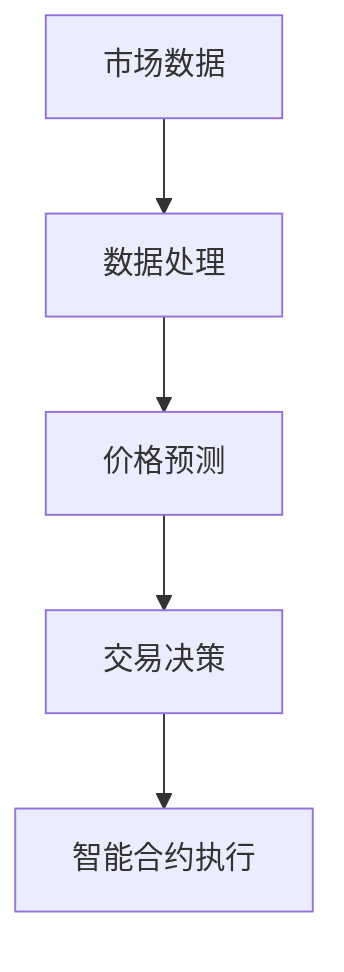
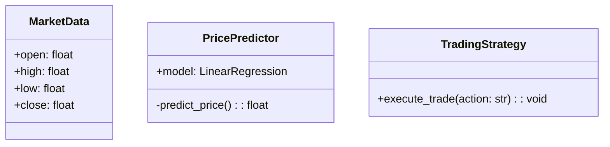
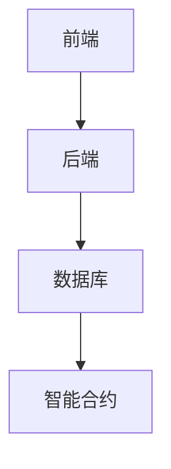
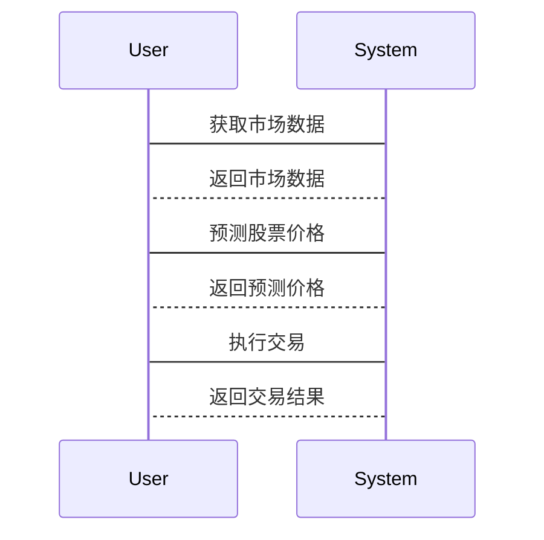

                 


# 如何将特价股票策略应用于代币化资产投资

> 关键词：特价股票策略、代币化资产、量化交易、区块链技术、投资策略

> 摘要：本文详细探讨了如何将特价股票策略应用于代币化资产投资，结合量化交易模型和区块链技术，分析了其核心原理、算法实现、系统架构设计以及实际案例，为投资者提供了全新的视角和策略。

---

## 第1章: 特价股票策略与代币化资产投资的背景与概念

### 1.1 特价股票策略的定义与特点

#### 1.1.1 特价股票的定义
特价股票是指在特定市场条件下，价格低于其内在价值或市场公允价值的股票。这些股票通常具有较高的投资潜力，因为它们可能被市场低估。

#### 1.1.2 特价股票策略的核心特点
- **低买高卖**：抓住市场波动，以低于市场价买入，高价卖出。
- **量化分析**：依赖数学模型和算法进行价格预测。
- **风险管理**：通过严格的风险控制机制，降低投资风险。

#### 1.1.3 特价股票策略的优势与局限性
- **优势**：高收益潜力、灵活性强。
- **局限性**：市场波动大、风险较高、需要专业的分析能力。

### 1.2 代币化资产投资的定义与特点

#### 1.2.1 代币化资产的定义
代币化资产是将传统资产（如股票、房地产）转化为数字代币，通过区块链技术进行交易和管理。

#### 1.2.2 代币化资产投资的核心特点
- **透明性**：区块链技术确保交易透明。
- **流动性高**：代币化资产可以快速买卖。
- **去中心化**：交易不受传统金融体系的限制。

#### 1.2.3 代币化资产投资的优势与风险
- **优势**：高流动性、低交易成本、透明度高。
- **风险**：价格波动大、监管不确定性、技术风险。

### 1.3 特价股票策略与代币化资产投资的结合

#### 1.3.1 结合的背景与意义
随着区块链技术的发展，代币化资产为传统金融资产的交易提供了新的渠道，而特价股票策略则为投资者提供了捕捉市场机会的工具。

#### 1.3.2 结合的核心模式与应用场景
- **模式**：利用量化交易模型，通过代币化资产实现特价股票的快速交易。
- **应用场景**：高频交易、机构投资、个人投资。

#### 1.3.3 结合的未来发展趋势
随着技术的进步，代币化资产与特价股票策略的结合将更加紧密，应用场景也将更加广泛。

---

## 第2章: 特价股票策略与代币化资产投资的核心概念

### 2.1 特价股票策略的核心原理

#### 2.1.1 市场波动与价格波动的分析
市场波动是影响股票价格的主要因素，包括宏观经济因素、公司业绩、市场情绪等。

#### 2.1.2 价格波动的预测模型
常用的价格预测模型包括CAPM（资本资产定价模型）和APT（ Arbitrage Pricing Theory）。

#### 2.1.3 特价股票策略的数学模型与公式
- **CAPM模型**：$$ E(r_i) = r_f + β_i (E(r_m) - r_f) $$
- **APT模型**：$$ E(r_i) = α_i + β_i (E(r_m) - r_f) $$

### 2.2 代币化资产投资的核心原理

#### 2.2.1 区块链技术与代币化资产的关系
区块链技术为代币化资产提供了去中心化、透明的交易平台。

#### 2.2.2 代币化资产的发行与交易机制
- **发行**：通过智能合约发行代币。
- **交易**：在去中心化交易所进行交易。

#### 2.2.3 代币化资产的流动性与价值评估
流动性是代币化资产的重要特征，价值评估依赖于市场供需和区块链技术。

### 2.3 特价股票策略与代币化资产投资的结合原理

#### 2.3.1 结合的理论基础
结合量化交易模型和区块链技术，实现特价股票的快速交易和价值评估。

#### 2.3.2 结合的实现机制
- **数据获取**：实时获取股票价格和代币化资产数据。
- **算法分析**：利用量化算法预测价格波动。
- **交易执行**：通过智能合约自动执行交易。

#### 2.3.3 结合的数学模型与公式
- **量化交易模型**：$$ P(t) = a \cdot P(t-1) + b \cdot V(t-1) + c $$

---

## 第3章: 特价股票策略与代币化资产投资的算法原理

### 3.1 特价股票策略的算法实现

#### 3.1.1 市场数据的获取与处理
- **数据源**：股票市场数据。
- **数据处理**：清洗、转换和分析。

#### 3.1.2 价格波动预测的算法实现
- **算法选择**：使用机器学习模型进行预测。
- **实现步骤**：数据预处理、模型训练、预测。

#### 3.1.3 策略触发条件的设定
- **触发条件**：价格低于预设阈值时买入，高于预设阈值时卖出。

### 3.2 代币化资产投资的算法实现

#### 3.2.1 代币化资产的发行与交易算法
- **发行算法**：通过智能合约发行代币。
- **交易算法**：自动匹配买卖双方。

#### 3.2.2 代币化资产的流动性管理算法
- **流动性管理**：通过算法调整代币的买卖深度。

#### 3.2.3 代币化资产的价值评估算法
- **价值评估**：结合市场供需和区块链数据进行评估。

### 3.3 特价股票策略与代币化资产投资结合的算法实现

#### 3.3.1 结合算法的设计与实现
- **设计思路**：结合量化交易模型和区块链技术，实现自动化交易。

#### 3.3.2 算法流程图


#### 3.3.3 算法代码实现
```python
import pandas as pd
import numpy as np

# 数据处理
data = pd.read_csv('stock_data.csv')
processed_data = data.dropna()

# 价格预测
from sklearn.linear_model import LinearRegression
model = LinearRegression()
model.fit(processed_data[['open', 'high', 'low']], processed_data['close'])

# 交易决策
def trading_strategy(predicted_price, current_price):
    if predicted_price < current_price:
        return 'SELL'
    elif predicted_price > current_price:
        return 'BUY'
    else:
        return 'HOLD'

# 智能合约执行
from web3 import Web3
w3 = Web3(Web3.HTTPProvider('http://localhost:8545'))
contract_address = '0x...'
contract = w3.eth.contract(contract_address, abi=...)

def execute_trade(action):
    if action == 'BUY':
        contract.functions.buy().transact()
    elif action == 'SELL':
        contract.functions.sell().transact()
```

---

## 第4章: 系统分析与架构设计方案

### 4.1 系统功能设计

#### 4.1.1 领域模型


#### 4.1.2 系统架构设计


### 4.2 系统接口设计

#### 4.2.1 API接口
- `/api/market_data`：获取市场数据。
- `/api/predict_price`：预测股票价格。
- `/api/execute_trade`：执行交易。

### 4.3 系统交互设计

#### 4.3.1 交易流程


---

## 第5章: 项目实战

### 5.1 环境安装

```bash
pip install pandas numpy scikit-learn web3
```

### 5.2 核心代码实现

```python
# 数据处理
import pandas as pd
data = pd.read_csv('stock_data.csv')

# 价格预测
from sklearn.linear_model import LinearRegression
model = LinearRegression()
model.fit(data[['open', 'high', 'low']], data['close'])

# 交易策略
def trading_strategy(predicted_price, current_price):
    if predicted_price < current_price:
        return 'SELL'
    elif predicted_price > current_price:
        return 'BUY'
    else:
        return 'HOLD'

# 智能合约交互
from web3 import Web3
w3 = Web3(Web3.HTTPProvider('http://localhost:8545'))
contract = w3.eth.contract('0x...', abi=...)
```

### 5.3 案例分析

#### 5.3.1 数据分析
分析历史股票价格，寻找特价股票的机会。

#### 5.3.2 交易执行
通过智能合约自动执行交易策略。

#### 5.3.3 结果分析
评估交易策略的有效性和风险。

---

## 第6章: 最佳实践与总结

### 6.1 小结
本文详细探讨了如何将特价股票策略应用于代币化资产投资，结合量化交易模型和区块链技术，提供了理论支持和实际案例。

### 6.2 注意事项
- 风险控制是关键。
- 确保交易系统的安全性。

### 6.3 拓展阅读
- 推荐阅读《量化交易入门》和《区块链技术与应用》。

---

## 作者：AI天才研究院 & 禅与计算机程序设计艺术

---

以上是《如何将特价股票策略应用于代币化资产投资》的详细目录大纲，内容涵盖了从理论到实践的各个方面，帮助读者全面理解并应用这一策略。

