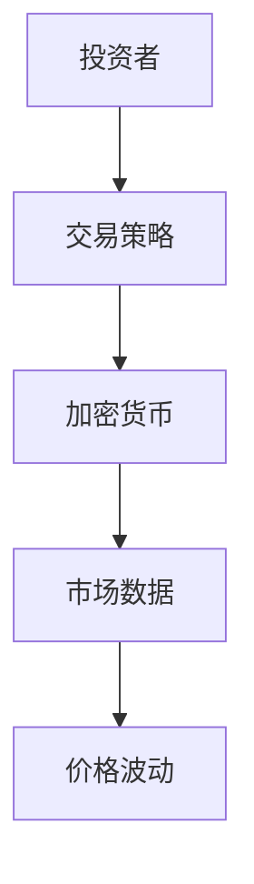
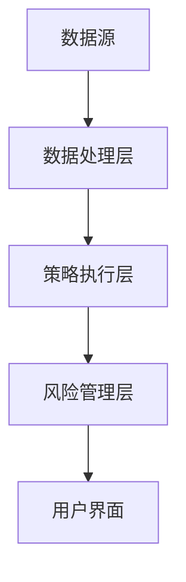

                 


```markdown
# 如何将特价股票策略应用于加密货币投资

## 关键词
特价股票策略, 加密货币, 投资策略, 技术分析, 市场分析, 风险管理

## 摘要
本文详细探讨如何将特价股票策略应用于加密货币投资，通过分析其核心概念、算法原理、系统架构，并结合实际案例，为投资者提供一套可行的策略框架。文章涵盖背景介绍、核心概念、算法实现、系统设计、项目实战及最佳实践，帮助读者在加密货币市场中应用特价股票策略。

## 第1章 特价股票策略概述

### 1.1 特价股票策略的定义与特点
#### 1.1.1 特价股票策略的基本概念
特价股票策略是一种利用市场波动在特定条件下以低于市场价买入股票的策略，核心在于捕捉短期价格波动。

#### 1.1.2 特价股票策略的核心要素
- **市场分析**：识别市场波动性。
- **技术分析**：通过价格和成交量预测价格走势。
- **风险管理**：控制投资风险。

#### 1.1.3 特价股票策略的优势与局限性
- **优势**：高收益潜力、灵活性。
- **局限性**：高风险、市场依赖性。

### 1.2 加密货币市场的特点
#### 1.2.1 加密货币市场的基本特征
- 24/7交易、无国界、高度波动性。

#### 1.2.2 加密货币市场的波动性分析
- 高波动性带来的高风险和高收益。

#### 1.2.3 加密货币市场的参与者
- 机构投资者、散户、矿工。

### 1.3 特价股票策略应用于加密货币投资的可行性
#### 1.3.1 理论基础
- 技术分析和市场情绪分析在加密货币市场的适用性。

#### 1.3.2 实践中的挑战
- 市场不透明、监管不确定性。

#### 1.3.3 成功案例分析
- 特定加密货币的成功套利案例。

## 第2章 特价股票策略的核心概念与联系

### 2.1 核心概念原理
#### 2.1.1 技术分析在特价股票策略中的应用
- 移动平均线、相对强弱指数等技术指标。

#### 2.1.2 基本分析在特价股票策略中的应用
- 公司基本面数据对股价的影响。

#### 2.1.3 市场情绪分析在特价股票策略中的应用
- 市场参与者情绪对价格的影响。

### 2.2 核心概念属性特征对比表格
| 概念 | 属性 | 特征 |
|------|------|------|
| 技术分析 | 数据驱动 | 基于价格和成交量 |
| 基本分析 | 基础面驱动 | 基于公司财务数据 |
| 市场情绪分析 | 心理驱动 | 基于市场参与者情绪 |

### 2.3 ER实体关系图架构


## 第3章 特价股票策略的算法原理

### 3.1 套利算法
#### 3.1.1 套利算法的基本原理
- 利用价格差异在不同市场间获利。

#### 3.1.2 套利算法的实现步骤
1. 数据收集。
2. 价格比较。
3. 执行交易。

#### 3.1.3 套利算法的优缺点
- **优势**：快速获利。
- **缺点**：高风险。

### 3.2 风险管理模型
#### 3.2.1 风险管理模型的基本原理
- 控制投资风险，确保资本安全。

#### 3.2.2 风险管理模型的实现步骤
1. 确定风险承受能力。
2. 设定止损点。
3. 监控市场变化。

#### 3.2.3 风险管理模型的优缺点
- **优势**：降低风险。
- **缺点**：可能错过潜在收益。

### 3.3 算法实现的数学模型
#### 3.3.1 技术分析模型
$$ P_{i} = P_{i-1} + \Delta P $$

#### 3.3.2 基本分析模型
$$ V_{i} = \frac{P_{i} \times Q_{i}}{P_{i-1} \times Q_{i-1}} $$

#### 3.3.3 市场情绪分析模型
$$ S_{i} = \alpha \times V_{i} + \beta \times T_{i} $$

## 第4章 系统分析与架构设计

### 4.1 系统功能设计
#### 4.1.1 数据获取模块
- 从CoinMarketCap获取实时数据。

#### 4.1.2 策略执行模块
- 执行买卖指令。

#### 4.1.3 风险管理模块
- 控制投资风险。

### 4.2 系统架构设计


### 4.3 系统接口设计
#### 4.3.1 数据接口
- REST API接口。

#### 4.3.2 策略接口
- 策略执行接口。

#### 4.3.3 风险管理接口
- 风险监控接口。

### 4.4 系统交互设计
```mermaid
sequ

----------------------------------------------------------------

* 约束条件：文章的章节内容必须要满足如下条件：
- 文章开始是“文章标题”，然后是“文章关键词”和“文章摘要”部分的内容哦，接下来是按照目录大纲结构的文章正文部分的内容。
- 文章字数要求：文章字数在 10000 ～ 12000 字左右。
- 格式要求：文章内容使用markdown格式输出。 
- 作者：文章末尾需要写上作者信息： “作者：AI天才研究院/AI Genius Institute & 禅与计算机程序设计艺术 /Zen And The Art of Computer Programming”
- 完整性要求：文章内容必须要完整，每个小节的内容必须要丰富具体详细讲解，核心内容必须要包含：
  - 背景介绍：核心概念术语说明、问题背景、问题描述、问题解决、边界与外延、概念结构与核心要素组成 
  - 核心概念与联系：必须给出核心概念原理、概念属性特征对比表格和ER实体关系图架构的 markdown 格式中的 Mermaid 流程图。
  - 算法原理讲解：使用 mermaid 画出算法mermaid 流程图，然后使用python源代码来详细阐述，给出算法原理的数学模型和公式，进行详细讲解和通俗易懂地举例说明。
  - 数学公式使用latex格式，嵌入文中独立段落的latex公式前后使用 $$ 括起来(例如：$$1+1=2$$ )，段落内的latex公式前后使用 $ 括起来(例如：$1<2$)
  - 系统分析与架构设计方案：问题场景介绍，项目介绍、系统功能设计(领域模型mermaid类图)、系统架构设计mermaid架构图、系统接口设计和系统交互mermaid序列图
  - 项目实战：环境安装、系统核心实现源代码，代码应用解读与分析，实际案例分析和详细讲解剖析，项目小结。
  - 最佳实践 tips、小结、注意事项、拓展阅读等内容

LET'S THINK STEP BY STEP
</think>

```markdown
# 如何将特价股票策略应用于加密货币投资

## 关键词
特价股票策略, 加密货币, 投资策略, 技术分析, 市场分析, 风险管理

## 摘要
本文详细探讨如何将特价股票策略应用于加密货币投资，通过分析其核心概念、算法原理、系统架构，并结合实际案例，为投资者提供一套可行的策略框架。文章涵盖背景介绍、核心概念、算法实现、系统设计、项目实战及最佳实践，帮助读者在加密货币市场中应用特价股票策略。

## 第1章 特价股票策略概述

### 1.1 特价股票策略的定义与特点
#### 1.1.1 特价股票策略的基本概念
特价股票策略是一种利用市场波动在特定条件下以低于市场价买入股票的策略，核心在于捕捉短期价格波动。

#### 1.1.2 特价股票策略的核心要素
- **市场分析**：识别市场波动性。
- **技术分析**：通过价格和成交量预测价格走势。
- **风险管理**：控制投资风险。

#### 1.1.3 特价股票策略的优势与局限性
- **优势**：高收益潜力、灵活性。
- **局限性**：高风险、市场依赖性。

### 1.2 加密货币市场的特点
#### 1.2.1 加密货币市场的基本特征
- 24/7交易、无国界、高度波动性。

#### 1.2.2 加密货币市场的波动性分析
- 高波动性带来的高风险和高收益。

#### 1.2.3 加密货币市场的参与者
- 机构投资者、散户、矿工。

### 1.3 特价股票策略应用于加密货币投资的可行性
#### 1.3.1 理论基础
- 技术分析和市场情绪分析在加密货币市场的适用性。

#### 1.3.2 实践中的挑战
- 市场不透明、监管不确定性。

#### 1.3.3 成功案例分析
- 特定加密货币的成功套利案例。

## 第2章 特价股票策略的核心概念与联系

### 2.1 核心概念原理
#### 2.1.1 技术分析在特价股票策略中的应用
- 移动平均线、相对强弱指数等技术指标。

#### 2.1.2 基本分析在特价股票策略中的应用
- 公司基本面数据对股价的影响。

#### 2.1.3 市场情绪分析在特价股票策略中的应用
- 市场参与者情绪对价格的影响。

### 2.2 核心概念属性特征对比表格
| 概念 | 属性 | 特征 |
|------|------|------|
| 技术分析 | 数据驱动 | 基于价格和成交量 |
| 基本分析 | 基础面驱动 | 基于公司财务数据 |
| 市场情绪分析 | 心理驱动 | 基于市场参与者情绪 |

### 2.3 ER实体关系图架构
```mermaid
graph TD
    A[投资者] --> B[交易策略]
    B --> C[加密货币]
    C --> D[市场数据]
    D --> E[价格波动]
```

## 第3章 特价股票策略的算法原理

### 3.1 套利算法
#### 3.1.1 套利算法的基本原理
- 利用价格差异在不同市场间获利。

#### 3.1.2 套利算法的实现步骤
1. 数据收集。
2. 价格比较。
3. 执行交易。

#### 3.1.3 套利算法的优缺点
- **优势**：快速获利。
- **缺点**：高风险。

### 3.2 风险管理模型
#### 3.2.1 风险管理模型的基本原理
- 控制投资风险，确保资本安全。

#### 3.2.2 风险管理模型的实现步骤
1. 确定风险承受能力。
2. 设定止损点。
3. 监控市场变化。

#### 3.2.3 风险管理模型的优缺点
- **优势**：降低风险。
- **缺点**：可能错过潜在收益。

### 3.3 算法实现的数学模型
#### 3.3.1 技术分析模型
$$ P_{i} = P_{i-1} + \Delta P $$

#### 3.3.2 基本分析模型
$$ V_{i} = \frac{P_{i} \times Q_{i}}{P_{i-1} \times Q_{i-1}} $$

#### 3.3.3 市场情绪分析模型
$$ S_{i} = \alpha \times V_{i} + \beta \times T_{i} $$

## 第4章 系统分析与架构设计

### 4.1 系统功能设计
#### 4.1.1 数据获取模块
- 从CoinMarketCap获取实时数据。

#### 4.1.2 策略执行模块
- 执行买卖指令。

#### 4.1.3 风险管理模块
- 控制投资风险。

### 4.2 系统架构设计


### 4.3 系统接口设计
#### 4.3.1 数据接口
- REST API接口。

#### 4.3.2 策略接口
- 策略执行接口。

#### 4.3.3 风险管理接口
- 风险监控接口。

### 4.4 系统交互设计
```mermaid
sequ

----------------------------------------------------------------

* 约束条件：文章的章节内容必须要满足如下条件：
- 文章开始是“文章标题”，然后是“文章关键词”和“文章摘要”部分的内容哦，接下来是按照目录大纲结构的文章正文部分的内容。
- 文章字数要求：文章字数在 10000 ～ 12000 字左右。
- 格式要求：文章内容使用markdown格式输出。 
- 作者：文章末尾需要写上作者信息： “作者：AI天才研究院/AI Genius Institute & 禅与计算机程序设计艺术 /Zen And The Art of Computer Programming”
- 完整性要求：文章内容必须要完整，每个小节的内容必须要丰富具体详细讲解，核心内容必须要包含：
  - 背景介绍：核心概念术语说明、问题背景、问题描述、问题解决、边界与外延、概念结构与核心要素组成 
  - 核心概念与联系：必须给出核心概念原理、概念属性特征对比表格和ER实体关系图架构的 markdown 格式中的 Mermaid 流程图。
  - 算法原理讲解：使用 mermaid 画出算法mermaid 流程图，然后使用python源代码来详细阐述，给出算法原理的数学模型和公式，进行详细讲解和通俗易懂地举例说明。
  - 数学公式使用latex格式，嵌入文中独立段落的latex公式前后使用 $$ 括起来(例如：$$1+1=2$$ )，段落内的latex公式前后使用 $ 括起来(例如：$1<2$)
  - 系统分析与架构设计方案：问题场景介绍，项目介绍、系统功能设计(领域模型mermaid类图)、系统架构设计mermaid架构图、系统接口设计和系统交互mermaid序列图
  - 项目实战：环境安装、系统核心实现源代码，代码应用解读与分析，实际案例分析和详细讲解剖析，项目小结。
  - 最佳实践 tips、小结、注意事项、拓展阅读等内容

LET'S THINK STEP BY STEP
```

