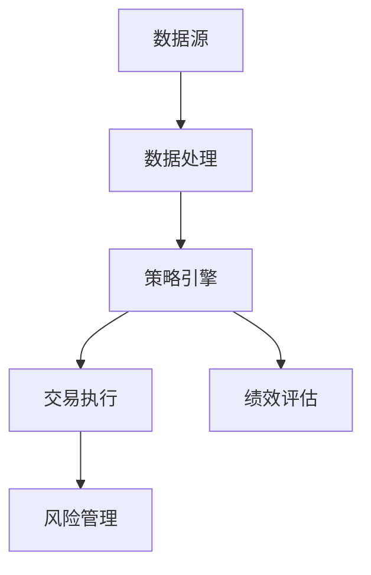
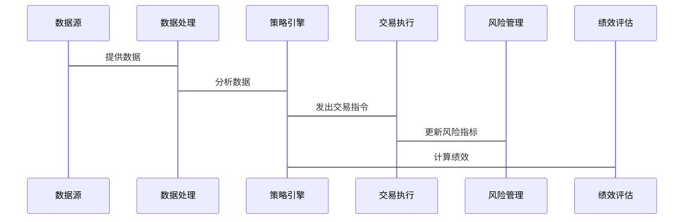

                 


# 如何将特价股票策略应用于商品期货投资

> 关键词：特价股票策略，商品期货投资，投资策略，风险管理，技术分析

> 摘要：本文将深入探讨如何将特价股票策略应用于商品期货投资。首先，我们将介绍特价股票策略的基本概念及其在商品期货投资中的潜在应用。接着，我们从核心概念与联系、算法原理、系统分析与架构设计、项目实战等多个维度展开详细分析。我们还将提供数学模型、系统架构图和实际案例，帮助读者理解如何在商品期货投资中有效运用特价股票策略。最后，我们将总结最佳实践、注意事项和拓展阅读建议，为读者提供全面的指导。

---

## 第1章: 特价股票策略的定义与特点

### 1.1 特价股票的定义

#### 1.1.1 特价股票的基本概念
特价股票是指在特定市场条件下，以低于正常市场价买入的股票。这种策略通常基于市场情绪、技术分析或基本面分析，旨在在价格回升时获利。

#### 1.1.2 特价股票的市场特征
- 市场波动性高
- 价格低估
- 市场情绪低迷

#### 1.1.3 特价股票与普通股票的区别
- 买入时机不同
- 风险承受能力不同
- 投资目标不同

### 1.2 特价股票策略的核心要素

#### 1.2.1 市场分析与选股策略
- 技术分析：利用K线图、均线等工具寻找买入机会
- 基本面分析：分析公司财务状况、行业地位等

#### 1.2.2 买入时机的选择
- 市场底部信号
- 技术指标的背离
- 市场恐慌情绪

#### 1.2.3 退出策略与风险管理
- 设置止损点
- 利用移动平均线或支撑位作为卖出信号
- 分阶段退出策略

---

## 第2章: 商品期货投资的基础知识

### 2.1 商品期货的基本概念

#### 2.1.1 商品期货的定义
商品期货是以实物商品为标的的标准化合约，约定在未来某一时间以特定价格买入或卖出商品。

#### 2.1.2 商品期货的种类
- 农产品期货：大豆、玉米等
- 能源期货：原油、天然气等
- 金属期货：黄金、白银等

#### 2.1.3 商品期货市场的运作机制
- 交易所：如芝加哥期货交易所（CME）
- 结算所：负责清算和交割
- 中间商：连接买家和卖家

### 2.2 商品期货投资的特点

#### 2.2.1 杠杆效应与风险
- 杠杆效应放大收益和亏损
- 风险较高，需严格控制仓位

#### 2.2.2 套期保值与投机交易
- 套期保值：锁定价格，规避风险
- 投机交易：通过价格波动获利

#### 2.2.3 商品期货市场的价格波动
- 受市场供需、政策、天气等因素影响

---

## 第3章: 特价股票策略与商品期货投资的结合

### 3.1 特价股票策略在商品期货中的应用

#### 3.1.1 特价股票策略如何影响商品期货价格
- 投资者通过股票市场行为间接影响期货市场价格
- 特价股票策略可能引发市场流动性变化，进而影响期货价格

#### 3.1.2 商品期货市场对特价股票策略的反馈机制
- 商品期货价格波动可能反过来影响股票市场
- 期货市场的价格信号为股票投资提供参考

### 3.2 商品期货市场对股票投资的辅助作用

#### 3.2.1 通过商品期货对冲股票投资风险
- 利用期货市场的价格波动对冲股票投资的市场风险
- 套期保值策略可以降低组合风险

#### 3.2.2 商品期货市场作为股票投资的参考指标
- 商品期货价格波动可能反映市场情绪，为股票投资提供参考
- 商品期货市场数据可以作为宏观经济指标的补充

---

## 第4章: 特价股票策略与商品期货投资的核心概念与联系

### 4.1 特价股票策略的核心原理

#### 4.1.1 市场情绪与价格波动
- 特价股票策略依赖于市场情绪的变化，而商品期货市场也受市场情绪影响

#### 4.1.2 市场周期与投资机会
- 特价股票策略通常在市场底部出现，而商品期货市场也可能在此时出现投资机会

#### 4.1.3 技术分析与基本面分析的结合
- 技术分析帮助确定买入时机，基本面分析帮助筛选标的

### 4.2 商品期货投资的核心原理

#### 4.2.1 商品价格波动的驱动因素
- 宏观经济政策
- 市场供需
- 天气、自然灾害等不可抗力因素

#### 4.2.2 市场供需关系与价格形成
- 供给与需求的动态平衡决定价格
- 市场参与者的行为影响价格波动

#### 4.2.3 套期保值与投机交易的平衡
- 套期保值为投机交易提供基础
- 投机交易增加市场流动性

### 4.3 特价股票策略与商品期货投资的联系

#### 4.3.1 特价股票策略对商品期货市场的影响
- 特价股票策略可能导致资金从股票市场转向商品期货市场
- 特价股票策略可能引发商品期货市场的价格波动

#### 4.3.2 商品期货市场对股票投资的反馈机制
- 商品期货市场的价格信号可以为股票投资提供参考
- 商品期货市场的风险偏好影响股票市场的资金流动

---

## 第5章: 特价股票策略与商品期货投资的算法与数学模型

### 5.1 特价股票策略的算法原理

#### 5.1.1 算法原理
- 基于技术分析的买卖信号生成
- 基于基本面分析的股票筛选

#### 5.1.2 数学模型
$$ P_{\text{buy}} = \text{MA}(n) \text{ 下穿 } \text{MA}(m) $$
$$ P_{\text{sell}} = \text{MA}(n) \text{ 上穿 } \text{MA}(m) $$

### 5.2 商品期货投资的算法原理

#### 5.2.1 算法原理
- 基于价格波动的套利机会识别
- 基于统计套利的策略开发

#### 5.2.2 数学模型
$$ \text{基差} = F_{\text{未来}} - P_{\text{当前}} $$
$$ \text{套利机会} = \text{基差} > \text{交易成本} $$

### 5.3 特价股票策略与商品期货投资的结合算法

#### 5.3.1 算法原理
- 利用特价股票策略筛选股票，结合商品期货市场的价格波动进行对冲或套利
- 基于市场情绪的期货市场投资

#### 5.3.2 数学模型
$$ \text{组合收益} = \alpha \times \text{股票收益} + \beta \times \text{期货收益} $$
$$ \text{风险调整收益} = \text{组合收益} - \text{无风险利率} \times \text{组合风险} $$

---

## 第6章: 特价股票策略与商品期货投资的系统分析与架构设计

### 6.1 项目介绍

#### 6.1.1 项目背景
- 利用特价股票策略在商品期货市场中寻找投资机会
- 构建一个基于算法的投资系统

### 6.2 系统功能设计

#### 6.2.1 数据源模块
- 股票市场数据：实时价格、历史数据、市场情绪指标
- 商品期货市场数据：期货价格、基差、持仓量

#### 6.2.2 策略引擎模块
- 技术分析策略：移动平均线、RSI、MACD等
- 基本面分析策略：公司财务数据、行业分析
- 统计套利策略：基差分析、配对交易

#### 6.2.3 交易执行模块
- 订单生成与提交
- 仓位管理
- 风险控制

#### 6.2.4 风险管理模块
- 止损策略
- 风险分散
- 绩效评估

### 6.3 系统架构设计

#### 6.3.1 系统架构图


#### 6.3.2 系统交互图


---

## 第7章: 特价股票策略与商品期货投资的项目实战

### 7.1 环境安装

#### 7.1.1 系统要求
- Python 3.8+
- Jupyter Notebook
- 数据分析库（Pandas、NumPy）
- 可视化库（Matplotlib、Seaborn）
- 期货交易接口（如 Interactive Brokers）

### 7.2 核心代码实现

#### 7.2.1 特价股票策略实现

```python
import pandas as pd
import numpy as np

def get_buy_signal(data, short_window=10, long_window=20):
    data['short_ma'] = data['Close'].rolling(short_window).mean()
    data['long_ma'] = data['Close'].rolling(long_window).mean()
    data['buy_signal'] = np.where(data['short_ma'] < data['long_ma'], 1, 0)
    return data['buy_signal']

# 示例数据
data = pd.DataFrame({
    'Close': [100, 98, 95, 97, 96, 99, 101, 102, 100, 98]
})
buy_signal = get_buy_signal(data)
print(buy_signal)
```

#### 7.2.2 商品期货投资策略实现

```python
def calculate_basis(futures_price, spot_price):
    basis = futures_price - spot_price
    return basis

# 示例数据
futures_price = [105, 104, 103, 102, 101]
spot_price = [100, 99, 98, 97, 96]
basis = calculate_basis(futures_price, spot_price)
print(basis)
```

### 7.3 实际案例分析

#### 7.3.1 案例背景
- 特价股票策略应用于某商品期货市场
- 数据来源：某商品期货的历史价格数据

#### 7.3.2 案例分析
- 使用移动平均线策略筛选特价股票
- 利用期货市场的基差进行套利

### 7.4 项目小结
- 特价股票策略与商品期货投资的结合可以有效降低投资风险
- 系统化的方法能够提高投资效率和收益
- 需要持续监控市场变化，及时调整策略

---

## 第8章: 特价股票策略与商品期货投资的最佳实践

### 8.1 小结
- 特价股票策略与商品期货投资的结合具有较大的潜力
- 系统化的策略设计和风险管理是成功的关键

### 8.2 注意事项
- 风险控制是首要任务
- 确保数据来源的准确性和及时性
- 灵活调整策略以适应市场变化

### 8.3 拓展阅读
- 《商品期货交易策略》
- 《股票投资策略与风险管理》
- 《算法交易与量化投资》

---

## 作者信息

作者：AI天才研究院/AI Genius Institute & 禅与计算机程序设计艺术 /Zen And The Art of Computer Programming

---

以上是《如何将特价股票策略应用于商品期货投资》的技术博客文章的完整目录和内容概要。希望这篇文章能够为读者提供清晰、实用的指导，帮助他们在商品期货投资中有效应用特价股票策略。

