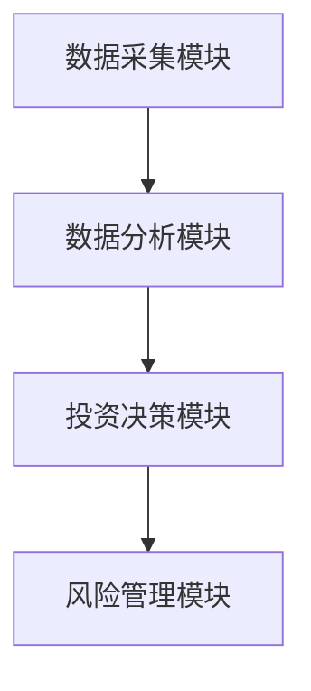
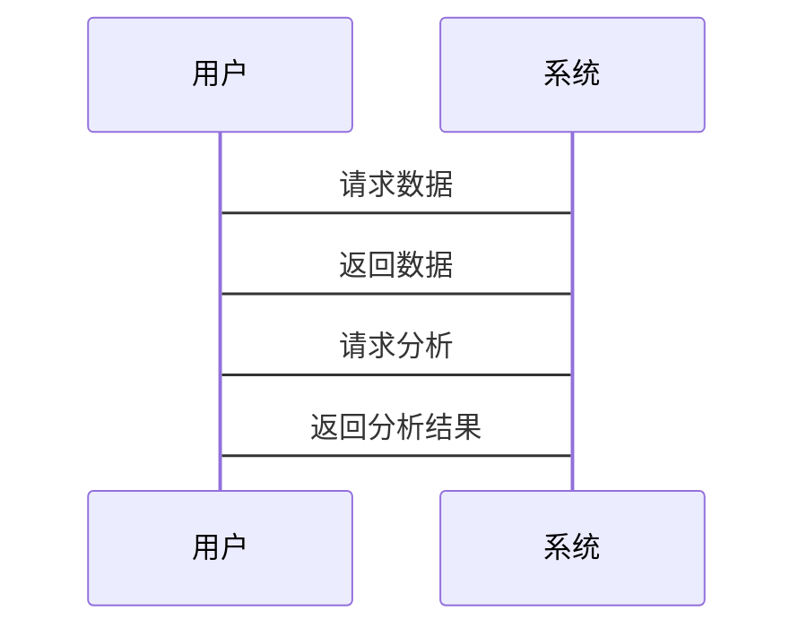

                 


# 如何将特价股票策略应用于新兴市场债券投资

## 关键词：特价股票策略、新兴市场债券、算法交易、风险管理、投资组合优化

## 摘要：本文探讨了如何将特价股票策略应用于新兴市场债券投资。通过分析特价股票策略的核心原理、数学模型和系统架构，结合实际案例，展示了如何在新兴市场中应用该策略，并提供了风险管理的最佳实践。

---

## 第一章: 特价股票策略与新兴市场债券投资概述

### 1.1 特价股票策略的基本概念

#### 1.1.1 特价股票策略的定义
特价股票策略是一种投资策略，通过在市场下跌时购买被低估的股票或债券，以低于其内在价值的价格买入，等待价格回升时卖出获利。

#### 1.1.2 特价股票策略的核心要素
- 市场波动分析
- 价值评估模型
- 入场和出场时机

#### 1.1.3 特价股票策略的市场背景
近年来，全球市场的波动性增加，尤其是新兴市场，为特价策略提供了更多的机会。

### 1.2 新兴市场债券投资的基本概念

#### 1.2.1 新兴市场债券的定义
新兴市场债券是指由新兴经济体发行的债券，包括主权债券、企业债券等。

#### 1.2.2 新兴市场债券的主要类型
- 主权债券
- 企业债券
- 机构债券

#### 1.2.3 新兴市场债券的投资风险
- 市场风险
- 汇率风险
- 政治风险

### 1.3 特价股票策略与新兴市场债券投资的结合

#### 1.3.1 结合的背景与动机
新兴市场的高波动性为特价策略提供了机会，同时债券市场的稳定性为投资者提供了避险选择。

#### 1.3.2 结合的核心逻辑
通过分析市场波动，利用特价策略在债券价格低估时买入，价格回升时卖出。

#### 1.3.3 结合的潜在优势与挑战
优势：潜在高回报，分散投资风险；挑战：市场波动大，信息不透明。

## 第二章: 特价股票策略的核心原理

### 2.1 特价股票策略的数学模型

#### 2.1.1 市场波动模型
使用时间序列分析模型，如ARIMA，预测债券价格波动。

#### 2.1.2 债券定价模型
基于收益率曲线和信用评级，评估债券的内在价值。

#### 2.1.3 投资组合优化模型
使用均值-方差优化，构建风险调整后的最优投资组合。

### 2.2 特价股票策略与债券投资的关联

#### 2.2.1 市场波动对债券价格的影响
通过波动率和相关性分析，量化市场波动对债券价格的影响。

#### 2.2.2 特价策略在债券投资中的应用
利用市场低估时买入，高估时卖出，实现超额收益。

#### 2.2.3 债券评级与特价策略的关系
债券评级影响其信用风险，评级下降可能导致价格低估，提供买入机会。

### 2.3 特价股票策略在新兴市场的特殊性

#### 2.3.1 新兴市场的波动特征
新兴市场的波动性较高，且受到全球经济和地缘政治的影响较大。

#### 2.3.2 新兴市场的债券评级体系
新兴市场债券评级通常较低，但可能因经济改善而提升。

#### 2.3.3 新兴市场的政策环境影响
政府政策和法规变化可能影响债券价格，提供特价策略的机会。

### 2.4 本章小结
本章介绍了特价策略的核心原理及其在新兴市场债券投资中的应用，强调了市场波动和债券评级的重要性。

---

## 第三章: 特价股票策略的算法实现

### 3.1 算法概述

#### 3.1.1 算法目标
预测债券价格波动，优化投资组合，最大化收益并最小化风险。

#### 3.1.2 算法输入
历史价格数据、市场波动指标、债券评级数据。

#### 3.1.3 算法输出
投资建议，包括买入信号、卖出信号、仓位调整建议。

### 3.2 算法流程

#### 3.2.1 数据预处理
清洗数据，处理缺失值和异常值。

#### 3.2.2 市场波动预测
使用LSTM神经网络预测债券价格的未来走势。

#### 3.2.3 债券价格预测
基于波动预测，评估债券的潜在价格变动。

#### 3.2.4 投资决策
根据预测结果，生成买入或卖出信号。

### 3.3 算法实现的数学模型

#### 3.3.1 时间序列模型
使用ARIMA模型进行价格预测。

#### 3.3.2 机器学习模型
利用LSTM进行时间序列预测，捕捉复杂的市场模式。

#### 3.3.3 组合优化模型
通过均值-方差优化，构建最优投资组合。

### 3.4 算法实现的代码示例

#### 3.4.1 数据读取与预处理
```python
import pandas as pd
data = pd.read_csv('bond_prices.csv')
data = data.dropna()
```

#### 3.4.2 市场波动预测
```python
from sklearn.preprocessing import MinMaxScaler
from keras.models import Sequential
from keras.layers import LSTM, Dense

# 数据归一化
scaler = MinMaxScaler()
data_scaled = scaler.fit_transform(data)

# 构建数据集
X_train, y_train = [], []
for i in range(60, len(data_scaled)):
    X_train.append(data_scaled[i-60:i])
    y_train.append(data_scaled[i])

X_train = np.array(X_train)
y_train = np.array(y_train)

# 构建LSTM模型
model = Sequential()
model.add(LSTM(50, return_sequences=True, input_shape=(60,1)))
model.add(LSTM(50, return_sequences=False))
model.add(Dense(1))
model.compile(loss='mean_squared_error', optimizer='adam')

# 训练模型
model.fit(X_train, y_train, epochs=100, batch_size=32)
```

#### 3.4.3 投资决策
```python
# 预测未来价格
next_month_price = model.predict(np.array([data_scaled[-60:]]))[0][0]
scaled_price = scaler.inverse_transform([[next_month_price]])[0][0]
```

### 3.5 本章小结
本章详细介绍了算法实现的过程，包括数据预处理、模型构建和投资决策，展示了如何通过机器学习模型实现特价策略的应用。

---

## 第四章: 系统分析与架构设计方案

### 4.1 系统功能设计

#### 4.1.1 功能模块
- 数据采集模块
- 数据分析模块
- 投资决策模块
- 风险管理模块

#### 4.1.2 功能描述
- 数据采集：实时获取新兴市场债券数据
- 数据分析：预测价格波动
- 投资决策：生成买卖信号
- 风险管理：控制投资风险

### 4.2 系统架构设计

#### 4.2.1 系统架构图


#### 4.2.2 数据流图
```mermaid
flowchart TD
    start --> A[开始]
    A --> B[数据预处理]
    B --> C[模型训练]
    C --> D[生成信号]
    D --> end
```

### 4.3 系统接口设计

#### 4.3.1 API接口
- 数据接口：获取债券数据
- 分析接口：返回波动预测
- 决策接口：返回投资建议

#### 4.3.2 接口交互


### 4.4 本章小结
本章设计了一个完整的系统架构，展示了如何将特价策略应用于实际投资中，包括功能模块、架构设计和接口设计。

---

## 第五章: 项目实战

### 5.1 项目环境配置

#### 5.1.1 安装依赖
```bash
pip install pandas numpy keras scikit-learn
```

### 5.2 核心实现代码

#### 5.2.1 数据处理代码
```python
import pandas as pd
import numpy as np
from sklearn.preprocessing import MinMaxScaler
from keras.models import Sequential
from keras.layers import LSTM, Dense

# 数据读取
data = pd.read_csv('em_bond.csv')

# 数据预处理
data = data.dropna()
scaler = MinMaxScaler()
data_scaled = scaler.fit_transform(data)
```

#### 5.2.2 模型实现代码
```python
# LSTM模型构建
model = Sequential()
model.add(LSTM(50, return_sequences=True, input_shape=(60,1)))
model.add(LSTM(50, return_sequences=False))
model.add(Dense(1))
model.compile(loss='mean_squared_error', optimizer='adam')

# 模型训练
model.fit(X_train, y_train, epochs=100, batch_size=32)
```

### 5.3 项目实战分析

#### 5.3.1 数据分析与建模
通过对新兴市场债券数据的分析，构建LSTM模型预测价格波动。

#### 5.3.2 投资决策
基于模型预测，生成买入和卖出信号，优化投资组合。

#### 5.3.3 风险管理
通过动态调整头寸和止损策略，控制投资风险。

### 5.4 本章小结
本章通过实际案例展示了如何将特价策略应用于新兴市场债券投资，从数据处理到模型实现，再到投资决策，完整地体现了策略的实际应用。

---

## 第六章: 最佳实践与总结

### 6.1 风险管理

#### 6.1.1 头寸控制
根据账户资金和风险承受能力，合理分配投资比例。

#### 6.1.2 止损策略
设置止损点，避免过度亏损。

#### 6.1.3 风险分散
通过投资不同地区的债券，分散市场风险。

### 6.2 策略优化

#### 6.2.1 模型优化
尝试不同的机器学习模型，如随机森林和GARCH模型，优化预测精度。

#### 6.2.2 动态调整
根据市场变化，动态调整模型参数和投资策略。

### 6.3 注意事项

#### 6.3.1 市场风险
新兴市场的波动性和政策风险较高，需谨慎操作。

#### 6.3.2 数据质量
确保数据的准确性和完整性，避免因数据问题导致错误决策。

#### 6.3.3 模型局限
认识到模型的局限性，结合市场分析和专家意见，做出综合决策。

### 6.4 拓展阅读

#### 6.4.1 进一步学习
建议阅读相关书籍和文献，深入了解新兴市场债券投资和机器学习在金融中的应用。

#### 6.4.2 实践经验
参与金融论坛和社区，分享和学习他人的实践经验。

### 6.5 本章小结
本章总结了应用特价策略的关键点，强调了风险管理的重要性，并提供了策略优化和注意事项的建议。

---

## 作者：AI天才研究院 & 禅与计算机程序设计艺术

通过本文，读者可以系统地了解如何将特价股票策略应用于新兴市场债券投资，从理论到实践，全面掌握相关知识和技能。

