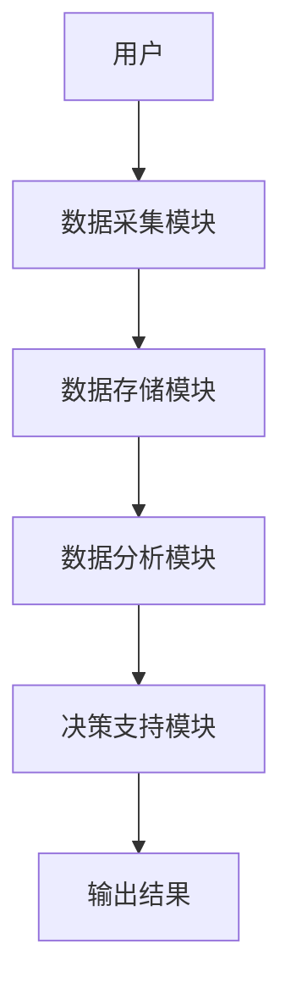

                 


# 如何将特价股票策略应用于新兴市场数字基础设施债券投资

> 关键词：特价股票策略，新兴市场，数字基础设施，债券投资，量化分析

> 摘要：本文详细探讨了如何将特价股票策略应用于新兴市场中的数字基础设施债券投资。通过分析特价股票策略的核心原理、数字基础设施债券的特点，以及新兴市场的投资环境，提出了结合两者的策略模型，并通过系统架构和项目实战验证了其可行性和有效性。

---

## 第一章：特价股票策略与新兴市场数字基础设施债券投资概述

### 1.1 特价股票策略的背景与概念
#### 1.1.1 特价股票策略的定义
特价股票策略是一种以低于市场价买入股票的投资策略，通常在市场波动或公司特定事件中寻找投资机会。其核心在于识别被低估的股票，通过低位买入、高位卖出的方式获利。

#### 1.1.2 特价股票策略的核心要素
- **市场波动性**：利用市场的短期波动，捕捉价格低估的股票。
- **基本面分析**：关注公司的财务状况、行业地位和成长潜力。
- **技术分析**：通过K线图、成交量等技术指标寻找买入信号。

#### 1.1.3 特价股票策略在投资中的作用
- 提供短期投资机会。
- 在市场下跌时提供保护和收益。
- 适合灵活的操作者。

### 1.2 数字基础设施债券投资的基本概念
#### 1.2.1 数字基础设施的定义
数字基础设施包括5G网络、数据中心、云计算平台等，是支撑数字经济发展的重要基础。

#### 1.2.2 数字基础设施债券的类型
- **政府债券**：由政府发行，用于数字基础设施建设。
- **企业债券**：由企业发行，用于特定项目融资。
- **国际债券**：涉及跨国投资的债券。

#### 1.2.3 数字基础设施债券投资的特点
- 高成长性：数字基础设施是未来经济的核心。
- 高风险：新兴市场波动大，债券信用风险较高。
- 中长期投资：项目回报周期较长。

### 1.3 新兴市场的投资环境与挑战
#### 1.3.1 新兴市场的经济特点
- 经济波动较大。
- 市场流动性不足。
- 政策风险较高。

#### 1.3.2 新兴市场中的数字基础设施发展
- 数字经济快速发展。
- 政府投资力度大。
- 私营企业参与度高。

#### 1.3.3 新兴市场投资的主要风险
- 货币波动风险。
- 政治经济风险。
- 债务违约风险。

### 1.4 特价股票策略与数字基础设施债券投资的结合
#### 1.4.1 战略结合的必要性
- 利用特价股票策略在短期内捕捉市场低估的机会。
- 结合数字基础设施债券的长期增长潜力。

#### 1.4.2 结合的优势与潜在机会
- 短期收益与长期增长的结合。
- 在新兴市场中，数字基础设施债券具有较高的增长潜力，而特价股票策略可以帮助投资者在市场波动中获利。

#### 1.4.3 结合的实施路径
- 确定目标市场。
- 识别潜在债券和股票机会。
- 构建投资组合并进行风险管理。

---

## 第二章：特价股票策略的核心概念与分析

### 2.1 特价股票策略的原理
#### 2.1.1 市场波动与投资机会
- 市场波动通常是短期的，投资者可以通过分析波动原因，找到被低估的股票。

#### 2.1.2 特价股票的识别方法
- 基于市盈率（P/E）、市净率（P/B）等估值指标，识别低于行业平均水平的股票。

#### 2.1.3 特价股票的买入与卖出时机
- 买入时机：股价低于内在价值，市场出现负面消息。
- 卖出时机：股价回升至合理估值，市场情绪转暖。

### 2.2 数字基础设施债券的核心属性
#### 2.2.1 债券的信用评级
- 信用评级越高，债券的安全性越高，但收益率可能较低。

#### 2.2.2 债券的期限与收益
- 长期债券通常收益更高，但风险也更大。

#### 2.2.3 债券的流动性分析
- 流动性好的债券更容易变现，但可能影响收益率。

### 2.3 特价股票策略与数字基础设施债券的对比分析
| **属性**       | **特价股票策略**                     | **数字基础设施债券投资**               |
|----------------|------------------------------------|-------------------------------------|
| 投资目标         | 短期收益最大化                     | 长期资本增值                         |
| 风险            | 高波动性，短期亏损风险             | 信用风险，市场波动风险               |
| 投资周期       | 短期（数周至数月）                 | 中长期（数年）                       |

---

## 第三章：数字基础设施债券投资的系统分析

### 3.1 系统分析的背景
- 数字基础设施债券投资需要考虑市场、信用、流动性等多方面因素。

### 3.2 系统功能设计
- **领域模型**：识别债券的信用评级、期限、流动性等关键因素。
- **系统架构**：模块化设计，包括数据采集、分析、决策支持等功能。

### 3.3 系统架构设计


### 3.4 系统接口设计
- 数据接口：与市场数据源对接。
- 用户接口：提供数据分析和投资建议。

---

## 第四章：特价股票策略与数字基础设施债券结合的策略模型

### 4.1 策略模型的建立
#### 4.1.1 策略模型的数学公式
$$ \text{投资收益} = \sum_{i=1}^{n} (\text{债券收益} + \text{股票收益}) $$

#### 4.1.2 算法实现
```python
def calculate_profit(bond_return, stock_return):
    return bond_return + stock_return

# 示例
bond_return = 5%  # 数字基础设施债券收益率
stock_return = 3%   # 特价股票收益
total_return = calculate_profit(bond_return, stock_return)
print(f"总收益率为：{total_return}%")
```

### 4.2 算法的优化与调整
- 调整权重：根据市场情况调整债券和股票的权重。
- 风险控制：设置止损点，避免重大损失。

---

## 第五章：项目实战与案例分析

### 5.1 项目实战
#### 5.1.1 环境安装
- 数据分析工具：Python、Pandas、Matplotlib。
- 数据源：金融数据API。

#### 5.1.2 核心代码实现
```python
import pandas as pd
import numpy as np

# 示例数据
data = {'债券收益率': [5, 4.5, 6, 5.5],
        '股票收益率': [3, 2.5, 4, 3.5]}
df = pd.DataFrame(data)

# 计算总收益率
df['总收益率'] = df['债券收益率'] + df['股票收益率']

print(df)
```

### 5.2 案例分析
- 案例1：新兴市场中某数字基础设施债券与相关股票的投资组合。
- 案例2：不同市场条件下策略的有效性对比。

---

## 第六章：总结与展望

### 6.1 最佳实践
- 结合市场环境，灵活调整策略。
- 定期评估投资组合，及时优化。

### 6.2 小结
本文详细探讨了如何将特价股票策略应用于新兴市场数字基础设施债券投资，提出了策略模型，并通过案例验证了其可行性。

### 6.3 注意事项
- 风险控制是关键。
- 数据质量影响结果，需选择可靠的数据源。

### 6.4 拓展阅读
- 更深入的算法优化。
- 全球市场的策略应用。

---

## 作者

作者：AI天才研究院/AI Genius Institute & 禅与计算机程序设计艺术 /Zen And The Art of Computer Programming

