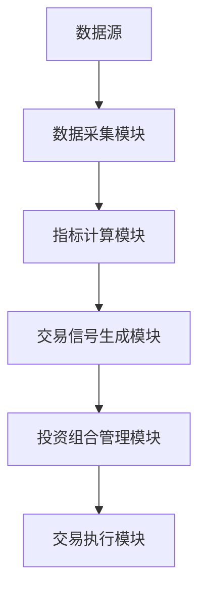

                 


# 如何将特价股票策略应用于新兴市场本地货币债券投资

> **关键词**：特价股票策略，新兴市场，本地货币债券，投资策略，风险管理  
> **摘要**：本文详细探讨如何将特价股票策略应用于新兴市场本地货币债券投资，分析其核心概念、数学模型、算法原理及系统架构，结合实际案例进行深入解读，并提出风险管理与最佳实践建议。

---

# 1. 特价股票策略与新兴市场本地货币债券投资的背景介绍

## 1.1 特价股票策略的基本概念

### 1.1.1 什么是特价股票策略
特价股票策略是一种基于市场波动性，寻找被低估股票的投资策略。核心在于通过分析市场周期和价格波动，捕捉短期或中期内价格被低估的股票进行投资，以期在价格回归合理区间时获利。

### 1.1.2 特价股票策略的核心要素
- **市场周期分析**：识别市场波动周期，判断是否处于低价区。
- **估值指标**：如市盈率（P/E）、市净率（P/B）等，评估股票是否被低估。
- **交易信号**：通过技术分析或基本面分析触发买入信号。

### 1.1.3 特价股票策略的适用场景
- **市场下跌周期**：适合在市场低迷时寻找被低估的股票。
- **短期套利机会**：适用于对市场波动敏感的投资者。
- **高波动性市场**：如新兴市场，波动性较高，适合特价股票策略。

## 1.2 新兴市场本地货币债券的基本概念

### 1.2.1 新兴市场的定义与特点
- **新兴市场**：经济快速增长但尚未完全工业化的国家，如中国、印度、巴西等。
- **本地货币债券**：以新兴市场国家的本地货币（如人民币、卢布、巴西里尔）发行的债券。

### 1.2.2 本地货币债券的分类
- **政府债券**：由政府发行，信用风险较低。
- **企业债券**：由企业发行，信用风险较高，但收益也较高。
- **通胀挂钩债券**：收益与通胀挂钩，适合通胀较高的新兴市场。

### 1.2.3 新兴市场本地货币债券的投资价值
- **高收益潜力**：新兴市场经济增长快，债券收益率较高。
- **分散风险**：与传统债券市场相关性较低，适合多元化投资。
- **本地货币优势**：持有本地货币债券可对冲汇率风险。

## 1.3 特价股票策略应用于新兴市场本地货币债券投资的意义

### 1.3.1 为什么将特价股票策略应用于新兴市场本地货币债券投资
- **价格波动性**：新兴市场债券价格波动较大，适合特价策略。
- **市场效率不足**：新兴市场信息不对称，存在定价错误的机会。
- **多样化收益来源**：结合股票和债券，优化投资组合。

### 1.3.2 特价股票策略在新兴市场本地货币债券投资中的优势
- **捕捉低估机会**：通过分析债券价格与基本面的偏离，寻找投资机会。
- **灵活性**：策略可根据市场变化快速调整。
- **风险控制**：通过低估价格进入，降低初始投资风险。

### 1.3.3 该策略的潜在风险
- **市场波动**：新兴市场波动性高，可能导致策略失效。
- **流动性风险**：部分新兴市场债券流动性较低，难以迅速买卖。
- **政策风险**：新兴市场政策变化快，可能影响债券价格。

---

# 2. 特价股票策略与新兴市场本地货币债券投资的核心概念与联系

## 2.1 特价股票策略的核心原理

### 2.1.1 特价股票策略的数学模型

#### 市盈率（P/E）计算公式
$$ P/E = \frac{当前股价}{每股净利润} $$

#### 市净率（P/B）计算公式
$$ P/B = \frac{当前股价}{每股净资产} $$

### 2.1.2 特价股票策略的关键指标与分析方法

- **相对强度**：比较股票与市场指数的表现，判断股票的强弱。
- **资金流向**：通过成交量和资金流分析判断市场情绪。
- **技术指标**：如RSI（相对强弱指数）、MACD（移动平均收敛散度）等。

### 2.1.3 特价股票策略的实施步骤

1. **筛选低估股票**：根据P/E、P/B等指标筛选低于行业平均水平的股票。
2. **市场周期分析**：判断市场是否处于低价区。
3. **技术信号确认**：通过技术指标确认买入信号。
4. **组合构建**：分散投资，降低风险。

## 2.2 新兴市场本地货币债券的核心属性

### 2.2.1 新兴市场本地货币债券的主要特征

- **高收益率**：新兴市场债券收益率通常高于发达市场。
- **高波动性**：价格波动较大，适合短期交易。
- **货币风险**：债券以本地货币计价，存在汇率波动风险。

### 2.2.2 新兴市场本地货币债券的风险与收益分析

- **收益**：高经济增长带来高债券收益率。
- **风险**：包括信用风险、流动性风险和汇率风险。

### 2.2.3 新兴市场本地货币债券的定价模型

#### 债券定价公式
$$ P = \frac{C}{(1 + r)^n} $$
其中，\( C \) 为每年的现金流，\( r \) 为收益率，\( n \) 为债券期限。

## 2.3 特价股票策略与新兴市场本地货币债券投资的联系

### 2.3.1 特价股票策略在新兴市场本地货币债券投资中的应用

- **筛选低估债券**：通过P/E、P/B等指标筛选低估债券。
- **市场周期分析**：判断市场是否处于低价区，适合投资。
- **技术信号确认**：通过技术指标确认买入信号。

### 2.3.2 两者结合的理论基础与实践意义

- **理论基础**：两者都基于市场波动性和价格低估。
- **实践意义**：新兴市场债券波动性高，适合特价策略。

### 2.3.3 两者结合的可行性分析

- **优势**：新兴市场债券波动性高，适合特价策略。
- **劣势**：新兴市场债券流动性较低，可能影响策略效果。

---

# 3. 特价股票策略应用于新兴市场本地货币债券投资的数学模型与算法原理

## 3.1 特价股票策略的数学模型

### 3.1.1 特价股票策略的基本公式

$$ 价格低估 = \frac{当前价格}{内在价值} < 1 $$

### 3.1.2 特价股票策略的优化模型

$$ 最优买入价格 = \frac{内在价值}{安全边际系数} $$

## 3.2 新兴市场本地货币债券的定价模型

### 3.2.1 新兴市场本地货币债券的定价公式

$$ P = \sum_{t=1}^{n} \frac{C}{(1 + r)^t} + \frac{F}{(1 + r)^n} $$
其中，\( C \) 为每年的利息，\( F \) 为面值，\( r \) 为收益率，\( n \) 为期限。

### 3.2.2 新兴市场本地货币债券的收益率计算

$$ YTM = \left( \frac{C}{P} + \frac{F - P}{n} \right) \times 100\% $$

---

# 4. 系统架构与实现方案

## 4.1 系统功能设计

### 4.1.1 系统模块划分

- 数据采集模块：采集新兴市场本地货币债券数据。
- 指标计算模块：计算P/E、P/B等指标。
- 交易信号生成模块：根据模型生成买入信号。

### 4.1.2 系统功能流程

1. 数据采集：从数据源获取债券数据。
2. 指标计算：计算各项估值指标。
3. 交易信号生成：判断是否满足买入条件。
4. 投资组合管理：根据信号构建投资组合。

## 4.2 系统架构设计

### 4.2.1 系统架构图



---

# 5. 项目实战与案例分析

## 5.1 环境安装与配置

- 数据源：使用新兴市场债券数据API。
- 工具：Python、Pandas、Matplotlib。

## 5.2 核心实现源代码

```python
import pandas as pd
import numpy as np

# 示例数据
data = {
    '债券代码': ['BOND1', 'BOND2', 'BOND3'],
    '价格': [100, 90, 110],
    'P/E': [15, 10, 20],
    'P/B': [3, 2, 4]
}

df = pd.DataFrame(data)

# 计算低估债券
df['低估指标'] = (df['价格'] / df['P/E']).rank(ascending=True)

# 筛选低估债券
undervalued_bonds = df[df['低估指标'] < np.quantile(df['低估指标'], 0.3)]
print(undervalued_bonds)
```

---

# 6. 总结与展望

## 6.1 总结

本文详细探讨了如何将特价股票策略应用于新兴市场本地货币债券投资，分析了其核心概念、数学模型、系统架构，并结合实际案例进行了深入解读。通过本文的分析，读者可以更好地理解如何在新兴市场中应用特价策略进行债券投资。

## 6.2 展望

未来，随着新兴市场的进一步发展，本地货币债券的投资机会将更加丰富。特价股票策略的应用也将更加多样化，投资者需密切关注市场变化，灵活调整策略。

---

**作者：AI天才研究院 & 禅与计算机程序设计艺术**

