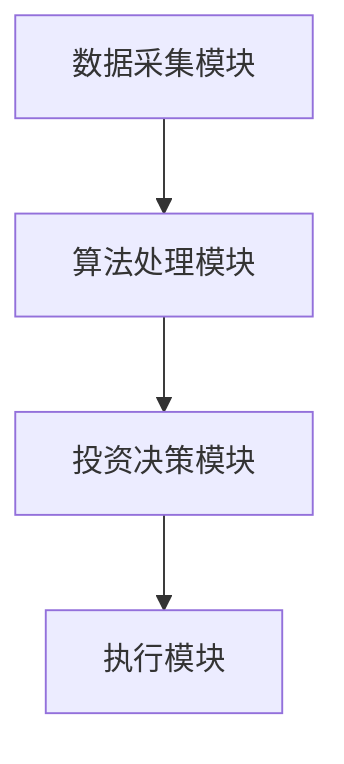
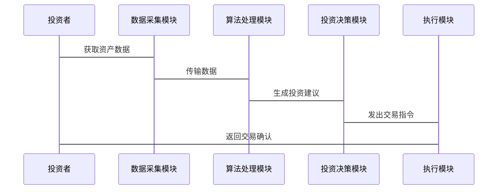

                 


# 如何将特价股票策略应用于跨元宇宙资产(CMA)投资

> 关键词：跨元宇宙资产、特价股票策略、投资策略、算法设计、风险管理

> 摘要：本文详细探讨如何将特价股票策略应用于跨元宇宙资产（CMA）投资。通过分析CMA的特性、特价股票策略的核心原理，以及两者结合的投资机会和挑战，本文提出了一套适用于CMA投资的算法和系统架构，并通过实际案例展示了策略的应用效果。

---

## 第1章 背景介绍：跨元宇宙资产与特价股票策略

### 1.1 跨元宇宙资产(CMA)的定义与特点

#### 1.1.1 跨元宇宙资产的基本概念
跨元宇宙资产（Cross-MetaVerse Assets, CMA）是指在多个虚拟世界或元宇宙中流通的数字资产，包括虚拟货币、虚拟商品、虚拟权益等。这些资产通过区块链技术实现跨平台的互操作性，能够在不同的元宇宙生态系统中进行交易和转移。

#### 1.1.2 跨元宇宙资产与传统金融资产的对比
| 特性       | 跨元宇宙资产（CMA）                | 传统金融资产                  |
|------------|----------------------------------|------------------------------|
| 流动性      | 高，支持跨平台交易                | 较低，受地域和市场限制          |
| 数字化      | 以数字形式存在                   | 部分数字化，如股票和债券        |
| 可编程性    | 支持智能合约                     | 依赖传统金融系统和规则          |
| 透明性      | 区块链技术提供透明记录           | 依赖金融机构和监管机构          |
| 风险性      | 市场波动大，价格波动频繁          | 市场波动相对稳定，风险可控      |

#### 1.1.3 跨元宇宙资产的投资潜力
随着元宇宙技术的快速发展，CMA的投资潜力巨大。它们不仅可以在虚拟经济中流通，还可以与现实世界的价值体系结合，形成新的投资机会。

### 1.2 特价股票策略的核心概念

#### 1.2.1 特价股票策略的定义
特价股票策略是一种基于市场波动和资产价格低估的投资策略。投资者通过分析市场数据和公司基本面，寻找价格低于其内在价值的股票进行投资。

#### 1.2.2 特价股票策略的应用场景
- **短期投资**：通过技术分析识别短期价格波动，迅速买入低估资产。
- **长期投资**：通过基本面分析寻找具有长期增长潜力的资产。
- **市场波动**：在市场下跌时，寻找被低估的资产进行投资。

#### 1.2.3 特价股票策略的优缺点
| 优点       | 缺点                         |
|------------|------------------------------|
| 高收益潜力  | 市场波动风险大               |
| 技术门槛低   | 需要持续市场监控             |
| 适合短期投资 | 长期投资效果不稳定           |

### 1.3 跨元宇宙资产与特价股票策略的结合

#### 1.3.1 跨元宇宙资产的流动性问题
跨元宇宙资产的流动性较高，但不同平台的交易规则和市场深度差异较大，需要投资者具备跨平台的市场分析能力。

#### 1.3.2 特价股票策略在虚拟经济中的应用
通过分析跨元宇宙资产的价格波动，投资者可以利用特价策略在虚拟经济中寻找投资机会。

#### 1.3.3 跨元宇宙资产投资的风险与机会
- **风险**：市场波动大、平台 interoperability 问题、监管不确定性。
- **机会**：高增长潜力、跨平台投资机会、技术创新驱动。

---

## 第2章 跨元宇宙资产的核心概念与联系

### 2.1 跨元宇宙资产的分类

#### 2.1.1 数字资产类
包括虚拟货币（如比特币、以太坊）和其他加密货币。

#### 2.1.2 虚拟商品类
如虚拟土地、虚拟装备等。

#### 2.1.3 虚拟权益类
如元宇宙平台的治理 token。

### 2.2 跨元宇宙资产的特性

#### 2.2.1 虚拟性
资产以数字形式存在，依赖区块链技术实现价值。

#### 2.2.2 跨平台性
资产可以在多个元宇宙平台中流通和交易。

#### 2.2.3 可编程性
通过智能合约实现自动化的交易和价值转移。

### 2.3 跨元宇宙资产的经济模型

#### 2.3.1 代币经济
基于区块链的经济体系，通过代币实现价值流通。

#### 2.3.2 智能合约
自动执行的合同，确保交易的安全性和透明性。

#### 2.3.3 资产流动性
资产在不同平台之间的流动性和交易深度直接影响其投资价值。

---

## 第3章 特价股票策略在跨元宇宙资产投资中的应用

### 3.1 特价股票策略的算法原理

#### 3.1.1 基于价格波动的预测模型
通过历史价格数据，使用时间序列分析预测未来价格走势。

#### 3.1.2 基于市场情绪的分析模型
利用社交媒体和市场情绪指标，预测市场波动对资产价格的影响。

#### 3.1.3 基于机器学习的推荐系统
使用机器学习算法，分析跨元宇宙资产的特征，推荐适合投资的资产。

### 3.2 算法实现

#### 3.2.1 数据采集与处理
从多个元宇宙平台收集资产价格、交易量、市场情绪等数据，并进行清洗和预处理。

#### 3.2.2 模型训练与优化
使用历史数据训练预测模型，调整参数以提高预测精度。

#### 3.2.3 策略执行与反馈
根据模型预测结果，执行买入或卖出操作，并根据市场反馈优化策略。

### 3.3 算法的数学模型与公式

#### 3.3.1 时间序列分析模型
使用ARIMA模型预测未来价格：
$$ ARIMA(p, d, q) $$
其中，p为自回归阶数，d为差分阶数，q为移动平均阶数。

#### 3.3.2 价格波动预测公式
基于波动率模型预测未来价格波动：
$$ \sigma_t = \alpha + \beta \sigma_{t-1} + \epsilon_t $$

#### 3.3.3 风险评估模型
使用VaR（Value at Risk）模型评估投资风险：
$$ VaR(\alpha) = \text{分位数}(\alpha) \text{的损失} $$

---

## 第4章 跨元宇宙资产投资的系统架构设计

### 4.1 系统功能设计

#### 4.1.1 数据采集模块
负责收集跨元宇宙资产的价格、交易量等数据。

#### 4.1.2 算法处理模块
执行价格预测和投资策略优化。

#### 4.1.3 投资决策模块
根据预测结果生成买入或卖出指令。

### 4.2 系统架构图


### 4.3 系统接口设计

#### 4.3.1 数据接口
- 数据来源：多个元宇宙平台的API接口。
- 数据格式：JSON格式，包含资产代码、价格、交易量等信息。

#### 4.3.2 算法接口
- 输入：资产数据、市场情绪指标。
- 输出：预测结果和投资建议。

#### 4.3.3 执行接口
- 输入：投资策略指令。
- 输出：交易确认和反馈。

### 4.4 系统交互流程



---

## 第5章 项目实战：跨元宇宙资产投资策略实现

### 5.1 环境安装

#### 5.1.1 安装Python环境
使用Anaconda安装Python 3.8及以上版本。

#### 5.1.2 安装相关库
安装Pandas、NumPy、Scikit-learn、Plotly等库：
```bash
pip install pandas numpy scikit-learn plotly
```

### 5.2 核心代码实现

#### 5.2.1 数据采集模块
```python
import pandas as pd
import requests

def fetch_data(asset_code):
    url = f"https://api.crossmetaverse.com/assets/{asset_code}"
    response = requests.get(url)
    data = response.json()
    df = pd.DataFrame({
        'timestamp': data['time'],
        'price': data['price']
    })
    return df
```

#### 5.2.2 预测模型实现
```python
from sklearn.metrics import mean_squared_error
from sklearn.preprocessing import MinMaxScaler
import numpy as np

def train_model(X_train, y_train):
    model = ARIMA(order=(5, 1, 0))
    model.fit(X_train, y_train)
    return model

def predict_price(model, X_test):
    forecast = model.predict(X_test)
    return forecast
```

#### 5.2.3 投资策略实现
```python
def execute_strategy(prices, threshold=0.1):
    for i in range(1, len(prices)):
        if prices[i] < prices[i-1] * (1 - threshold):
            print(f"买入信号：价格从{prices[i-1]}降至{prices[i]}")
        elif prices[i] > prices[i-1] * (1 + threshold):
            print(f"卖出信号：价格从{prices[i-1]}升至{prices[i]}")
```

### 5.3 实际案例分析

#### 5.3.1 数据收集与预处理
收集某跨元宇宙资产过去30天的价格数据，清洗数据并填充缺失值。

#### 5.3.2 模型训练与预测
使用ARIMA模型训练价格预测模型，并预测未来7天的价格走势。

#### 5.3.3 策略执行与结果分析
根据预测结果，执行买入和卖出指令，计算投资收益并分析策略的有效性。

---

## 第6章 最佳实践与总结

### 6.1 投资策略的注意事项
- **风险管理**：设定止损点和止盈点，控制投资风险。
- **市场监控**：实时监控市场动态，及时调整投资策略。
- **技术选型**：选择合适的算法和工具，提高策略执行效率。

### 6.2 未来展望
随着元宇宙技术的不断进步，跨元宇宙资产的投资机会将更加多样化。投资者需要不断学习新技术，优化投资策略，以应对未来的市场挑战。

---

## 作者：AI天才研究院/AI Genius Institute & 禅与计算机程序设计艺术 /Zen And The Art of Computer Programming

---

通过本文的详细分析，我们了解了如何将特价股票策略应用于跨元宇宙资产投资。从背景介绍到系统架构设计，再到实际案例分析，我们为读者提供了一套完整的投资策略框架。希望本文能为投资者提供有益的指导，帮助他们在跨元宇宙资产投资中获得更好的收益。

