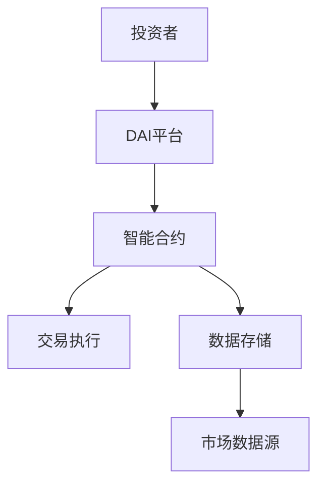
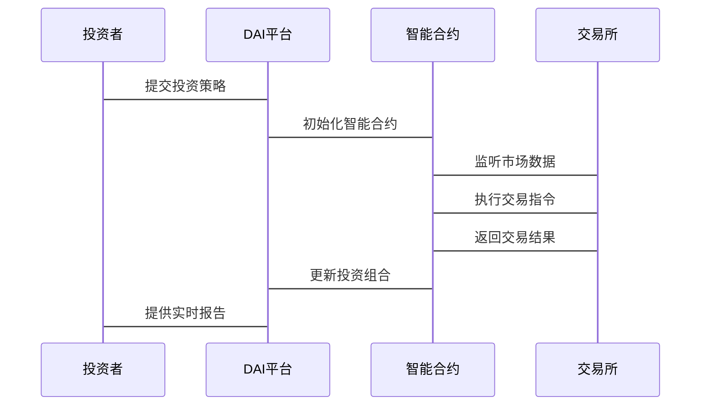

                 


# 如何将特价股票策略融入去中心化自治投资(DAI)

> 关键词：特价股票策略、去中心化自治投资、DAI、智能合约、区块链、量化交易

> 摘要：本文详细探讨了如何将特价股票策略与去中心化自治投资（DAI）相结合，通过分析背景、核心概念、算法原理、系统架构及项目实战，为读者提供从理论到实践的全面指导。

---

## 第一部分：特价股票策略与去中心化自治投资（DAI）概述

### 第1章：特价股票策略与DAI的背景介绍

#### 1.1 特价股票策略的基本概念

##### 1.1.1 什么是特价股票策略
特价股票策略是一种基于市场波动性进行投资的策略，投资者通过预测股票价格的变化，在合适的时间点买入或卖出股票，以赚取差价利润。这种策略通常依赖于技术分析和量化模型，能够在短时间内捕捉价格波动带来的收益。

##### 1.1.2 特价股票策略的核心要素
- **价格波动检测**：通过分析历史数据，识别价格波动的模式和周期。
- **交易时机选择**：利用算法确定最佳买卖时机，减少人为干扰。
- **风险控制**：设定止损点和止盈点，确保投资风险在可控范围内。

##### 1.1.3 特价股票策略的应用场景
- 短期交易：利用市场波动迅速获利。
- 对冲策略：通过做空或做多对冲市场风险。
- 自动化交易：借助算法实现高频交易，提高效率。

#### 1.2 去中心化自治投资（DAI）的基本概念

##### 1.2.1 DAI的定义与特点
DAI（Decentralized Autonomous Investment）是一种基于区块链技术的投资方式，通过智能合约实现投资决策的自动化和去中心化。投资者的资金由智能合约管理，合约根据预设的规则自动执行交易。

##### 1.2.2 DAI的核心要素与运作机制
- **智能合约**：执行投资策略的自动化的代码，运行在区块链上。
- **去中心化**：避免传统金融体系的中心化控制，提高透明度和安全性。
- **自治性**：智能合约自动执行交易，无需人工干预。

##### 1.2.3 DAI与传统投资的区别
- **自动化**：DAI通过智能合约自动执行交易，而传统投资依赖人工决策。
- **去中心化**：DAI基于区块链技术，消除中间人，降低成本。
- **透明性**：DAI的交易记录在区块链上，公开透明，便于追溯。

#### 1.3 特价股票策略与DAI的结合意义

##### 1.3.1 结合的必要性与优势
- **提高效率**：通过智能合约自动执行特价股票策略，减少人为干预。
- **增强透明性**：区块链技术确保交易记录的透明和可追溯。
- **降低风险**：智能合约可以自动执行风险控制策略，如止损。

##### 1.3.2 结合可能带来的创新
- **自动化交易**：将特价股票策略的算法嵌入智能合约，实现自动化交易。
- **智能化决策**：利用大数据和机器学习优化策略，提高收益。
- **去中心化管理**：投资者共同参与决策，实现真正的自治投资。

#### 1.4 当前市场中的相关实践与案例

##### 1.4.1 现有特价股票策略的应用实例
- **高频交易**：某些机构利用算法在短时间内进行大量交易，捕捉微小的价格波动。
- **套利策略**：利用不同市场或资产的价格差异进行无风险或低风险套利。

##### 1.4.2 DAI在投资领域的实际应用
- **智能合约基金**：投资者通过智能合约自动分配收益，无需基金管理人干预。
- **自动化指数基金**：根据指数表现自动调整投资组合，实现被动投资。

##### 1.4.3 相关案例分析与经验总结
- **案例分析**：某些项目通过智能合约实现自动化投资，显著提高了效率和透明度。
- **经验总结**：结合DAI和特价股票策略需要考虑技术和市场的双重因素。

---

## 第2章：特价股票策略与DAI的核心概念与联系

### 2.1 特价股票策略的核心原理

#### 2.1.1 价格波动的识别与预测
- **技术分析**：通过K线图、均线、MACD等指标预测价格走势。
- **量化模型**：利用统计学和机器学习模型预测价格波动。

#### 2.1.2 交易时机的选择
- **信号触发**：当价格达到预设条件时，触发买入或卖出指令。
- **算法优化**：通过回测和优化算法提高交易信号的准确性。

#### 2.1.3 风险控制与收益最大化
- **止损与止盈**：设定止损点以限制损失，设定止盈点以锁定收益。
- **资产分配**：根据市场情况调整资产配置，分散投资风险。

### 2.2 DAI的核心原理

#### 2.2.1 智能合约的作用与机制
- **智能合约的定义**：智能合约是运行在区块链上的自动化的代码，根据预设的条件自动执行交易。
- **智能合约的特点**：不可篡改、自动执行、透明可信。

#### 2.2.2 DAI的治理与决策过程
- **去中心化决策**：通过投票或共识机制决定投资策略的调整。
- **透明管理**：所有决策和交易记录在区块链上，可供所有参与者查询。

#### 2.2.3 智能合约的执行流程
1. **触发条件**：当市场数据满足特定条件时，智能合约被触发。
2. **交易执行**：智能合约调用相关API或接口，执行买入或卖出操作。
3. **记录与反馈**：交易结果记录在区块链上，供后续查询和审计。

### 2.3 特价股票策略与DAI的结合原理

#### 2.3.1 智能合约在特价股票策略中的应用
- **信号触发**：智能合约根据市场数据自动触发交易信号。
- **自动执行**：智能合约自动执行交易，无需人工干预。
- **风险控制**：智能合约自动执行止损和止盈指令，确保投资安全。

#### 2.3.2 去中心化决策对投资策略的影响
- **集体决策**：投资者共同参与决策，避免个人决策的局限性。
- **透明性**：决策过程公开透明，增强信任和合规性。

#### 2.3.3 价格波动与智能合约的结合
- **实时监控**：智能合约实时监控市场数据，捕捉价格波动。
- **自动响应**：当价格波动达到预设条件时，智能合约自动执行交易。

---

## 第3章：特价股票策略与DAI的算法原理

### 3.1 特价股票策略的算法原理

#### 3.1.1 算法流程
1. 数据采集：收集历史价格数据和市场指标。
2. 数据分析：通过技术分析和量化模型识别价格波动。
3. 信号生成：生成买入或卖出信号。
4. 交易执行：根据信号执行交易。

#### 3.1.2 数据分析的数学模型
- **移动平均线（MA）**：计算一定周期内的平均价格，用于判断趋势。
- **相对强弱指数（RSI）**：衡量价格的超买或超卖状态。
- **波动率计算**：通过标准差或波动率指数衡量价格波动程度。

#### 3.1.3 算法实现的Python代码
```python
import pandas as pd
import numpy as np

# 示例：计算移动平均线和相对强弱指数
def calculate_technical_indicators(data, window=14):
    # 计算移动平均线
    data['MA'] = data['Close'].rolling(window=window).mean()
    
    # 计算RSI
    data['RSI'] = (data['Close'] - data['Close'].shift(1)) / data['Close'].shift(1).abs().rolling(window=window).mean() * 100
    return data

# 示例：生成交易信号
def generate_signals(data):
    signals = pd.DataFrame(index=data.index)
    signals['Signal'] = 0
    signals['Signal'] = np.where(data['RSI'] < 30, 1, 0)  # 买入信号
    signals['Signal'] = np.where(data['RSI'] > 70, -1, signals['Signal'])  # 卖出信号
    return signals
```

### 3.2 智能合约的算法实现

#### 3.2.1 智能合约的执行逻辑
1. 监听市场数据：智能合约实时监听市场数据，如价格变化。
2. 判断交易条件：根据预设的条件判断是否需要执行交易。
3. 执行交易：当条件满足时，智能合约调用交易接口执行交易。
4. 记录交易：将交易记录保存在区块链上。

#### 3.2.2 智能合约的数学模型
- **价格波动阈值**：设定价格波动的阈值，当波动超过阈值时触发交易。
- **交易成本计算**：计算交易的手续费和滑点，优化交易策略。

#### 3.2.3 智能合约的实现代码
```solidity
// 示例：简单价格波动触发的智能合约
contract PriceTrigger {
    address payable public owner;
    uint256 public threshold;
    
    constructor(address payable _owner, uint256 _threshold) {
        owner = _owner;
        threshold = _threshold;
    }
    
    function trade(address token, uint256 amount) public {
        if (msg.sender != owner) revert Unauthorized();
        // 模拟价格波动检测
        if (amount > threshold) {
            // 执行交易
            owner.transfer(amount);
        }
    }
    
    modifier authorized() {
        require(msg.sender == owner);
        _;
    }
}
```

---

## 第4章：系统分析与架构设计

### 4.1 系统分析

#### 4.1.1 问题场景介绍
- **目标**：将特价股票策略嵌入DAI系统，实现自动化投资。
- **挑战**：如何确保系统安全、高效、透明地运行。

#### 4.1.2 需求分析
- **功能需求**：支持特价股票策略的自动化执行。
- **性能需求**：快速响应市场数据，确保交易及时性。
- **安全性需求**：保护投资者资金和数据安全。

### 4.2 系统架构设计

#### 4.2.1 系统功能设计
- **数据采集模块**：实时采集市场数据。
- **策略执行模块**：根据策略生成交易信号。
- **智能合约模块**：执行交易指令。
- **监控与报告模块**：监控系统运行状态，生成报告。

#### 4.2.2 系统架构图


#### 4.2.3 系统接口设计
- **数据接口**：与数据源（如交易所API）对接，获取实时数据。
- **交易接口**：与交易所API对接，执行交易指令。
- **用户接口**：提供用户操作界面，供投资者查看和管理投资。

#### 4.2.4 系统交互流程图


---

## 第5章：项目实战

### 5.1 环境安装与配置

#### 5.1.1 系统需求
- **硬件需求**：具备一定计算能力的服务器或云主机。
- **软件需求**：安装区块链节点、智能合约编译工具、数据处理工具。

#### 5.1.2 安装步骤
1. 安装区块链平台（如Ethereum、EOS）。
2. 安装智能合约开发环境（如Solidity、Web3.js）。
3. 安装数据处理工具（如Python、Pandas）。

### 5.2 核心代码实现

#### 5.2.1 特价股票策略的实现
```python
import pandas as pd
import numpy as np
from datetime import datetime, timedelta

def fetch_data(symbol, start_date, end_date):
    # 示例：从API获取数据
    pass

def generate_signals(data):
    # 示例：生成交易信号
    pass

def execute_trades(signals, api_key):
    # 示例：调用交易API执行交易
    pass

def main():
    symbol = "BTCUSDT"
    start_date = datetime.now() - timedelta(days=365)
    end_date = datetime.now()
    data = fetch_data(symbol, start_date, end_date)
    signals = generate_signals(data)
    execute_trades(signals, "your_api_key")

if __name__ == "__main__":
    main()
```

#### 5.2.2 智能合约的实现
```solidity
// 示例：智能合约实现
contract StockTrader {
    function trade(address token, uint256 amount) public {
        // 执行交易逻辑
    }
}
```

### 5.3 代码解读与分析

#### 5.3.1 特价股票策略代码解读
- **数据获取**：通过API获取历史和实时数据。
- **信号生成**：基于技术指标生成买入或卖出信号。
- **交易执行**：根据信号调用交易API执行交易。

#### 5.3.2 智能合约代码解读
- **初始化**：设定合约参数和初始状态。
- **交易逻辑**：根据市场数据执行交易指令。
- **状态更新**：记录交易结果和合约状态。

### 5.4 实际案例分析

#### 5.4.1 案例背景
- **目标**：利用特价股票策略在DAI系统中实现自动化投资。
- **数据源**：选择某加密货币交易所的历史数据。

#### 5.4.2 案例分析
- **数据处理**：清洗和转换数据，提取有用特征。
- **策略优化**：通过回测优化交易策略，提高收益。
- **风险控制**：设定合理的止损和止盈点，降低投资风险。

### 5.5 项目总结

#### 5.5.1 项目成果
- 成功将特价股票策略嵌入DAI系统，实现了自动化投资。
- 提高了交易效率和透明度，降低了投资成本。

#### 5.5.2 经验总结
- 系统设计需要考虑安全性、高效性和可扩展性。
- 策略优化和风险管理是成功的关键。

---

## 第6章：最佳实践与小结

### 6.1 最佳实践

#### 6.1.1 系统设计
- 确保系统安全性和稳定性，定期进行压力测试。
- 采用模块化设计，便于维护和升级。

#### 6.1.2 策略优化
- 定期回测和优化策略，适应市场变化。
- 引入机器学习和大数据分析，提高预测准确性。

#### 6.1.3 风险管理
- 设定合理的止损和止盈点，控制投资风险。
- 分散投资组合，降低市场波动带来的影响。

### 6.2 小结

通过本文的详细探讨，我们了解了如何将特价股票策略融入去中心化自治投资（DAI）系统。从背景介绍到系统设计，再到项目实战，我们展示了如何利用智能合约和区块链技术实现自动化投资，提高了投资效率和透明度。

### 6.3 注意事项

- **安全性**：智能合约和交易系统需要经过严格测试，确保安全性。
- **合规性**：遵守相关法律法规，确保投资活动的合法性。
- **可扩展性**：系统设计需要考虑未来的扩展和升级。

### 6.4 拓展阅读

- **智能合约开发**：深入学习Solidity编程和智能合约开发。
- **量化交易策略**：研究更多的量化交易策略和算法。
- **区块链技术**：进一步了解区块链技术及其在金融领域的应用。

---

## 作者信息

作者：AI天才研究院/AI Genius Institute & 禅与计算机程序设计艺术/Zen And The Art of Computer Programming

---

通过本文的系统介绍，读者可以全面了解如何将特价股票策略融入去中心化自治投资（DAI）系统，从理论到实践，逐步实现自动化投资。希望本文能为相关领域的研究和实践提供有价值的参考和指导。

