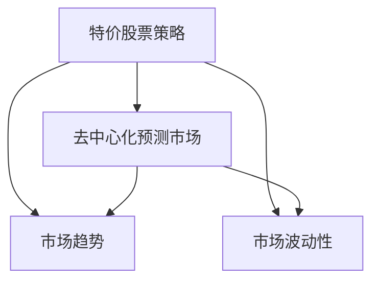

                 


# 如何将特价股票策略融入去中心化预测市场投资

> 关键词：特价股票策略、去中心化预测市场、区块链、预测模型、投资策略

> 摘要：本文探讨如何将特价股票策略与去中心化预测市场相结合，构建一种新型的投资策略。通过分析两者的结合方式，提出基于预测模型的算法框架，并结合实际案例进行详细讲解。文章内容包括背景介绍、核心概念、算法原理、系统设计、项目实战和总结与展望等部分。

---

# 第一部分: 特价股票策略与去中心化预测市场概述

## # 第1章: 特价股票策略与去中心化预测市场背景

### 1.1 特价股票策略的基本概念
#### 1.1.1 特价股票的定义与特点
特价股票是指在特定市场条件下以低于市价买入的股票。其特点包括价格波动大、市场流动性不足、风险较高、投资机会短暂等。

#### 1.1.2 特价股票策略的应用场景
特价股票策略常用于以下场景：
1. 市场下跌周期：利用低价买入，等待市场回升。
2. 事件驱动型交易：公司重组、并购等事件发生时，股价可能出现大幅波动。
3. 技术分析信号：通过技术指标识别超卖或超买机会。

#### 1.1.3 特价股票策略的核心目标
通过低价买入优质股票，抓住市场反弹或长期增值的机会，实现超额收益。

---

### 1.2 去中心化预测市场的基本概念
#### 1.2.1 去中心化预测市场的定义与特点
去中心化预测市场是基于区块链技术的去中心化平台，允许用户对未来的事件进行预测和交易。其特点包括透明性、去中心化、匿名性、实时性等。

#### 1.2.2 去中心化预测市场的技术基础
主要基于区块链技术，通过智能合约实现预测市场的自动执行和资金结算。

#### 1.2.3 去中心化预测市场的优势与挑战
优势：透明性高、去中心化、抗审查、激励机制合理。  
挑战：市场流动性不足、技术复杂性高、监管不确定性。

---

### 1.3 特价股票策略与去中心化预测市场的结合
#### 1.3.1 结合的背景与动机
随着区块链技术的发展，去中心化预测市场为投资者提供了新的工具和机会。特价股票策略需要依赖市场预测来优化投资决策，而预测市场的数据可以为特价股票策略提供实时支持。

#### 1.3.2 结合的核心目标与应用场景
核心目标是通过预测市场数据优化特价股票的投资决策，降低风险，提高收益。应用场景包括市场趋势预测、事件驱动型投资、风险管理等。

#### 1.3.3 结合的潜在价值与意义
通过结合两者的优点，投资者可以实现更精准的市场预测和投资决策，同时利用去中心化技术确保交易的透明性和安全性。

---

## # 第2章: 特价股票策略与去中心化预测市场的核心概念与联系

### 2.1 特价股票策略的核心原理
#### 2.1.1 特价股票策略的数学模型
特价股票策略可以通过以下数学模型表示：
$$ P = \alpha \times T + \beta \times V + \gamma \times M $$
其中：
- \( P \) 表示买入价格
- \( T \) 表示市场趋势
- \( V \) 表示市场波动性
- \( M \) 表示公司基本面
- \(\alpha, \beta, \gamma \) 表示权重

#### 2.1.2 特价股票策略的关键因素分析
- 市场趋势：通过技术分析识别超卖或超买信号。
- 市场波动性：利用波动性指标（如VIX）预测市场波动。
- 公司基本面：分析公司的财务状况和行业前景。

#### 2.1.3 特价股票策略的优缺点对比
| 优点 | 缺点 |
|------|------|
| 投资成本低 | 市场流动性不足 |
| 风险可控 | 市场波动大 |
| 收益潜力高 | 需要专业分析能力 |

---

### 2.2 去中心化预测市场的核心原理
#### 2.2.1 去中心化预测市场的技术架构
去中心化预测市场的技术架构包括以下几个模块：
1. 数据采集模块：收集市场数据。
2. 预测模型模块：构建预测模型。
3. 智能合约模块：执行交易和结算。
4. 用户界面模块：提供交互界面。

#### 2.2.2 去中心化预测市场的运行机制
通过智能合约实现预测市场的自动执行，用户可以对未来的事件进行预测和交易，系统根据预测结果自动结算收益。

#### 2.2.3 去中心化预测市场的优缺点对比
| 优点 | 缺点 |
|------|------|
| 透明性高 | 市场流动性不足 |
| 抗审查性 | 技术复杂性高 |
| 激励机制合理 | 监管不确定性 |

---

### 2.3 特价股票策略与去中心化预测市场的联系
#### 2.3.1 特价股票策略与去中心化预测市场的实体关系
通过以下关系图展示两者的核心联系：



---

## # 第3章: 特价股票策略与去中心化预测市场的算法原理

### 3.1 特价股票策略的算法实现
#### 3.1.1 预测模型的构建
通过机器学习算法构建市场预测模型，例如线性回归、随机森林、神经网络等。

#### 3.1.2 特价股票策略的实现
根据预测模型的结果，制定买入和卖出策略。

---

### 3.2 预测模型的数学模型
#### 3.2.1 线性回归模型
$$ y = \beta_0 + \beta_1x + \epsilon $$
其中：
- \( y \) 表示目标变量
- \( x \) 表示自变量
- \( \beta_0, \beta_1 \) 表示回归系数
- \( \epsilon \) 表示误差项

#### 3.2.2 时间序列分析模型
$$ ARIMA(p, d, q) $$
其中：
- \( p \) 表示自回归阶数
- \( d \) 表示差分阶数
- \( q \) 表示移动平均阶数

---

### 3.3 去中心化预测市场的算法实现
#### 3.3.1 预测市场的数据采集
通过区块链节点实时采集市场数据。

#### 3.3.2 预测市场的智能合约
通过智能合约实现预测市场的自动执行和结算。

---

## # 第4章: 特价股票策略与去中心化预测市场的系统设计

### 4.1 系统功能设计
#### 4.1.1 预测市场的数据采集
通过API接口实时采集市场数据。

#### 4.1.2 特价股票策略的实现
根据预测模型的结果，制定买入和卖出策略。

---

### 4.2 系统架构设计
#### 4.2.1 分层架构
系统采用分层架构，包括数据层、业务逻辑层和用户界面层。

---

### 4.3 系统接口设计
#### 4.3.1 API接口设计
通过REST API实现预测市场的数据采集和交易执行。

---

## # 第5章: 特价股票策略与去中心化预测市场的项目实战

### 5.1 环境搭建
安装必要的开发工具和库，例如Python、TensorFlow、Pandas等。

---

### 5.2 系统核心实现
#### 5.2.1 数据采集模块
通过API接口实时采集市场数据。

#### 5.2.2 预测模型模块
实现市场预测模型，例如线性回归、随机森林等。

#### 5.2.3 特价股票策略模块
根据预测模型的结果，制定买入和卖出策略。

---

### 5.3 代码实现
#### 5.3.1 数据采集代码
```python
import requests

def get_market_data():
    response = requests.get('https://api.example.com/market-data')
    return response.json()
```

#### 5.3.2 预测模型代码
```python
import pandas as pd
from sklearn.linear_model import LinearRegression

def predict_stock_price(data):
    model = LinearRegression()
    model.fit(data[['close', 'volume']], data['open'])
    return model.predict(data[['close', 'volume']])
```

---

## # 第6章: 总结与展望

### 6.1 总结
本文探讨了如何将特价股票策略与去中心化预测市场相结合，构建了一种新型的投资策略。

### 6.2 展望
未来，随着区块链技术的不断发展，去中心化预测市场将为投资策略的优化提供更多的可能性。

---

作者：AI天才研究院 & 禅与计算机程序设计艺术

