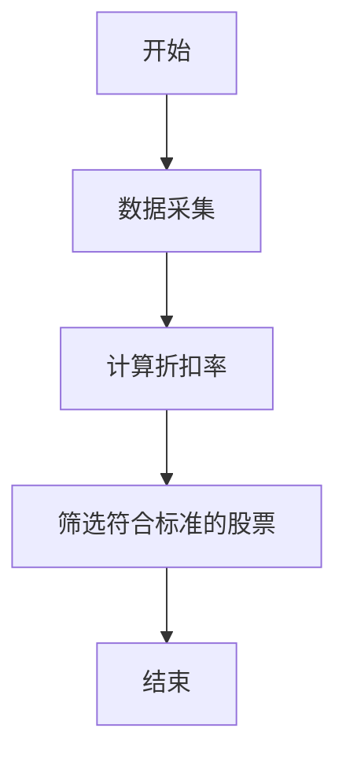
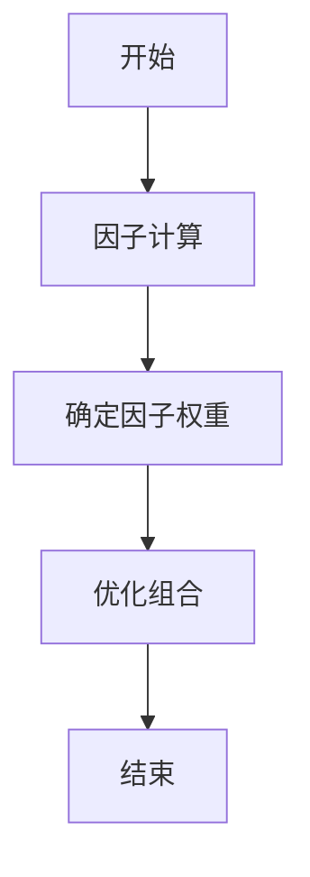
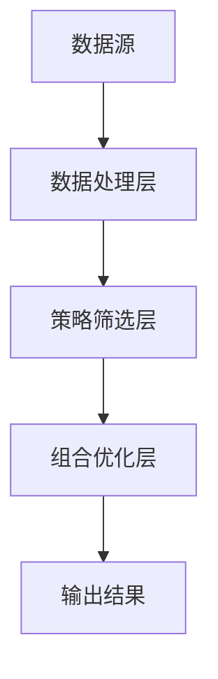

                 


# 如何将特价股票策略融入因子投资

## 关键词：特价股票、因子投资、动量因子、数学模型、系统架构

## 摘要

本文详细探讨了如何将特价股票策略与因子投资相结合，利用因子投资的长期收益潜力和特价股票的短期价格优势，构建一个高效的投资组合。通过动量因子优化特价股票选择，并结合数学模型和系统架构，提供了一套可行的解决方案。

## 第一部分：背景介绍

### 第1章：特价股票策略与因子投资的背景

#### 1.1 特价股票策略的定义与特点

- **特价股票的定义**：指在特定时期内价格显著低于其内在价值的股票。
- **特点**：
  - 价格被低估
  - 市场情绪低落时出现
  - 短期波动大，长期潜力大

#### 1.2 因子投资的定义与特点

- **因子投资的定义**：基于特定因子（如价值、动量、成长）构建投资组合。
- **特点**：
  - 系统化、量化
  - 长期收益稳定
  - 通过分散投资降低风险

#### 1.3 特价股票策略融入因子投资的意义

- **提高效率**：利用因子筛选特价股票，提升选择效率。
- **降低风险**：通过因子优化组合，分散投资风险。
- **提升收益**：结合长期因子和短期特价优势，增强收益。

## 第二部分：核心概念与联系

### 第2章：特价股票策略与因子投资的核心概念

#### 2.1 特价股票策略的核心要素

| 核心要素 | 描述 |
|----------|------|
| 价格折扣率 | 股票价格与内在价值的差距 |
| 市场情绪 | 投资者情绪对股价的影响 |
| 基本面 | 公司财务状况等基本面因素 |

#### 2.2 因子投资的核心要素

| 因子类型 | 描述 |
|----------|------|
| 价值因子 | 低市盈率、低市净率等 |
| 动量因子 | 近期价格走势强劲 |
| 成长因子 | 高盈利增长潜力 |

#### 2.3 特价股票策略与因子投资的联系

- **互补性**：特价股票提供短期机会，因子投资提供长期框架。
- **策略融合**：结合动量因子优化特价股票选择，提升收益潜力。

## 第三部分：算法原理讲解

### 第3章：特价股票策略的算法原理

#### 3.1 特价股票筛选算法



#### 3.2 因子投资组合优化算法



## 第四部分：数学模型与公式

### 第4章：数学模型与公式

#### 4.1 特价股票筛选模型

- **折扣率计算公式**：$$ \text{折扣率} = \frac{\text{内在价值} - \text{市场价格}}{\text{内在价值}} $$
- **评分模型**：$$ S = \alpha \times D + \beta \times F $$ 其中，$D$ 是折扣率，$F$ 是市场情绪评分，$\alpha$ 和 $\beta$ 是权重。

#### 4.2 因子投资组合优化模型

- **因子得分计算**：$$ F_i = \sum_{j=1}^{n} w_j \times R_j $$ 其中，$w_j$ 是因子权重，$R_j$ 是因子值。
- **组合优化公式**：$$ \text{收益} = \sum_{i=1}^{m} w_i \times R_i $$ 其中，$m$ 是组合中的股票数，$w_i$ 是权重。

## 第五部分：系统分析与架构设计方案

### 第5章：系统架构与实现

#### 5.1 系统功能设计

- **数据采集模块**：收集股票数据和因子数据。
- **策略筛选模块**：应用算法筛选特价股票。
- **组合优化模块**：优化投资组合。

#### 5.2 系统架构设计



## 第六部分：项目实战

### 第6章：项目实战

#### 6.1 环境安装与配置

- **安装Python**：确保安装了Python 3.8以上版本。
- **安装依赖库**：使用pip安装pandas、numpy、scipy等库。

#### 6.2 核心实现代码

```python
import pandas as pd
import numpy as np

# 数据处理
def calculate_discount(data, intrinsic_value):
    return (intrinsic_value - data['price']) / intrinsic_value

# 策略筛选
def select_special_stocks(data, intrinsic_value, threshold=0.2):
    discount = calculate_discount(data, intrinsic_value)
    return data[discount > threshold]

# 组合优化
def optimize_portfolio(stocks, factors):
    # 计算因子得分
    factor_scores = {}
    for stock in stocks:
        score = sum(factors[stock])
        factor_scores[stock] = score
    # 排序并选择前N只
    selected = sorted(factor_scores.items(), key=lambda x: x[1], reverse=True)[:5]
    return [s[0] for s in selected]
```

## 结语

通过将特价股票策略融入因子投资，投资者可以结合短期价格优势和长期收益潜力，构建高效的投资组合。本文详细介绍了从理论到实践的全过程，提供了丰富的代码示例和系统设计，帮助读者理解和应用这一策略。

## 作者

作者：AI天才研究院 & 禅与计算机程序设计艺术

