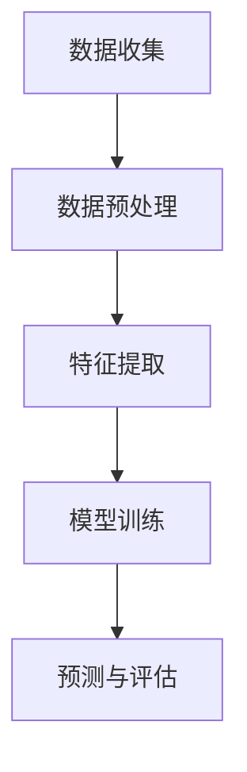
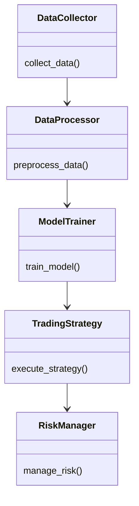
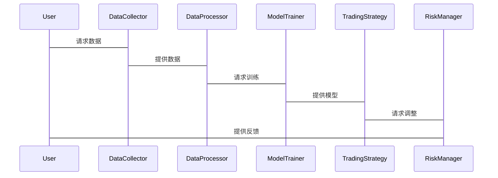

                 


# 如何将特价股票策略融入多元化数字资产对冲组合

---

## 关键词：特价股票、对冲组合、数字资产、投资策略、风险管理、算法优化

---

## 摘要：  
本文将详细介绍如何将特价股票策略融入多元化数字资产对冲组合中。首先，我们将从背景与概述入手，分析特价股票策略的定义、优势以及其在现代金融中的应用。接着，我们将探讨对冲组合的基本原理和构建方法，包括资产配置、风险分散和组合优化。随后，我们将深入分析数字资产与传统股票市场的关联性，探讨市场情绪对价格波动的影响。在技术实现部分，我们将详细讲解特价股票识别的算法，包括基于技术指标和机器学习的策略，并提供Python代码实现。最后，我们将从系统架构、项目实战和风险管理等多个角度，全面展示如何将特价股票策略融入对冲组合中，并提供最佳实践和未来展望。

---

## 第一部分：背景与概述

### 第1章：特价股票策略与对冲组合的背景

#### 1.1 特价股票策略的背景

- **1.1.1 特价股票的定义与特点**  
  特价股票是指在特定时间点，由于市场波动或其他因素导致股价低于其内在价值的股票。其特点包括高波动性、短期价格偏离和潜在的快速反弹。

- **1.1.2 特价股票策略的起源与发展**  
  特价股票策略起源于20世纪初，早期的套利者通过识别市场中的价格偏差进行交易。随着技术进步，该策略逐渐融入算法交易和量化分析。

- **1.1.3 特价股票策略在现代金融中的地位**  
  特价股票策略在现代金融中占据重要地位，尤其在高频交易和量化投资中被广泛应用。它通过捕捉短期价格波动，为投资者提供超额收益。

#### 1.2 对冲组合的背景

- **1.2.1 对冲组合的基本概念**  
  对冲组合是一种通过多样化投资来降低风险的策略。它通过将不同资产、行业或市场进行组合，以抵消单一资产的风险。

- **1.2.2 数字资产对冲的兴起**  
  随着数字资产市场的兴起，对冲组合的概念扩展到包括加密货币、股票和其他金融资产。数字资产的高波动性使其成为对冲组合的重要组成部分。

- **1.2.3 对冲组合在风险管理中的作用**  
  对冲组合通过分散投资，降低市场风险和特定资产的风险。它帮助投资者在不同市场条件下保持稳定的收益。

#### 1.3 特价股票策略与对冲组合的结合

- **1.3.1 结合的必要性与优势**  
  特价股票策略与对冲组合的结合可以利用短期价格波动，同时通过多样化投资降低风险。这种结合能够提高收益并降低单一市场的波动影响。

- **1.3.2 当前市场环境下的应用前景**  
  在当前市场环境下，数字资产的高波动性和传统股票市场的稳定性相结合，为特价股票策略在对冲组合中的应用提供了广阔前景。

- **1.3.3 特价股票策略对冲组合的边界与外延**  
  特价股票策略对冲组合的边界在于其投资范围和风险承受能力。其外延包括不同资产类别和市场的组合优化。

---

## 第二部分：核心概念与原理

### 第2章：特价股票策略的核心原理

#### 2.1 特价股票识别的数学模型

- **2.1.1 市场波动性分析**  
  市场波动性是影响特价股票识别的重要因素。我们可以通过波动率指标（如标准差）来量化市场的波动性。

- **2.1.2 价格预测模型**  
  基于历史数据，我们可以建立价格预测模型，如ARIMA模型，来预测未来的价格走势。

- **2.1.3 基于统计套利的策略**  
  统计套利通过寻找资产价格的短期偏差，利用均值回归的特性进行交易。

#### 2.2 对冲组合的构建原理

- **2.2.1 资产配置的理论基础**  
  资产配置基于现代投资组合理论（MPT），通过优化风险和收益比来构建投资组合。

- **2.2.2 风险分散的数学模型**  
  风险分散通过将资产分配到不同类别和市场，降低特定资产的风险。

- **2.2.3 组合优化的算法原理**  
  组合优化算法（如遗传算法）用于寻找最优资产配置，以最大化收益并最小化风险。

---

### 第3章：数字资产与股票市场的关联性分析

#### 3.1 数字资产与传统股票市场的相关性

- **3.1.1 数字资产的波动性分析**  
  数字资产具有高波动性，其价格受市场情绪和技术因素的影响较大。

- **3.1.2 股票市场的周期性特征**  
  股票市场具有周期性，其波动与经济周期密切相关。

- **3.1.3 两者的相互影响**  
  数字资产和股票市场相互影响，特别是在市场波动加剧时，数字资产可能成为投资者的避险工具。

#### 3.2 市场情绪与价格波动的关系

- **3.2.1 市场情绪的量化方法**  
  市场情绪可以通过新闻分析、社交媒体数据和交易量来量化。

- **3.2.2 情绪对价格波动的影响**  
  市场情绪的变化直接影响资产价格的波动，特别是在数字资产市场中，情绪的影响更为显著。

- **3.2.3 基于情绪的交易策略**  
  基于情绪的交易策略通过捕捉市场情绪的变化，进行超前于市场的交易。

---

## 第三部分：算法与技术实现

### 第4章：特价股票识别的算法实现

#### 4.1 特价股票识别的算法选择

- **4.1.1 基于技术指标的算法**  
  常用技术指标包括移动平均线（MA）、相对强弱指数（RSI）和MACD等。

- **4.1.2 基于机器学习的算法**  
  机器学习算法（如随机森林和XGBoost）可以通过历史数据预测价格波动。

- **4.1.3 算法的优缺点对比**  
  技术指标简单易用，但可能无法捕捉复杂市场变化；机器学习算法具有更高的准确性，但需要更多的数据和计算资源。

#### 4.2 算法实现的步骤与流程



#### 4.3 特价股票识别的Python代码实现

```python
import numpy as np
import pandas as pd
from sklearn.ensemble import RandomForestClassifier
from sklearn.metrics import accuracy_score

# 数据预处理
data = pd.read_csv('stock_data.csv')
X = data.drop('target', axis=1)
y = data['target']

# 特征选择
selected_features = ['open', 'high', 'low', 'close', 'volume']
X = X[selected_features]

# 模型训练
model = RandomForestClassifier(n_estimators=100)
model.fit(X, y)

# 预测与评估
test_data = pd.read_csv('test_stock_data.csv')
test_X = test_data[selected_features]
test_y = test_data['target']

predictions = model.predict(test_X)
print("准确率:", accuracy_score(test_y, predictions))
```

---

## 第四部分：系统分析与架构设计方案

### 第5章：系统架构设计

#### 5.1 问题场景介绍

- 投资者希望通过特价股票策略构建一个多元化数字资产对冲组合，以实现稳定收益。

#### 5.2 项目介绍

- **系统功能设计**  
  该系统将实时监控市场数据，识别特价股票，并构建对冲组合。

#### 5.3 系统功能设计（领域模型类图）



#### 5.4 系统架构设计（系统架构图）

```mermaid
container 接入层 {
    DataCollector
}
container 业务逻辑层 {
    DataProcessor
    ModelTrainer
    TradingStrategy
}
container 数据存储层 {
    Database
}
```

#### 5.5 系统接口设计

- **数据源接口**  
  从Yahoo Finance获取股票数据和从CoinMarketCap获取数字资产数据。

- **交易接口**  
  使用Interactive Brokers API进行交易操作。

- **风险管理接口**  
  实时监控市场风险并调整投资组合。

#### 5.6 系统交互设计（系统交互序列图）



---

## 第五部分：项目实战

### 第6章：项目实战

#### 6.1 环境安装与配置

- 安装Python、Pandas、NumPy、Scikit-learn、Plotly和Dash。

#### 6.2 系统核心实现

```python
import pandas as pd
import numpy as np
from sklearn.ensemble import RandomForestClassifier
import plotly.express as px

# 数据收集与预处理
data = pd.read_csv('stock_data.csv')
data['Date'] = pd.to_datetime(data['Date'])
data = data.set_index('Date')

# 特征选择与建模
features = ['open', 'high', 'low', 'close', 'volume']
target = 'target'

X = data[features]
y = data[target]

# 模型训练
model = RandomForestClassifier(n_estimators=100)
model.fit(X, y)

# 可视化
fig = px.scatter(data, x='Date', y='close', color='target')
fig.show()
```

#### 6.3 案例分析与详细解读

- 以2023年为例，分析如何利用特价股票策略构建数字资产对冲组合。

---

## 第六部分：风险管理与优化

### 第7章：风险管理与优化

#### 7.1 风险管理策略

- **头寸规模控制**  
  根据账户资金和风险承受能力，确定每笔交易的头寸大小。

- **止损与止盈机制**  
  设置止损点以限制亏损，设置止盈点以锁定利润。

#### 7.2 优化策略

- **动态调整组合**  
  根据市场变化和模型预测，动态调整对冲组合的资产配置。

- **参数优化**  
  使用网格搜索优化模型参数，提高预测准确率。

#### 7.3 应对市场变化

- **应对市场波动**  
  在市场剧烈波动时，及时调整投资组合，降低风险。

- **应对黑天鹅事件**  
  制定应急计划，确保在极端市场情况下能够迅速反应。

---

## 结论

本文详细探讨了如何将特价股票策略融入多元化数字资产对冲组合中。从背景与概述、核心概念与原理，到算法与技术实现、系统架构设计，再到项目实战和风险管理，我们全面分析了这一策略的可行性与应用前景。通过本文的指导，读者可以掌握如何利用特价股票策略构建稳定收益的对冲组合，并在实际操作中灵活应对市场变化。

---

## 作者：AI天才研究院/AI Genius Institute & 禅与计算机程序设计艺术 /Zen And The Art of Computer Programming

---

# END

