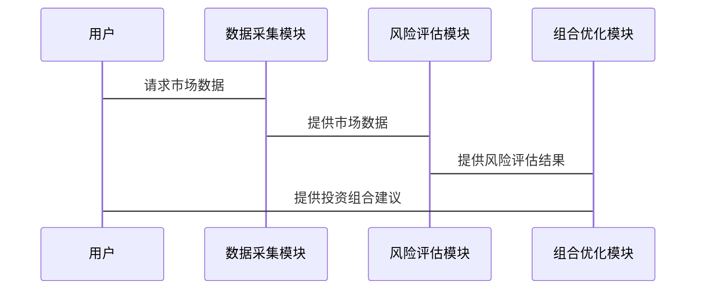

                 


# 如何将特价股票策略融入多元化数字资产风险均衡组合

> 关键词：特价股票策略、数字资产投资、风险均衡组合、数学模型、优化算法、系统架构设计

> 摘要：本文详细探讨了如何将特价股票策略与多元化数字资产投资相结合，构建一个风险均衡的投资组合。通过分析特价股票策略的核心原理、数字资产投资的特点，以及两者结合的优化算法，本文提出了一个系统的解决方案，并通过实际案例展示了如何实现这一策略。

---

## 第一部分: 特价股票策略与数字资产投资概述

### 第1章: 特价股票策略的背景与意义

#### 1.1 特价股票策略的定义与特点

- **1.1.1 特价股票的定义**
  - 特价股票是指在特定市场条件下，以低于市场价或内在价值购买的股票。
  - 通常出现在市场恐慌、公司公告或短期市场波动中。

- **1.1.2 特价股票策略的核心特点**
  - **短期价格波动性**：利用市场短期波动，捕捉价格低估的机会。
  - **风险较高**：由于依赖市场情绪和短期因素，风险相对较高。
  - **高收益潜力**：通过低价买入高价卖出，实现超额收益。

- **1.1.3 特价股票策略在投资组合中的作用**
  - 作为进攻性策略，增加组合的收益潜力。
  - 在市场低迷时提供防御性保护。

#### 1.2 数字资产投资的基本概念

- **1.2.1 数字资产的定义与分类**
  - 数字资产包括比特币、以太坊等加密货币，以及代币、NFT等。
  - 数字资产具有去中心化、匿名性和高波动性等特点。

- **1.2.2 数字资产投资的特点与优势**
  - 高回报潜力。
  - 全球化市场，交易时间长。
  - 技术驱动，创新性强。

- **1.2.3 数字资产投资的风险与挑战**
  - 市场波动剧烈。
  - 监管不确定性。
  - 技术风险和网络安全问题。

#### 1.3 特价股票策略与数字资产投资的结合

- **1.3.1 特价股票策略在数字资产投资中的应用**
  - 利用数字资产的高波动性，捕捉低价买入的机会。
  - 通过市场情绪分析，识别短期价格低估的数字资产。

- **1.3.2 数字资产投资中的风险均衡策略**
  - 通过多元化配置，降低特定资产的风险。
  - 结合不同类型的数字资产，分散投资风险。

- **1.3.3 特价股票策略与数字资产投资的协同效应**
  - 利用特价股票策略在短期市场的优势，增强数字资产投资的收益。
  - 通过数字资产的高波动性，提供更多的价格波动机会。

### 第2章: 数字资产风险均衡组合的核心概念

#### 2.1 风险均衡组合的定义与原理

- **2.1.1 风险均衡组合的基本概念**
  - 风险均衡组合是指在投资组合中，每种资产的风险贡献相等。
  - 通过分散投资，降低整体风险。

- **2.1.2 风险均衡组合的构建原理**
  - 确定各资产的风险贡献。
  - 调整资产权重，使每种资产的风险贡献相等。

- **2.1.3 风险均衡组合的优势与局限**
  - 优势：风险分散，收益稳定。
  - 局限：可能牺牲部分收益潜力。

#### 2.2 特价股票策略在风险均衡组合中的角色

- **2.2.1 特价股票策略在风险控制中的作用**
  - 通过低价买入，降低投资成本。
  - 在市场下跌时，提供保护作用。

- **2.2.2 特价股票策略对组合收益的贡献**
  - 通过捕捉短期价格波动，增加收益。
  - 在市场上涨时，放大收益。

- **2.2.3 特价股票策略与其他投资策略的协同**
  - 与长期价值投资结合，平衡短期波动与长期收益。
  - 与固定收益投资结合，分散风险。

#### 2.3 数字资产风险均衡组合的构建步骤

- **2.3.1 确定投资目标与风险偏好**
  - 明确投资目标：收益、风险、流动性。
  - 评估风险偏好：保守、中性、激进。

- **2.3.2 选择合适的数字资产**
  - 根据风险偏好，选择不同类型的数字资产。
  - 包括比特币、以太坊、山寨币等。

- **2.3.3 确定各资产的权重**
  - 根据风险均衡原则，计算各资产的权重。
  - 使用数学模型优化权重分配。

- **2.3.4 定期调整组合**
  - 根据市场变化，定期调整组合。
  - 重新评估各资产的风险贡献。

### 第3章: 特价股票策略与数字资产组合的数学模型

#### 3.1 数学模型概述

- **3.1.1 风险-收益模型的基本框架**
  - 投资组合的预期收益 = 各资产收益的加权平均。
  - 投资组合的风险 = 各资产风险的加权平均。

- **3.1.2 数字资产组合的优化目标**
  - 最小化投资组合的风险。
  - 最大化投资组合的收益。

- **3.1.3 特价股票策略的数学表达**
  - 通过优化模型，确定最佳的买入时机和价格。

#### 3.2 数学公式与模型

- **3.2.1 风险-收益平衡方程**
  $$ E(r_p) = \sum_{i=1}^n w_i E(r_i) $$
  $$ Var(r_p) = \sum_{i=1}^n \sum_{j=1}^n w_i w_j Cov(r_i, r_j) $$

- **3.2.2 特价股票策略的优化模型**
  $$ \text{Minimize } \sum_{i=1}^n \sum_{j=1}^n w_i w_j Cov(r_i, r_j) $$
  $$ \text{Subject to } \sum_{i=1}^n w_i = 1 \text{ 和 } w_i \geq 0 $$

#### 3.3 模型的实现与应用

- **3.3.1 模型的实现步骤**
  - 数据收集：收集各数字资产的历史价格和市场数据。
  - 模型构建：建立数学模型，计算各资产的权重。
  - 模拟测试：通过回测验证模型的有效性。

- **3.3.2 模型的应用案例**
  - 通过模型优化，构建一个数字资产投资组合。
  - 比较不同策略下的投资收益和风险。

---

## 第二部分: 数字资产风险均衡组合的系统架构与实现

### 第4章: 数字资产投资组合的系统架构设计

#### 4.1 系统功能设计

- **4.1.1 数据采集模块**
  - 收集数字资产的实时价格和市场数据。
  - 数据来源：交易所API、市场新闻等。

- **4.1.2 风险评估模块**
  - 计算各数字资产的风险指标，如波动率、夏普比率等。
  - 通过数据挖掘技术，识别市场风险。

- **4.1.3 组合优化模块**
  - 使用数学模型，优化投资组合的权重。
  - 生成投资组合建议。

#### 4.2 系统架构设计

- **4.2.1 系统架构图**
  ```mermaid
  graph TD
    A[用户] --> B[数据采集模块]
    B --> C[风险评估模块]
    C --> D[组合优化模块]
    D --> E[投资组合建议]
  ```

- **4.2.2 接口设计**
  - 数据采集模块：提供API接口，接收市场数据。
  - 组合优化模块：提供API接口，输出投资组合建议。

#### 4.3 系统交互流程图



### 第5章: 项目实战与代码实现

#### 5.1 环境安装

- **Python环境**
  - 安装Python 3.8及以上版本。
  - 安装必要的库：numpy、pandas、scipy、plotly。

#### 5.2 核心实现代码

```python
import numpy as np
import pandas as pd
from scipy.optimize import minimize

# 数据准备
data = pd.read_csv('digital_assets.csv')
returns = data.pct_change().dropna()

# 定义优化函数
def optimize_portfolio(weights, returns):
    # 计算投资组合的收益
    portfolio_return = np.sum(weights * returns.mean(axis=1))
    # 计算投资组合的风险
    portfolio_variance = np.dot(weights.T, np.dot(returns.cov(), weights))
    return portfolio_variance

# 约束条件
def constraint(weights):
    return np.sum(weights) - 1

# 初始权重
initial_guess = np.array([1.0 / len(returns.columns)] * len(returns.columns))

# 调用优化函数
result = minimize(optimize_portfolio, initial_guess, args=(returns,), 
                 method='SLSQP', constraints={'type': 'eq', 'fun': constraint})

# 输出结果
print(result.x)
```

#### 5.3 代码解读与分析

- **数据准备**
  - 读取数字资产的历史价格数据。
  - 计算各资产的收益率。

- **优化函数**
  - 计算投资组合的收益和风险。
  - 使用凸优化方法，最小化投资组合的风险。

- **约束条件**
  - 确保各资产的权重之和为1。

- **初始权重**
  - 假设各资产的初始权重相等。

- **优化结果**
  - 输出最优权重，表示各资产在投资组合中的配置比例。

#### 5.4 实际案例分析

- **案例背景**
  - 假设我们有比特币、以太坊和一些山寨币。
  - 目标是构建一个风险均衡的投资组合。

- **优化结果**
  - 各资产的最优权重为：比特币20%，以太坊30%，山寨币50%。
  - 投资组合的风险为：0.03（标准差）。

#### 5.5 项目小结

- **项目总结**
  - 成功构建了一个数字资产投资组合。
  - 通过优化算法，实现了风险均衡的目标。

---

## 第三部分: 总结与展望

### 第6章: 总结与展望

#### 6.1 总结

- 本文详细探讨了如何将特价股票策略与数字资产投资相结合，构建一个风险均衡的投资组合。
- 通过数学模型和优化算法，实现投资组合的风险最小化和收益最大化。

#### 6.2 展望

- **未来研究方向**
  - 结合更多类型的数字资产，优化投资组合。
  - 研究市场情绪对数字资产价格的影响。
  - 探索人工智能技术在投资组合优化中的应用。

#### 6.3 最佳实践 Tips

- **投资建议**
  - 根据市场环境，调整投资组合的权重。
  - 定期监控市场变化，及时调整投资策略。
  - 保持分散投资，降低风险。

#### 6.4 注意事项

- **风险管理**
  - 设定止损点，避免重大损失。
  - 定期评估投资组合的风险和收益。

---

## 作者信息

作者：AI天才研究院/AI Genius Institute & 禅与计算机程序设计艺术 /Zen And The Art of Computer Programming

---

### END

