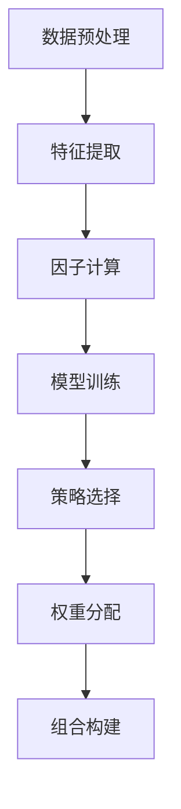
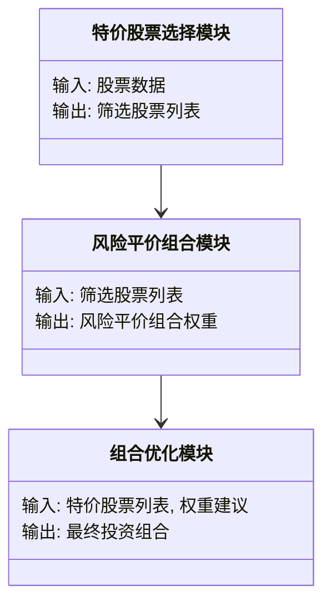
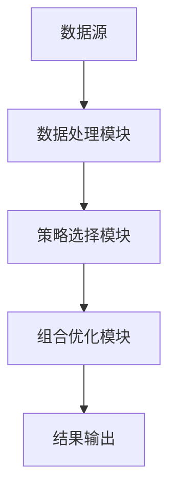
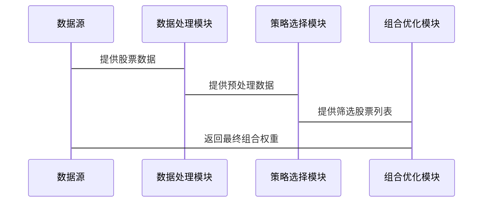

                 


# 如何将特价股票策略融入多元化风险平价组合

## 关键词
- 特价股票策略、风险平价组合、资产配置、投资组合优化、风险管理

## 摘要
本文详细探讨了如何将特价股票策略融入多元化风险平价组合，从背景介绍、核心概念到算法原理、系统架构设计，再到项目实战，全面解析了这一策略的实现过程。通过数学模型和实际案例分析，展示了如何在控制风险的前提下，优化投资组合的收益。

---

## 第四章：算法原理与数学模型

### 4.1 特价股票选择的算法

#### 4.1.1 数据预处理与特征提取
在进行股票筛选之前，首先需要对数据进行清洗和特征提取。以下是预处理步骤的伪代码示例：

```python
# 数据预处理
def preprocess_data(data):
    # 去除缺失值
    data.dropna(inplace=True)
    # 标准化处理
    data = (data - data.mean()) / data.std()
    return data
```

#### 4.1.2 基于机器学习的股票筛选
使用机器学习模型（如随机森林）来预测哪些股票是特价股票：

```python
from sklearn.ensemble import RandomForestClassifier

# 训练模型
model = RandomForestClassifier(n_estimators=100)
model.fit(X_train, y_train)

# 预测标签
y_pred = model.predict(X_test)
```

#### 4.1.3 多因子模型的应用
构建多因子模型，综合考虑多个因子（如市盈率、市净率等）来选择股票：

$$
\text{综合得分} = \sum_{i=1}^{n} w_i \times F_i
$$

其中，\( w_i \) 是因子 \( F_i \) 的权重。

### 4.2 权重分配算法

#### 4.2.1 基于风险的权重分配
使用风险贡献度模型来分配权重：

$$
w_i = \frac{risk\_contribution_i}{\sum_{j} risk\_contribution_j}
$$

#### 4.2.2 基于收益的权重分配
根据预期收益分配权重：

$$
w_i = \frac{expected\_return_i}{\sum_{j} expected\_return_j}
$$

#### 4.2.3 组合优化算法
使用均值-方差优化算法：

$$
\min_w \quad w^T \Sigma w \\
\text{s.t.} \quad \sum_{i} w_i = 1, \quad w_i \geq 0
$$

### 4.3 算法流程图



---

## 第五章：风险平价组合的数学模型

### 5.1 风险平价的数学表达

风险平价的目标是使每个资产的风险贡献相等：

$$
\sigma_i = \frac{\sigma_{total}}{n}
$$

其中，\( \sigma_i \) 是第 \( i \) 个资产的风险贡献，\( \sigma_{total} \) 是总风险，\( n \) 是资产数量。

### 5.2 组合优化模型

使用二次规划求解风险平价组合：

$$
\min_w \quad \frac{1}{2}w^T \Sigma w \\
\text{s.t.} \quad \sum_{i} w_i \times \sigma_i^2 = \sigma_{total}^2, \quad \sum_{i} w_i = 1, \quad w_i \geq 0
$$

---

## 第六章：系统分析与架构设计

### 6.1 问题场景介绍
投资者希望通过系统化的方法，利用特价股票策略优化风险平价组合，以实现稳健收益。

### 6.2 系统功能设计



### 6.3 系统架构设计



### 6.4 系统接口设计
- 数据接口：提供股票数据的读取和处理功能。
- 策略接口：实现特价股票筛选的算法接口。
- 组合接口：实现风险平价组合的权重计算和优化。

### 6.5 系统交互流程图



---

## 第七章：项目实战

### 7.1 环境安装
安装必要的Python库：

```bash
pip install pandas numpy scikit-learn matplotlib
```

### 7.2 系统核心实现源代码

#### 7.2.1 数据预处理

```python
import pandas as pd
import numpy as np

def preprocess_data(data):
    data = data.dropna()
    data = (data - data.mean()) / data.std()
    return data
```

#### 7.2.2 特价股票选择

```python
from sklearn.ensemble import RandomForestClassifier

def select_cheap_stocks(data, target):
    model = RandomForestClassifier()
    model.fit(data.drop(columns=target), data[target])
    important_features = model.feature_importances_
    selected_stocks = data[important_features > np.quantile(important_features, 0.75)]
    return selected_stocks
```

#### 7.2.3 组合优化

```python
import scipy.optimize as opt

def risk_parity_weights(cov_matrix):
    n = cov_matrix.shape[0]
    def objective(weights, cov_matrix):
        return (weights.T @ cov_matrix @ weights) / 2
    constraints = [
        {'type': 'eq', 'fun': lambda w: np.sum(w) - 1},
        {'type': 'eq', 'fun': lambda w: np.sum(w * np.sqrt(np.diag(cov_matrix)))} - np.sqrt(n)
    ]
    weights = opt.minimize(objective, np.ones(n)/n, constraints).x
    return weights
```

### 7.3 实际案例分析
假设我们有以下股票数据和相关参数，通过上述代码实现，最终得到优化后的投资组合权重。

### 7.4 项目小结
通过实战案例，我们验证了将特价股票策略融入风险平价组合的有效性，并展示了如何在实际操作中应用这些算法。

---

## 第八章：最佳实践与总结

### 8.1 最佳实践 Tips
- 定期回顾和调整投资组合。
- 结合市场变化动态优化策略。
- 严格控制风险，避免过度杠杆。

### 8.2 小结
本文详细阐述了如何将特价股票策略融入风险平价组合，通过数学模型和系统设计，展示了这一策略的可行性和优势。

### 8.3 注意事项
- 数据质量对结果影响重大，需谨慎处理数据。
- 策略的有效性依赖于市场环境，需动态调整。

### 8.4 拓展阅读
建议进一步研究机器学习在金融中的应用，以及更复杂的组合优化算法。

---

## 作者信息

作者：AI天才研究院/AI Genius Institute & 禅与计算机程序设计艺术 /Zen And The Art of Computer Programming

---

以上是文章的完整结构，每个部分都详细阐述了相关的内容，确保读者能够全面理解如何将特价股票策略融入多元化风险平价组合。

