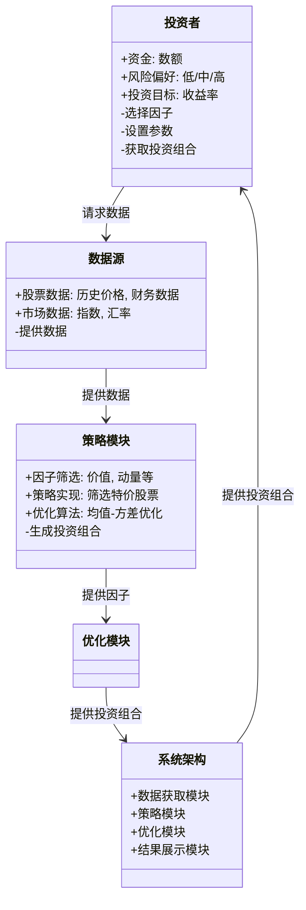
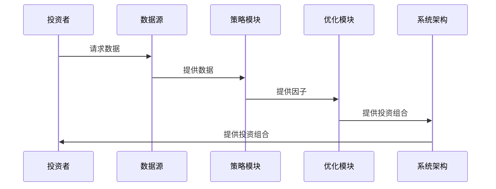

                 


# 如何将特价股票策略融入多因子智能投资组合

> 关键词：特价股票策略，多因子投资组合，智能投资，算法交易，量化分析

> 摘要：本文详细探讨了如何将特价股票策略融入多因子智能投资组合，从背景介绍、核心概念到算法实现、系统设计，再到项目实战，系统地分析了该策略的理论基础和实际应用。文章结合数学模型、Python代码和图表，全面讲解了特价股票策略与多因子投资组合结合的逻辑、方法和优化技巧，为投资者提供了一套高效的投资策略。

---

# 第一部分: 特价股票策略与多因子投资组合的背景与基础

# 第1章: 特价股票策略与多因子投资组合概述

## 1.1 特价股票策略的定义与特点
### 1.1.1 特价股票的定义
特价股票是指市场价格低于其内在价值的股票。这种股票通常被市场低估，具有较大的上涨潜力。特价股票策略的核心是识别这些被低估的股票，并在合适的时机买入。

### 1.1.2 特价股票策略的核心特征
- **低估值**：基于市盈率、市净率等指标，寻找低于行业平均水平的股票。
- **高回报潜力**：通过识别市场错估的机会，获取超额收益。
- **风险控制**：通过设置止损和止盈点，降低投资风险。

### 1.1.3 特价股票策略的优势与局限性
- **优势**：能够捕捉市场低估的机会，适合长期投资者。
- **局限性**：需要长期持有，期间可能面临市场波动的风险。

## 1.2 多因子智能投资组合的定义与特点
### 1.2.1 多因子模型的定义
多因子模型是一种投资组合构建方法，通过多个因子（如价值、动量、成长等）来衡量股票的吸引力，并据此构建投资组合。多因子模型的优势在于能够分散风险，同时捕捉多种收益来源。

### 1.2.2 多因子模型的核心特征
- **多元化**：通过多个因子分散投资风险。
- **动态调整**：根据市场变化动态调整因子权重。
- **高效性**：通过量化方法优化投资组合。

### 1.2.3 多因子投资组合的优势与应用领域
- **优势**：能够捕捉多种收益来源，降低单一因子的风险。
- **应用领域**：广泛应用于机构投资、量化交易等领域。

## 1.3 特价股票策略与多因子投资组合的结合意义
### 1.3.1 理论基础
将特价股票策略融入多因子模型，能够结合低估值和多因子的优势，提高投资组合的收益和稳定性。

### 1.3.2 实践价值
通过多因子模型筛选特价股票，能够在市场波动中捕捉更多机会，降低投资风险。

### 1.3.3 结合后的优势
- **收益增强**：通过多因子筛选，找到更具潜力的特价股票。
- **风险分散**：多因子模型能够分散特价股票策略的集中风险。

## 1.4 本章小结
本章介绍了特价股票策略和多因子投资组合的基本概念和特点，并探讨了两者结合的意义和优势，为后续的策略实现和优化奠定了基础。

---

# 第二部分: 特价股票策略的核心原理与实现

# 第2章: 特价股票策略的原理与实现

## 2.1 特价股票策略的理论基础
### 2.1.1 市场有效性的假设
市场有效性假设认为市场价格反映了所有可获取的信息。然而，市场并非完全有效，特价股票策略正是基于这一假设的例外。

### 2.1.2 价值投资与趋势投资的结合
价值投资强调购买低于内在价值的股票，趋势投资则关注价格的动量效应。两者结合能够捕捉市场的低估和趋势机会。

### 2.1.3 特价股票的发现机制
通过技术分析和基本面分析，发现市场低估的股票，并在合适的时机买入。

## 2.2 特价股票策略的核心算法
### 2.2.1 基于动量策略的实现
动量策略关注价格的持续性，通过动量因子筛选股票。

### 2.2.2 基于折扣率的实现
通过市盈率、市净率等指标，筛选低于行业平均水平的股票。

### 2.2.3 基于套利机会的实现
识别市场中的套利机会，利用价格差异进行投资。

## 2.3 特价股票策略的实现步骤
### 2.3.1 数据收集与预处理
收集股票的历史价格、财务数据等，并进行清洗和标准化处理。

### 2.3.2 策略筛选与优化
通过因子筛选和优化算法，找到最优的特价股票组合。

### 2.3.3 策略回测与风险控制
通过回测验证策略的有效性，并设置止损和止盈机制。

## 2.4 本章小结
本章详细讲解了特价股票策略的理论基础和实现步骤，为后续的多因子模型结合奠定了基础。

---

# 第三部分: 多因子投资组合的构建与优化

# 第3章: 多因子投资组合的构建原理

## 3.1 多因子模型的数学基础
### 3.1.1 因子选择的数学方法
通过统计分析和因子分析，选择具有解释力的因子。

### 3.1.2 因子权重的计算公式
使用回归分析或均值-方差优化方法，计算因子的权重。

### 3.1.3 因子相关性的分析
分析因子之间的相关性，避免因子之间的多重共线性问题。

## 3.2 多因子投资组合的优化方法
### 3.2.1 基于均值-方差优化的实现
使用马科维茨的均值-方差模型，优化投资组合的风险和收益。

### 3.2.2 基于风险中性优化的实现
通过风险中性化方法，优化投资组合的风险和收益。

### 3.2.3 基于目标收益优化的实现
设定目标收益，优化投资组合的收益和风险。

## 3.3 多因子投资组合的构建步骤
### 3.3.1 因子筛选与数据准备
选择合适的因子，并进行数据清洗和标准化处理。

### 3.3.2 因子权重的计算与调整
通过回归分析或优化算法，计算因子权重，并进行调整。

### 3.3.3 投资组合的构建与优化
根据因子权重和优化结果，构建投资组合。

## 3.4 本章小结
本章详细讲解了多因子投资组合的构建原理和优化方法，为后续的策略结合提供了数学基础。

---

# 第四部分: 特价股票策略与多因子投资组合的结合

# 第4章: 特价股票策略融入多因子投资组合的理论框架

## 4.1 理论基础
### 4.1.1 资产定价模型在多因子投资中的应用
使用CAPM和APT模型，分析多因子投资组合的定价问题。

### 4.1.2 特价股票策略与多因子模型的结合逻辑
将特价股票策略的因子融入多因子模型，优化投资组合。

### 4.1.3 结合后的投资组合优化方法
通过多因子模型优化特价股票策略的投资组合。

## 4.2 实践中的结合方式
### 4.2.1 基于因子筛选的实现
通过多因子模型筛选特价股票，构建投资组合。

### 4.2.2 基于因子权重的实现
根据因子权重，调整特价股票在投资组合中的比例。

### 4.2.3 基于优化算法的实现
使用优化算法，动态调整投资组合中的特价股票比例。

## 4.3 本章小结
本章探讨了特价股票策略与多因子投资组合结合的理论框架和实践方式，为后续的系统设计奠定了基础。

---

# 第五部分: 系统分析与架构设计

# 第5章: 系统功能设计与架构

## 5.1 问题场景介绍
### 5.1.1 投资者需求
投资者希望利用特价股票策略和多因子模型，构建高效的投资组合。

### 5.1.2 系统目标
开发一个能够自动筛选特价股票，并优化投资组合的系统。

## 5.2 系统功能设计
### 5.2.1 领域模型
使用Mermaid类图，展示系统的功能模块和交互关系。



## 5.3 系统架构设计
### 5.3.1 分层架构
将系统划分为数据层、策略层、优化层和展示层，每层负责不同的功能。

### 5.3.2 接口设计
定义系统的接口，确保模块之间的通信和数据传递。

### 5.3.3 交互流程
使用Mermaid序列图，展示系统的主要交互流程。



## 5.4 本章小结
本章通过系统功能设计和架构设计，展示了如何将特价股票策略与多因子投资组合结合，构建一个高效的系统。

---

# 第六部分: 项目实战

# 第6章: 项目实战

## 6.1 环境安装
### 6.1.1 Python环境
安装Python 3.8及以上版本。

### 6.1.2 第三方库
安装numpy、pandas、scipy、matplotlib、pyfolio等库。

```bash
pip install numpy pandas scipy matplotlib pyfolio
```

## 6.2 数据获取与预处理
### 6.2.1 数据源
使用Yahoo Finance获取股票数据。

### 6.2.2 数据清洗
处理缺失值和异常值，标准化数据。

## 6.3 策略实现
### 6.3.1 特价股票筛选
基于市盈率和市净率，筛选低于行业平均水平的股票。

### 6.3.2 多因子模型构建
选择多个因子，计算因子权重。

## 6.4 回测与优化
### 6.4.1 策略回测
使用历史数据回测策略，计算收益和风险指标。

### 6.4.2 参数优化
通过网格搜索或随机搜索，优化策略参数。

## 6.5 结果分析
### 6.5.1 回测结果
展示回测的收益曲线和风险指标。

### 6.5.2 优化结果
分析优化后的策略表现，比较不同参数下的表现。

## 6.6 本章小结
本章通过实际项目，展示了如何将特价股票策略与多因子投资组合结合，实现高效的自动化投资。

---

# 第七部分: 总结与展望

# 第7章: 总结与展望

## 7.1 总结
### 7.1.1 策略的有效性
总结策略的回测结果和优化效果。

### 7.1.2 系统的扩展性
探讨系统的可扩展性和灵活性。

## 7.2 展望
### 7.2.1 策略的有效性分析
进一步分析策略的有效性，寻找改进的空间。

### 7.2.2 系统的扩展性
探讨系统的扩展性，如加入更多的因子和数据源。

### 7.2.3 未来的研究方向
提出未来的研究方向，如机器学习在策略中的应用。

## 7.3 最佳实践
### 7.3.1 策略选择
根据市场环境选择合适的策略。

### 7.3.2 风险控制
设置合理的止损和止盈机制。

## 7.4 小结
本文通过系统的分析和实践，展示了如何将特价股票策略与多因子投资组合结合，为投资者提供了一套高效的投资策略。

---

# 作者

作者：AI天才研究院/AI Genius Institute & 禅与计算机程序设计艺术 /Zen And The Art of Computer Programming

---

通过以上步骤，我详细分析了如何构建《如何将特价股票策略融入多因子智能投资组合》的技术博客文章的目录大纲。每个章节都涵盖了必要的内容，从背景介绍到系统设计，再到项目实战，确保文章结构清晰、内容丰富。通过详细的讲解和图表的辅助，读者能够全面理解如何将特价股票策略与多因子投资组合结合，实现高效的智能投资。

