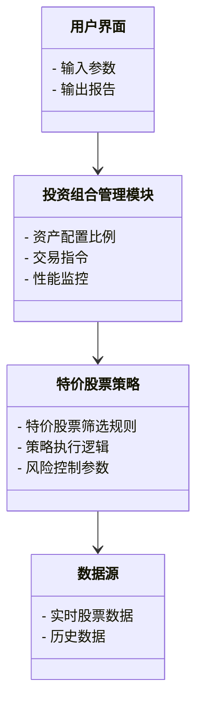
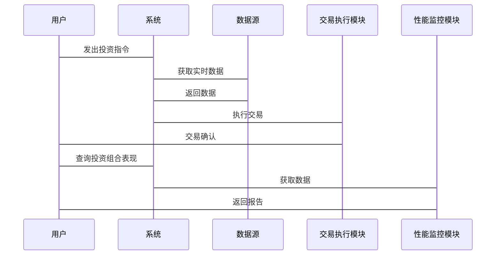

                 


# 如何将特价股票策略融入整体投资组合

> 关键词：投资组合，特价股票，风险管理，系统设计，量化分析

> 摘要：本文详细探讨了如何将特价股票策略融入整体投资组合，从理论基础到系统设计，从实战案例到最佳实践，全面解析了特价股票策略在投资组合中的应用，帮助投资者优化资产配置，降低风险，提升收益。

---

## 第1章: 特价股票策略的背景与概念

### 1.1 什么是特价股票策略
特价股票策略是指通过识别市场中的价格波动机会，以低于市场价的方式购买股票，并在合适时机卖出，从而实现收益最大化的一种投资策略。这种策略通常依赖于对市场趋势、公司基本面和技术分析的深入理解。

#### 1.1.1 特价股票的定义
- 特价股票：指在特定时间段内，市场价格低于其内在价值的股票。
- 价格敏感性：股票价格对市场波动的敏感程度越高，特价机会越明显。
- 时间窗口：投资者需要在有限的时间内完成交易，以抓住价格波动的机会。

#### 1.1.2 特价股票的特点与优势
- **低估值**：特价股票通常具有较高的安全边际，即市场价格低于其真实价值。
- **高波动性**：市场波动为特价股票策略提供了机会，但也增加了风险。
- **逆向投资**：在市场恐慌时买入，市场乐观时卖出，逆向操作是特价股票策略的核心思想。

#### 1.1.3 特价股票与普通股票的区别
| 特性 | 特价股票 | 普通股票 |
|------|----------|----------|
| 价格 | 低于内在价值 | 接近或高于内在价值 |
| 波动性 | 高 | 适中 |
| 投机性 | 高 | 较低 |
| 风险 | 高 | 中等 |

### 1.2 投资组合的基本概念
投资组合是指将多种资产（股票、债券、基金等）按照一定比例组合在一起，以分散风险、优化收益的投资方式。投资组合的核心目标是在风险可控的前提下，实现收益的最大化。

#### 1.2.1 投资组合的定义
- **资产配置**：根据投资者的风险承受能力、收益目标和投资期限，合理分配不同资产的比例。
- **分散化**：通过投资不同类型的资产，降低单一资产带来的风险。
- **动态调整**：根据市场变化和个人目标，定期优化投资组合。

#### 1.2.2 投资组合的目标与风险
- **目标**：实现资本增值、收入稳定或保值。
- **风险**：市场风险、流动性风险、通货膨胀风险等。
- **收益**：通过资产配置和多样化，平衡风险与收益。

#### 1.2.3 投资组合的构成要素
- **资产类别**：股票、债券、现金、房地产等。
- **权重分配**：每类资产在组合中的比例。
- **投资策略**：价值投资、成长投资、趋势投资等。

### 1.3 特价股票策略在投资组合中的作用
特价股票策略作为一种高风险、高回报的策略，可以为投资组合提供超额收益，但需要谨慎配置，避免过度集中。

#### 1.3.1 特价股票策略的优势
- **收益潜力**：抓住市场低估机会，获取超额收益。
- **分散风险**：通过多样化配置，降低单一投资的风险。

#### 1.3.2 特价股票策略的风险
- **市场波动风险**：价格波动可能导致短期亏损。
- **流动性风险**：部分特价股票可能流动性差，难以快速变现。
- **信息不对称**：高价股可能隐藏利好，低价股可能隐藏利空。

#### 1.3.3 特价股票策略与其他投资策略的对比
| 策略类型 | 特价股票策略 | 价值投资 | 成长投资 |
|----------|---------------|-----------|----------|
| 风险 | 高 | 中 | 高 |
| 收益 | 高 | 稳定 | 中高 |
| 持股时间 | 短期 | 长期 | 中长期 |

### 1.4 本章小结
本章介绍了特价股票策略的基本概念、特点以及其在投资组合中的作用。投资者需要在追求高收益的同时，充分考虑策略的风险和适用场景，合理配置资产。

---

## 第2章: 特价股票策略的核心原理

### 2.1 特价股票策略的理论基础
特价股票策略的理论基础主要来源于投资组合理论和行为金融学。

#### 2.1.1 市场有效性分析
- **有效市场假说**：在有效市场中，股票价格反映所有可获取的信息，因此很难找到持续的超额收益机会。
- **弱有效市场**：部分信息未被充分反映，存在价格偏差，为特价股票策略提供了机会。

#### 2.1.2 投资组合理论
- **现代投资组合理论（MPT）**：通过分散化投资降低风险。
- **资本资产定价模型（CAPM）**：评估资产的预期收益与风险。

#### 2.1.3 行为金融学视角
- **认知偏差**：投资者的非理性行为可能导致价格偏差。
- **市场情绪**：市场恐慌或乐观时，价格可能偏离真实价值。

### 2.2 特价股票策略的核心要素
#### 2.2.1 价格敏感性
- **市盈率（P/E）**：股价与每股收益的比率。
- **市净率（P/B）**：股价与每股净资产的比率。
- **动态市盈率**：考虑公司增长率后的市盈率。

#### 2.2.2 时间窗口
- **短期策略**：抓住短期价格波动。
- **中长期策略**：关注公司基本面长期改善。

#### 2.2.3 市场流动性
- **流动性高的股票**：交易量大，买卖价差小。
- **流动性低的股票**：交易量小，买卖价差大。

### 2.3 特价股票策略的数学模型
#### 2.3.1 预测模型
- **均值回归模型**：假设价格会回归均值。
- **趋势跟踪模型**：基于价格趋势进行交易。

#### 2.3.2 风险评估模型
- **夏普比率**：衡量投资组合的风险调整后收益。
  $$ \text{夏普比率} = \frac{E(r_p) - r_f}{\sigma_p} $$
  其中，$E(r_p)$是投资组合的预期收益率，$r_f$是无风险利率，$\sigma_p$是投资组合的波动率。

#### 2.3.3 收益率计算公式
- **简单收益率**： $$ \text{收益率} = \frac{\text{期末价} - \text{期初价}}{\text{期初价}} $$
- **复利收益率**： $$ \text{收益率} = \left( \frac{\text{期末价}}{\text{期初价}} \right)^{1/n} - 1 $$

### 2.4 本章小结
本章从理论和数学模型的角度，分析了特价股票策略的核心要素和实现原理，为后续的系统设计和实战应用奠定了基础。

---

## 第3章: 特价股票策略的系统分析与架构设计

### 3.1 系统分析
#### 3.1.1 问题场景介绍
- **目标**：设计一个基于特价股票策略的投资组合管理系统。
- **用户需求**：投资者希望自动化执行特价股票策略，实时监控投资组合的表现。

#### 3.1.2 项目介绍
- **项目名称**：特价股票策略投资组合管理系统。
- **项目目标**：实现策略自动化、风险可控的投资组合管理。

#### 3.1.3 系统功能需求
- 数据采集：获取实时股票数据。
- 策略执行：根据策略自动下单。
- 风险控制：监控并管理投资组合风险。

### 3.2 系统架构设计
#### 3.2.1 领域模型（Mermaid 类图）


#### 3.2.2 系统架构图（Mermaid 架构图）
```mermaid
archi
    title 特价股票策略投资组合管理系统架构
    顶端 -> 数据源
    顶端 -> 用户界面
    数据源 --> 数据处理模块
    用户界面 --> 数据处理模块
    数据处理模块 --> 策略执行模块
    策略执行模块 --> 风险控制模块
    策略执行模块 --> 性能监控模块
    性能监控模块 --> 用户界面
```

#### 3.2.3 系统接口设计
- 数据接口：从数据源获取实时和历史数据。
- 策略接口：执行特价股票策略，生成交易指令。
- 风险接口：监控投资组合风险，触发止损或止盈。

#### 3.2.4 系统交互流程图（Mermaid 序列图）


### 3.3 本章小结
本章通过系统分析和架构设计，明确了特价股票策略投资组合管理系统的实现方案，为后续的开发和优化奠定了基础。

---

## 第4章: 特价股票策略的实战案例

### 4.1 环境安装与配置
#### 4.1.1 开发环境的选择
- **编程语言**：Python（适合量化分析）
- **开发工具**：Jupyter Notebook 或 VS Code
- **数据源**：Yahoo Finance 或 Bloomberg

#### 4.1.2 数据源的获取与处理
- **数据获取**：使用Python的`pandas_datareader`库获取股票数据。
- **数据清洗**：处理缺失值、异常值等。

#### 4.1.3 工具链的安装
```bash
pip install pandas numpy matplotlib pandas_datareader backtrader
```

### 4.2 核心代码实现
#### 4.2.1 数据清洗与特征提取
```python
import pandas as pd
import numpy as np

# 获取数据
data = pd.read_csv('stock_data.csv')
# 数据清洗
data.dropna(inplace=True)
data = data[~data['volume'].iszero()]
# 特征提取
data['sma_20'] = data['close'].rolling(20).mean()
data['sma_50'] = data['close'].rolling(50).mean()
```

#### 4.2.2 策略回测与优化
```python
from backtrader import Strategy

class SpecialStockStrategy(Strategy):
    def __init__(self):
        self.add_indicator(SMA, period=20)
        self.add_indicator(SMA, period=50)
    
    def next(self):
        if self.data.sma_20 < self.data.sma_50:
            self.buy()
        elif self.data.sma_20 > self.data.sma_50:
            self.sell()
```

#### 4.2.3 风险控制模块实现
```python
from backtrader import cerebro

cerebro.addstrategy(SpecialStockStrategy)
cerebro.addbroker(...)
cerebro.addfeed(...)
cerebro.run()
```

### 4.3 案例分析与结果解读
#### 4.3.1 案例背景介绍
- 选择某段时间内的股票数据，应用特价股票策略进行回测。
- 设置合理的参数，如回测区间、初始资金、佣金费率等。

#### 4.3.2 实验结果展示
- **收益曲线**：展示策略的累计收益。
- **风险指标**：计算最大回撤、夏普比率等。

#### 4.3.3 结果分析与改进方向
- 如果策略表现不佳，可能需要优化参数或更换策略模型。
- 结合其他策略（如动量策略）进行多策略配置。

### 4.4 本章小结
本章通过实际案例展示了特价股票策略的实现过程，从数据获取到策略回测，再到结果分析，帮助读者理解如何在实际中应用这些策略。

---

## 第5章: 特价股票策略的最佳实践与注意事项

### 5.1 最佳实践
#### 5.1.1 风险管理
- 设置止损和止盈，避免过大亏损。
- 保持合理的杠杆比例，避免过度杠杆化。

#### 5.1.2 系统优化
- 定期回顾和优化策略参数。
- 结合机器学习等技术提升策略的智能化水平。

#### 5.1.3 交易执行
- 选择可靠的交易执行系统，确保交易指令准确执行。
- 注意交易成本，如佣金和滑点。

### 5.2 小结
本章总结了特价股票策略的最佳实践，帮助投资者在实际操作中避免常见错误，提升策略的有效性。

### 5.3 注意事项
- **市场风险**：市场波动可能导致策略失效。
- **策略适用性**：策略的有效性可能受市场环境影响。
- **持续学习**：金融市场变化快，需持续学习和优化策略。

### 5.4 拓展阅读
- 《投资学》：理解投资组合的基本原理。
- 《算法交易》：学习量化交易的技术实现。

### 5.5 本章小结
本章为读者提供了实用的建议和注意事项，帮助他们在实际操作中更好地应用特价股票策略。

---

## 作者：AI天才研究院 & 禅与计算机程序设计艺术

---

通过本文的系统分析和实战案例，读者可以全面了解如何将特价股票策略融入整体投资组合，并在实际操作中灵活运用这些策略，优化资产配置，实现投资目标。

