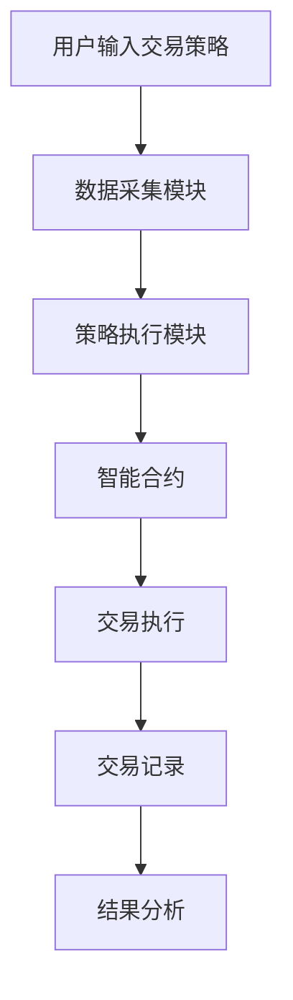
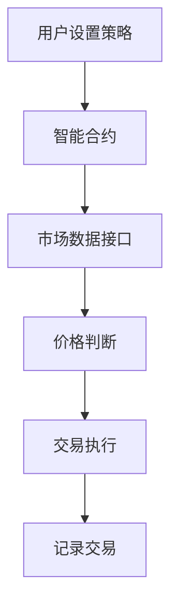

                 


# 如何将特价股票策略融入智能合约自动化投资

## 关键词：智能合约，特价股票策略，自动化投资，区块链，DeFi

## 摘要：本文详细探讨了如何将特价股票策略与智能合约相结合，实现自动化投资。文章从特价股票策略和智能合约的基本概念出发，分析了两者的结合优势，详细讲解了相关算法原理、系统架构设计、项目实现案例，并给出了最佳实践和优化建议。

---

# 第一部分: 特价股票策略与智能合约概述

## 第1章: 特价股票策略的基本概念

### 1.1 特价股票策略的定义与特点

#### 1.1.1 特价股票的定义
特价股票策略是指在特定条件下以低于市场价或折中价买入股票，并在达到预期收益后卖出的策略。这种策略通常基于技术分析、市场情绪或算法模型。

#### 1.1.2 特价股票策略的核心特点
- **价格敏感性**：依赖于价格波动，寻找低买高卖的机会。
- **自动化**：通过算法自动执行买卖操作，减少人为干扰。
- **风险管理**：设定止损和止盈点，控制投资风险。

#### 1.1.3 特价股票策略的应用场景
- 股票市场中的短期交易。
- 利用市场波动进行套利。
- 针对特定事件（如公司财报发布）的策略性投资。

### 1.2 智能合约的基本概念

#### 1.2.1 智能合约的定义
智能合约是一种基于区块链的自动化协议，能够在满足特定条件时自动执行交易。它通过代码实现信任，无需依赖中间人。

#### 1.2.2 智能合约的特点
- **自动化**：代码自动执行，无需人工干预。
- **透明性**：区块链上的智能合约代码对所有人可见。
- **不可篡改性**：一旦部署，合约代码无法修改。
- **去中心化**：运行在区块链上，不存在单点故障。

#### 1.2.3 智能合约在金融领域的应用
- 自动化金融交易。
- 去中心化金融（DeFi）中的借贷、质押。
- 股权管理与分红。

## 第2章: 特价股票策略与智能合约的结合

### 2.1 特价股票策略的自动化需求

#### 2.1.1 传统股票交易的局限性
- 人工操作效率低，容易出错。
- 市场波动快，人工难以及时反应。
- 交易成本高，尤其是小额交易。

#### 2.1.2 自动化交易的优势
- 提高交易效率，减少人为错误。
- 实时监控市场，快速执行策略。
- 降低交易成本，适合小额投资。

#### 2.1.3 特价股票策略的自动化目标
- 实现24/7市场监控。
- 自动识别买卖时机。
- 自动执行交易并记录结果。

### 2.2 智能合约在股票交易中的优势

#### 2.2.1 智能合约的自动化执行能力
- 自动触发交易条件，无需人工介入。
- 代码透明，可验证交易逻辑。

#### 2.2.2 智能合约的透明性和不可篡改性
- 所有交易记录可追溯，提高信任度。
- 代码无法篡改，确保策略执行的准确性。

#### 2.2.3 智能合约的安全性与效率
- 区块链技术保障交易安全。
- 高效的智能合约执行，减少延迟。

---

# 第二部分: 智能合约的系统设计与实现

## 第4章: 智能合约的系统架构设计

### 4.1 系统功能需求分析

#### 4.1.1 系统的核心功能
- 自动化交易执行。
- 市场数据实时监控。
- 交易策略配置与调整。
- 交易记录与数据分析。

#### 4.1.2 系统的性能需求
- 高可用性：保证系统7x24小时运行。
- 高扩展性：支持多种交易策略。
- 高安全性：防止数据篡改和网络攻击。

#### 4.1.3 系统的安全性需求
- 数据加密存储与传输。
- 防止智能合约漏洞被利用。
- 用户身份验证与权限管理。

### 4.2 系统架构设计

#### 4.2.1 分层架构设计
- 数据层：负责数据存储与访问。
- 业务逻辑层：实现交易策略的逻辑处理。
- 表现层：提供用户交互界面。

#### 4.2.2 模块化设计
- 数据采集模块：实时获取市场数据。
- 策略执行模块：根据策略决定交易。
- 记录与分析模块：记录交易结果并生成报告。

#### 4.2.3 系统交互流程设计



---

## 第5章: 智能合约的实现与部署

### 5.1 智能合约开发环境的搭建

#### 5.1.1 开发工具安装
- 安装Solidity编译器。
- 安装以太坊钱包（如MetaMask）。

#### 5.1.2 智能合约开发框架
- 使用Truffle框架进行智能合约开发。
- 配置 Ganache 模拟区块链环境。

#### 5.1.3 智能合约部署流程
1. 编写智能合约代码。
2. 使用Truffle编译合约。
3. 部署合约到区块链测试网络。
4. 部署合约到主网。

### 5.2 智能合约的核心实现

#### 5.2.1 智能合约代码实现

```solidity
// 特价股票策略智能合约
contract StockTrading {
    // 市场数据接口
    interface MarketData {
        function getPrice(address stock) external returns (uint);
    }

    // 事件：交易执行
    event Trade(address indexed account, address stock, uint amount, uint price);

    // 函数：执行交易
    function executeTrade(address stock, uint amount, uint minPrice, uint maxPrice) {
        uint currentPrice = MarketData.getPrice(stock);
        if (currentPrice < minPrice) {
            // 执行买入操作
            emit Trade(msg.sender, stock, amount, currentPrice);
        } else if (currentPrice > maxPrice) {
            // 执行卖出操作
            emit Trade(msg.sender, stock, amount, currentPrice);
        }
    }
}
```

#### 5.2.2 智能合约的测试与验证
- 使用Truffle进行单元测试。
- 部署到测试网络进行功能测试。
- 验证合约的交易逻辑和事件触发。

---

# 第三部分: 项目实战与优化

## 第6章: 项目实战

### 6.1 环境安装与配置

#### 6.1.1 安装以太坊开发环境
```bash
npm install -g truffle
npm install -g ganache-cli
```

#### 6.1.2 配置Truffle项目
```bash
truffle init
```

### 6.2 核心代码实现

#### 6.2.1 智能合约实现
```solidity
// 特价股票策略智能合约
contract PriceTrader {
    // 价格数据接口
    interface PriceFeed {
        function getPrice(address token) external returns (uint);
    }

    // 事件：买入触发
    event BuyTrigger(address indexed trader, address token, uint amount, uint price);

    // 事件：卖出触发
    event SellTrigger(address indexed trader, address token, uint amount, uint price);

    // 函数：设置价格范围
    function setPriceRange(address token, uint minPrice, uint maxPrice) {
        // 存储价格范围
        // ... 实现细节 ...
    }

    // 函数：自动执行交易
    function autoTrade(address token, uint amount, uint minPrice, uint maxPrice) {
        uint currentPrice = PriceFeed.getPrice(token);
        if (currentPrice < minPrice) {
            // 执行买入操作
            emit BuyTrigger(msg.sender, token, amount, currentPrice);
        } else if (currentPrice > maxPrice) {
            // 执行卖出操作
            emit SellTrigger(msg.sender, token, amount, currentPrice);
        }
    }
}
```

#### 6.2.2 后端接口实现
```javascript
// 后端数据接口
const express = require('express');
const app = express();

app.get('/getPrice', async (req, res) => {
    const { token } = req.query;
    // 获取实时价格
    const price = await marketData.getPrice(token);
    res.json({ price: price });
});
```

### 6.3 项目测试与优化

#### 6.3.1 智能合约测试
使用Truffle进行智能合约测试：

```javascript
// 测试用例
describe('PriceTrader', function() {
    let priceTrader;

    beforeEach(async function() {
        priceTrader = await PriceTrader.deployed();
    });

    it('should trigger buy when price is below minPrice', async function() {
        const minPrice = 100;
        const maxPrice = 200;
        const token = '0x123';
        await priceTrader.setPriceRange(token, minPrice, maxPrice);
        const mockPrice = 90;
        // 模拟价格低于minPrice，触发买入事件
        await priceTrader.autoTrade(token, 10, mockPrice);
        const events = await priceTrader.getPastEvents('BuyTrigger', {
            fromBlock: 0,
            toBlock: 'latest'
        });
        expect(events.length).to.equal(1);
    });
});
```

#### 6.3.2 性能优化
- 使用更高效的算法减少计算开销。
- 优化智能合约代码，减少Gas消耗。
- 引入限价单和市价单机制。

### 6.4 实际案例分析

#### 6.4.1 案例背景
假设某股票价格波动较大，适合特价策略。我们设定买入价低于当前价格10%，卖出价高于当前价格15%。

#### 6.4.2 系统交互流程



#### 6.4.3 优化建议
- 定期更新价格范围，适应市场变化。
- 设置合理的止损点，控制风险。
- 监控网络状态，确保交易及时执行。

---

# 第四部分: 高级主题与最佳实践

## 第7章: 智能合约的安全性与风险管理

### 7.1 智能合约的安全风险

#### 7.1.1 合约漏洞
- 逻辑漏洞：如价格判断错误导致的损失。
- 代码漏洞：如整数溢出、重入攻击。

#### 7.1.2 市场风险
- 市场剧烈波动导致策略失效。
- 黑天鹅事件引发的系统性风险。

### 7.2 风险管理策略

#### 7.2.1 限额管理
- 设置单笔交易最大金额，防止重大损失。

#### 7.2.2 止损与止盈
- 自动执行止损订单，限制最大亏损。
- 设置止盈点，锁定利润。

#### 7.2.3 风险监控
- 实时监控市场和合约状态。
- 配置报警机制，及时发现异常。

## 第8章: 最佳实践与未来展望

### 8.1 最佳实践

#### 8.1.1 合约开发
- 使用经过验证的智能合约模板。
- 进行全面的测试和审计。
- 定期更新合约代码，修复潜在漏洞。

#### 8.1.2 系统部署
- 部署到多个区块链网络，分散风险。
- 使用多重签名钱包，控制权限。
- 配置自动备份和恢复机制。

### 8.2 未来展望

#### 8.2.1 技术发展
- 更高效的智能合约编译器。
- 更智能的市场数据接口。
- 更强大的去中心化预言机（Oracle）。

#### 8.2.2 应用场景扩展
- 结合NFT，推出个性化投资产品。
- 与DeFi协议集成，提供更复杂的金融工具。
- 利用人工智能优化交易策略。

---

# 作者：AI天才研究院/AI Genius Institute & 禅与计算机程序设计艺术 /Zen And The Art of Computer Programming

