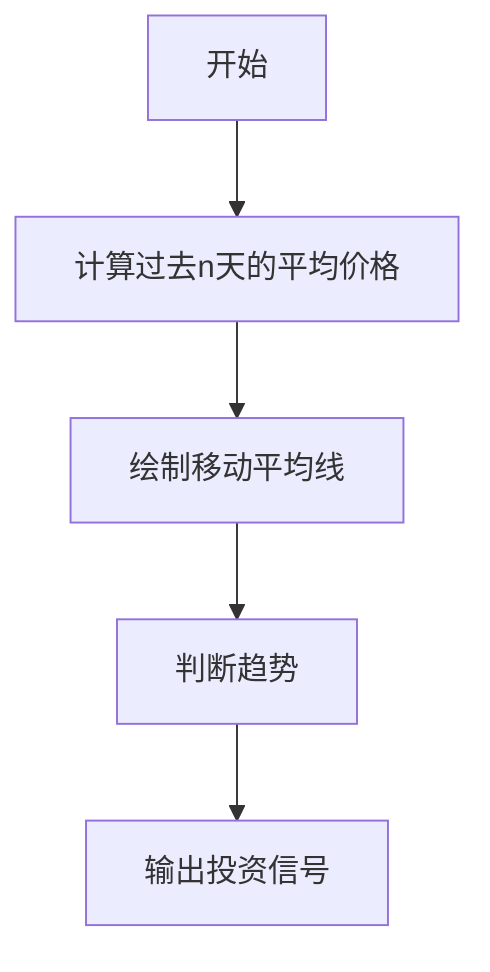
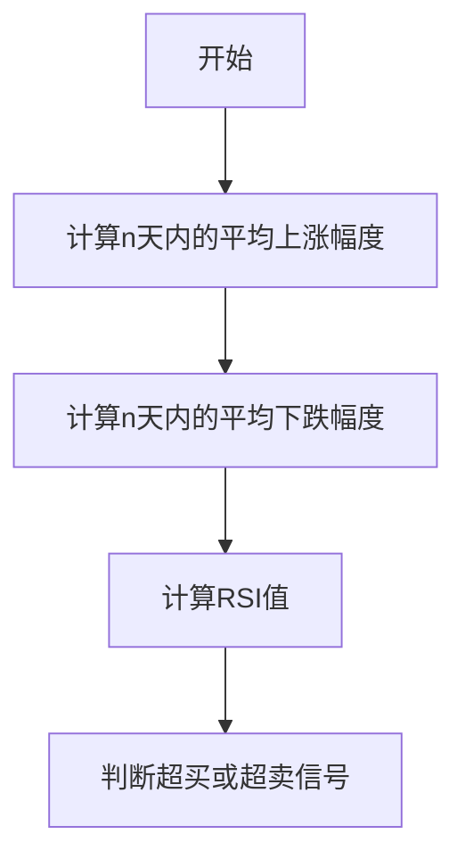
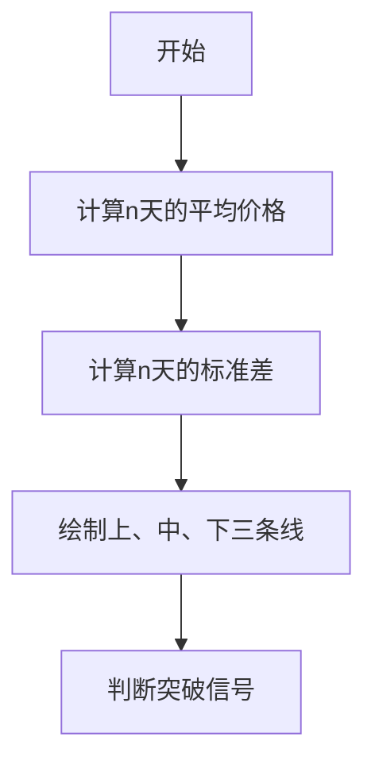
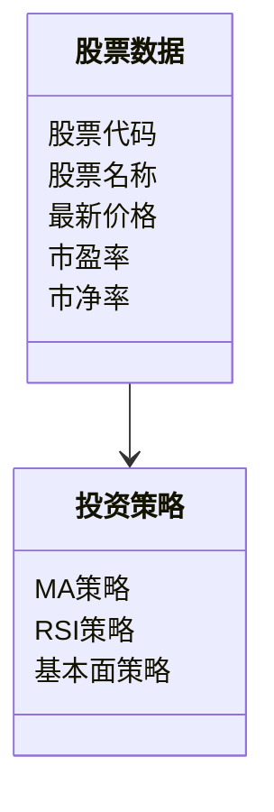
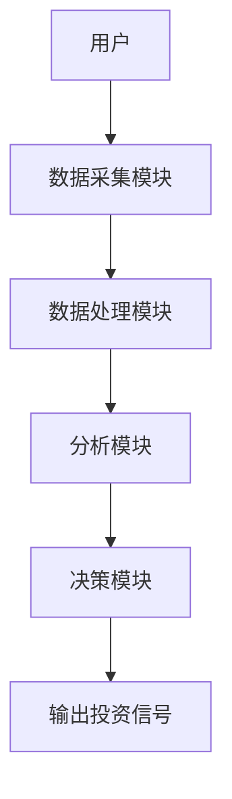
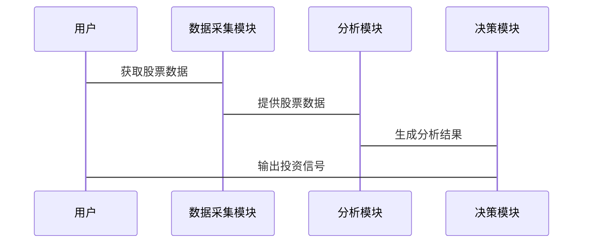

                 


# 如何提高特价股票投资的成功率

> 关键词：特价股票、投资策略、风险管理、技术分析、基本面分析

> 摘要：本文将详细探讨如何提高特价股票投资的成功率。首先介绍特价股票的基本概念和投资背景，然后分析核心概念与联系，深入讲解技术分析和基本面分析的算法原理，结合数学模型和公式，最后通过系统设计与项目实战提供具体实现方案，并总结最佳实践。

---

# 第一部分: 特价股票投资的背景与核心概念

## 第1章: 特价股票投资的背景与意义

### 1.1 特价股票的定义与特征

#### 1.1.1 特价股票的定义
特价股票是指价格相对较低、具有潜在上涨空间的股票。它们通常来自中小型企业或周期性行业的公司，在市场低迷时可能被低估。

#### 1.1.2 特价股票的核心特征
- 价格低于行业平均水平
- 市盈率、市净率等估值指标低于市场平均水平
- 具有较高的成长潜力

#### 1.1.3 特价股票与普通股票的区别
| 特性       | 特价股票             | 普通股票             |
|------------|----------------------|----------------------|
| 价格       | 较低                 | 市场平均或较高       |
| 风险       | 较高                 | 风险适中             |
| 成长潜力   | 较高                 | 成长潜力一般         |

### 1.2 特价股票投资的背景与意义

#### 1.2.1 当前股市环境分析
- 全球经济波动导致股市低迷
- 中小型企业股票估值被低估
- 投资者寻找高回报机会

#### 1.2.2 特价股票投资的潜在收益
- 股价回升带来的资本收益
- 低估值带来的安全边际
- 长期持有的成长收益

#### 1.2.3 特价股票投资的风险与挑战
- 市场波动风险
- 公司基本面变化
- 信息不对称风险

### 1.3 特价股票投资的市场现状

#### 1.3.1 特价股票市场的参与者
- 机构投资者
- 个人投资者
- 投资基金

#### 1.3.2 特价股票市场的规模与结构
- 市场规模庞大
- 分布于多个行业
- 价格波动频繁

#### 1.3.3 特价股票市场的未来发展趋势
- 数字化交易增加
- 机构投资者占比提升
- 可持续投资理念的影响

---

## 第2章: 特价股票投资的核心概念与联系

### 2.1 特价股票投资的核心概念

#### 2.1.1 投资目标与策略
- 短期收益：通过低价买入、高价卖出获利
- 长期收益：持有优质股票，分享公司成长

#### 2.1.2 市场分析与预测
- 宏观经济分析：GDP、利率、通货膨胀等
- 行业趋势分析：行业周期、政策影响
- 公司基本面分析：财务状况、管理团队

#### 2.1.3 风险管理与控制
- 设置止损点
- 分散投资
- 定期调整投资组合

### 2.2 特价股票投资的核心要素

#### 2.2.1 股票基本面分析
- 财务指标：市盈率（P/E）、市净率（P/B）、股息率（Dividend Yield）
- 盈利能力：净利润率、毛利率
- 偿债能力：资产负债率、流动比率

#### 2.2.2 股票技术分析
- 移动平均线（MA）
- 相对强弱指数（RSI）
- 布林带（Bollinger Bands）

#### 2.2.3 股票市场情绪分析
- 市场情绪指标：恐慌指数（VIX）
- 投资者情绪调查
- 媒体情绪分析

### 2.3 特价股票投资的系统架构

#### 2.3.1 投资决策系统
- 数据采集模块：收集股票价格、财务数据
- 分析模块：技术分析、基本面分析
- 决策模块：生成投资信号

#### 2.3.2 数据采集与处理
- 数据源：股票交易所API、财务报表
- 数据清洗：处理缺失值、异常值
- 数据存储：数据库存储

#### 2.3.3 模型构建与优化
- 构建股票筛选模型
- 参数优化
- 模型验证

---

## 第3章: 特价股票投资的算法原理

### 3.1 技术分析算法

#### 3.1.1 移动平均线（MA）算法

公式：$$ MA_t = \frac{1}{n} \sum_{i=1}^{n} P_{t-i} $$

#### 3.1.2 相对强弱指数（RSI）算法

公式：$$ RSI_t = \frac{100}{1 + \frac{A}{B}} $$

#### 3.1.3 布林带（Bollinger Bands）算法


### 3.2 基本面分析算法

#### 3.2.1 财务指标分析
- 市盈率（P/E）：$$ P/E = \frac{股价}{每股收益} $$
- 市净率（P/B）：$$ P/B = \frac{股价}{每股净资产} $$
- 股息率：$$ Dividend Yield = \frac{每股股息}{股价} $$

#### 3.2.2 行业趋势分析
- 行业周期：$$ 行业周期 = \frac{行业收入增长率}{GDP增长率} $$
- 政策影响：$$ 政策影响指数 = \sum_{i=1}^{n} \text{政策评分}_i $$

#### 3.2.3 公司估值模型
- 市场价值：$$ MV = \text{净利润} \times P/E $$
- 重估价值：$$ RV = \text{资产价值} - \text{负债} $$

### 3.3 组合优化算法

#### 3.3.1 马科维茨均值-方差模型
公式：$$ \text{Min} \left( \sigma^2 \right) \text{ s.t. } \sum_{i=1}^{n} w_i = 1, \text{且} w_i \geq 0 $$

#### 3.3.2 股票组合优化的数学模型
公式：$$ \text{Max} \left( \mu \cdot w \right) \text{ s.t. } \sigma^2 \leq \text{风险上限}, \sum_{i=1}^{n} w_i = 1 $$

#### 3.3.3 现实中的组合优化策略
- 风险平价：$$ \text{风险权重} = \frac{\text{资产方差}}{\sum \text{资产方差}} $$
- 情景分析：$$ \text{情景收益} = \text{情景概率} \times \text{情景收益} $$

---

## 第4章: 特价股票投资的数学模型与公式

### 4.1 移动平均线（MA）模型
公式：$$ MA_t = \frac{1}{n} \sum_{i=1}^{n} P_{t-i} $$

### 4.2 相对强弱指数（RSI）模型
公式：$$ RSI_t = \frac{100}{1 + \frac{A}{B}} $$

### 4.3 马科维茨均值-方差模型
公式：$$ \text{Min} \left( \sigma^2 \right) \text{ s.t. } \sum_{i=1}^{n} w_i = 1, \text{且} w_i \geq 0 $$

---

## 第5章: 特价股票投资的系统分析与架构设计

### 5.1 投资场景介绍
- 数据来源：股票交易所API、财经网站
- 用户需求：实时监控、投资信号生成
- 功能需求：数据采集、分析、决策

### 5.2 系统功能设计

#### 5.2.1 领域模型


#### 5.2.2 系统架构


### 5.3 系统接口设计

#### 5.3.1 数据接口
- API接口：GET /stockdata?code=XXXX
- 数据格式：JSON

#### 5.3.2 分析接口
- API接口：POST /analysis
- 数据格式：请求体包含股票代码和分析类型

### 5.4 系统交互设计

#### 5.4.1 交互流程


---

## 第6章: 特价股票投资的项目实战

### 6.1 环境安装

#### 6.1.1 安装Python
```bash
python --version
pip install --upgrade pip
```

#### 6.1.2 安装依赖库
```bash
pip install numpy pandas matplotlib
```

### 6.2 系统核心实现

#### 6.2.1 数据采集模块
```python
import pandas as pd
import requests

def get_stock_data(code):
    url = f"https://api.example.com/stock?code={code}"
    response = requests.get(url)
    data = response.json()
    return pd.DataFrame(data)
```

#### 6.2.2 分析模块
```python
def calculate_ma(data, window=10):
    return data['close'].rolling(window).mean()
```

#### 6.2.3 决策模块
```python
def generate_signal(data, ma):
    if data['close'] > ma:
        return '买入'
    else:
        return '卖出'
```

### 6.3 代码应用解读与分析
- 数据采集模块：从API获取实时数据
- 分析模块：计算移动平均线
- 决策模块：根据价格与MA的关系生成信号

### 6.4 实际案例分析

#### 6.4.1 案例背景
- 股票代码：XXXX
- 数据范围：过去1年

#### 6.4.2 数据分析
```python
data = get_stock_data('XXXX')
ma = calculate_ma(data)
signal = generate_signal(data, ma)
print(signal)
```

#### 6.4.3 结果分析
- 如果信号为“买入”，则执行买入操作
- 如果信号为“卖出”，则执行卖出操作

### 6.5 项目小结
- 代码实现：完成了数据采集、分析、决策模块
- 系统功能：实现了特价股票投资的自动化决策
- 实际应用：可以在实际投资中提供参考

---

## 第7章: 特价股票投资的最佳实践

### 7.1 成功经验总结
- 多因素分析：结合技术分析和基本面分析
- 风险控制：设置止损点，分散投资
- 持续学习：关注市场动态，优化投资策略

### 7.2 投资注意事项
- 避免过度交易
- 保持长期视角
- 定期复盘和调整

### 7.3 拓展阅读
- 《投资学》
- 《技术分析实战》
- 《风险管理手册》

---

# 第三部分: 总结

## 第8章: 特价股票投资的总结与展望

### 8.1 本章小结
- 本文详细介绍了如何提高特价股票投资的成功率
- 包括背景分析、核心概念、算法原理、系统设计和项目实战
- 提供了丰富的数学模型和公式，以及实际的代码实现

### 8.2 未来展望
- 技术进步：AI和大数据在投资中的应用将更加广泛
- 市场变化：可持续投资理念的影响将增强
- 研究方向：多因素模型和智能投资系统的研究

---

# 作者：AI天才研究院/AI Genius Institute & 禅与计算机程序设计艺术 /Zen And The Art of Computer Programming

