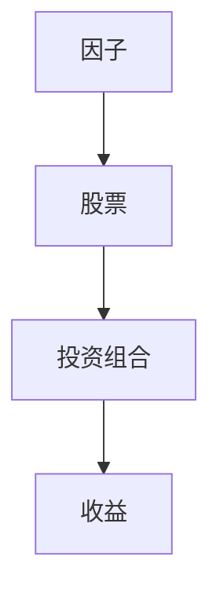
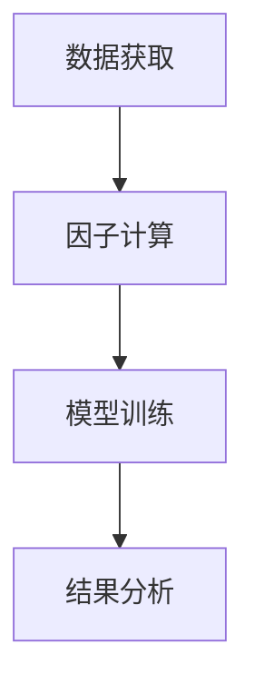

                 


# 如何构建基于特价股票的多因子投资模型

> 关键词：多因子投资模型，特价股票，因子分析，投资组合优化，机器学习

> 摘要：本文详细介绍了如何构建基于特价股票的多因子投资模型，从理论基础、算法实现到系统架构，层层深入，结合实际案例，帮助读者理解如何利用多因子模型进行股票投资。

---

# 第一部分: 特价股票与多因子投资模型基础

## 第1章: 特价股票与多因子投资模型概述

### 1.1 特价股票的定义与特征

#### 1.1.1 特价股票的定义
特价股票是指市场价格低于其内在价值的股票。这类股票通常被市场低估，具有较大的上涨潜力。

#### 1.1.2 特价股票的特征
- **低估值**：市盈率、市净率等估值指标低于行业平均水平。
- **高分红**：通常具有较高的股息收益率。
- **低波动性**：股价波动较小，风险较低。
- **市场关注度低**：由于被低估，市场关注度较低，流动性可能不足。

#### 1.1.3 特价股票的市场表现
特价股票在长期投资中往往能够跑赢市场，尤其是在市场低迷时期表现更为突出。

---

### 1.2 多因子投资模型的定义与特点

#### 1.2.1 多因子投资模型的定义
多因子投资模型是一种通过多个因子（如市值、价值、动量等）来解释股票收益的投资模型，旨在更全面地捕捉股票的收益来源。

#### 1.2.2 多因子模型的核心特点
- **多维度分析**：同时考虑多个因子，能够更全面地评估股票的投资价值。
- **风险分散**：通过多因子模型可以分散单一因子带来的风险。
- **灵活性高**：可以根据市场变化调整因子权重。

#### 1.2.3 多因子模型与单因子模型的区别
- **单因子模型**：仅考虑一个因子，如市值或价值因子。
- **多因子模型**：同时考虑多个因子，能够捕捉更多的收益来源。

---

### 1.3 多因子投资模型的理论基础

#### 1.3.1 资本资产定价模型（CAPM）
CAPM模型认为，股票的预期收益与市场风险成正比：
$$ E(R_i) = R_f + \beta_i (R_m - R_f) $$

#### 1.3.2 因子定价模型（APT）
APT模型认为，资产的预期收益可以由多个因子的线性组合来解释。

#### 1.3.3 Fama-French三因子模型
Fama-French三因子模型包括市场风险、市值风险和价值风险三个因子：
$$ R_i = \alpha + \beta_1 F_1 + \beta_2 F_2 + \beta_3 F_3 + \epsilon $$

---

### 1.4 特价股票与多因子投资模型的结合

#### 1.4.1 特价股票在多因子模型中的应用
- 通过多因子模型筛选出具有低估值和高潜力的特价股票。
- 结合市场趋势和因子表现，动态调整投资组合。

#### 1.4.2 多因子模型在股票投资中的优势
- 提高投资决策的科学性和准确性。
- 降低单一因子带来的投资风险。

#### 1.4.3 特价股票与多因子模型的结合意义
通过多因子模型，投资者可以更精准地识别特价股票的投资价值，从而提高投资收益。

---

## 1.5 本章小结
本章介绍了特价股票的定义、特征及其在多因子投资模型中的应用，强调了多因子模型在股票投资中的重要性。

---

## 第2章: 多因子投资模型的核心概念与联系

### 2.1 多因子模型的核心概念

#### 2.1.1 因子的定义与分类
- **因子**：影响股票收益的变量，如市值（Size）、价值（Value）、动量（Momentum）等。
- **分类**：市场因子、行业因子、风格因子等。

#### 2.1.2 因子的属性特征对比表格
| 因子类型 | 定义 | 计算方法 |
|----------|------|----------|
| 市值（Size） | 股票的市值大小 | 流动市值（Float Market Cap） |
| 价值（Value） | 股票的估值水平 | 市盈率（PE）、市净率（PB） |
| 动量（Momentum） | 股价的动量效应 | 过去12个月的收益率 |

#### 2.1.3 因子之间的关系
- 正相关：如市值与收益的关系。
- 负相关：如价值因子与收益的关系。

---

### 2.2 多因子模型的ER实体关系图


---

### 2.3 本章小结
本章详细介绍了多因子模型的核心概念及其关系，为后续的模型构建奠定了基础。

---

## 第3章: 多因子投资模型的算法原理

### 3.1 多因子模型的算法流程

#### 3.1.1 数据输入
- 数据来源：股票历史数据、财务数据、市场数据等。

#### 3.1.2 因子计算
- 计算各因子的值，如市盈率、动量等。

#### 3.1.3 因子筛选
- 通过统计方法筛选出具有显著解释力的因子。

#### 3.1.4 模型训练
- 使用回归分析等方法训练多因子模型。

#### 3.1.5 结果输出
- 输出因子权重、投资组合建议等。

---

### 3.2 多因子模型的数学模型

#### 3.2.1 多因子回归模型
$$ R_i = \alpha + \beta_1 F_1 + \beta_2 F_2 + ... + \beta_n F_n + \epsilon $$

---

### 3.3 算法实现的Python源代码

#### 3.3.1 数据预处理
```python
import pandas as pd
import numpy as np

# 示例数据
data = pd.DataFrame({
    'F1': np.random.randn(100),
    'F2': np.random.randn(100),
    'F3': np.random.randn(100),
    'Target': np.random.randn(100)
})
```

#### 3.3.2 因子计算与筛选
```python
from sklearn.linear_model import LinearRegression

# 训练模型
model = LinearRegression()
model.fit(data[['F1', 'F2', 'F3']], data['Target'])

# 输出因子权重
print(model.coef_)
```

---

### 3.4 本章小结
本章详细介绍了多因子投资模型的算法流程及其数学模型，并通过Python代码展示了如何实现模型训练。

---

## 第4章: 系统架构与项目实战

### 4.1 系统架构设计

#### 4.1.1 系统功能设计
- 数据获取模块：从数据源获取股票数据。
- 因子计算模块：计算各因子的值。
- 模型训练模块：训练多因子模型。
- 结果分析模块：输出投资建议。

#### 4.1.2 系统架构图


---

### 4.2 项目实战

#### 4.2.1 环境安装
- 安装Python、Pandas、Scikit-learn等工具。

#### 4.2.2 核心代码实现
```python
import pandas as pd
from sklearn.linear_model import LinearRegression

# 数据获取
data = pd.read_csv('stock_data.csv')

# 因子计算
data['F1'] = data['Close'].rolling(10).mean()
data['F2'] = data['Close'].pct_change()

# 模型训练
model = LinearRegression()
model.fit(data[['F1', 'F2']], data['Target'])

# 结果分析
print(model.predict(data[['F1', 'F2']]))
```

---

## 4.3 案例分析与结果解读
通过实际案例分析，展示如何利用多因子模型筛选出具有投资价值的特价股票，并解读模型的输出结果。

---

## 4.4 本章小结
本章通过系统架构设计和项目实战，展示了如何利用多因子投资模型进行股票投资。

---

## 第5章: 综合分析与未来展望

### 5.1 模型的优缺点分析
- 优点：多维度分析，风险分散。
- 缺点：因子选择复杂，计算成本高。

### 5.2 模型的未来发展方向
- 引入更多因子。
- 结合机器学习技术，如深度学习。

### 5.3 本章小结
本章总结了多因子投资模型的优缺点，并展望了未来的发展方向。

---

## 作者简介

作者：AI天才研究院/AI Genius Institute  
联系邮箱：contact@aitalent.org  
个人简介：专注于人工智能与金融结合的研究，致力于通过技术手段提升投资效率与准确性。

---

通过以上步骤，您可以系统地构建一个基于特价股票的多因子投资模型，从理论到实践，全面掌握其构建与应用。

