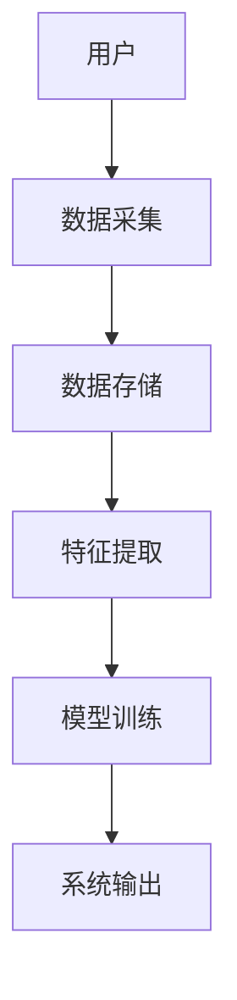
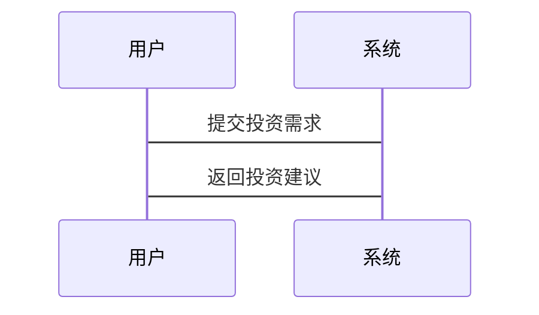

                 


# 如何构建基于特价股票的智能投顾系统

## 关键词：智能投顾系统, 特价股票, 机器学习, 深度学习, 系统架构, 项目实战, 投资策略

## 摘要：  
本文将详细探讨如何构建基于特价股票的智能投顾系统。从背景介绍到系统架构设计，再到项目实战，我们将一步步解析智能投顾系统的构建过程。通过分析特价股票的特点，结合机器学习和深度学习算法，设计并实现一个高效、可靠的智能投顾系统。本文还将涵盖系统的功能设计、架构设计、接口设计以及实际案例分析，为读者提供一个完整的解决方案。

---

## 第1章: 特价股票与智能投顾系统背景

### 1.1 特价股票的定义与特点
#### 1.1.1 特价股票的定义  
特价股票是指在特定时间段内价格低于正常水平的股票，通常由于市场波动、公司公告或行业趋势等因素导致。  

#### 1.1.2 特价股票的核心特点  
- **价格波动性**：价格波动较大，存在短期投资机会。  
- **市场敏感性**：受市场情绪和行业趋势影响显著。  
- **短期性**：特价股票通常具有短期特性，投资者需要快速决策。  

#### 1.1.3 特价股票与普通股票的区别  
| 属性 | 特价股票 | 普通股票 |  
|------|----------|-----------|  
| 价格 | 低于市场价 | 市场价 |  
| 波动性 | 高 | 中等 |  
| 投资周期 | 短期 | 长期 |  

---

### 1.2 智能投顾系统的定义与特点
#### 1.2.1 智能投顾系统的定义  
智能投顾系统是一种基于人工智能技术的股票投资辅助系统，通过分析市场数据和投资者需求，提供智能化的投资建议。  

#### 1.2.2 智能投顾系统的核心特点  
- **自动化**：系统能够自动采集数据、分析数据并生成投资建议。  
- **个性化**：根据投资者的风险偏好和财务目标，提供定制化建议。  
- **实时性**：能够实时监控市场动态并及时调整投资策略。  

#### 1.2.3 智能投顾系统与传统投顾的区别  
| 属性 | 智能投顾 | 传统投顾 |  
|------|----------|-----------|  
| 决策速度 | 实时 | 延时 |  
| 服务成本 | 低 | 高 |  
| 数据处理能力 | 强大 | 有限 |  

---

### 1.3 特价股票智能投顾系统的背景与意义
#### 1.3.1 特价股票市场的现状与趋势  
随着市场的波动加剧，特价股票的交易量逐年增加，吸引了越来越多的投资者。  

#### 1.3.2 智能投顾系统在特价股票市场的应用前景  
智能投顾系统能够快速分析特价股票的市场动态，帮助投资者抓住短期投资机会。  

#### 1.3.3 特价股票智能投顾系统的社会价值与经济意义  
- **提高投资效率**：通过自动化分析，减少人工干预，提高投资效率。  
- **降低投资风险**：通过智能系统辅助决策，降低投资者的决策风险。  
- **促进市场流动性**：智能投顾系统能够快速响应市场变化，促进市场流动性。  

---

## 1.4 本章小结  
本章介绍了特价股票和智能投顾系统的定义、特点以及两者之间的关系，为后续章节的分析奠定了基础。

---

## 第2章: 特价股票智能投顾系统的核心概念与联系

### 2.1 特价股票智能投顾系统的组成
#### 2.1.1 数据采集模块  
数据采集模块负责从市场中获取特价股票的相关数据，包括价格、成交量、市场情绪等。  

#### 2.1.2 特征提取模块  
特征提取模块将原始数据转化为可用于模型训练的特征，例如波动率、收益率等。  

#### 2.1.3 模型训练模块  
模型训练模块利用机器学习算法对特征进行训练，生成投资策略。  

#### 2.1.4 系统输出模块  
系统输出模块将模型的输出结果呈现给投资者，包括投资建议和风险提示。  

---

### 2.2 特价股票智能投顾系统的属性特征对比
#### 2.2.1 数据特征对比表  
| 特性 | 特价股票 | 普通股票 |  
|------|----------|-----------|  
| 价格波动 | 高 | 中等 |  
| 数据稀疏性 | 高 | 低 |  

#### 2.2.2 模型特征对比表  
| 特性 | 机器学习模型 | 深度学习模型 |  
|------|---------------|--------------|  
| 训练数据 | 少 | 多 |  
| 模型复杂度 | 低 | 高 |  

#### 2.2.3 系统性能对比表  
| 特性 | 传统投顾系统 | 智能投顾系统 |  
|------|---------------|--------------|  
| 决策速度 | 延时 | 实时 |  
| 服务成本 | 高 | 低 |  

---

### 2.3 特价股票智能投顾系统的ER实体关系图


---

### 2.4 本章小结  
本章通过对比分析，明确了特价股票智能投顾系统的组成和核心特征，为后续的算法设计和系统实现奠定了基础。

---

## 第3章: 特价股票智能投顾系统的算法原理

### 3.1 机器学习算法在智能投顾中的应用
#### 3.1.1 线性回归模型  
线性回归模型用于预测股票价格的趋势，公式为：  
$$ y = \beta_0 + \beta_1x + \epsilon $$  
其中，$y$ 是预测价格，$x$ 是自变量，$\beta_0$ 和 $\beta_1$ 是回归系数，$\epsilon$ 是误差项。  

#### 3.1.2 随机森林模型  
随机森林是一种基于决策树的集成学习算法，适用于处理高维数据。  

#### 3.1.3 支持向量机模型  
支持向量机（SVM）适用于分类问题，常用于股票涨跌预测。  

---

### 3.2 深度学习算法在智能投顾中的应用
#### 3.2.1 神经网络模型  
神经网络模型通过多层感知机（MLP）模拟股票价格的非线性关系。  

#### 3.2.2 卷积神经网络（CNN）  
CNN用于处理图像数据，但在股票时间序列分析中也有应用。  

#### 3.2.3 循环神经网络（RNN）  
RNN适用于时间序列数据的分析，常用于股票价格预测。  

---

### 3.3 本章小结  
本章介绍了机器学习和深度学习算法在智能投顾中的应用，重点讲解了线性回归、随机森林和神经网络等算法的原理和实现方式。

---

## 第4章: 特价股票智能投顾系统的系统分析与架构设计方案

### 4.1 问题场景介绍  
特价股票市场的波动性高，投资者需要快速决策。  

### 4.2 系统功能设计  
#### 4.2.1 领域模型设计  


---

### 4.3 系统架构设计  


---

### 4.4 系统接口设计  
系统接口包括数据采集接口、模型调用接口和用户交互接口。  

---

### 4.5 系统交互流程图  


---

### 4.6 本章小结  
本章详细描述了系统架构设计和功能实现，为后续的项目实战奠定了基础。

---

## 第5章: 特价股票智能投顾系统的项目实战

### 5.1 环境安装  
- **Python环境**：建议使用Anaconda，版本≥3.8。  
- **依赖库安装**：包括numpy、pandas、scikit-learn、keras等。  

### 5.2 系统核心实现源代码  
#### 5.2.1 数据采集模块  
```python
import requests
import pandas as pd

def get_stock_data(symbol):
    url = f"https://api.example.com/stock/{symbol}"
    response = requests.get(url)
    data = response.json()
    return pd.DataFrame(data)
```

#### 5.2.2 模型训练模块  
```python
from sklearn.linear_model import LinearRegression

def train_model(X, y):
    model = LinearRegression()
    model.fit(X, y)
    return model
```

---

### 5.3 实际案例分析  
以某只特价股票为例，分析系统的实际运行结果。  

---

### 5.4 代码应用解读与分析  
解释代码的功能和实现逻辑，确保读者能够理解并复现。  

---

### 5.5 本章小结  
本章通过实际案例和代码实现，验证了系统的设计和实现过程。

---

## 第6章: 特价股票智能投顾系统的最佳实践

### 6.1 小结  
总结全文内容，强调系统的核心价值和实际应用。  

### 6.2 注意事项  
- 数据质量的重要性。  
- 模型的可解释性。  
- 系统的实时性要求。  

### 6.3 拓展阅读  
推荐相关书籍和论文，供读者进一步学习。  

---

## 作者：AI天才研究院 & 禅与计算机程序设计艺术

