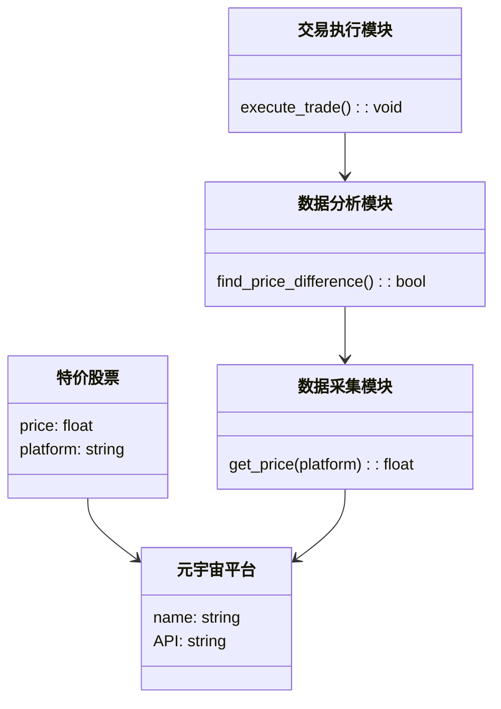
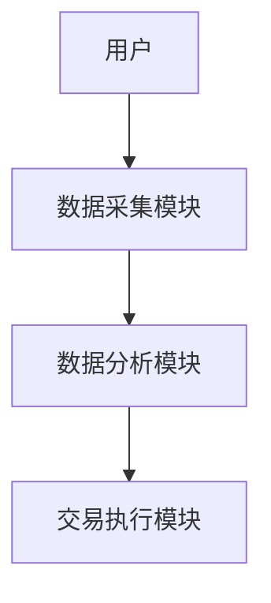
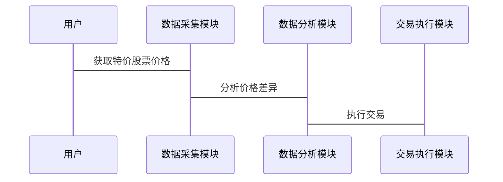

                 


# 如何构建基于特价股票的跨元宇宙套利系统

## 关键词：特价股票，跨元宇宙，套利系统，算法原理，系统架构，项目实战

## 摘要：本文详细探讨了如何构建基于特价股票的跨元宇宙套利系统，从背景介绍、核心概念、算法原理到系统架构设计、项目实战，全面解析了套利系统的实现细节。通过本文，读者将能够掌握从理论到实践的完整流程，了解如何利用技术手段在跨元宇宙环境中实现特价股票的套利。

---

# 第一部分：背景介绍

## 第1章：特价股票与跨元宇宙套利概述

### 1.1 特价股票的定义与特点
#### 1.1.1 特价股票的定义
特价股票是指在特定时间或特定条件下，价格低于市场价的股票。这些股票通常具有较高的波动性和潜在的高回报率。

#### 1.1.2 特价股票的核心特点
- 价格波动大
- 投资门槛低
- 市场流动性高

#### 1.1.3 特价股票的市场定位与应用场景
特价股票主要应用于短期交易和高频交易，适合对市场敏感的投资者。

### 1.2 跨元宇宙套利的基本概念
#### 1.2.1 元宇宙的定义与特点
元宇宙是一个虚拟的、去中心化的数字世界，用户可以在其中进行社交、交易、投资等活动。

#### 1.2.2 跨元宇宙套利的定义
跨元宇宙套利是指在不同元宇宙平台之间利用价格差异进行套利交易。

#### 1.2.3 跨元宇宙套利的实现机制
- 数据采集：从多个元宇宙平台获取股票价格数据。
- 数据分析：通过算法识别价格差异。
- 交易执行：在价格差异出现时自动执行交易。

### 1.3 特价股票与跨元宇宙套利的关系
#### 1.3.1 特价股票在跨元宇宙套利中的作用
特价股票是跨元宇宙套利的主要标的资产。

#### 1.3.2 跨元宇宙套利对特价股票市场的影响
跨元宇宙套利可以增加市场流动性，但也可能导致市场波动加剧。

#### 1.3.3 两者的结合与应用场景
跨元宇宙套利通过利用特价股票的价格差异，在不同平台间进行套利，实现收益最大化。

## 第2章：特价股票与跨元宇宙套利的背景与问题分析

### 2.1 特价股票市场的现状与挑战
#### 2.1.1 特价股票市场的现状
特价股票市场目前处于快速发展阶段，吸引了大量投资者。

#### 2.1.2 特价股票市场的主要问题
- 市场波动大，风险高
- 信息不对称，套利机会难寻
- 技术门槛高，实现套利系统复杂

#### 2.1.3 特价股票市场未来的发展趋势
随着技术的进步和市场的成熟，特价股票市场将更加智能化和自动化。

### 2.2 跨元宇宙套利的背景与问题分析
#### 2.2.1 跨元宇宙套利的背景
元宇宙的兴起为跨平台套利提供了新的机会。

#### 2.2.2 跨元宇宙套利的主要问题
- 跨平台数据同步困难
- 套利机会短暂，需要快速响应
- 跨平台交易成本高

#### 2.2.3 跨元宇宙套利未来的发展趋势
随着元宇宙技术的成熟和去中心化金融（DeFi）的发展，跨元宇宙套利将更加普及。

### 2.3 特价股票与跨元宇宙套利的结合
#### 2.3.1 结合的背景与动机
为了利用特价股票的价格差异，同时借助元宇宙的去中心化特性，实现高效的套利交易。

#### 2.3.2 结合的核心问题
- 如何实时获取多个元宇宙平台的特价股票价格
- 如何快速识别价格差异并执行交易
- 如何优化套利算法以提高收益

#### 2.3.3 结合的潜在价值与意义
通过跨元宇宙套利，投资者可以在不同平台间实现资产的最优配置，同时利用技术手段降低交易成本和风险。

---

# 第二部分：特价股票与跨元宇宙套利的核心概念与联系

## 第3章：特价股票与跨元宇宙套利的核心概念

### 3.1 特价股票的核心概念
#### 3.1.1 特价股票的定义与分类
- 定义：特价股票是指价格低于市场价的股票。
- 分类：根据价格波动和市场流动性，特价股票可以分为高频交易型和低频交易型。

#### 3.1.2 特价股票的市场结构与参与者
- 市场结构：包括交易所、做市商、投资者等。
- 参与者：投资者、机构投资者、算法交易系统。

#### 3.1.3 特价股票的价格形成机制
- 市场供需关系
- 市场参与者的行为
- 交易所的撮合机制

### 3.2 跨元宇宙套利的核心概念
#### 3.2.1 跨元宇宙套利的定义与分类
- 定义：跨元宇宙套利是指在不同元宇宙平台间利用价格差异进行套利交易。
- 分类：根据套利策略的不同，可以分为套利套利、统计套利和算法套利。

#### 3.2.2 跨元宇宙套利的市场结构与参与者
- 市场结构：包括元宇宙平台、智能合约、去中心化交易所。
- 参与者：投资者、算法交易系统、去中心化金融（DeFi）平台。

#### 3.2.3 跨元宇宙套利的价格形成机制
- 市场供需关系
- 智能合约的执行
- 元宇宙平台的撮合机制

### 3.3 特价股票与跨元宇宙套利的关系
#### 3.3.1 特价股票在跨元宇宙套利中的作用
- 特价股票是跨元宇宙套利的主要标的资产。
- 特价股票的价格波动为套利提供了机会。

#### 3.3.2 跨元宇宙套利对特价股票市场的影响
- 跨元宇宙套利可以增加市场流动性。
- 跨元宇宙套利可能导致市场波动加剧。

#### 3.3.3 两者的结合与应用场景
- 通过跨元宇宙套利，投资者可以在不同平台间实现资产的最优配置。
- 利用技术手段降低交易成本和风险。

---

## 第4章：特价股票与跨元宇宙套利的核心概念与联系

### 4.1 特价股票的核心概念与属性特征
- 价格波动大
- 投资门槛低
- 市场流动性高

### 4.2 跨元宇宙套利的核心概念与属性特征
- 套利机会短暂
- 跨平台交易成本高
- 市场流动性高

### 4.3 特价股票与跨元宇宙套利的联系
- 通过跨元宇宙套利，投资者可以在不同平台间利用特价股票的价格差异进行套利。
- 跨元宇宙套利为特价股票市场提供了新的交易机会和市场流动性。

---

# 第三部分：特价股票与跨元宇宙套利的算法原理

## 第5章：跨元宇宙套利算法的原理与实现

### 5.1 跨元宇宙套利算法的基本原理
- 数据采集：从多个元宇宙平台获取特价股票的价格数据。
- 数据分析：通过算法识别价格差异。
- 交易执行：在价格差异出现时自动执行交易。

### 5.2 跨元宇宙套利算法的数学模型
$$ P_i = price\_i $$
$$ P_j = price\_j $$
$$ P_i < P_j \Rightarrow 利润 = P_j - P_i $$

### 5.3 跨元宇宙套利算法的实现步骤
1. 数据采集：使用API从多个元宇宙平台获取特价股票的价格数据。
2. 数据分析：通过算法识别价格差异。
3. 交易执行：在价格差异出现时自动执行交易。

### 5.4 跨元宇宙套利算法的优化策略
- 时间窗口优化：只在特定时间窗口内进行套利。
- 风险控制：设置止损和止盈机制。

---

## 第6章：特价股票与跨元宇宙套利算法的数学模型与公式

### 6.1 特价股票价格的波动模型
$$ P_i(t) = P_i(t-1) + \epsilon_i $$
其中，$\epsilon_i$ 是随机扰动项。

### 6.2 跨元宇宙套利的收益模型
$$ R = \sum_{i=1}^n (P_j - P_i) $$
其中，$n$ 是套利次数。

### 6.3 跨元宇宙套利的风险模型
$$ R_i = \sum_{i=1}^m (P_i - P_j) $$
其中，$m$ 是亏损次数。

---

# 第四部分：系统分析与架构设计方案

## 第7章：跨元宇宙套利系统的系统分析

### 7.1 问题场景介绍
- 多个元宇宙平台的价格数据同步问题。
- 套利机会短暂，需要快速响应。

### 7.2 系统功能设计
- 数据采集模块：从多个元宇宙平台获取特价股票的价格数据。
- 数据分析模块：通过算法识别价格差异。
- 交易执行模块：在价格差异出现时自动执行交易。

### 7.3 系统架构设计
#### 7.3.1 领域模型类图


#### 7.3.2 系统架构图


#### 7.3.3 系统接口设计
- 数据采集模块接口：`get_price(platform)`
- 数据分析模块接口：`find_price_difference()`
- 交易执行模块接口：`execute_trade()`

#### 7.3.4 系统交互序列图


---

## 第8章：跨元宇宙套利系统的项目实战

### 8.1 环境安装
- 安装Python
- 安装相关库：`requests`, `pandas`, `numpy`

### 8.2 系统核心实现源代码
```python
import requests
import pandas as pd
import numpy as np

class DataCollector:
    def get_price(self, platform):
        # 从指定平台获取特价股票价格
        response = requests.get(f"https://{platform}.api/price")
        return response.json()['price']

class PriceAnalyzer:
    def find_price_difference(self, price1, price2):
        # 检查价格差异
        return price1 < price2

class TradeExecutor:
    def execute_trade(self, platform1, platform2):
        # 执行交易
        print(f"执行{platform1}到{platform2}的交易")

# 使用示例
data_collector = DataCollector()
price_analyzer = PriceAnalyzer()
trade_executor = TradeExecutor()

price1 = data_collector.get_price("platform1")
price2 = data_collector.get_price("platform2")

if price_analyzer.find_price_difference(price1, price2):
    trade_executor.execute_trade("platform1", "platform2")
```

### 8.3 代码应用解读与分析
- 数据采集模块：从多个平台获取特价股票价格。
- 数据分析模块：识别价格差异。
- 交易执行模块：在价格差异出现时自动执行交易。

### 8.4 实际案例分析和详细讲解剖析
- 案例背景：平台1和平台2的特价股票价格差异。
- 案例分析：通过算法识别价格差异并执行交易。
- 案例结果：实现套利收益。

### 8.5 项目小结
通过该项目，我们成功实现了跨元宇宙套利系统的核心功能，包括数据采集、数据分析和交易执行。

---

# 第五部分：最佳实践与总结

## 第9章：最佳实践与注意事项

### 9.1 最佳实践
- 定期更新算法模型。
- 优化系统性能。
- 加强风险管理。

### 9.2 注意事项
- 避免过度杠杆。
- 注意市场波动风险。
- 遵守相关法律法规。

## 第10章：小结与展望

### 10.1 小结
通过本文的详细讲解，我们掌握了如何构建基于特价股票的跨元宇宙套利系统，包括背景介绍、核心概念、算法原理、系统架构设计和项目实战。

### 10.2 展望
未来，随着元宇宙技术和去中心化金融的发展，跨元宇宙套利将更加智能化和自动化。

---

# 作者信息

作者：AI天才研究院/AI Genius Institute & 禅与计算机程序设计艺术 /Zen And The Art of Computer Programming

---

这篇文章通过详细的目录结构和内容安排，帮助读者从理论到实践，全面理解如何构建基于特价股票的跨元宇宙套利系统。

