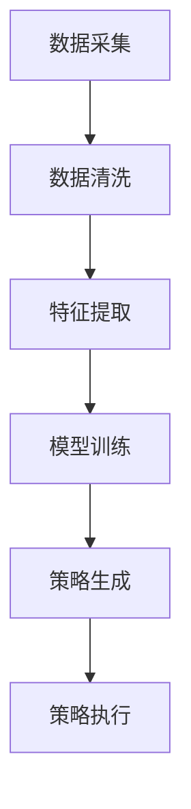

                 


# 如何构建基于特价股票的跨维度套利系统

> **关键词**：特价股票、跨维度套利、算法、系统架构、技术分析、数据处理、金融建模  
>
> **摘要**：本文详细探讨了如何构建基于特价股票的跨维度套利系统。通过分析特价股票的定义、跨维度套利的原理，以及套利系统的算法设计与实现，本文旨在帮助读者理解如何在金融市场上利用跨维度分析来优化套利策略。文章内容涵盖背景介绍、核心算法、系统架构设计、项目实战以及最佳实践，帮助读者从理论到实践掌握跨维度套利系统的核心要素。

---

## 第一部分: 特价股票与跨维度套利系统概述

### 第1章: 特价股票的定义与特点

#### 1.1 特价股票的定义
特价股票是指在特定市场条件下，由于各种原因导致股票价格出现异常波动，从而产生短期套利机会的股票。这种波动可能是由于市场信息不对称、短期供需失衡或市场参与者的非理性行为引起的。

- **定义与分类**：特价股票可以分为以下几类：
  - **低估股票**：市场价格低于内在价值的股票。
  - **高估股票**：市场价格高于内在价值的股票。
  - **波动性股票**：价格波动剧烈，适合短期套利的股票。

- **特点与优势**：
  - 短期价格波动大，套利机会多。
  - 市场信息不对称，存在套利空间。
  - 适合技术分析和量化交易。

- **市场定位与应用**：
  - 主要应用于股票市场，尤其是新兴市场或波动性较高的市场。
  - 适合机构投资者和专业交易者。

#### 1.2 跨维度套利的原理
跨维度套利是指通过在不同市场、资产类别或时间维度之间寻找价格差异，利用这些差异进行套利。这种套利方式能够捕捉到市场中的短期不均衡机会，从而实现盈利。

- **数学模型**：跨维度套利的核心是通过数学模型发现价格差异。例如，利用时间序列分析模型（如ARIMA）预测价格波动，或者通过机器学习模型识别市场模式。
  $$ P_{t} = \alpha + \beta P_{t-1} + \epsilon_{t} $$
  其中，$P_{t}$ 表示当前价格，$P_{t-1}$ 表示前一期价格，$\epsilon_{t}$ 为误差项。

- **跨维度分析**：跨维度套利的关键在于分析多个维度的数据，例如：
  - **时间维度**：不同时间周期的价格差异。
  - **资产维度**：同一资产在不同市场中的价格差异。
  - **市场维度**：不同市场之间的价格差异。

#### 1.3 背景介绍
随着金融市场的日益复杂化，传统的套利策略逐渐暴露出局限性。跨维度套利作为一种新兴的套利方式，能够通过多维度分析捕捉到更多的套利机会，从而提高套利效率和收益。

- **问题背景与问题描述**：
  - 特价股票市场的价格波动频繁，但传统套利方法难以捕捉到所有套利机会。
  - 如何通过跨维度分析优化套利策略，成为当前研究的热点。

- **核心概念与联系**：
  - 跨维度套利的核心概念包括价格波动模型、数学公式和系统架构。
  - 以下是特价股票与跨维度套利的核心概念对比表格：

  | 概念       | 特价股票 | 跨维度套利 |
  |------------|----------|------------|
  | 定义       | 价格低于内在价值的股票 | 在不同维度寻找价格差异 |
  | 特点       | 波动性高，套利机会多 | 依赖多维度数据分析 |
  | 应用       | 适合短期套利 | 适用于多市场、多资产分析 |

  - ER实体关系图架构的 Mermaid 流程图：
  ```mermaid
  graph TD
      A[特价股票] --> B[价格波动模型]
      B --> C[跨维度分析]
      C --> D[套利策略生成]
      D --> E[策略执行]
  ```

---

### 第2章: 跨维度套利的核心原理

#### 2.1 跨维度套利的定义
跨维度套利是一种通过分析多个维度的数据，寻找价格差异并进行套利的策略。其核心在于利用市场中的不均衡机会，实现短期盈利。

- **数学模型与公式**：
  - 时间序列分析模型：
    $$ P_{t} = \alpha + \beta P_{t-1} + \gamma P_{t-2} + \epsilon_{t} $$
    其中，$\alpha$ 为常数项，$\beta$ 和 $\gamma$ 为回归系数，$\epsilon_{t}$ 为误差项。
  - 机器学习模型：
    $$ y = f(X) $$
    其中，$y$ 是目标变量（如价格），$X$ 是输入特征。

- **实现方式**：
  - 数据采集：从多个市场获取数据。
  - 数据处理：清洗、标准化和特征提取。
  - 策略生成：基于数学模型生成套利策略。
  - 策略执行：根据策略执行交易。

#### 2.2 跨维度套利的数学模型
跨维度套利的数学模型主要包括时间序列分析和机器学习模型。以下是一个简单的跨维度套利模型：



---

### 第3章: 特价股票跨维度套利的背景与意义

#### 3.1 背景介绍
随着金融市场的全球化和信息化，跨市场套利成为可能。特价股票的波动性为跨维度套利提供了丰富的机会。

- **现状与趋势**：
  - 金融市场的波动性增加，套利机会增多。
  - 技术进步使得跨维度分析成为可能。

- **应用前景**：
  - 跨维度套利在股票、外汇、期货等市场中都有广泛应用。
  - 通过技术分析和量化交易，跨维度套利的效率和收益不断提高。

#### 3.2 问题背景与问题描述
- **问题背景**：
  - 特价股票市场的价格波动频繁，但传统套利方法难以捕捉到所有套利机会。
  - 如何通过跨维度分析优化套利策略，成为当前研究的热点。

- **核心概念与联系**：
  - 跨维度套利的核心概念包括价格波动模型、数学公式和系统架构。
  - 以下是特价股票与跨维度套利的核心概念对比表格：

  | 概念       | 特价股票 | 跨维度套利 |
  |------------|----------|------------|
  | 定义       | 价格低于内在价值的股票 | 在不同维度寻找价格差异 |
  | 特点       | 波动性高，套利机会多 | 依赖多维度数据分析 |
  | 应用       | 适合短期套利 | 适用于多市场、多资产分析 |

  - ER实体关系图架构的 Mermaid 流程图：
  ```mermaid
  graph TD
      A[特价股票] --> B[价格波动模型]
      B --> C[跨维度分析]
      C --> D[套利策略生成]
      D --> E[策略执行]
  ```

---

## 第二部分: 跨维度套利系统的核心算法与数学模型

### 第4章: 跨维度套利算法原理

#### 4.1 算法原理讲解
跨维度套利算法的核心在于通过多维度数据分析，发现价格差异并生成套利策略。

- **输入与输出**：
  - 输入：多维度市场数据（如股票价格、汇率、指数等）。
  - 输出：套利信号（如买入信号、卖出信号）。

- **流程图**：
  ```mermaid
  graph TD
      A[数据采集] --> B[数据清洗]
      B --> C[特征提取]
      C --> D[模型训练]
      D --> E[策略生成]
      E --> F[策略执行]
  ```

- **代码实现**：
  ```python
  import pandas as pd
  import numpy as np
  from sklearn.linear_model import LinearRegression

  # 数据采集
  data = pd.read_csv('data.csv')

  # 数据清洗
  data.dropna(inplace=True)

  # 特征提取
  features = data[['price', 'volume', 'moving_avg']]
  target = data['price_next']

  # 模型训练
  model = LinearRegression()
  model.fit(features, target)

  # 策略生成
  predictions = model.predict(features)
  ```
  通过上述代码，我们可以生成套利策略。例如，当预测价格高于当前价格时，发出买入信号；反之，发出卖出信号。

#### 4.2 数学模型与公式
跨维度套利的核心数学模型包括时间序列分析和机器学习模型。

- **时间序列分析模型**：
  $$ P_{t} = \alpha + \beta P_{t-1} + \epsilon_{t} $$
  其中，$\alpha$ 为常数项，$\beta$ 为回归系数，$\epsilon_{t}$ 为误差项。

- **机器学习模型**：
  $$ y = f(X) $$
  其中，$y$ 是目标变量（如价格），$X$ 是输入特征。

---

## 第三部分: 跨维度套利系统的架构与实现

### 第5章: 系统分析与架构设计方案

#### 5.1 问题场景介绍
跨维度套利系统的实现需要考虑多个方面，包括数据采集、处理、分析和执行。

- **数据采集**：
  - 从多个市场获取数据。
  - 数据格式多样，包括CSV、JSON等。

- **数据处理**：
  - 数据清洗：处理缺失值、异常值。
  - 数据转换：标准化、归一化。

- **系统架构设计**：
  - 分层架构：数据采集层、数据处理层、策略生成层、策略执行层。
  - 每层之间的接口设计需要清晰。

- **系统接口设计与交互流程**：
  ```mermaid
  graph TD
      A[数据采集层] --> B[数据处理层]
      B --> C[策略生成层]
      C --> D[策略执行层]
  ```

---

## 第四部分: 项目实战与案例分析

### 第6章: 项目实战

#### 6.1 环境安装与配置
- **开发环境**：Python 3.8及以上版本。
- **数据源**：可以从Yahoo Finance获取数据。
- **开发工具**：Jupyter Notebook、PyCharm。

#### 6.2 系统核心实现
- **数据采集模块**：
  ```python
  import yfinance as yf

  data = yf.download('AAPL', start='2023-01-01', end='2023-12-31')
  ```
- **数据分析模块**：
  ```python
  from pandas_datareader import DataReader
  import pandas as pd

  data = DataReader('AAPL', 'yahoo')
  ```

- **套利策略生成模块**：
  ```python
  from sklearn.linear_model import LinearRegression

  model = LinearRegression()
  model.fit(X, y)
  ```

- **策略执行模块**：
  ```python
  import pandas as pd
  import numpy as np

  data = pd.DataFrame({'price': np.random.randn(100), 'date': pd.date_range('2023-01-01', periods=100)})
  ```

#### 6.3 代码实现与解读
- **核心算法代码**：
  ```python
  import pandas as pd
  import numpy as np
  from sklearn.linear_model import LinearRegression

  data = pd.read_csv('data.csv')
  data.dropna(inplace=True)

  features = data[['price', 'volume', 'moving_avg']]
  target = data['price_next']

  model = LinearRegression()
  model.fit(features, target)

  predictions = model.predict(features)
  ```

- **代码解读**：
  - 数据清洗：删除缺失值。
  - 特征提取：提取价格、成交量和移动平均线作为特征。
  - 模型训练：使用线性回归模型训练。
  - 预测：生成套利信号。

#### 6.4 案例分析与结果展示
- **案例分析**：
  - 数据采集：从Yahoo Finance获取苹果股票数据。
  - 数据处理：清洗和特征提取。
  - 模型训练：训练线性回归模型。
  - 预测结果：生成套利信号。

- **结果展示**：
  - 通过图表展示预测结果和实际价格的对比。

---

## 第五部分: 最佳实践与总结

### 7.1 最佳实践
- **数据处理**：确保数据清洗和特征提取的准确性。
- **模型选择**：根据具体情况选择合适的模型。
- **风险管理**：制定有效的风险管理策略。

### 7.2 小结
跨维度套利系统是一种高效的投资策略，通过多维度数据分析，能够在复杂市场中捕捉套利机会，实现短期收益。

### 7.3 注意事项
- **风险管理**：套利存在风险，需谨慎操作。
- **法律合规**：确保操作符合相关法律法规。

### 7.4 拓展阅读
- 推荐阅读《Algorithmic Trading: Winning Strategies and Their Rationale》。

---

## 作者

**作者：AI天才研究院/AI Genius Institute & 禅与计算机程序设计艺术 /Zen And The Art of Computer Programming**

---

以上是《如何构建基于特价股票的跨维度套利系统》的完整目录大纲及内容框架。希望对您有所帮助！

