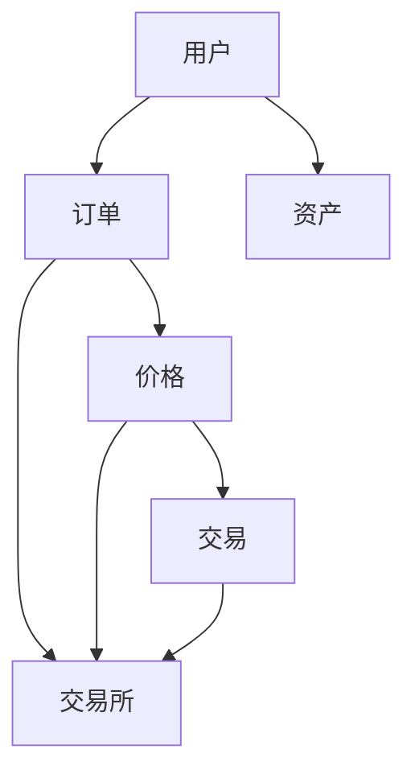
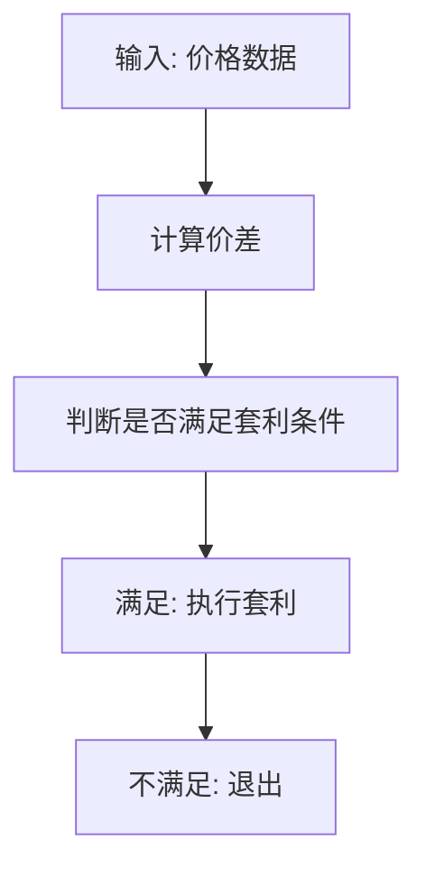
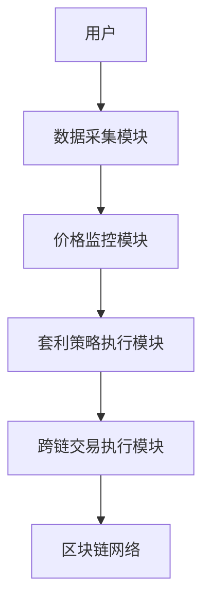

                 


# 如何构建基于特价股票的跨链套利系统

> 关键词：跨链套利、特价股票、分布式系统、区块链技术、数学优化算法、量化交易

> 摘要：本文详细讲解如何基于特价股票构建跨链套利系统，从问题背景、核心概念、算法原理、系统架构到项目实战，全面解析跨链套利的技术实现和数学优化方法，提供详细的代码实现和实际案例分析。

---

## 目录大纲

### 第一部分：背景介绍

#### 第1章：特价股票与跨链套利概述

##### 1.1 问题背景

- 1.1.1 传统股票交易的局限性
- 1.1.2 跨链技术的兴起
- 1.1.3 跨链套利的定义与特点

##### 1.2 问题描述

- 1.2.1 特价股票的市场特点
- 1.2.2 跨链套利的机会与挑战
- 1.2.3 现有系统的不足

##### 1.3 问题解决思路

- 1.3.1 跨链技术的应用场景
- 1.3.2 数学优化算法的作用
- 1.3.3 系统架构的设计原则

##### 1.4 边界与外延

- 1.4.1 跨链套利的边界条件
- 1.4.2 系统的可扩展性与限制
- 1.4.3 市场风险与法律合规

##### 1.5 概念结构与核心要素

- 1.5.1 核心概念术语说明
- 1.5.2 实体关系与依赖图
- 1.5.3 核心要素组成与相互作用

---

### 第二部分：核心概念与联系

#### 第2章：跨链套利的核心概念

##### 2.1 跨链技术原理

- 2.1.1 跨链通信机制
- 2.1.2 跨链交易的实现方式
- 2.1.3 跨链资产的互操作性

##### 2.2 套利机制解析

- 2.2.1 套利的基本原理
- 2.2.2 跨链套利的特殊性
- 2.2.3 套利机会的数学模型

##### 2.3 分布式系统的特点

- 2.3.1 分布式系统的定义与特点
- 2.3.2 跨链系统的复杂性
- 2.3.3 分布式系统中的共识机制

##### 2.4 核心概念对比表

| 概念       | 描述                                                                 |
|------------|----------------------------------------------------------------------|
| 跨链技术    | 跨链通信、互操作性、跨链资产转移                                         |
| 套利机制    | 利用价格差异进行无风险或低风险获利                                       |
| 分布式系统  | 分布式架构、去中心化、节点间通信                                         |

##### 2.5 实体关系图（Mermaid）



---

### 第三部分：算法原理讲解

#### 第3章：套利算法的数学优化

##### 3.1 算法原理概述

- 3.1.1 套利的基本数学模型
- 3.1.2 跨链套利的优化目标
- 3.1.3 算法的输入与输出

##### 3.2 数学模型与公式

- 3.2.1 套利收益最大化模型
- 3.2.2 言公式：$$ \text{收益} = \text{卖出价} - \text{买入价} $$
- 3.2.3 约束条件公式：$$ \text{卖出价} > \text{买入价} $$

##### 3.3 算法实现步骤（Mermaid）



##### 3.4 套利算法的Python实现

```python
def calculate_profit(buy_price, sell_price):
    return sell_price - buy_price

def cross_chain_arbitrage(price_data):
    for chain in price_data:
        for asset in chain.assets:
            buy_price = asset.buy_price
            sell_price = asset.sell_price
            if sell_price > buy_price:
                profit = calculate_profit(buy_price, sell_price)
                print(f"Detect arbitrage opportunity: Buy at {buy_price}, Sell at {sell_price}, Profit: {profit}")
    return

# 示例用法
price_data = [
    {"chain_id": 1, "assets": [{"asset_id": 1, "buy_price": 100, "sell_price": 110}]},
    {"chain_id": 2, "assets": [{"asset_id": 2, "buy_price": 90, "sell_price": 100}]}
]
cross_chain_arbitrage(price_data)
```

---

### 第四部分：系统分析与架构设计

#### 第4章：系统架构设计

##### 4.1 项目背景介绍

- 4.1.1 项目目标
- 4.1.2 项目范围
- 4.1.3 项目需求

##### 4.2 系统功能设计

- 4.2.1 数据采集模块
- 4.2.2 价格监控模块
- 4.2.3 套利策略执行模块
- 4.2.4 跨链交易执行模块

##### 4.3 系统架构图（Mermaid）



##### 4.4 接口设计与交互流程

- 4.4.1 API接口定义
- 4.4.2 模块之间的交互流程
- 4.4.3 接口实现细节

---

### 第五部分：项目实战

#### 第5章：跨链套利系统实现

##### 5.1 环境安装与配置

- 5.1.1 安装Python
- 5.1.2 安装区块链相关库
- 5.1.3 安装数据分析库

##### 5.2 核心功能实现

- 5.2.1 数据采集模块的实现
- 5.2.2 价格监控模块的实现
- 5.2.3 套利策略执行模块的实现
- 5.2.4 跨链交易执行模块的实现

##### 5.3 代码实现与解读

```python
class Asset:
    def __init__(self, buy_price, sell_price):
        self.buy_price = buy_price
        self.sell_price = sell_price

class CrossChainArbitrage:
    def __init__(self, assets):
        self.assets = assets

    def detect_arbitrage(self):
        for asset in self.assets:
            if asset.sell_price > asset.buy_price:
                print(f"Arbitrage detected: Buy at {asset.buy_price}, Sell at {asset.sell_price}")

# 示例用法
assets = [
    Asset(100, 110),
    Asset(90, 100)
]
arbitrage_system = CrossChainArbitrage(assets)
arbitrage_system.detect_arbitrage()
```

##### 5.4 实际案例分析

- 5.4.1 案例背景
- 5.4.2 数据分析
- 5.4.3 系统执行
- 5.4.4 结果解读

---

### 第六部分：最佳实践

#### 第6章：系统优化与注意事项

##### 6.1 系统优化建议

- 6.1.1 性能优化
- 6.1.2 安全性优化
- 6.1.3 可扩展性优化

##### 6.2 注意事项

- 6.2.1 市场风险
- 6.2.2 法律风险
- 6.2.3 技术风险

##### 6.3 小结与总结

- 6.3.1 项目总结
- 6.3.2 经验教训
- 6.3.3 未来展望

---

### 附录

#### 附录A：拓展阅读材料

- 推荐书籍
- 推荐论文
- 推荐在线资源

#### 附录B：术语表

- 术语解释

---

### 作者

作者：AI天才研究院/AI Genius Institute & 禅与计算机程序设计艺术 /Zen And The Art of Computer Programming

