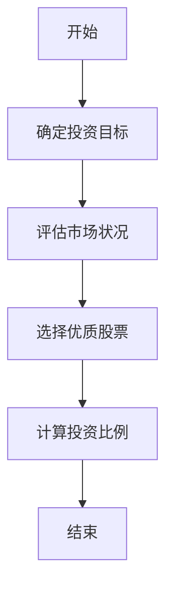

                 

# 如何构建格雷厄姆特价股票投资组合

## 关键词：格雷厄姆投资、价值投资、特价股票、投资组合、风险管理

## 摘要：本文将详细介绍如何利用格雷厄姆的价值投资理念构建特价股票投资组合。通过分析内在价值、安全边际和分散化原则，结合基本面和技术面分析，提供从理论到实践的全面指导，并强调风险管理的重要性。

---

# 第一部分: 格雷厄姆价值投资基础

## 第1章: 价值投资与格雷厄姆投资理念

### 1.1 价值投资的定义与核心理念

#### 1.1.1 价值投资的定义
价值投资是一种投资策略，强调以低于内在价值的价格购买优质资产。其核心在于寻找市场低估的股票，利用市场的非理性波动获利。

#### 1.1.2 格雷厄姆的价值投资理念
格雷厄姆的价值投资理念强调安全边际和分散投资。他建议投资者寻找那些市场价格远低于内在价值的股票，以确保投资的安全性。

#### 1.1.3 价值投资与投机的区别
价值投资注重长期稳健的增长，而投机则追求短期快速的收益。价值投资者更关注企业的基本面，而投机者则更关注市场情绪和短期波动。

### 1.2 格雷厄姆的投资策略

#### 1.2.1 格雷厄姆的投资方法
格雷厄姆的投资方法包括基本面分析、安全边际计算和分散化投资。他建议投资者通过分析企业的财务状况和市场估值来确定投资标的。

#### 1.2.2 安全边际的概念
安全边际是指股票的市场价格低于其内在价值的部分。通过计算安全边际，投资者可以确保在市场波动中获得超额收益。

#### 1.2.3 投资组合的分散化原则
分散化投资是降低风险的重要策略。格雷厄姆建议投资者将资金分配到多个行业中，以避免单一投资的风险。

### 1.3 特价股票的定义与特征

#### 1.3.1 什么是特价股票
特价股票是指市场价格远低于其内在价值的股票。这类股票通常被市场低估，具有较大的上涨潜力。

#### 1.3.2 特价股票的识别标准
识别特价股票的关键在于分析企业的基本面和市场估值。投资者需要计算股票的内在价值，并与市场价格进行比较。

#### 1.3.3 特价股票的投资价值
特价股票的投资价值体现在其较低的市场价格和较高的内在价值之间。通过投资特价股票，投资者可以在市场恢复时获得超额收益。

### 1.4 本章小结
本章介绍了格雷厄姆的价值投资理念、投资策略和特价股票的定义与特征。投资者需要通过基本面分析和市场估值来识别特价股票，并利用安全边际和分散化原则构建投资组合。

---

## 第2章: 格雷厄姆投资策略的核心算法

### 2.1 内在价值的计算公式

#### 2.1.1 内在价值的数学模型
内在价值可以通过未来现金流的现值计算得出。公式如下：
$$ V = \frac{E}{1 + r} $$
其中，V为内在价值，E为未来现金流，r为折现率。

#### 2.1.2 内在价值计算的公式
$$ V = \frac{E}{1 + r} $$
例如，如果未来现金流为100元，折现率为10%，则内在价值为：
$$ V = \frac{100}{1 + 0.1} = 90.91 $$

### 2.2 安全边际的计算方法

#### 2.2.1 安全边际的定义
安全边际是指股票的市场价格低于其内在价值的部分。计算公式为：
$$ \text{安全边际} = \text{内在价值} - \text{市场价格} $$

#### 2.2.2 安全边际的计算公式
$$ \text{安全边际} = \text{内在价值} - \text{市场价格} $$

### 2.3 投资组合优化的算法

#### 2.3.1 投资组合优化的数学模型
投资组合优化可以通过以下步骤进行：
1. 确定投资目标和风险偏好。
2. 评估各股票的内在价值和市场价格。
3. 计算各股票的安全边际。
4. 根据安全边际和分散化原则分配资金。

#### 2.3.2 投资组合优化的流程图

### 2.4 本章小结
本章详细讲解了内在价值和安全边际的计算方法，并通过流程图展示了投资组合优化的步骤。投资者可以通过这些方法识别特价股票，并构建风险可控的投资组合。

---

## 第3章: 股票基本面分析与财务报表解读

### 3.1 股票基本面分析的核心指标

#### 3.1.1 市盈率（P/E）
市盈率是衡量股票估值的重要指标，计算公式为：
$$ \text{市盈率} = \frac{\text{股价}}{\text{每股收益}} $$

#### 3.1.2 市净率（P/B）
市净率是衡量股票估值的另一个重要指标，计算公式为：
$$ \text{市净率} = \frac{\text{股价}}{\text{每股净资产}} $$

#### 3.1.3 股息率
股息率是衡量股票收益能力的指标，计算公式为：
$$ \text{股息率} = \frac{\text{股息支付额}}{\text{股价}} \times 100\% $$

### 3.2 财务报表分析

#### 3.2.1 利润表分析
利润表反映了企业的收入和支出情况，包括营业收入、营业成本、净利润等。

#### 3.2.2 资产负债表分析
资产负债表反映了企业的资产、负债和所有者权益情况，包括流动资产、固定资产、流动负债等。

#### 3.2.3 现金流量表分析
现金流量表反映了企业在一定时期内的现金流入和流出情况，包括经营活动、投资活动和筹资活动的现金流。

### 3.3 通过财务报表识别特价股票

#### 3.3.1 低市盈率股票
低市盈率股票通常意味着市场价格低于其内在价值，具有较大的上涨潜力。

#### 3.3.2 高股息率股票
高股息率股票通常意味着企业具有稳定的盈利能力和较高的分红能力，适合长期投资。

### 3.4 本章小结
本章通过分析股票基本面的核心指标和财务报表，帮助投资者识别具有投资价值的特价股票。

---

## 第4章: 格雷厄姆投资策略在实际中的应用

### 4.1 特价股票的筛选标准

#### 4.1.1 市场价格低于内在价值
这是筛选特价股票的核心标准，确保投资的安全性。

#### 4.1.2 具有较高的安全边际
安全边际越高，投资风险越小，潜在收益越大。

#### 4.1.3 行业分散化
通过分散投资不同行业的股票，降低整体投资组合的风险。

### 4.2 实际案例分析

#### 4.2.1 案例一：XYZ公司
XYZ公司的内在价值为100元，市场价格为80元，具有较高的安全边际。

#### 4.2.2 案例二：ABC公司
ABC公司的市盈率为10，低于行业平均水平，具有较大的上涨潜力。

### 4.3 投资组合的构建步骤

#### 4.3.1 确定投资目标
明确投资目标和风险偏好，制定投资计划。

#### 4.3.2 选择优质股票
根据格雷厄姆的投资策略，筛选具有较高安全边际的特价股票。

#### 4.3.3 分散化投资
将资金分配到多个行业中，降低投资风险。

### 4.4 本章小结
本章通过实际案例分析，展示了如何应用格雷厄姆的投资策略构建特价股票投资组合。

---

## 第5章: 风险管理与投资组合优化

### 5.1 风险管理的重要性

#### 5.1.1 投资风险的来源
市场波动、公司基本面变化、宏观经济环境等因素都可能影响投资组合的风险。

#### 5.1.2 风险管理的目标
通过分散化投资和风险控制，降低投资组合的整体风险。

### 5.2 投资组合优化的策略

#### 5.2.1 定期调整投资组合
根据市场变化和公司基本面，定期调整投资组合。

#### 5.2.2 保持安全边际
确保投资组合中每只股票的安全边际，降低投资风险。

### 5.3 本章小结
本章强调了风险管理的重要性，并提出了优化投资组合的具体策略。

---

## 第6章: 持续学习与投资优化

### 6.1 持续学习的重要性

#### 6.1.1 金融市场变化
金融市场变化无常，投资者需要不断学习新的知识和策略。

#### 6.1.2 全球经济趋势
全球经济趋势对投资组合的影响不可忽视，投资者需要关注宏观经济环境。

### 6.2 投资组合的持续优化

#### 6.2.1 定期评估投资组合
根据市场变化和公司基本面，定期评估投资组合的表现。

#### 6.2.2 优化投资策略
根据市场环境和个人风险偏好，不断优化投资策略。

### 6.3 本章小结
本章强调了持续学习和投资优化的重要性，帮助投资者在不断变化的市场中保持竞争优势。

---

## 第7章: 注意事项与拓展阅读

### 7.1 投资注意事项

#### 7.1.1 避免过度杠杆
过度杠杆会增加投资风险，影响投资组合的稳定性。

#### 7.1.2 避免情绪化投资
情绪化投资容易导致决策失误，投资者需要保持理性。

### 7.2 拓展阅读

#### 7.2.1 格雷厄姆的经典著作
《The Intelligent Investor》是格雷厄姆的代表作，值得投资者深入阅读。

#### 7.2.2 其他相关书籍
投资者可以阅读其他价值投资相关的书籍，如《The Art of Value Investing》。

### 7.3 本章小结
本章提醒投资者注意投资中的常见误区，并提供了拓展阅读的建议，帮助投资者进一步提升投资能力。

---

## 作者：AI天才研究院/AI Genius Institute & 禅与计算机程序设计艺术 /Zen And The Art of Computer Programming

---

**附录：进一步阅读与资源**

- 格雷厄姆的书籍推荐
- 免费投资工具和平台
- 投资组合管理软件

---

**致谢**

感谢读者的耐心阅读，希望本文能为构建格雷厄姆特价股票投资组合提供有价值的参考。

