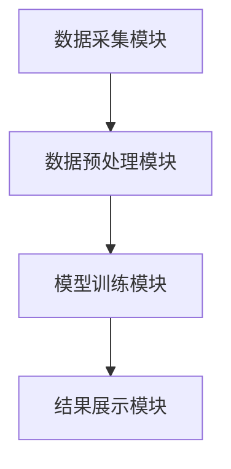
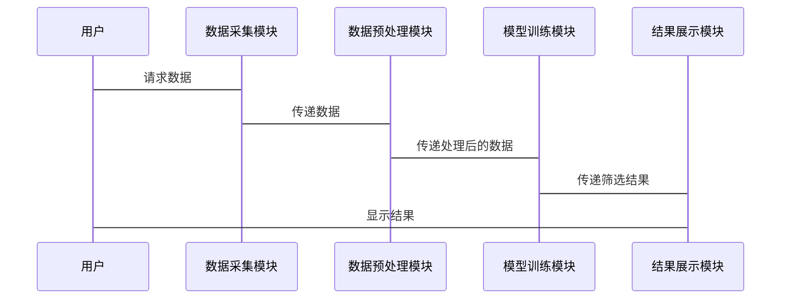

                 


# 如何构建高效的特价股票筛选模型

> 关键词：股票筛选模型，机器学习，数据特征，算法原理，系统架构，项目实战

> 摘要：本文将详细探讨如何构建一个高效的特价股票筛选模型。从背景介绍到核心概念，从算法原理到系统架构，再到项目实战和最佳实践，全面解析如何利用机器学习和数据分析技术，高效筛选出具有投资价值的特价股票。

---

## 第一部分: 特价股票筛选模型的背景与核心概念

### 第1章: 特价股票筛选模型的背景介绍

#### 1.1 特价股票的概念与重要性
##### 1.1.1 特价股票的定义
特价股票是指价格低于其内在价值，具有投资潜力的股票。这类股票通常被市场低估，具有较高的上涨空间。

##### 1.1.2 特价股票在投资中的作用
- 提供高回报的机会
- 分散投资风险
- 适合长期投资策略

##### 1.1.3 特价股票筛选的必要性
- 市场波动性高，需要科学的方法筛选股票
- 数据驱动的筛选方法更高效
- 帮助投资者做出理性决策

#### 1.2 特价股票筛选模型的背景
##### 1.2.1 传统股票筛选方法的局限性
- 主观性强，依赖个人经验
- 策略固定，难以适应市场变化
- 数据量有限，难以覆盖全市场

##### 1.2.2 数据驱动的筛选方法的兴起
- 数据量爆炸式增长
- 计算能力提升，支持复杂模型
- 算法优化，提高筛选效率

##### 1.2.3 机器学习在股票筛选中的应用
- 利用历史数据预测未来趋势
- 通过特征工程提取关键指标
- 使用分类算法筛选优质股票

### 第2章: 特价股票筛选模型的核心概念

#### 2.1 数据特征分析
##### 2.1.1 市盈率（P/E Ratio）
公式：$$ P/E = \frac{\text{股价}}{\text{每股净利润}} $$
低市盈率通常意味着股票被低估。

##### 2.1.2 市净率（P/B Ratio）
公式：$$ P/B = \frac{\text{股价}}{\text{每股净资产}} $$
市净率低的股票可能具有投资价值。

##### 2.1.3 股息率（Dividend Yield）
公式：$$ \text{股息率} = \frac{\text{每股股息}}{\text{股价}} \times 100\% $$
高股息率的股票适合长期投资。

##### 2.1.4 其他相关指标
- 市销率（P/S Ratio）
- 净利润增长率
- 营业利润率

#### 2.2 算法选择与模型构建
##### 2.2.1 线性回归模型
- 用于预测股票价格
- 假设变量间存在线性关系
- 适合趋势分析

##### 2.2.2 支持向量机（SVM）
- 用于分类问题
- 特别适用于高维数据
- 通过核函数处理非线性关系

##### 2.2.3 随机森林（Random Forest）
- 一种集成学习算法
- 能够处理缺失值和非线性关系
- 适合特征重要性分析

##### 2.2.4 神经网络（Neural Networks）
- 适用于复杂非线性关系
- 需要大量数据训练
- 适合时间序列分析

#### 2.3 模型评价与优化
##### 2.3.1 准确率、召回率、F1值
- 准确率：正确预测的比例
- 召回率：实际为正且被正确预测的比例
- F1值：平衡准确率和召回率的指标

##### 2.3.2 交叉验证与过拟合问题
- 交叉验证：通过多次训练和验证评估模型性能
- 过拟合：模型在训练数据上表现好，但在测试数据上表现差
- 解决方法：减少模型复杂度、增加数据量

##### 2.3.3 调参与优化策略
- 参数调优：如学习率、树的深度等
- 正则化：L1/L2正则化减少过拟合
- 增加数据多样性

---

## 第二部分: 特价股票筛选模型的算法原理

### 第3章: 线性回归算法

#### 3.1 线性回归的基本原理
- 假设因变量与自变量之间存在线性关系
- 最小化预测值与实际值的平方差之和

#### 3.2 普通最小二乘法（OLS）
公式：$$ \text{最小化} \sum_{i=1}^{n} (y_i - \hat{y}_i)^2 $$
其中，$$ \hat{y}_i = \beta_0 + \beta_1x_i $$

#### 3.3 线性回归的数学公式
$$ y = \beta_0 + \beta_1x + \epsilon $$
其中，$\epsilon$ 是误差项。

### 第4章: 随机森林算法

#### 4.1 随机森林的基本原理
- 通过随机采样构建多棵决策树
- 通过投票机制进行结果预测

#### 4.2 树的构建与投票机制
- 每棵树独立训练
- 预测结果取各树的平均值或多数投票

#### 4.3 随机森林的数学公式
$$ y = \sum_{i=1}^{n} \text{Tree}_i(x) $$

### 第5章: 支持向量机（SVM）

#### 5.1 SVM的基本原理
- 寻找一个超平面，最大化类别间隔
- 使用核函数处理非线性数据

#### 5.2 核函数与非线性分类
- 线性核：处理线性可分数据
- 多项式核：处理高阶多项式关系
- RBF核：处理非线性数据

#### 5.3 SVM的数学公式
- 最小化：$$ \frac{1}{2} \|\mathbf{w}\|^2 + C \sum_{i=1}^{n} \xi_i $$
- 约束条件：$$ y_i (\mathbf{w} \cdot \mathbf{x}_i + b) \geq 1 - \xi_i $$
- $$ \xi_i \geq 0 $$

---

## 第三部分: 特价股票筛选模型的系统分析与架构设计

### 第6章: 系统功能设计

#### 6.1 数据采集模块
- 数据来源：股票市场数据接口、API
- 数据类型：开盘价、收盘价、最高价、最低价、成交量等

#### 6.2 数据预处理模块
- 数据清洗：处理缺失值、异常值
- 标准化/归一化：统一数据尺度
- 特征提取：从原始数据中提取有用特征

#### 6.3 模型训练模块
- 特征选择：筛选重要特征
- 模型训练：使用机器学习算法训练模型
- 模型评估：通过交叉验证评估模型性能

#### 6.4 结果展示模块
- 可视化展示：图表展示筛选结果
- 报告生成：生成投资建议报告
- 实时监控：监控股票实时价格和模型表现

### 第7章: 系统架构设计

#### 7.1 系统架构图


#### 7.2 接口设计
- 数据接口：与数据源对接
- API接口：提供筛选结果查询

#### 7.3 系统交互流程


---

## 第四部分: 特价股票筛选模型的项目实战

### 第8章: 环境安装与数据准备

#### 8.1 环境安装
- 安装Python：```bash
  python --version
  ```
- 安装必要的库：```bash
  pip install numpy pandas scikit-learn matplotlib
  ```

#### 8.2 数据准备
- 数据来源：股票数据API（如Yahoo Finance）
- 数据格式：CSV或Excel文件
- 数据清洗：处理缺失值、异常值

### 第9章: 模型实现与优化

#### 9.1 线性回归模型实现
```python
from sklearn.linear_model import LinearRegression
import numpy as np
import pandas as pd

# 数据准备
X = df[['市盈率', '市净率']]
y = df['股价']

# 模型训练
model = LinearRegression()
model.fit(X, y)

# 预测
y_pred = model.predict(X)
```

#### 9.2 随机森林模型实现
```python
from sklearn.ensemble import RandomForestClassifier

# 数据准备
X = df.drop('目标变量', axis=1)
y = df['目标变量']

# 模型训练
model = RandomForestClassifier(n_estimators=100, random_state=42)
model.fit(X, y)

# 特征重要性分析
importances = model.feature_importances_
```

#### 9.3 模型调优
- 调参：网格搜索（Grid Search）
- 正则化：L1/L2正则化
- 数据增强：增加更多特征或数据样本

### 第10章: 实际案例分析

#### 10.1 数据分析与预处理
- 数据可视化：使用Matplotlib或Seaborn绘制相关图表
- 数据标准化：对特征进行标准化处理
- 特征选择：使用特征重要性分析选择关键特征

#### 10.2 模型训练与评估
- 训练集与测试集划分
- 模型评估：准确率、召回率、F1值
- 模型优化：调整参数，提高性能

#### 10.3 模型部署与应用
- 将模型部署到生产环境
- 提供API接口，供其他系统调用
- 实时监控模型性能，及时调整

---

## 第五部分: 最佳实践与小结

### 第11章: 最佳实践

#### 11.1 数据处理
- 保持数据更新，定期重新训练模型
- 处理缺失值时，采用合理的方法（如均值、中位数）
- 数据清洗时，注意异常值的影响

#### 11.2 模型选择
- 根据数据特性选择合适的算法
- 线性回归适合趋势预测
- 随机森林适合特征重要性分析
- SVM适合小样本、高维数据

#### 11.3 模型部署
- 定期评估模型性能，更新模型
- 部署到云平台，提供API服务
- 监控模型表现，及时调整

### 第12章: 小结

通过本文的详细讲解，读者可以系统地了解如何构建高效的特价股票筛选模型。从背景介绍到算法实现，从系统设计到项目实战，每一步都进行了详细的阐述。希望本文能够为投资者和数据科学家提供有价值的参考，帮助他们在股票投资领域取得更好的成绩。

---

## 作者信息

作者：AI天才研究院/AI Genius Institute & 禅与计算机程序设计艺术 /Zen And The Art of Computer Programming

---

本文通过系统地介绍特价股票筛选模型的构建过程，结合理论与实践，为读者提供了从数据采集、特征工程、算法选择到模型部署的完整流程。希望本文能够为投资者和数据科学家提供有价值的参考，帮助他们在股票投资领域取得更好的成绩。

