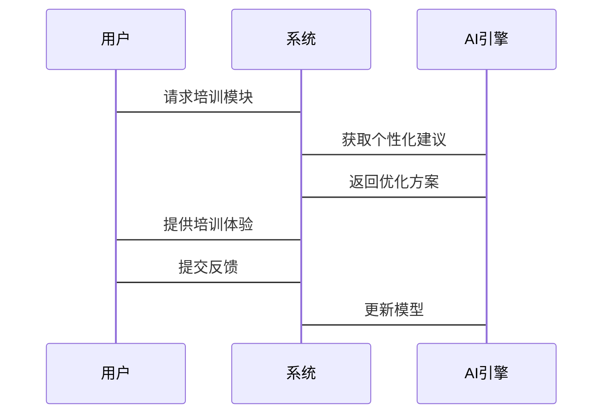

                 


# 如何评估企业的AI驱动的虚拟现实培训系统

> 关键词：企业培训系统，AI技术，虚拟现实，系统评估，技术实现，性能优化

> 摘要：本文将深入探讨如何评估企业中AI驱动的虚拟现实培训系统的有效性。通过分析系统的组成部分、核心算法及其在虚拟现实环境中的应用，结合实际案例，提供一套系统的评估方法和最佳实践。本文旨在帮助企业技术决策者和开发人员更好地理解和优化其AI驱动的VR培训系统。

---

## 第一部分：背景与核心概念

### 第1章：AI驱动的虚拟现实培训系统概述

#### 1.1 问题背景与描述
企业培训系统是提升员工技能和企业竞争力的关键工具。然而，传统的培训方式存在以下局限性：
- **成本高昂**：面对面培训需要大量的人力和时间。
- **灵活性不足**：难以满足不同员工的个性化需求。
- **效果受限**：难以评估和优化培训效果。

AI驱动的虚拟现实（AI-VR）培训系统通过结合人工智能和虚拟现实技术，能够提供实时反馈、个性化学习路径和沉浸式体验，显著提升了培训的效果和效率。

#### 1.2 核心概念与定义
- **虚拟现实（VR）技术**：通过计算机生成的模拟环境，提供沉浸式的体验。
- **人工智能（AI）技术**：利用机器学习算法分析数据、识别模式并做出决策。
- **AI驱动的虚拟现实培训系统**：结合AI和VR技术，实现智能化的培训体验。

#### 1.3 核心要素与概念结构
通过以下ER实体关系图，我们可以清晰地看到系统的组成模块及其关系：

```mermaid
erDiagram
    actor 员工{}{
        id : int
        name : string
        role : string
    }
    actor 管理员{}{
        id : int
        username : string
        password : string
    }
    class 系统{}{
        id : int
        name : string
        version : string
    }
    class 培训模块{}{
        id : int
        module_name : string
        difficulty : int
    }
    class 用户反馈{}{
        id : int
        feedback_score : int
        timestamp : datetime
    }
    员工 --> 管理员 : "管理"
    员工 --> 系统 : "使用"
    管理员 --> 系统 : "配置"
    系统 --> 培训模块 : "包含"
    培训模块 --> 用户反馈 : "生成"
```

---

## 第二部分：AI与虚拟现实的核心原理

### 第2章：AI技术的核心原理

#### 2.1 支持向量机（SVM）算法
- **算法原理**：SVM通过找到一个超平面，将数据点分成两类。如果数据不可分割，可以通过松弛约束引入软间隔。
- **数学模型**：目标是最小化权重的平方和，同时满足约束条件。

$$ \text{目标函数：} \quad \min_{w,b,\xi} \frac{1}{2}||w||^2 + C\sum_{i=1}^n \xi_i $$
$$ \text{约束条件：} \quad y_i(w \cdot x_i + b) \geq 1 - \xi_i $$
$$ \xi_i \geq 0 $$

- **应用实例**：在VR培训中，SVM可以用于识别用户的特定行为模式。

#### 2.2 神经网络（NN）算法
- **算法原理**：神经网络通过多层结构近似非线性函数，能够处理复杂的模式识别任务。
- **训练过程**：包括前向传播和反向传播，使用梯度下降优化权重。

- **应用实例**：在VR培训中，NN可以用于语音识别和实时交互优化。

---

### 第3章：虚拟现实技术的核心原理

#### 3.1 VR设备与交互技术
- **头显设备**：如Oculus Rift、HTC Vive等，提供沉浸式体验。
- **交互技术**：如手势识别、眼球追踪等，增强用户体验。

#### 3.2 3D建模与渲染技术
- **建模工具**：如Blender、Maya等，用于创建虚拟场景。
- **渲染技术**：如光线追踪，提升画面质量。

#### 3.3 实时渲染与物理模拟
- **渲染引擎**：如Unreal Engine、Unity，提供高效的实时渲染。
- **物理模拟**：模拟真实世界的物理规律，增强沉浸感。

---

## 第三部分：系统分析与架构设计

### 第3章：系统功能设计

#### 3.1 领域模型设计
通过以下类图，我们可以看到系统的组成模块及其关系：

```mermaid
classDiagram
    class 系统{}{
        id : int
        name : string
        version : string
    }
    class 培训模块{}{
        id : int
        module_name : string
        difficulty : int
    }
    class 用户{}{
        id : int
        name : string
        role : string
    }
    class 用户反馈{}{
        id : int
        feedback_score : int
        timestamp : datetime
    }
    系统 --> 培训模块 : "包含"
    用户 --> 系统 : "使用"
    培训模块 --> 用户反馈 : "生成"
```

#### 3.2 系统架构设计
以下是系统的整体架构图：


#### 3.3 接口设计与交互流程
以下是系统的交互流程图：



---

## 第四部分：项目实战

### 第4章：环境安装与系统实现

#### 4.1 环境安装
- **操作系统**：建议使用Windows 10或更高版本。
- **开发工具**：安装Unity或Unreal Engine。
- **AI库**：安装Scikit-learn、TensorFlow等库。

#### 4.2 核心代码实现

以下是基于SVM的用户行为识别代码示例：

```python
from sklearn import svm
import numpy as np

# 示例数据集
X = np.array([[1, 2], [3, 4], [5, 6], [7, 8]])
y = np.array([0, 1, 0, 1])

# 创建SVM模型
model = svm.SVC(kernel='linear')

# 训练模型
model.fit(X, y)

# 预测新样本
print(model.predict([[9, 10]]))
```

---

## 第五部分：总结与展望

### 第5章：总结与最佳实践

#### 5.1 总结
AI驱动的虚拟现实培训系统通过结合AI和VR技术，显著提升了企业培训的效果和效率。本文从系统架构、算法原理、项目实现等多个方面进行了详细探讨。

#### 5.2 最佳实践
- **数据质量**：确保数据的多样性和代表性。
- **模型优化**：定期更新和优化AI模型。
- **用户体验**：注重VR体验的沉浸感和交互性。

#### 5.3 展望
随着AI和VR技术的不断发展，未来的AI-VR培训系统将更加智能化和个性化，为企业培训带来更多的可能性。

---

## 作者

作者：AI天才研究院/AI Genius Institute & 禅与计算机程序设计艺术/Zen And The Art of Computer Programming

---

通过本文，读者可以全面了解如何评估和优化企业的AI驱动的虚拟现实培训系统，为企业技术决策者和开发人员提供有价值的参考。

