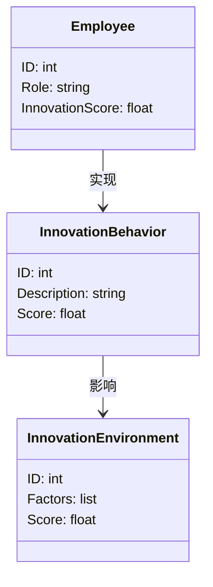
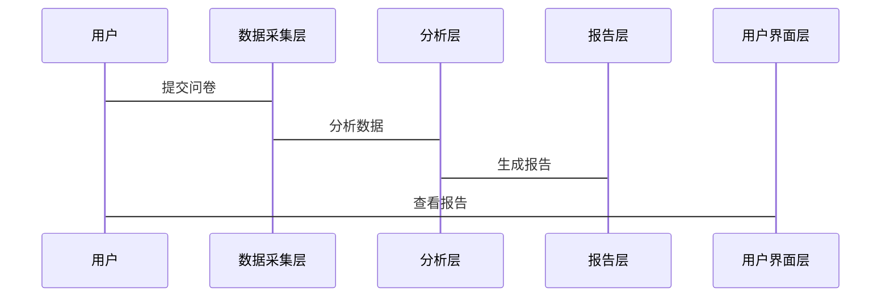

                 


# 如何评估企业的创新文化

---

## 关键词：企业创新文化、文化评估、创新管理、评估方法、创新工具、文化系统架构

---

## 摘要

企业创新文化是企业持续发展和竞争力的关键因素。本文系统地探讨了如何评估企业的创新文化，从核心概念、评估维度、方法论到工具应用，再到系统架构和项目实战，层层深入，为企业管理者提供实用的评估框架和策略。通过结合理论与实践，本文旨在帮助企业识别和优化其创新文化，以应对快速变化的商业环境。

---

# 第1章: 企业创新文化概述

## 1.1 创新文化的核心概念

### 1.1.1 什么是创新文化

创新文化是指企业在组织内部鼓励创新思维、开放协作和持续改进的文化氛围。它强调员工的创造力、冒险精神和对变革的适应能力。

### 1.1.2 创新文化与企业绩效的关系

创新文化直接影响企业的创新能力和市场竞争力。研究表明，具有强大创新文化的组织能够更快地响应市场变化，推出新产品和服务，从而在竞争中占据优势。

### 1.1.3 创新文化的核心要素

创新文化的三大核心要素包括：

1. **创新意识**：员工对创新的积极态度和主动思考。
2. **创新能力**：员工解决复杂问题和创造新价值的能力。
3. **创新环境**：支持创新的组织结构、政策和资源。

---

## 1.2 企业创新文化评估的背景与意义

### 1.2.1 当前企业面临的创新挑战

随着市场竞争的加剧和技术的快速迭代，企业必须不断优化其创新文化，以保持竞争优势。然而，许多企业在创新过程中面临资源分配不当、员工激励不足和文化冲突等问题。

### 1.2.2 创新文化评估的重要性

创新文化评估是企业优化创新管理的基础。通过评估，企业可以识别文化中的薄弱环节，并采取针对性措施，如优化激励机制、加强协作和引入新技术。

### 1.2.3 评估创新文化对企业发展的价值

评估创新文化有助于企业：

1. **提升创新效率**：通过优化资源配置和流程。
2. **增强员工凝聚力**：促进团队协作和知识共享。
3. **提升市场竞争力**：通过持续创新满足客户需求。

---

## 1.3 本章小结

本章介绍了创新文化的核心概念、评估的背景与意义，强调了创新文化对企业绩效的重要性。下一章将深入探讨创新文化的核心要素及其相互关系。

---

# 第2章: 创新文化的核心要素与关系

## 2.1 创新文化的核心要素

### 2.1.1 创新意识与思维方式

创新意识是创新文化的基石。员工需要具备开放的思维方式，能够跳出常规思考问题。

### 2.1.2 创新能力与技术实力

创新能力不仅包括解决问题的能力，还包括技术实力的支持。例如，技术娴熟的团队更容易实现创新。

### 2.1.3 创新环境与组织结构

创新环境包括组织结构、政策和资源支持。例如，扁平化的组织结构更有利于信息流通和创新。

---

## 2.2 核心要素之间的关系

### 2.2.1 创新意识与创新能力的关系

创新意识是创新能力的基础，而创新能力是创新意识的体现。两者相辅相成，共同推动创新。

### 2.2.2 创新能力与创新环境的关系

良好的创新环境能够激发员工的创新能力，而强大的创新能力又需要依赖创新环境的支持。

### 2.2.3 创新环境与创新意识的关系

创新环境影响员工的创新意识。例如，鼓励冒险和包容失败的企业文化能够提升员工的创新意识。

---

## 2.3 创新文化的整体架构

### 2.3.1 创新文化的系统性分析

创新文化是一个复杂的系统，包括员工、组织结构、技术和外部环境等多个方面。

### 2.3.2 创新文化的核心要素与外部环境的交互

外部环境如市场需求和技术趋势会直接影响创新文化的核心要素。例如，市场需求增加会推动企业加强创新能力。

### 2.3.3 创新文化评估的边界与外延

创新文化评估的边界包括企业内部和外部环境，而外延则涉及创新成果的应用和影响。

---

## 2.4 本章小结

本章分析了创新文化的核心要素及其相互关系，构建了创新文化的系统架构。下一章将探讨创新文化评估的理论框架。

---

# 第3章: 企业创新文化评估的理论框架

## 3.1 创新文化评估的理论基础

### 3.1.1 创新管理理论的发展历程

创新管理理论从早期的线性模型发展到现代的系统化方法，强调创新文化的系统性和动态性。

### 3.1.2 创新文化评估的理论模型

基于创新管理理论，提出了创新文化评估的模型，包括创新意识、能力和环境三个维度。

### 3.1.3 相关理论对评估方法的启示

资源基础观点（RBV）强调企业内部资源的重要性，启示创新文化评估应关注企业内部资源的优化配置。

---

## 3.2 创新文化评估的核心维度

### 3.2.1 创新意识与态度

通过员工调查和访谈，评估员工对创新的态度和积极性。

### 3.2.2 创新行为与实践

通过观察员工的行为和实际创新成果，评估创新行为的频率和效果。

### 3.2.3 创新环境与支持系统

评估企业的组织结构、政策和资源支持，确保创新环境的优化。

---

## 3.3 创新文化评估的指标体系

### 3.3.1 指标体系的设计原则

指标应具有可操作性、可测量性和代表性。

### 3.3.2 核心指标的定义与解释

核心指标包括创新意识强度、创新能力水平和创新环境质量。

### 3.3.3 指标之间的关联性分析

通过数据分析，揭示各指标之间的相互作用和影响。

---

## 3.4 本章小结

本章构建了创新文化评估的理论框架和指标体系，为后续评估方法的制定奠定了基础。

---

# 第4章: 企业创新文化评估的方法论

## 4.1 定性评估方法

### 4.1.1 文化调研与访谈法

通过深度访谈和焦点小组，了解员工对创新文化的看法和建议。

### 4.1.2 文化观察与行为分析

观察员工的行为和项目执行情况，分析创新文化的实际表现。

### 4.1.3 文化比较与标杆分析

将企业的创新文化与行业标杆进行比较，找出差距和改进方向。

---

## 4.2 定量评估方法

### 4.2.1 问卷调查法

设计结构化问卷，收集大量数据，进行统计分析。

### 4.2.2 数据分析法

利用大数据技术，分析员工创新行为和成果的数据。

### 4.2.3 绩效评估法

将创新成果与企业绩效指标相结合，评估创新文化的效果。

---

## 4.3 混合评估方法

### 4.3.1 定性与定量结合的评估策略

结合定性分析和定量分析，全面评估创新文化。

### 4.3.2 混合评估的优势与挑战

优势在于全面性和准确性，挑战在于数据整合和分析的复杂性。

### 4.3.3 混合评估的实际应用案例

通过某企业的实际案例，展示混合评估方法的应用效果。

---

## 4.4 本章小结

本章介绍了创新文化评估的多种方法，强调根据企业实际情况选择合适的评估策略。

---

# 第5章: 企业创新文化评估的工具与技术

## 5.1 创新文化评估的主要工具

### 5.1.1 问卷调查工具

推荐使用标准化问卷，如Cultural Assessment Survey（CAS），并提供工具代码示例。

```python
# 示例代码：生成问卷调查报告
import pandas as pd

def generate_survey_report(survey_data):
    report = pd.DataFrame(survey_data)
    return report.describe()

# 示例数据：员工创新意识得分
survey_data = {'Innovation Awareness': [4.5, 3.8, 5.2, 4.1]}
print(generate_survey_report(survey_data))
```

### 5.1.2 文化评估框架

使用系统化的评估框架，如创新文化评估模型（ICE Model），进行结构化分析。

### 5.1.3 数据分析工具

利用SPSS或R等工具进行数据分析，提取关键指标。

---

## 5.2 创新文化评估的技术方法

### 5.2.1 数据挖掘技术

通过数据挖掘技术，识别创新文化中的关键影响因素。

```python
# 示例代码：使用数据挖掘技术分析创新行为
from sklearn.cluster import KMeans

data = {'Innovation Behaviors': [1, 2, 3, 4, 5]}
model = KMeans(n_clusters=2).fit(data['Innovation Behaviors'].values.reshape(-1,1))
print('聚类结果:', model.labels_)
```

### 5.2.2 文本分析技术

通过文本分析技术，挖掘员工反馈中的关键词和情感倾向。

```python
# 示例代码：使用文本分析技术评估员工反馈
from textblob import TextBlob

feedback = "Our team lacks the resources to innovate effectively."
blob = TextBlob(feedback)
print('情感分析结果:', blob.polarity)
```

### 5.2.3 绩效评估法

结合企业绩效指标，评估创新文化的实际效果。

---

## 5.3 本章小结

本章介绍了创新文化评估的主要工具和技术方法，展示了如何通过技术手段提升评估的准确性和效率。

---

# 第6章: 企业创新文化评估的系统架构与设计

## 6.1 问题场景介绍

通过一个假设的企业案例，展示创新文化评估的系统架构设计。

---

## 6.2 系统功能设计

### 6.2.1 领域模型（Mermaid 类图）



---

## 6.3 系统架构设计

### 6.3.1 系统架构设计（Mermaid 架构图）


---

## 6.4 系统接口设计

### 6.4.1 API 设计

使用RESTful API，定义数据接口和分析接口，确保系统模块之间的通信。

---

## 6.5 系统交互设计

### 6.5.1 系统交互设计（Mermaid 序列图）



---

## 6.6 本章小结

本章从系统架构的角度，详细设计了创新文化评估的实现方案，包括功能设计、架构设计和接口设计。

---

# 第7章: 企业创新文化评估的项目实战

## 7.1 项目背景

通过一个具体企业案例，展示如何应用创新文化评估的方法。

---

## 7.2 环境安装

指导读者安装必要的工具和环境，例如Python、Jupyter Notebook等。

---

## 7.3 核心实现源代码

### 7.3.1 数据处理代码

```python
# 示例代码：数据预处理
import pandas as pd

data = pd.read_csv('innovation_survey.csv')
print(data.head())
```

### 7.3.2 数据分析代码

```python
# 示例代码：计算创新意识得分
data['InnovationScore'] = data['InnovationAwareness'] + data['InnovationBehavior']
print(data['InnovationScore'].describe())
```

---

## 7.4 代码应用解读与分析

详细解释代码的功能和实现逻辑，帮助读者理解如何应用这些代码进行创新文化评估。

---

## 7.5 案例分析和详细讲解剖析

通过具体案例，展示如何分析评估结果并提出改进建议。

---

## 7.6 项目小结

总结项目实施的关键步骤和成果，强调创新文化评估的实际应用价值。

---

# 第8章: 结论与建议

## 8.1 结论

总结全文，强调创新文化评估的重要性及其对企业发展的积极影响。

## 8.2 最佳实践 Tips

提供实用的建议，例如：

1. **定期评估**：每年至少进行一次创新文化评估。
2. **领导参与**：高层管理者应积极参与评估过程。
3. **结果应用**：将评估结果与绩效考核相结合。

## 8.3 小结

通过系统化的创新文化评估，企业可以有效优化其创新管理，提升市场竞争力。

---

## 作者

作者：AI天才研究院/AI Genius Institute & 禅与计算机程序设计艺术 /Zen And The Art of Computer Programming

---

希望这篇文章能够满足用户的需求，提供有价值的内容和方法，帮助企业有效评估和优化其创新文化。

