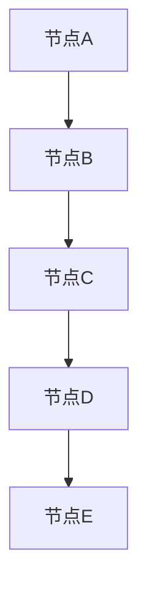
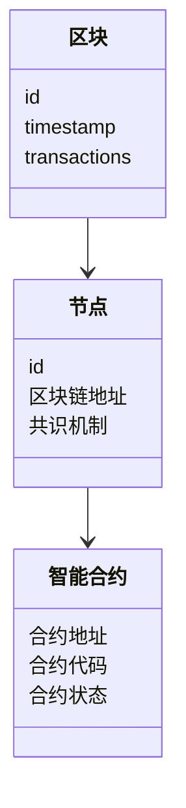
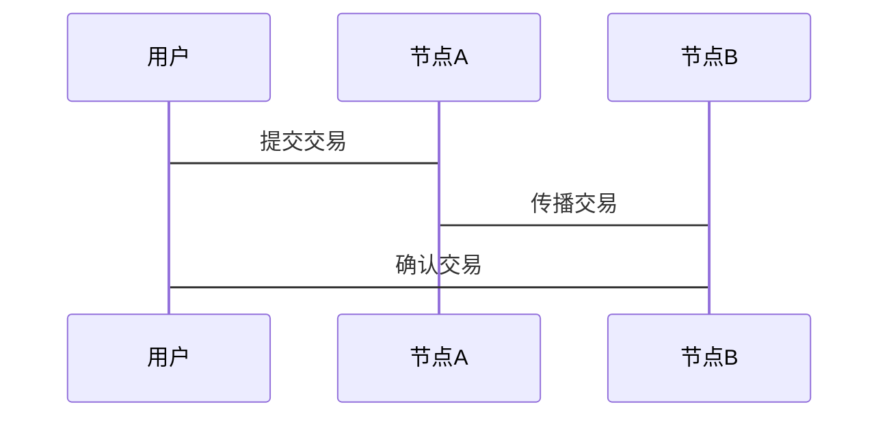

                 


# 如何评估企业的区块链应用能力

## 关键词：区块链、企业应用能力、技术评估、系统架构、智能合约、共识机制

## 摘要：  
区块链技术正在迅速改变企业应用的格局。评估企业的区块链应用能力不仅需要理解技术本身的复杂性，还需要结合企业的实际业务需求和应用场景。本文将从区块链的核心概念、算法原理、系统架构设计、项目实战以及最佳实践等多个维度，详细分析如何全面评估企业的区块链应用能力。

---

## 第1章：区块链技术概述

### 1.1 区块链的基本概念

区块链是一种分布式账本技术，通过去中心化的方式记录数据，并通过加密算法确保数据的安全性和不可篡改性。其核心特点包括去中心化、不可篡改、透明性和高安全性。

#### 1.1.1 区块链的定义与特点

- **定义**：区块链是一种通过分布式节点共同维护的数据库技术，数据通过区块按顺序相连，并通过加密算法确保数据的完整性和安全性。
- **特点**：
  - **去中心化**：数据不依赖于单一中心节点，由多个节点共同维护。
  - **不可篡改**：数据一旦写入区块链，难以被修改或删除。
  - **透明性**：区块链上的数据对所有参与者公开，增加信任。
  - **高安全性**：通过加密算法和共识机制，防止数据被恶意篡改。

#### 1.1.2 区块链的技术特点

- **分布式账本**：数据分布在多个节点上，确保数据的高可用性和冗余性。
- **共识机制**：通过特定算法（如PoW、PoS、BFT等）达成数据一致。
- **智能合约**：基于区块链的自动化执行逻辑，简化业务流程。

#### 1.1.3 区块链与传统技术的对比

- **传统数据库**：依赖中心化服务器，数据容易被篡改。
- **区块链**：去中心化，数据安全性高，适合需要高信任度的场景。

---

## 第2章：区块链的核心概念与联系

### 2.1 区块链的核心要素

- **区块**：区块链的基本数据单位，包含数据、时间戳和哈希值。
- **链**：由多个区块按顺序链接而成的结构，确保数据的连续性和不可篡改性。
- **共识机制**：确保所有节点达成一致的算法。

#### 2.1.1 区块链的核心要素对比

| 核心要素 | 描述 | 示例 |
|----------|------|------|
| 区块     | 数据存储的基本单位 | 存储交易记录、智能合约状态 |
| 链       | 区块按顺序连接的结构 | 从创世区块开始，每个新区块连接到前一个区块 |
| 共识机制 | 确保数据一致性的算法 | PoW、PoS、BFT |

#### 2.2 区块链的ER实体关系图

```mermaid
er
    entity 区块 {
        id
        timestamp
        transactions
    }
    entity 节点 {
        id
        区块链地址
        共识机制
    }
    entity 智能合约 {
        合约地址
        合约代码
        合约状态
    }
    区块块 --> 区块链地址
    节点 --> 区块链地址
    区块块 --> 智能合约
```

---

## 第3章：共识机制的算法原理

### 3.1 共识机制的类型

- **工作量证明（PoW）**：通过计算哈希值来证明工作量，常见于比特币。
- **权益证明（PoS）**：通过持有代币的数量来决定记账权，常见于以太坊。
- **拜占庭容错（BFT）**：适用于小规模网络，快速达成共识。

#### 3.2 工作量证明（PoW）算法



**代码实现**：
```python
def compute_hash(target):
    # 计算哈希值
    import hashlib
    hash_object = hashlib.sha256(target.encode()).hexdigest()
    return hash_object
```

**数学模型**：
$$ H = f(target) $$

**示例**：
$$ H = compute\_hash("区块数据") $$

---

## 第4章：智能合约的原理与应用

### 4.1 智能合约的原理

智能合约是基于区块链的自动化执行逻辑，通过预设的代码实现特定的业务逻辑。

#### 4.2 智能合约的功能对比

| 功能 | 描述 |
|------|------|
| 合约地址 | 智能合约的唯一标识 |
| 合约代码 | 智能合约的源代码 |
| 合约状态 | 智能合约的运行状态 |

**示例**：
$$ 合约代码：当交易金额 >= 100时，执行转账 $$

---

## 第5章：企业区块链应用能力评估模型

### 5.1 评估指标体系

- **技术能力**：企业的技术团队是否具备区块链开发能力。
- **业务需求**：企业是否需要区块链技术来解决业务问题。
- **数据安全**：企业对数据安全和隐私保护的需求。

#### 5.2 评估方法

- **技术评估**：检查企业的技术团队和开发能力。
- **业务分析**：评估企业是否适合区块链技术。
- **安全审计**：确保数据安全和隐私保护。

---

## 第6章：区块链系统架构设计

### 6.1 系统架构设计

#### 6.2 系统功能设计

- **节点管理**：管理区块链节点。
- **数据存储**：存储区块数据和交易记录。
- **智能合约**：实现业务逻辑的自动化执行。

**类图**：


---

## 第7章：项目实战

### 7.1 环境安装

- **安装以太坊**：使用Geth或Nethermind节点。
- **安装Solidity**：编写智能合约的编程语言。

#### 7.2 核心代码实现

```python
# 智能合约代码示例
def transfer(from_address, to_address, amount):
    if amount > 0:
        # 执行转账操作
        pass
```

**序列图**：


---

## 第8章：最佳实践与注意事项

### 8.1 最佳实践

- **选择合适的共识机制**：根据企业需求选择PoW、PoS或BFT。
- **确保数据安全**：加密敏感数据，保护隐私。
- **监控系统性能**：定期检查节点状态和网络性能。

#### 8.2 注意事项

- **性能优化**：避免过多的智能合约调用，影响系统性能。
- **法律合规**：确保区块链应用符合相关法律法规。

---

## 作者：AI天才研究院 & 禅与计算机程序设计艺术

通过本文的详细分析，读者可以全面了解如何评估企业的区块链应用能力，并在实际项目中应用这些方法。希望本文能为企业的技术决策提供有价值的参考。

