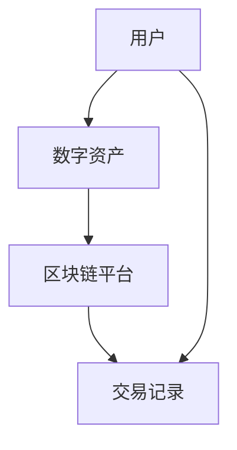
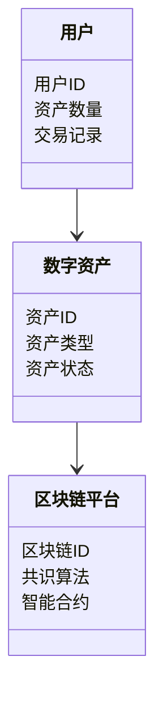

                 


# 如何评估企业的区块链数字资产管理平台

---

## 关键词
区块链, 数字资产管理, 共识算法, 智能合约, 区块链架构, 数字资产生命周期

---

## 摘要
区块链技术在数字资产管理领域的应用日益广泛，企业如何选择和评估合适的区块链数字资产管理平台成为关键问题。本文从区块链的基本概念、数字资产管理的核心需求出发，详细分析区块链数字资产管理平台的核心概念、算法原理、系统架构，并通过实际案例展示项目实战，最后总结最佳实践和评估方法，为企业提供全面的指导。

---

# 正文

## 第一部分：区块链数字资产管理平台概述

### 第1章：区块链与数字资产管理概述

#### 1.1 区块链的基本概念
区块链是一种分布式账本技术，通过去中心化、不可篡改和可追溯的特性，解决了传统系统中的信任问题。区块链的核心原理包括去中心化、共识机制、区块结构和哈希指针。

#### 1.2 数字资产管理的定义与特点
数字资产指的是以数字形式存在的资产，包括加密货币、NFT（非同质化代币）和数字证券等。数字资产管理需要确保资产的安全性、唯一性和可追溯性。

#### 1.3 区块链与数字资产管理的结合
区块链技术为数字资产管理提供了去中心化和不可篡改的特性，解决了传统数字资产管理中的信任和安全问题。区块链在数字资产管理中的应用包括资产发行、交易记录和权益管理。

---

### 第2章：区块链数字资产管理的核心概念与联系

#### 2.1 区块链数字资产管理的核心概念
区块链数字资产管理平台由用户、数字资产、区块链平台和交易记录四个核心要素组成。用户通过区块链平台进行数字资产的发行、交易和管理。

#### 2.2 核心概念的原理与联系
区块链的去中心化特性确保了数字资产的唯一性和可追溯性，系统模型展示了用户、数字资产和区块链平台之间的交互关系。

#### 2.3 实体关系图（ER图）


---

## 第二部分：区块链数字资产管理的算法原理

### 第3章：区块链数字资产管理的算法原理

#### 3.1 区块链共识算法
共识算法是区块链的核心机制，常见的算法包括PoW（工作量证明）、PoS（权益证明）和Raft。每种算法都有其优缺点，选择合适的算法取决于应用场景和性能需求。

#### 3.2 智能合约原理
智能合约是区块链上的自动化程序，用于执行和管理数字资产的交易。Solidity是一种常用智能合约编程语言，支持面向对象的编程特性。

#### 3.3 数学模型与公式
区块链中的哈希函数用于数据完整性验证，公式为：
$$H(x) = \text{hash}(x)$$
椭圆曲线加密用于数字签名，公式为：
$$y = x^3 + ax + b$$

---

## 第三部分：区块链数字资产管理的系统分析与架构设计

### 第4章：系统分析与架构设计

#### 4.1 系统分析
区块链数字资产管理平台需要解决资产发行、交易验证和权益管理等问题，系统功能设计包括资产发行模块、交易模块和管理模块。

#### 4.2 系统架构设计
系统架构采用分层设计，包括数据层、网络层、共识层、智能合约层和应用层。组件之间的交互通过API实现，确保系统的高效和安全。

#### 4.3 系统功能设计（领域模型）


---

## 第四部分：项目实战

### 第5章：项目实战

#### 5.1 环境搭建
安装以太坊或Hyperledger Fabric，配置Solidity编译工具，准备智能合约开发环境。

#### 5.2 核心代码实现
编写智能合约代码，实现数字资产的发行和转让功能。例如：
```solidity
// SPDX-License-Identifier: MIT
pragma solidity ^0.8.0;

contract DigitalAsset {
    mapping(address => uint) public balances;

    function transfer(address recipient, uint amount) public {
        require(balances[msg.sender] >= amount, "Insufficient balance");
        balances[msg.sender] -= amount;
        balances[recipient] += amount;
    }
}
```

#### 5.3 案例分析
通过实际案例分析智能合约的执行流程和交易记录，验证系统的安全性和高效性。

#### 5.4 项目总结
总结项目实施的关键点，包括技术选型、系统设计和安全性保障，为后续项目提供参考。

---

## 第五部分：最佳实践

### 第6章：最佳实践

#### 6.1 评估方法
从技术、业务和经济模型三个方面评估平台，重点关注性能、安全性、合规性和激励机制。

#### 6.2 实用建议
选择适合的区块链平台，关注监管合规性，定期进行安全审计，确保系统安全和稳定运行。

#### 6.3 小结
总结评估的关键点，强调安全性和合规性的重要性，为企业提供全面的指导。

#### 6.4 注意事项
避免技术盲目追求最新，注重实际业务需求，确保团队技术能力匹配。

#### 6.5 拓展阅读
推荐相关书籍和资源，提供更多学习方向，帮助读者深入理解区块链技术。

---

## 作者信息

作者：AI天才研究院/AI Genius Institute & 禅与计算机程序设计艺术 /Zen And The Art of Computer Programming

---

以上是《如何评估企业的区块链数字资产管理平台》的完整目录和文章结构。接下来，我将按照这个结构，逐步展开撰写每个章节的内容。

