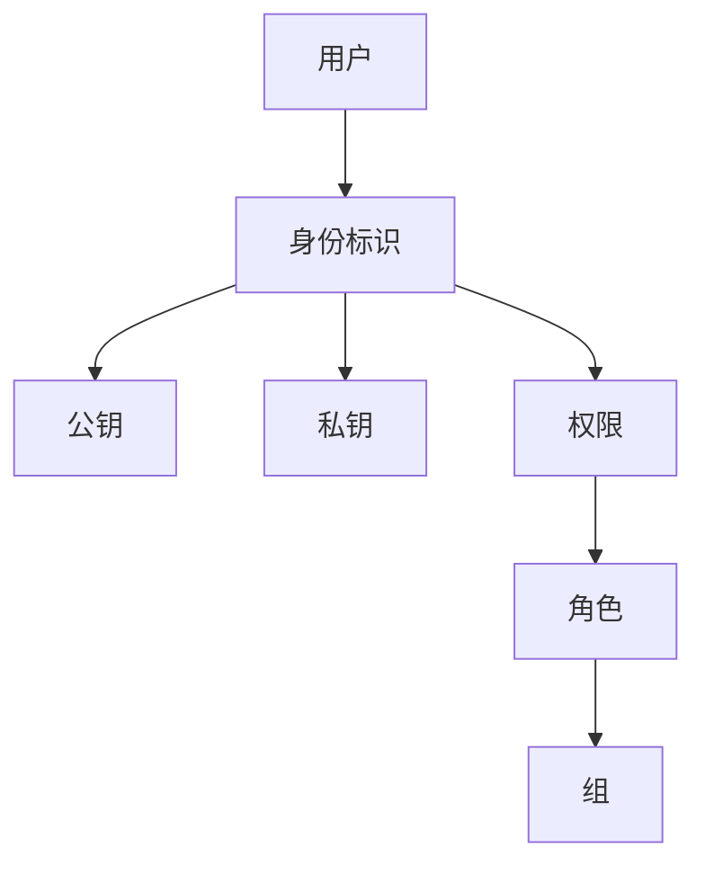
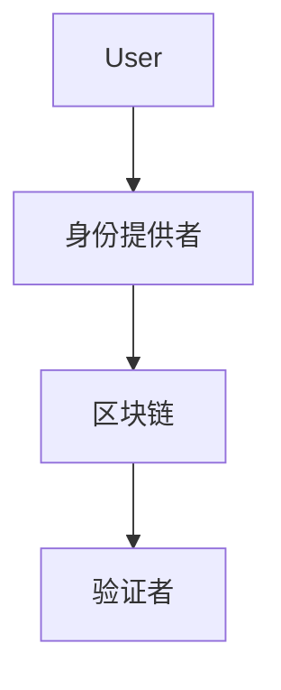
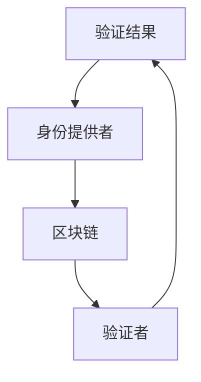

                 


# 如何评估企业的区块链数字身份系统

**关键词：** 区块链、数字身份、系统评估、安全、去中心化、共识机制、身份验证

**摘要：** 区块链技术在数字身份管理中的应用正在迅速普及，为企业提供了更安全、更高效的解决方案。本文将从背景介绍、核心概念、算法原理、系统架构、项目实战等多个维度，详细分析如何评估企业区块链数字身份系统，帮助企业更好地选择和实施适合的解决方案。

---

# 第1章: 区块链数字身份系统背景介绍

## 1.1 区块链数字身份的核心概念

### 1.1.1 区块链数字身份的定义

区块链数字身份是指基于区块链技术构建的数字身份验证和管理方案。它通过去中心化的特性，确保用户身份信息的安全性和不可篡改性。

### 1.1.2 区块链数字身份的属性与特征

区块链数字身份具有以下核心属性：

1. **去中心化**：身份信息不由单一机构控制，而是分布式存储在区块链网络中。
2. **不可篡改**：区块链的特性使得一旦信息被写入，就无法被修改或删除。
3. **匿名与隐私保护**：用户可以选择性地共享身份信息，保护隐私。
4. **可扩展性**：支持大规模用户和复杂的身份验证场景。

### 1.1.3 区块链数字身份的边界与外延

区块链数字身份的边界包括用户身份标识、数字证书、密钥管理、权限控制等核心要素。外延则扩展到与区块链相关的共识机制、加密算法、智能合约等技术。

## 1.2 区块链数字身份系统的组成要素

### 1.2.1 用户身份标识

用户身份标识是区块链数字身份系统的基础，通常包括用户的公钥、地址或其他唯一标识符。

### 1.2.2 数字证书与密钥

数字证书用于验证用户身份，密钥（公钥和私钥）用于数字签名和加密操作。

### 1.2.3 身份验证机制

区块链数字身份系统需要支持多种身份验证方式，如基于密码的身份验证、基于密钥的验证等。

### 1.2.4 身份授权与访问控制

通过权限管理，确保用户只能访问其授权的资源和功能。

## 1.3 区块链技术与数字身份的关系

### 1.3.1 区块链技术的基本原理

区块链通过去中心化、共识机制、链式结构和加密算法，确保数据的安全性和不可篡改性。

### 1.3.2 区块链在数字身份中的应用

区块链可以实现用户身份的去中心化存储和验证，减少对中心机构的依赖。

### 1.3.3 区块链与传统身份验证的对比

传统身份验证依赖于中心机构，容易受到攻击；区块链身份验证更加安全和透明。

## 1.4 区块链数字身份系统的应用场景

### 1.4.1 企业内部身份管理

企业可以使用区块链技术管理员工、合作伙伴的身份信息，提高安全性。

### 1.4.2 供应链与合作伙伴身份认证

通过区块链，企业可以验证供应链中的合作伙伴身份，确保供应链的安全性。

### 1.4.3 客户身份验证与隐私保护

区块链数字身份可以保护客户隐私，同时确保身份验证的安全性。

## 1.5 本章小结

本章介绍了区块链数字身份的核心概念、组成要素、与区块链技术的关系以及应用场景，为后续章节的分析打下基础。

---

# 第2章: 区块链数字身份系统的核心概念与联系

## 2.1 区块链数字身份的核心原理

### 2.1.1 区块链的去中心化特性

去中心化确保了身份信息不会因单一机构的故障而丢失或被篡改。

### 2.1.2 数字签名与公私钥机制

数字签名通过公私钥对实现身份验证和数据完整性验证。

### 2.1.3 联盟链与权限管理

联盟链通过权限管理，确保只有授权节点可以参与网络。

## 2.2 核心概念的属性对比

| 实体 | 属性 | 描述 |
|------|------|------|
| 用户 | ID | 唯一标识符 |
| 用户 | 权限 | 访问权限等级 |
| 区块链 | 区块高度 | 区块链的高度 |
| 区块链 | 节点 | 网络节点 |

## 2.3 实体关系图（ER图）



## 2.4 本章小结

本章通过属性对比和ER图展示了区块链数字身份系统的核心概念及其相互关系。

---

# 第3章: 区块链数字身份系统的算法原理

## 3.1 区块链共识机制

### 3.1.1 工作量证明（PoW）

PoW通过计算哈希值来验证区块的有效性，确保网络安全。

### 3.1.2 权益证明（PoS）

PoS通过持有代币的数量来决定节点的权重，减少能源消耗。

### 3.1.3 拜占庭容错（BFT）

BFT通过共识算法确保网络中的节点达成一致。

## 3.2 数字签名与加密算法

### 3.2.1 SHA-256哈希函数

$$ SHA-256(message) = hash $$

### 3.2.2 数字签名生成与验证

$$ signature = sign(privateKey, message) $$
$$ verify(publicKey, signature, message) = true/false $$

## 3.3 身份验证算法

### 3.3.1 椭圆曲线数字签名算法（ECDSA）

ECDSA通过椭圆曲线加密实现数字签名。

### 3.3.2 哈希摘要验证

通过哈希函数验证数据完整性。

### 3.3.3 联盟链权限验证流程



## 3.4 本章小结

本章详细讲解了区块链数字身份系统中常用的共识机制、加密算法和身份验证流程。

---

# 第4章: 区块链数字身份系统的数学模型与公式

## 4.1 区块链共识机制的数学模型

### 4.1.1 工作量证明（PoW）的数学模型

$$ H(m) = h $$，其中 \( H \) 是哈希函数，\( m \) 是区块头，\( h \) 是目标哈希值。

### 4.1.2 权益证明（PoS）的数学模型

$$ P_i = \frac{balance_i}{\sum_{j} balance_j} \times N $$，其中 \( P_i \) 是节点 \( i \) 的概率，\( balance_i \) 是节点 \( i \) 的余额。

## 4.2 数字签名的数学模型

### 4.2.1 椭圆曲线数字签名算法（ECDSA）

$$ y = a x + b \mod p $$，其中 \( y \) 是椭圆曲线上的点，\( a \) 和 \( b \) 是椭圆曲线的参数，\( p \) 是模数。

### 4.2.2 哈希摘要验证

$$ H(m) = h $$，其中 \( H \) 是哈希函数，\( m \) 是明文，\( h \) 是哈希值。

## 4.3 身份验证的数学模型

### 4.3.1 公钥加密

$$ c = E(publicKey, m) $$，其中 \( c \) 是密文，\( m \) 是明文。

### 4.3.2 私钥解密

$$ m = D(privateKey, c) $$，其中 \( m \) 是明文，\( c \) 是密文。

## 4.4 本章小结

本章通过数学公式和模型，深入分析了区块链数字身份系统中的共识机制和加密算法。

---

# 第5章: 区块链数字身份系统的系统分析与架构设计

## 5.1 系统功能设计

### 5.1.1 用户身份标识

用户通过公钥或地址进行身份标识。

### 5.1.2 数字证书管理

系统需要管理用户的数字证书和密钥。

### 5.1.3 身份验证

支持多种身份验证方式，如基于密码和基于密钥的验证。

### 5.1.4 权限控制

通过权限管理，确保用户只能访问授权的资源。

## 5.2 系统架构设计

### 5.2.1 分层架构

系统分为应用层、服务层、数据层和区块链层。

### 5.2.2 节点角色

网络中的节点包括普通节点、验证节点和记账节点。

### 5.2.3 智能合约

通过智能合约实现复杂的业务逻辑。

## 5.3 系统接口设计

### 5.3.1 用户身份验证接口

$$ API: POST /api/v1/authenticate $$

### 5.3.2 数字证书查询接口

$$ API: GET /api/v1/certificate/{id} $$

## 5.4 系统交互流程



## 5.5 本章小结

本章通过分层架构和交互流程图，详细分析了区块链数字身份系统的架构设计。

---

# 第6章: 区块链数字身份系统的项目实战

## 6.1 环境安装

### 6.1.1 安装区块链框架

选择适合的区块链框架，如Hyperledger Fabric。

### 6.1.2 安装依赖项

安装必要的开发工具和依赖项。

## 6.2 核心代码实现

### 6.2.1 身份验证模块

```python
def sign_message(private_key, message):
    return sign(private_key, message)
```

### 6.2.2 数字证书管理

```python
def generate_certificate(user_id, public_key):
    return create_certificate(user_id, public_key)
```

## 6.3 案例分析

### 6.3.1 供应链身份验证

通过区块链验证供应链合作伙伴的身份信息。

### 6.3.2 客户身份验证

实现客户身份验证的完整流程。

## 6.4 本章小结

本章通过实际项目案例，展示了区块链数字身份系统的实现过程。

---

# 第7章: 总结与展望

## 7.1 本章总结

本文从背景介绍、核心概念、算法原理、系统架构、项目实战等多个维度，全面分析了如何评估企业区块链数字身份系统。

## 7.2 未来展望

未来，区块链数字身份系统将在更多领域得到应用，技术也将更加成熟和高效。

---

**作者：AI天才研究院/AI Genius Institute & 禅与计算机程序设计艺术 /Zen And The Art of Computer Programming**

