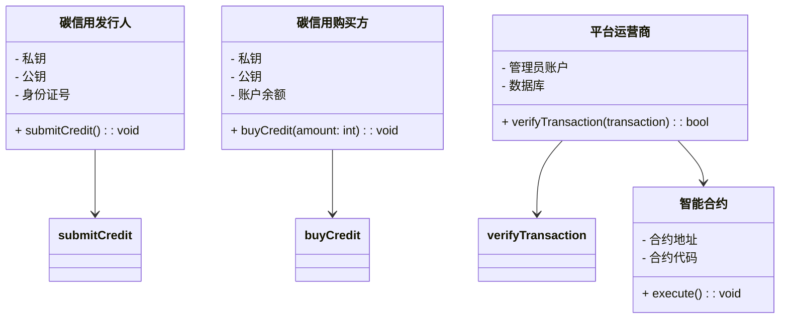
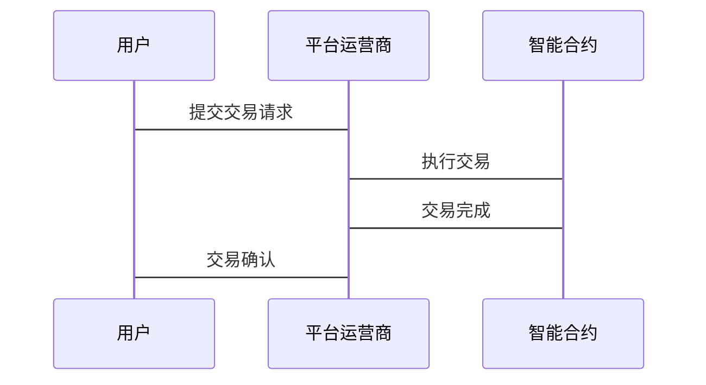

                 


# 如何评估企业的区块链碳信用交易平台

> 关键词：区块链，碳信用，交易平台，评估，智能合约，安全性，性能优化

> 摘要：随着全球对碳减排的关注不断增加，区块链技术在碳信用交易中的应用日益广泛。本文将详细探讨如何评估一个企业的区块链碳信用交易平台，包括其技术架构、核心概念、安全性、性能优化、合规性以及用户体验等方面。通过逐步分析，本文旨在为读者提供一个全面的评估框架，帮助企业在选择和优化区块链碳信用交易平台时做出明智决策。

---

# 第一部分：区块链碳信用交易平台的背景与核心概念

## 第1章：碳信用交易的背景与现状

### 1.1 碳信用交易的背景介绍

#### 1.1.1 碳信用交易的定义与核心概念
碳信用交易是一种通过市场机制减少温室气体排放的工具。碳信用允许企业或组织购买他们在减少碳排放方面的成果，以抵消其自身的碳排放。每单位碳信用通常代表一吨二氧化碳当量的减排量。

碳信用交易的核心在于其“可测量、可报告、可核查”的特性（MRV原则）。区块链技术的引入，进一步增强了碳信用交易的透明性和不可篡改性。

#### 1.1.2 碳信用交易的全球发展趋势
全球碳市场的规模正在迅速增长。根据国际能源署（IEA）和世界银行的报告，全球碳市场的交易额在2020年超过2,500亿美元，预计到2030年将达到50万亿美元。区块链技术在碳信用交易中的应用，可以帮助实现更高效、更透明的交易流程。

#### 1.1.3 区块链技术在碳信用交易中的应用潜力
区块链技术的去中心化特性、不可篡改性和透明性，使其成为碳信用交易的理想选择。通过区块链技术，可以实现碳信用的发行、转让、登记和结算的全流程数字化，减少中间环节，降低成本。

---

### 1.2 区块链技术的核心优势

#### 1.2.1 区块链技术的基本原理
区块链是一种分布式账本技术，通过去中心化的节点网络，实现数据的安全存储和共享。每个区块链节点都有一份完整的账本副本，通过共识机制确保所有节点的数据一致性。

#### 1.2.2 区块链在碳信用交易中的独特价值
区块链技术可以确保碳信用数据的真实性和完整性，防止数据篡改和重复交易。智能合约的自动化执行能力，可以简化交易流程，降低人为干预的风险。

#### 1.2.3 区块链技术的局限性与挑战
尽管区块链技术具有诸多优势，但其在碳信用交易中的应用也面临一些挑战，如高能耗（尤其是比特币等加密货币使用的PoW共识机制）、网络延迟和数据隐私等问题。

---

### 1.3 区块链碳信用交易平台的基本概念

#### 1.3.1 平台的定义与功能
区块链碳信用交易平台是一个基于区块链技术的在线平台，用于碳信用的发行、交易和结算。平台的功能包括：
- 碳信用的发行与登记
- 碳信用的交易撮合
- 智能合约的执行
- 交易的记录与结算

#### 1.3.2 平台的核心要素与组成
区块链碳信用交易平台的核心要素包括：
- 用户身份认证与权限管理
- 碳信用的发行与注销
- 智能合约的编写与部署
- 交易记录的可追溯性

#### 1.3.3 平台的参与者与角色分析
区块链碳信用交易平台的主要参与者包括：
- 碳信用发行人：负责碳信用的生成和发行。
- 碳信用购买方：购买碳信用以抵消自身碳排放。
- 平台运营商：负责平台的技术运维和管理。
- 监管机构：负责监督碳信用交易的合规性。

---

### 1.4 本章小结

#### 1.4.1 碳信用交易的背景与意义
碳信用交易是实现全球碳减排目标的重要工具，区块链技术的引入可以进一步提升其效率和可信度。

#### 1.4.2 区块链技术的核心优势
区块链技术通过去中心化和不可篡改性，确保了碳信用交易的透明性和安全性。

#### 1.4.3 平台的基本概念与框架
区块链碳信用交易平台是一个综合性的平台，涉及碳信用的发行、交易和结算，其核心要素包括智能合约、用户身份认证和交易记录的可追溯性。

---

## 第2章：区块链碳信用交易平台的核心概念与联系

### 2.1 核心概念的原理分析

#### 2.1.1 区块链技术的去中心化特性
区块链的去中心化特性使得碳信用交易可以在没有中央机构的情况下进行，通过分布式账本确保数据的一致性和安全性。

#### 2.1.2 智能合约的自动化执行机制
智能合约是区块链平台上的自动执行程序，用于定义和自动执行碳信用交易的规则和条件。例如，当买方支付碳信用购买费用时，智能合约会自动将碳信用转移至买方账户。

#### 2.1.3 碳信用交易的透明性与可追溯性
区块链的透明性确保了每笔碳信用交易都可以被追踪和验证，防止重复交易和数据篡改。

---

### 2.2 核心概念的对比分析

#### 2.2.1 区块链与传统数据库的对比
- **区块链**：去中心化、不可篡改、透明性高。
- **传统数据库**：中心化、可篡改、透明性低。

#### 2.2.2 智能合约与传统合同的对比
- **智能合约**：自动执行、无需中介、透明性高。
- **传统合同**：需要法律执行、依赖中介机构、透明性低。

#### 2.2.3 碳信用交易平台与传统交易平台的对比
- **区块链碳信用交易平台**：透明、高效、不可篡改。
- **传统交易平台**：可能存在信息不对称、效率低、成本高。

---

### 2.3 实体关系图（ER图）分析

#### 2.3.1 平台参与者的实体关系
- **用户**：包括碳信用发行人、购买方和平台运营商。
- **碳信用**：包括碳信用的发行、交易和结算。
- **智能合约**：定义碳信用交易的规则和条件。

#### 2.3.2 数据流与信息交互关系
- 用户提交碳信用发行请求。
- 平台验证并发行碳信用。
- 用户提交交易请求，智能合约自动执行交易。
- 交易记录存储在区块链上，可供查询和验证。

#### 2.3.3 实体关系图的 Mermaid 描述
```mermaid
erDiagram
    actor 用户
    actor 平台运营商
    actor 监管机构
    database 碳信用数据库
    database 交易记录数据库
    object 智能合约
    用户 --> 碳信用数据库 : 提交发行请求
    平台运营商 --> 碳信用数据库 : 验证并发行碳信用
    用户 --> 交易记录数据库 : 提交交易请求
    智能合约 --> 交易记录数据库 : 执行交易
    监管机构 --> 交易记录数据库 : 监督交易合规性
```

---

## 第3章：区块链碳信用交易平台的技术评估

### 3.1 区块链技术的共识机制

#### 3.1.1 共识机制的基本原理
共识机制是区块链的核心组件之一，用于确保所有节点在分布式网络中达成一致。常见的共识机制包括：
- **PoW（工作量证明）**：比特币采用的共识机制，通过计算哈希值来验证交易。
- **PoS（权益证明）**：以太坊2.0采用的共识机制，通过质押代币来验证交易。
- **RAFT**：一种适用于企业级区块链的高效共识机制。

#### 3.1.2 适合碳信用交易的共识机制
对于碳信用交易而言，PoS或RAFT等低能耗的共识机制更为合适，因为它们可以在保证安全性的同时，降低能源消耗和交易延迟。

---

### 3.2 智能合约的实现与验证

#### 3.2.1 智能合约的定义与功能
智能合约是区块链上的自动执行程序，用于定义和执行碳信用交易的规则。例如，智能合约可以自动验证交易双方的身份、计算碳信用的转让金额，并完成交易的结算。

#### 3.2.2 智能合约的编写与部署
智能合约通常使用Solidity等区块链编程语言编写，并通过区块链平台（如以太坊）进行部署和验证。以下是智能合约的简单示例：
```solidity
// 简单的智能合约，用于管理碳信用
contract CarbonCredit {
    address public seller;
    address public buyer;

    constructor() {
        seller = msg.sender;
    }

    function transfer(address _buyer) public {
        buyer = _buyer;
    }

    function getOwner() public view returns (address) {
        return seller;
    }
}
```

#### 3.2.3 智能合约的安全性与测试方法
智能合约的安全性至关重要，因为一旦部署到区块链上，就无法进行修改。为了确保智能合约的安全性，需要进行全面的测试和漏洞审计。常见的测试方法包括：
- **单元测试**：测试智能合约的单个功能模块。
- **集成测试**：测试智能合约的多个功能模块的交互。
- **漏洞扫描**：使用工具（如Slither）扫描智能合约中的潜在漏洞。

---

### 3.3 数据结构与存储方式

#### 3.3.1 区块链中的数据结构
区块链中的数据结构包括：
- **区块**：包含交易记录和元数据的容器。
- **链式结构**：区块通过哈希指针连接成链式结构。
- ** Merkel树**：用于验证数据的完整性和一致性。

#### 3.3.2 数据的存储与检索
碳信用交易的数据存储在区块链的分布式账本中，每笔交易都会被记录在一个区块中，并通过Merkel树确保数据的完整性。

#### 3.3.3 数据隐私与加密技术
为了保护用户的隐私，区块链平台可以采用零知识证明等加密技术，确保敏感数据（如用户身份信息）不会被泄露。

---

### 3.4 平台的安全性评估

#### 3.4.1 安全威胁的分析
区块链碳信用交易平台可能面临的安全威胁包括：
- **恶意攻击**：如DDoS攻击、节点攻击等。
- **数据篡改**：如恶意修改交易记录。
- **隐私泄露**：用户数据被未经授权的第三方获取。

#### 3.4.2 安全防护措施的设计
为了应对上述安全威胁，可以采取以下防护措施：
- **多重签名钱包**：需要多个签名才能进行交易，防止单点攻击。
- **入侵检测系统（IDS）**：实时监控网络流量，发现异常行为及时报警。
- **加密通信**：使用SSL/TLS等加密协议，确保数据传输的安全性。

#### 3.4.3 安全漏洞的检测与修复
定期进行安全漏洞扫描和渗透测试，及时发现并修复平台中的安全漏洞。

---

### 3.5 本章小结

#### 3.5.1 区块链技术的核心组件
区块链技术的核心组件包括共识机制、智能合约、数据结构和安全性设计。

#### 3.5.2 智能合约的实现与验证
智能合约的编写和部署需要遵循严格的开发和测试流程，确保其安全性和可靠性。

#### 3.5.3 平台安全性评估的关键点
平台安全性评估需要从数据隐私、网络攻击、交易验证等多个方面进行综合考虑。

---

## 第4章：区块链碳信用交易平台的评估模型与指标

### 4.1 评估模型的构建

#### 4.1.1 评估模型的设计思路
评估模型的设计需要综合考虑技术、业务和合规性等多个维度，确保模型的全面性和可操作性。

#### 4.1.2 评估模型的数学表达式
以下是一个简化的评估模型，用于衡量区块链碳信用交易平台的整体性能：
$$
\text{综合评估得分} = 0.4 \times \text{技术评估} + 0.3 \times \text{业务评估} + 0.3 \times \text{合规性评估}
$$

#### 4.1.3 评估模型的验证与优化
通过实际案例验证评估模型的有效性，并根据反馈进行优化和调整。

---

### 4.2 评估指标的选择

#### 4.2.1 技术指标的定义与选择
技术指标包括：
- **交易吞吐量**：每秒可以处理的交易数量。
- **延迟**：从提交交易到确认的时间。
- **网络带宽**：区块链网络的数据传输能力。

#### 4.2.2 业务指标的定义与选择
业务指标包括：
- **交易成功率**：交易成功完成的比例。
- **用户满意度**：用户对平台的使用体验的评价。
- **交易成本**：每笔交易的平均成本。

#### 4.2.3 综合指标的计算方法
综合指标可以通过加权平均的方法进行计算，权重可以根据实际需求进行调整。

---

### 4.3 数学模型与公式

#### 4.3.1 碳信用交易的数学模型
碳信用交易的数学模型可以表示为：
$$
\text{碳信用交易量} = \sum_{i=1}^{n} \text{交易}_i
$$

其中，$\text{交易}_i$ 表示第 $i$ 笔交易的碳信用数量。

#### 4.3.2 区块链性能的数学公式
区块链性能的数学公式可以表示为：
$$
\text{性能} = \frac{\text{交易吞吐量}}{\text{延迟}}
$$

---

## 第5章：区块链碳信用交易平台的系统分析与架构设计

### 5.1 问题场景介绍

#### 5.1.1 碳信用交易的痛点
碳信用交易中存在的主要痛点包括：
- 数据不透明，容易被篡改。
- 交易流程复杂，涉及多个中间机构。
- 缺乏统一的平台，导致交易效率低。

#### 5.1.2 区块链技术的应用场景
区块链技术可以在碳信用交易的多个环节中发挥作用，如碳信用的发行、交易和结算。

---

### 5.2 系统功能设计

#### 5.2.1 领域模型（Mermaid 类图）
以下是碳信用交易平台的领域模型：


---

#### 5.2.2 系统架构设计（Mermaid 架构图）
以下是碳信用交易平台的系统架构设计：
```mermaid
container 区块链网络 {
    participant 节点1
    participant 节点2
    participant 节点3
}
actor 用户
actor 监管机构
用户 --> 区块链网络 : 提交交易请求
区块链网络 --> 智能合约 : 执行交易
区块链网络 --> 监管机构 : 通知交易完成
```

---

### 5.3 接口设计与交互流程

#### 5.3.1 系统接口设计
以下是碳信用交易平台的主要接口：
- `submitCredit(seller)`：碳信用发行人提交碳信用。
- `buyCredit(buyer, amount)`：碳信用购买方购买碳信用。
- `verifyTransaction(tx)`：平台运营商验证交易。

#### 5.3.2 系统交互流程（Mermaid 序列图）
以下是碳信用交易的交互流程：


---

## 第6章：区块链碳信用交易平台的项目实战

### 6.1 环境安装

#### 6.1.1 操作系统
建议使用Linux或macOS系统，因为它们对开发环境的配置更为友好。

#### 6.1.2 区块链平台的选择
可以选择以太坊、FISCO BCOS等区块链平台。

#### 6.1.3 开发工具的安装
安装Solidity编译器、以太坊钱包（如MetaMask）和区块链节点客户端（如Geth）。

---

### 6.2 系统核心实现

#### 6.2.1 智能合约的实现
以下是碳信用交易智能合约的实现代码：
```solidity
// SPDX-License-Identifier: MIT
pragma solidity ^0.8.0;

contract CarbonCredit {
    address public seller;
    address public buyer;

    constructor() {
        seller = msg.sender;
    }

    function transfer(address _buyer) public {
        require(msg.sender == seller, "Not authorized");
        buyer = _buyer;
        emit Transfer(seller, buyer);
    }

    event Transfer(address indexed from, address indexed to);
}
```

#### 6.2.2 平台功能的实现
以下是平台功能的实现代码（以Python为例）：
```python
from web3 import Web3, HTTPProvider

# 初始化区块链节点
web3 = Web3(HTTPProvider("http://localhost:8545"))

# 获取智能合约地址
contract_address = web3.toChecksumAddress("0x...")

# 载入智能合约ABI
abi = [
    // 智能合约ABI数组
]

contract = web3.eth.contract(contract_address, abi=abi)

# 提交交易请求
def submit_request():
    tx_hash = contract.functions.submit().transact()
    receipt = web3.eth.wait_for_transaction_receipt(tx_hash)
    return receipt

submit_request()
```

---

### 6.3 实际案例分析与解读

#### 6.3.1 案例背景
某企业希望通过购买碳信用来抵消其碳排放。该企业选择了一个基于以太坊的区块链碳信用交易平台。

#### 6.3.2 交易流程
1. **提交交易请求**：企业向平台提交购买碳信用的请求。
2. **智能合约执行**：平台通过智能合约自动验证交易并完成结算。
3. **交易确认**：交易完成后，企业收到碳信用，并可在区块链上查询交易记录。

---

### 6.4 项目总结

#### 6.4.1 项目目标的实现
本项目旨在通过区块链技术实现碳信用交易的透明化和高效化。

#### 6.4.2 项目成果
成功开发了一个基于区块链的碳信用交易平台，实现了智能合约的编写与部署，完成了交易流程的自动化。

#### 6.4.3 项目经验总结
- **技术选型**：选择适合的区块链平台和共识机制。
- **安全性设计**：加强智能合约的安全性，防止漏洞。
- **用户体验**：优化界面设计，提高用户操作体验。

---

## 第7章：区块链碳信用交易平台的最佳实践与扩展阅读

### 7.1 最佳实践

#### 7.1.1 技术层面
- 使用优化的共识机制（如PoS或RAFT）。
- 定期进行安全漏洞扫描和渗透测试。
- 引入零知识证明等隐私保护技术。

#### 7.1.2 业务层面
- 与国际碳信用标准（如Verra标准）接轨。
- 建立碳信用的发行和注销机制。
- 提供数据可视化工具，帮助用户更好地理解和分析交易数据。

#### 7.1.3 用户体验层面
- 提供直观的用户界面和友好的操作流程。
- 提供详细的交易记录和数据查询功能。
- 提供多语言支持，满足不同地区用户的需求。

---

### 7.2 小结

区块链技术在碳信用交易中的应用前景广阔，但其成功实施需要综合考虑技术、业务和用户体验等多个方面。通过最佳实践和持续优化，可以进一步提升平台的效率和安全性。

---

### 7.3 注意事项

- **合规性**：确保平台符合相关法律法规和国际标准。
- **数据隐私**：加强对用户数据的保护，防止隐私泄露。
- **性能优化**：根据实际需求，优化平台的交易吞吐量和响应时间。

---

### 7.4 拓展阅读

- **《区块链技术与应用》**：深入理解区块链技术的核心原理。
- **《碳信用交易指南》**：了解碳信用交易的国际标准和实践。
- **《智能合约开发实战》**：掌握智能合约的编写和测试技巧。

---

## 作者：AI天才研究院/AI Genius Institute & 禅与计算机程序设计艺术/Zen And The Art of Computer Programming

