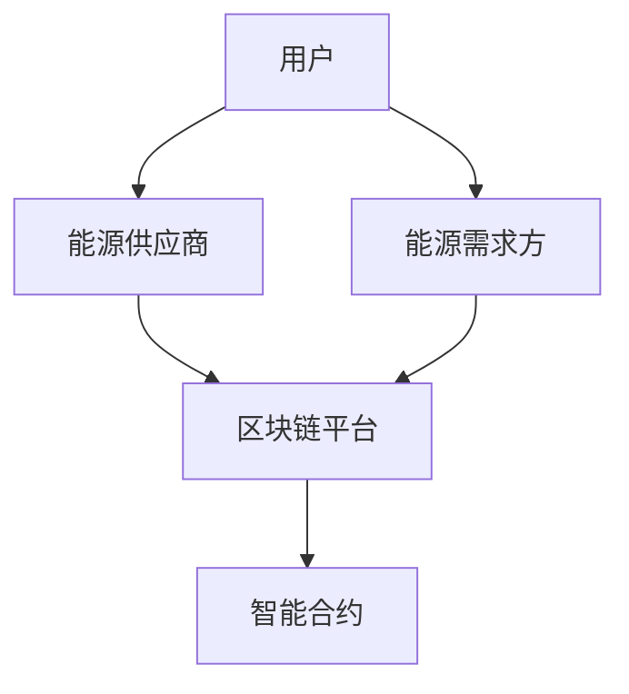
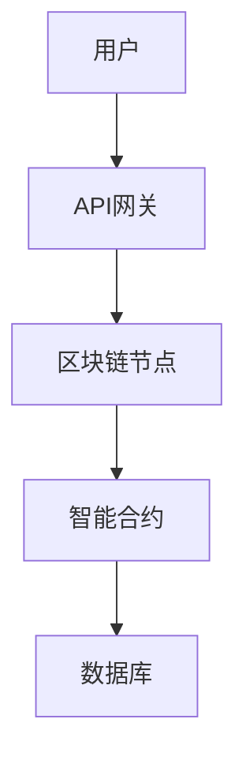
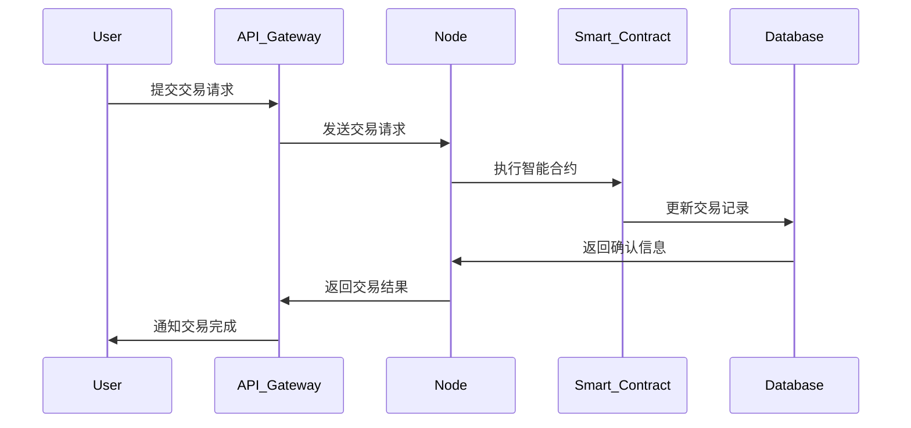

                 

# 如何评估企业的区块链能源交易平台

## 关键词：区块链、能源交易、去中心化、智能合约、评估方法

## 摘要：随着区块链技术的快速发展，区块链能源交易平台逐渐成为能源行业的重要工具。本文详细探讨如何评估企业级的区块链能源交易平台，涵盖技术、经济和法律等多个维度。通过分析核心概念、系统架构和项目实战，本文为读者提供全面的评估框架，帮助企业在选择和优化区块链能源交易平台时做出明智决策。

---

# 第一部分: 区块链能源交易平台概述

## 第1章: 区块链能源交易平台的背景与概念

### 1.1 区块链技术的背景与发展

#### 1.1.1 区块链的基本概念
区块链是一种分布式账本技术，通过去中心化的方式记录和验证交易信息。其核心特点包括去中心化、不可篡改、透明性和可追溯性。

#### 1.1.2 区块链的核心特点
- **去中心化**：数据由多个节点共同维护，避免单点故障。
- **不可篡改**：通过加密算法确保数据的安全性和完整性。
- **透明性**：所有交易记录公开，参与者可实时查看。
- **可追溯性**：通过区块链可追踪每一笔交易的来源。

#### 1.1.3 区块链在能源交易中的应用潜力
区块链技术可以解决能源交易中的信任问题，提高交易效率，降低中间成本。

### 1.2 能源交易的背景与挑战

#### 1.2.1 能源交易的基本概念
能源交易涉及能源的买卖，包括电力、天然气等多种能源类型。

#### 1.2.2 传统能源交易的痛点
- **信任问题**：交易双方可能存在信息不对称。
- **中间成本高**：需要依赖第三方机构进行清算和结算。
- **效率低下**：交易流程繁琐，耗时长。

#### 1.2.3 区块链技术如何解决能源交易问题
区块链通过去中心化和智能合约技术，实现能源交易的透明化和自动化，降低信任和成本问题。

### 1.3 区块链能源交易平台的定义与特点

#### 1.3.1 区块链能源交易平台的定义
区块链能源交易平台是一个基于区块链技术的平台，用于能源的买卖和结算，提供去中心化的交易环境。

#### 1.3.2 区块链能源交易平台的核心特点
- **去中心化**：交易直接在买方和卖方之间进行，无需中间机构。
- **智能合约**：自动执行交易和结算，减少人为干预。
- **透明性**：所有交易记录在区块链上，可供所有参与者查看。

#### 1.3.3 区块链能源交易平台的边界与外延
- **边界**：仅涉及能源交易，不包括能源生产或分配。
- **外延**：可以扩展到其他类型的资源交易，如碳排放配额。

### 1.4 本章小结
本章介绍了区块链技术和能源交易的基本概念，并阐述了区块链能源交易平台的定义、特点及其在能源交易中的应用潜力。

---

## 第2章: 区块链能源交易平台的核心概念

### 2.1 区块链技术的核心原理

#### 2.1.1 区块链的去中心化特性
去中心化意味着数据不依赖单一中心节点，而是分布在网络的各个节点上。

#### 2.1.2 区块链的共识机制
共识机制（如PoW、PoS）确保所有节点达成一致，保证区块链的正确性。

#### 2.1.3 区块链的智能合约
智能合约是区块链上的自动执行程序，根据预设条件自动触发交易。

### 2.2 能源交易的核心要素

#### 2.2.1 能源的物理特性
能源的物理特性包括可测量性、可传输性和可存储性。

#### 2.2.2 能源交易的流程
能源交易通常包括需求匹配、订单生成、交易确认和结算等步骤。

#### 2.2.3 能源交易的参与者
参与者包括能源供应商、能源需求方和区块链平台。

### 2.3 区块链能源交易平台的实体关系

### 2.4 本章小结
本章详细探讨了区块链技术的核心原理以及能源交易的核心要素，并通过实体关系图展示了区块链能源交易平台的结构。

---

## 第3章: 区块链能源交易平台的系统分析与架构设计

### 3.1 问题场景介绍

#### 3.1.1 能源交易的痛点
传统能源交易存在信任不足、效率低下和成本高昂的问题。

#### 3.1.2 区块链技术的应用场景
通过区块链技术实现能源交易的透明化、自动化和去中心化。

#### 3.1.3 系统的目标与范围
系统旨在通过区块链技术优化能源交易流程，降低交易成本，提高效率。

### 3.2 系统功能设计

#### 3.2.1 用户模块
- 用户注册与登录
- 用户信息管理

#### 3.2.2 交易模块
- 订单生成与匹配
- 交易确认与执行

#### 3.2.3 智能合约模块
- 合约部署与执行
- 合约状态监控

### 3.3 系统架构设计

### 3.4 系统接口设计

#### 3.4.1 用户接口
- 用户通过API网关提交交易请求。

#### 3.4.2 交易接口
- 区块链节点接收交易请求并进行处理。

#### 3.4.3 智能合约接口
- 智能合约与区块链节点进行交互，执行交易。

### 3.5 系统交互流程

### 3.6 本章小结
本章详细分析了区块链能源交易系统的功能设计和架构设计，并通过图表展示了系统的交互流程。

---

## 第4章: 区块链能源交易平台的评估指标与方法

### 4.1 评估指标

#### 4.1.1 技术性能
- 去中心化程度
- 网络性能（如交易速度）

#### 4.1.2 安全性
- 攻击抗性
- 数据隐私保护

#### 4.1.3 经济性
- 成本效益分析
- 可扩展性

### 4.2 评估方法

#### 4.2.1 技术评估
- 代码审查
- 性能测试

#### 4.2.2 经济评估
- 成本收益分析
- 业务可行性评估

#### 4.2.3 安全评估
- 漏洞扫描
- 安全审计

### 4.3 本章小结
本章讨论了区块链能源交易平台的评估指标与方法，帮助企业在选择和优化平台时提供参考。

---

## 第5章: 区块链能源交易平台的安全与合规

### 5.1 数据隐私保护

#### 5.1.1 区块链中的隐私保护技术
- 零知识证明
- 同态加密

#### 5.1.2 用户数据保护
- 数据加密存储
- 访问权限控制

### 5.2 合规性

#### 5.2.1 法律合规
- 符合相关法律法规
- 数据留存与审计

#### 5.2.2 行业标准
- 符合能源行业的技术标准

### 5.3 安全事件处理

#### 5.3.1 安全事件响应
- 事件监测与预警
- 应急响应机制

#### 5.3.2 安全培训与教育
- 定期安全培训
- 用户教育

### 5.4 本章小结
本章探讨了区块链能源交易平台在数据隐私保护和合规性方面的挑战，并提出了相应的解决方案。

---

## 第6章: 区块链能源交易平台的项目实战

### 6.1 环境搭建

#### 6.1.1 安装区块链框架
- 安装以太坊（Ethereum）或超级账本（Hyperledger）

#### 6.1.2 安装开发工具
- 安装IDE（如VS Code）
- 安装Solidity编译器

### 6.2 核心实现

#### 6.2.1 智能合约开发
- 使用Solidity编写智能合约
- 编写交易订单处理逻辑

#### 6.2.2 平台功能开发
- 实现用户模块
- 实现交易模块

### 6.3 实际案例分析

#### 6.3.1 案例背景
- 某地区电力交易项目

#### 6.3.2 案例实现
- 使用区块链平台实现电力交易
- 部署智能合约进行自动化结算

#### 6.3.3 案例分析
- 交易效率提升
- 成本降低

### 6.4 本章小结
本章通过实际案例展示了区块链能源交易平台的开发过程，帮助读者更好地理解理论知识。

---

## 第7章: 总结与展望

### 7.1 本章总结
本文详细探讨了如何评估企业区块链能源交易平台，涵盖技术、经济和法律等多个维度。

### 7.2 未来展望
未来，随着区块链技术的不断发展，能源交易将更加智能化和高效化。

### 7.3 注意事项
企业在选择区块链能源交易平台时，应充分考虑技术、经济和法律等多方面因素。

### 7.4 拓展阅读
建议读者进一步阅读相关书籍和文献，深入了解区块链技术的细节。

---

## 作者：AI天才研究院/AI Genius Institute & 禅与计算机程序设计艺术 /Zen And The Art of Computer Programming

---

通过以上内容，您可以系统地评估企业的区块链能源交易平台，从技术实现到实际应用，全面了解其优缺点，并为未来的优化和改进提供指导。

