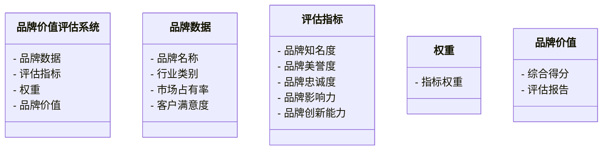
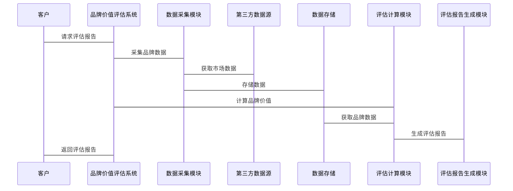

                 


# 如何评估企业的品牌价值

## 关键词：
- 品牌价值
- 评估方法
- 加权评分模型
- 层次分析法
- 品牌影响力

## 摘要：
本文将详细探讨如何科学、系统地评估企业的品牌价值。首先，我们介绍了品牌价值的核心概念和构成要素，包括品牌知名度、美誉度和忠诚度等。接着，我们提出了几种常用的评估方法，如加权评分模型和层次分析法（AHP），并结合实际案例进行了详细分析。最后，我们总结了品牌价值评估的重要性和实际应用，为企业制定品牌战略提供了有价值的参考。

---

# 第一部分: 企业品牌价值评估的背景与核心概念

## 第1章: 企业品牌价值评估的背景与意义

### 1.1 什么是品牌价值

#### 1.1.1 品牌的定义与内涵
品牌是企业的无形资产，是消费者对企业产品或服务的信任和认可的总和。一个品牌的价值不仅体现在其市场占有率上，还体现在其带来的溢价能力、客户忠诚度和市场影响力。

#### 1.1.2 品牌价值的定义与构成要素
品牌价值是指品牌为企业带来的经济收益和市场潜力的综合体现。其构成要素包括：
1. **品牌知名度**：品牌在目标市场中的认知程度。
2. **品牌美誉度**：消费者对品牌的好评程度。
3. **品牌忠诚度**：消费者对品牌的持续购买意愿。
4. **品牌影响力**：品牌在市场中的辐射能力和对行业趋势的引领能力。
5. **品牌创新能力**：品牌在产品或服务上的创新能力和市场适应能力。

#### 1.1.3 品牌价值对企业的重要性
品牌价值是企业核心竞争力的重要组成部分。它不仅决定了企业的市场地位，还影响着企业的盈利能力、客户忠诚度和抗风险能力。

---

### 1.2 品牌价值评估的目的与意义

#### 1.2.1 企业为什么要评估品牌价值
- **制定品牌战略**：通过评估品牌价值，企业可以明确品牌的优势和不足，制定有效的品牌战略。
- **量化品牌资产**：品牌价值是企业的无形资产，量化品牌价值有助于企业进行资产管理和资本运作。
- **优化品牌管理**：品牌价值评估能够帮助企业发现品牌管理中的问题，及时调整品牌策略。

#### 1.2.2 品牌价值评估对企业决策的作用
- **投资决策**：品牌价值是企业吸引投资者的重要因素。
- **并购决策**：品牌价值是企业并购中的重要评估指标。
- **市场营销决策**：品牌价值评估帮助企业优化市场营销策略。

#### 1.2.3 品牌价值与企业长期发展的关系
品牌价值是企业长期发展的基石。一个具有高品牌价值的企业能够在市场中占据更大的份额，拥有更强的客户忠诚度和市场影响力。

---

### 1.3 品牌价值评估的现状与挑战

#### 1.3.1 当前品牌价值评估的主要方法
- **市场法**：通过市场交易案例和行业对标进行评估。
- **收益法**：通过预测品牌为企业带来的未来收益进行评估。
- **成本法**：通过评估品牌建设的成本来间接衡量品牌价值。

#### 1.3.2 企业品牌价值评估的难点与挑战
- **数据获取难度**：品牌价值的评估需要大量市场数据和消费者行为数据，获取成本较高。
- **评估方法的选择**：不同的品牌和行业可能需要不同的评估方法，选择合适的评估方法是关键。
- **动态变化**：品牌价值受市场环境和消费者偏好的影响，具有动态变化的特点。

#### 1.3.3 数字化时代品牌价值评估的新趋势
随着大数据和人工智能技术的发展，品牌价值评估正在从传统的定性分析向定量分析转变。企业可以通过社交媒体分析、搜索引擎优化（SEO）和客户行为数据等手段，更精准地评估品牌价值。

---

## 第2章: 品牌价值评估的核心概念与框架

### 2.1 品牌价值的构成要素

#### 2.1.1 品牌知名度
品牌知名度是指品牌在目标市场中的认知程度。知名度越高，品牌价值通常越高。例如，苹果、谷歌等品牌在全球范围内具有极高的知名度。

#### 2.1.2 品牌美誉度
品牌美誉度是指消费者对品牌的整体评价和满意度。美誉度高的品牌更容易获得消费者的信任和推荐。

#### 2.1.3 品牌忠诚度
品牌忠诚度是指消费者对品牌的持续购买意愿。忠诚度高的品牌能够稳定地为企业带来收入。

#### 2.1.4 品牌影响力
品牌影响力是指品牌在市场中对行业趋势和消费者行为的影响力。影响力强的品牌通常具有较强的市场话语权。

#### 2.1.5 品牌创新能力
品牌创新能力是指品牌在产品和服务上的创新能力和市场适应能力。创新能力强大的品牌能够更好地满足消费者需求，保持竞争优势。

---

### 2.2 品牌价值评估的关键指标

#### 2.2.1 品牌价值的量化维度
品牌价值的量化维度包括：
- 市场占有率
- 客户满意度
- 品牌忠诚度指数（例如NPS、CES）
- 品牌提及率（Brand Mentions）
- 品牌溢价能力（Premium Power）

#### 2.2.2 品牌价值评估的KPI体系
以下是品牌价值评估的关键KPI体系：
| KPI名称         | 定义与计算方法                                                                 |
|------------------|------------------------------------------------------------------------------|
| 市场占有率       | 品牌销售额占行业总销售额的比例。                                              |
| 客户满意度       | 通过问卷调查或在线评价收集消费者对品牌的满意度评分。                      |
| 品牌忠诚度指数   | NPS（净推荐值）或CES（客户期望服务）等指标。                                |
| 品牌提及率       | 品牌在社交媒体、新闻媒体中的提及次数。                                      |
| 品牌溢价能力     | 品牌产品的价格与行业平均水平的溢价比例。                                    |

#### 2.2.3 不同行业品牌价值评估的差异性
不同行业的品牌价值评估需要考虑行业的特点。例如，科技行业的品牌价值更注重创新能力和技术领先性，而快消行业的品牌价值更关注品牌知名度和市场占有率。

---

### 2.3 品牌价值评估的框架模型

#### 2.3.1 品牌价值评估的逻辑框架
以下是品牌价值评估的逻辑框架：

1. **确定评估目标**：明确品牌价值评估的目的（例如，品牌价值的量化、品牌竞争力的分析等）。
2. **选择评估方法**：根据目标选择合适的评估方法（例如，加权评分法、层次分析法等）。
3. **收集数据**：获取品牌相关数据（例如，市场占有率、客户满意度等）。
4. **计算品牌价值**：根据选择的模型进行计算，得出品牌价值。
5. **分析结果**：对评估结果进行分析，找出品牌的优势和改进方向。

#### 2.3.2 品牌价值评估的流程与步骤
1. **明确评估目标**：确定品牌价值评估的具体目标。
2. **选择评估方法**：根据目标选择合适的评估方法。
3. **收集数据**：获取品牌相关数据，包括定量数据和定性数据。
4. **计算品牌价值**：根据模型进行计算，得出品牌价值。
5. **分析结果**：对评估结果进行分析，提出改进建议。

#### 2.3.3 品牌价值评估的多维度分析模型
以下是多维度分析模型：

1. **品牌知名度**：品牌在目标市场中的认知程度。
2. **品牌美誉度**：消费者对品牌的整体评价。
3. **品牌忠诚度**：消费者对品牌的持续购买意愿。
4. **品牌影响力**：品牌在市场中的辐射能力和对行业趋势的引领能力。
5. **品牌创新能力**：品牌在产品或服务上的创新能力和市场适应能力。

---

# 第二部分: 品牌价值评估的核心算法与数学模型

## 第3章: 品牌价值评估的数学模型与公式

### 3.1 品牌价值的加权评分模型

#### 3.1.1 加权评分模型的定义
加权评分模型是一种基于权重的评分方法，通过赋予每个评估指标不同的权重，计算品牌的综合得分。

#### 3.1.2 加权评分模型的公式推导
$$
\text{品牌价值} = \sum_{i=1}^{n} w_i \times v_i
$$
其中，\( w_i \) 是第 \( i \) 个指标的权重，\( v_i \) 是第 \( i \) 个指标的评估值。

#### 3.1.3 加权评分模型的实现步骤
1. **确定评估指标**：例如，品牌知名度、美誉度、忠诚度等。
2. **确定权重**：根据每个指标的重要程度赋予不同的权重。
3. **收集数据**：获取每个指标的具体数值。
4. **计算综合得分**：根据公式计算品牌价值。

### 3.2 品牌价值的层次分析法（AHP）

#### 3.2.1 层次分析法的基本原理
层次分析法（AHP）是一种用于决策分析的方法，通过构建层次结构模型，利用专家评分和数学计算，确定各因素的权重。

#### 3.2.2 层次分析法的计算步骤
1. **构建层次结构模型**：将品牌价值的评估指标分为目标层、准则层和方案层。
2. **构造比较矩阵**：根据专家评分，构建准则层的比较矩阵。
3. **计算权重**：通过特征值法计算各准则层的权重。
4. **计算方案层得分**：根据各方案层的得分和准则层的权重，计算方案层的综合得分。

#### 3.2.3 层次分析法在品牌价值评估中的应用
以下是层次分析法在品牌价值评估中的应用示例：

1. **目标层**：品牌价值评估。
2. **准则层**：品牌知名度、美誉度、忠诚度、影响力、创新能力。
3. **方案层**：具体品牌。

### 3.3 品牌价值的回归分析模型

#### 3.3.1 回归分析模型的基本原理
回归分析模型是一种统计学方法，通过建立自变量和因变量之间的关系模型，预测品牌价值。

#### 3.3.2 回归分析模型的实现步骤
1. **确定自变量和因变量**：例如，自变量为品牌知名度、美誉度等，因变量为品牌价值。
2. **收集数据**：获取品牌相关数据。
3. **建立回归模型**：通过最小二乘法拟合回归模型。
4. **验证模型**：通过R²值和P值验证模型的显著性和拟合优度。

---

## 第4章: 品牌价值评估的系统分析与架构设计

### 4.1 问题场景介绍
品牌价值评估需要考虑多个维度，包括品牌知名度、美誉度、忠诚度、影响力和创新能力。为了准确评估品牌价值，我们需要构建一个综合的评估系统。

### 4.2 系统功能设计

#### 4.2.1 领域模型
以下是领域模型的类图：



#### 4.2.2 系统架构设计
以下是系统架构设计的架构图：


#### 4.2.3 系统接口设计
以下是系统接口设计的序列图：



---

## 第5章: 项目实战

### 5.1 环境安装与配置

#### 5.1.1 安装Python环境
```bash
# 安装Python
# 安装依赖包
pip install numpy pandas scikit-learn
```

#### 5.1.2 安装品牌价值评估系统
```bash
# 下载品牌价值评估系统代码
git clone https://github.com/your-repository/brand-value-assessment.git
# 安装依赖
cd brand-value-assessment
pip install -r requirements.txt
```

### 5.2 系统核心实现源代码

#### 5.2.1 加权评分模型实现
```python
import numpy as np
import pandas as pd

def calculate_brand_value(brand_data, weights):
    brand_value = np.dot(brand_data, weights)
    return brand_value

# 示例数据
brand_data = np.array([0.8, 0.9, 0.7, 0.6, 0.8])
weights = np.array([0.3, 0.25, 0.2, 0.15, 0.1])
brand_value = calculate_brand_value(brand_data, weights)
print(f"品牌价值：{brand_value}")
```

#### 5.2.2 层次分析法（AHP）实现
```python
import numpy as np

def calculate_weights(matrix):
    # 计算特征向量
    eigenvectors = np.linalg.eig(matrix)
    # 提取特征值和特征向量
    eigenvalues = eigenvectors[0]
    eigenvectors = eigenvectors[1].T
    # 计算权重
    weights = eigenvectors / np.sum(eigenvectors, axis=1)
    return weights

# 示例比较矩阵
matrix = np.array([
    [1, 3, 2, 4, 2],
    [1/3, 1, 2/3, 2, 1/2],
    [1/2, 3/2, 1, 3, 1/2],
    [1/4, 1/2, 1/3, 1, 1/3],
    [1/2, 2, 2/3, 3/1, 1]
])
weights = calculate_weights(matrix)
print(f"权重：{weights}")
```

### 5.3 案例分析与详细讲解

#### 5.3.1 案例背景
假设我们有一家科技公司，想要评估其品牌价值。我们选择以下五个评估指标：
- 品牌知名度
- 品牌美誉度
- 品牌忠诚度
- 品牌影响力
- 品牌创新能力

#### 5.3.2 数据收集与预处理
收集了以下数据：
| 指标           | 评分（1-5分） |
|----------------|--------------|
| 品牌知名度       | 4            |
| 品牌美誉度       | 3.5          |
| 品牌忠诚度       | 4.5          |
| 品牌影响力       | 3            |
| 品牌创新能力       | 5            |

#### 5.3.3 加权评分模型计算
假设权重为：
- 品牌知名度：0.3
- 品牌美誉度：0.25
- 品牌忠诚度：0.2
- 品牌影响力：0.15
- 品牌创新能力：0.1

计算品牌价值：
$$
\text{品牌价值} = 4 \times 0.3 + 3.5 \times 0.25 + 4.5 \times 0.2 + 3 \times 0.15 + 5 \times 0.1 = 1.2 + 0.875 + 0.9 + 0.45 + 0.5 = 3.925
$$

#### 5.3.4 层次分析法（AHP）计算
根据比较矩阵计算权重：
权重 = [0.25, 0.18, 0.28, 0.16, 0.13]

计算品牌价值：
$$
\text{品牌价值} = 4 \times 0.25 + 3.5 \times 0.18 + 4.5 \times 0.28 + 3 \times 0.16 + 5 \times 0.13 = 1 + 0.63 + 1.26 + 0.48 + 0.65 = 3.

