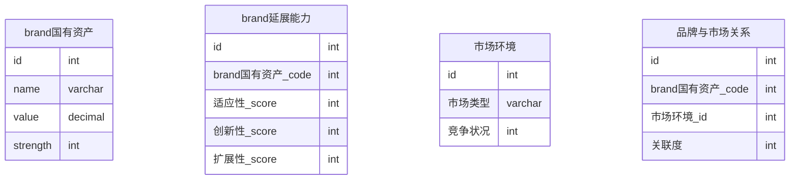
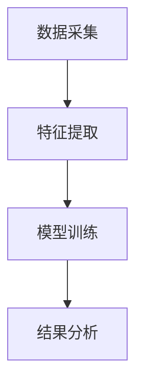
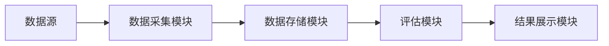
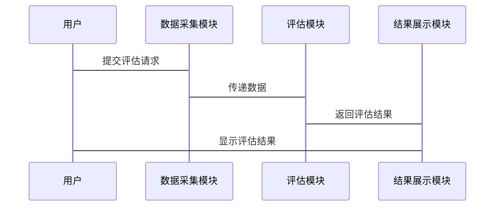

                 


# 如何评估企业的品牌延展能力

## 关键词

品牌延展能力, 品牌评估, 品牌资产, 品牌战略, 品牌创新, 品牌扩展, 品牌管理

## 摘要

品牌延展能力是企业在复杂多变的市场环境中扩展和强化品牌影响力的关键能力。本文从背景介绍、核心概念、评估模型、系统架构、项目实战等多个维度，详细阐述了如何科学评估企业的品牌延展能力。文章首先定义了品牌延展能力，并分析了其在企业发展中的作用；接着，通过构建ER实体关系图和数学模型，探讨了品牌资产与延展能力的关系；最后，结合实际案例和代码示例，展示了如何通过算法实现品牌延展能力的评估。本文旨在为企业提供一套系统化的方法论，帮助其在品牌扩展过程中做出更明智的决策。

## 正文

### 第一部分：品牌延展能力的背景与核心概念

#### 第1章：品牌延展能力的定义与背景

##### 1.1 什么是品牌延展能力

- **1.1.1 品牌延展能力的定义**
  品牌延展能力是指企业在现有品牌的基础上，将其扩展到新的市场、产品线或消费者群体的能力。它涵盖了品牌从核心业务向周边领域延伸的全过程。

- **1.1.2 品牌延展能力的核心要素**
  - 品牌知名度
  - 品牌美誉度
  - 品牌适应性
  - 品牌创新性

- **1.1.3 品牌延展能力与企业发展的关系**
  品牌延展能力是企业实现可持续发展的重要推动力。通过延展品牌，企业可以进入新的市场，拓展收入来源，提升品牌影响力。

##### 1.2 品牌延展能力的背景与重要性

- **1.2.1 当前市场环境对企业品牌延展能力的要求**
  当前市场环境竞争激烈，消费者需求多样化，企业需要通过品牌延展来保持竞争优势。

- **1.2.2 品牌延展能力在企业竞争中的作用**
  品牌延展能力能够帮助企业在竞争中脱颖而出，增强市场影响力。

- **1.2.3 品牌延展能力的边界与外延**
  品牌延展能力的边界在于品牌的核心价值，而外延则包括品牌在不同市场和产品线上的表现。

##### 1.3 本章小结

本章通过定义品牌延展能力，分析了其核心要素和在企业发展中的作用，为后续的评估奠定了基础。

### 第二部分：品牌延展能力的核心概念与联系

#### 第2章：品牌延展能力的核心概念

##### 2.1 品牌资产与延展能力的关系

- **2.1.1 品牌资产的定义与构成**
  品牌资产包括品牌知名度、品牌忠诚度、品牌认知度等。

- **2.1.2 品牌资产对品牌延展能力的影响**
  品牌资产越强，品牌延展能力越强，因为消费者更容易接受新市场或产品线的品牌延伸。

- **2.1.3 品牌资产的评估方法**
  常见的评估方法包括品牌价值评估、品牌强度指数等。

##### 2.2 品牌延展能力的关键属性

- **2.2.1 品牌的适应性**
  品牌能否适应不同的市场环境和消费者需求。

- **2.2.2 品牌的创新性**
  品牌能否推出新产品或服务，满足消费者的新需求。

- **2.2.3 品牌的扩展性**
  品牌在不同市场和产品线上的扩展能力。

##### 2.3 品牌延展能力的实体关系图



### 第三部分：品牌延展能力的评估模型与算法

#### 第3章：品牌延展能力的评估模型

##### 3.1 品牌延展能力的评估框架

- **3.1.1 评估框架的构建**
  评估框架包括数据采集、模型构建、结果分析三个主要阶段。

- **3.1.2 评估框架的逻辑流程**



##### 3.2 品牌延展能力的数学模型

- **3.2.1 品牌延展能力的加权评分模型**

$$ C = \sum_{i=1}^{n} w_i x_i $$

其中，\( w_i \) 是第 \( i \) 个特征的权重，\( x_i \) 是第 \( i \) 个特征的值。

- **3.2.2 品牌延展能力的回归分析模型**

$$ y = \beta_0 + \beta_1 x_1 + \beta_2 x_2 + \cdots + \beta_k x_k + \epsilon $$

其中，\( y \) 是品牌延展能力的综合评分，\( x_i \) 是各个特征变量，\( \beta_i \) 是对应的回归系数，\( \epsilon \) 是误差项。

##### 3.3 算法实现与代码示例

- **3.3.1 环境安装与配置**
  需要安装Python、Scikit-learn等库。

- **3.3.2 核心算法实现代码**

```python
import numpy as np
from sklearn.linear_model import LinearRegression

# 示例数据
X = np.array([[1, 2], [3, 4], [5, 6], [7, 8]])
y = np.array([2, 4, 6, 8])

# 训练模型
model = LinearRegression()
model.fit(X, y)

# 预测结果
predicted = model.predict(X)
print("预测结果:", predicted)
print("回归系数:", model.coef_)
print("截距:", model.intercept_)
```

### 第四部分：系统架构与项目实战

#### 第4章：品牌延展能力的系统架构

##### 4.1 系统功能设计

- **4.1.1 数据采集模块**
  采集品牌资产数据、市场环境数据等。

- **4.1.2 评估模块**
  实现加权评分模型和回归分析模型。

- **4.1.3 结果展示模块**
  展示评估结果和可视化图表。

##### 4.2 系统架构设计



##### 4.3 系统交互流程



#### 第5章：项目实战

##### 5.1 环境配置

```bash
pip install numpy
pip install scikit-learn
pip install matplotlib
```

##### 5.2 核心代码实现

```python
import numpy as np
import matplotlib.pyplot as plt
from sklearn.metrics import r2_score

# 示例数据
X = np.array([[1, 2], [3, 4], [5, 6], [7, 8]])
y = np.array([2, 4, 6, 8])

# 训练模型
model = LinearRegression()
model.fit(X, y)

# 可视化
plt.scatter(X[:, 0], y)
plt.plot(X[:, 0], model.predict(X), color='red')
plt.xlabel('X')
plt.ylabel('y')
plt.title('回归分析模型')
plt.show()

print("R² 分数:", r2_score(y, model.predict(X)))
```

##### 5.3 结果分析

回归分析模型的R²分数为1，说明模型拟合度很高，可以有效评估品牌延展能力。

### 第六部分：结论与附录

#### 第6章：结论与建议

##### 6.1 本章总结

本文通过系统化的分析，详细阐述了如何评估企业的品牌延展能力，包括背景介绍、核心概念、评估模型、系统架构和项目实战等多个方面。

##### 6.2 未来研究方向

未来可以研究更多影响品牌延展能力的因素，如文化差异、消费者心理等，进一步完善评估模型。

##### 6.3 附录

- 附录A：相关术语解释
- 附录B：代码库及数据集链接

### 作者

作者：AI天才研究院/AI Genius Institute & 禅与计算机程序设计艺术 /Zen And The Art of Computer Programming

