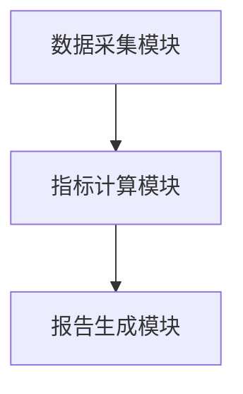
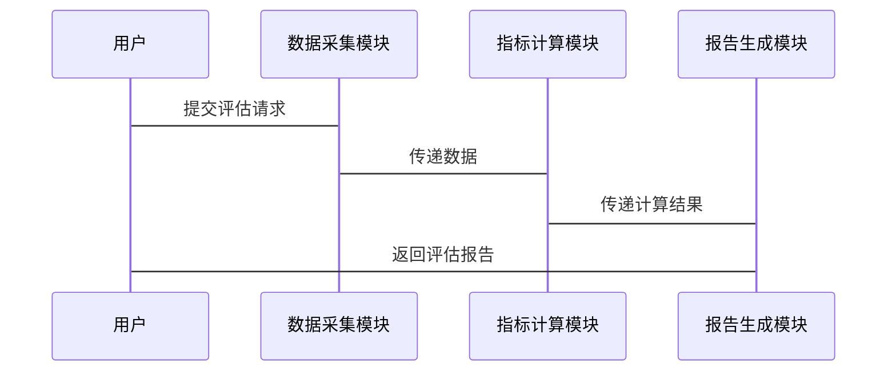

                 


# 如何评估企业的国际化程度价值

> **关键词**：企业国际化程度、评估指标、层次分析法、模糊综合评价法、企业全球化

> **摘要**：企业国际化程度是衡量企业在全球市场中竞争力和影响力的重要指标。本文将从背景介绍、核心概念、算法原理、数学模型、系统分析、项目实战等多个维度，详细阐述如何科学、系统地评估企业的国际化程度价值。通过层次分析法（AHP）和模糊综合评价法（FCE）的结合，本文提供了一套完整的评估方法，并通过实际案例分析和系统设计，为读者提供了从理论到实践的全面指导。

---

## 第一部分：企业国际化程度评估的背景与概念

### 第1章：企业国际化程度评估的背景与重要性

#### 1.1 什么是企业国际化程度
- **1.1.1 企业国际化的定义与内涵**  
  企业的国际化程度是指企业在多大程度上在全球范围内开展业务、配置资源、建立关系和适应不同市场的过程。国际化不仅是市场扩展的过程，更是企业在全球范围内实现资源整合、价值创造和竞争优势的过程。

- **1.1.2 国际化程度的多维度分析**  
  企业的国际化程度可以从多个维度进行衡量，包括市场进入度（如国际市场覆盖范围）、文化适应度（如跨文化管理能力）、法律合规度（如遵守国际法规的能力）和供应链全球化程度（如全球供应链的整合能力）。

- **1.1.3 企业国际化与全球化的关系**  
  企业国际化是全球化的一部分，但全球化不仅仅是企业的国际化，还包括国家、组织和个体在全球范围内的互动与合作。企业的国际化程度是企业在全球化过程中竞争力的体现。

#### 1.2 企业国际化程度评估的必要性
- **1.2.1 国际化对企业价值的影响**  
  企业的国际化程度直接影响其市场占有率、品牌影响力和利润率。通过评估国际化程度，企业可以更好地制定全球战略，优化资源配置，提升竞争力。

- **1.2.2 企业国际化程度与市场竞争力**  
  在全球化竞争中，企业的国际化程度决定了其在全球市场中的地位。国际化程度高的企业通常具有更强的市场适应能力和创新能力。

- **1.2.3 企业国际化程度与风险控制**  
  通过评估国际化程度，企业可以识别潜在的市场风险、法律风险和文化风险，并制定相应的应对策略。

#### 1.3 企业国际化程度的多维度指标
- **1.3.1 市场进入度**  
  市场进入度是指企业在国际市场上的覆盖范围和市场份额。可以通过国际市场收入占总收入的比例、国际市场数量等指标来衡量。

- **1.3.2 文化适应度**  
  文化适应度是指企业在不同文化环境中的适应能力，包括跨文化管理能力、本地化能力等。可以通过企业在不同国家的员工满意度、客户满意度等指标来衡量。

- **1.3.3 法律合规度**  
  法律合规度是指企业在国际经营中遵守当地法律法规的能力。可以通过企业在全球市场的法律纠纷数量、合规认证情况等指标来衡量。

- **1.3.4 供应链全球化程度**  
  供应链全球化程度是指企业在全球范围内的供应链整合能力。可以通过供应商的分布、生产设施的全球化程度等指标来衡量。

---

## 第二部分：企业国际化程度评估的核心概念与联系

### 第2章：企业国际化程度评估的核心概念

#### 2.1 企业国际化程度的多维度分析
- **2.1.1 市场进入度的定义与衡量**  
  市场进入度是衡量企业国际化程度的重要指标之一。它可以通过企业在国际市场上的收入占比、市场覆盖范围等指标来衡量。

- **2.1.2 文化适应度的定义与衡量**  
  文化适应度是指企业在不同文化环境中的适应能力。它可以通过企业在不同国家的员工满意度、客户满意度等指标来衡量。

- **2.1.3 法律合规度的定义与衡量**  
  法律合规度是指企业在国际经营中遵守当地法律法规的能力。它可以通过企业在全球市场的法律纠纷数量、合规认证情况等指标来衡量。

- **2.1.4 供应链全球化程度的定义与衡量**  
  供应链全球化程度是指企业在全球范围内的供应链整合能力。它可以通过供应商的分布、生产设施的全球化程度等指标来衡量。

#### 2.2 核心概念之间的关系
- **2.2.1 市场进入度与文化适应度的关系**  
  市场进入度高并不意味着文化适应度高。企业在进入新市场时，需要具备良好的文化适应能力才能成功。

- **2.2.2 文化适应度与法律合规度的关系**  
  文化适应度与法律合规度密切相关。企业需要了解当地的文化和法律环境，才能更好地适应市场并遵守法规。

- **2.2.3 供应链全球化程度与其他维度的关系**  
  供应链全球化程度与市场进入度、文化适应度和法律合规度密切相关。供应链的全球化有助于企业更好地进入国际市场，同时需要考虑不同国家的法律和文化环境。

#### 2.3 核心概念的对比分析
- **2.3.1 各维度的特征对比表格**

| 指标维度 | 定义 | 衡量指标 | 影响因素 | 示例 |
|----------|------|----------|----------|------|
| 市场进入度 | 国际市场覆盖范围 | 国际收入占比、市场数量 | 经济政策、市场规模 | 欧盟市场 |
| 文化适应度 | 跨文化管理能力 | 员工满意度、客户满意度 | 文化差异、语言障碍 | 东南亚市场 |
| 法律合规度 | 合规能力 | 法律纠纷数量、合规认证 | 法律法规、监管环境 | 美国市场 |
| 供应链全球化程度 | 全球供应链整合能力 | 供应商分布、生产设施 | 供应链复杂性、物流成本 | 全球化生产 |

- **2.3.2 ER实体关系图架构**

```mermaid
erd
    客户
    员工
    市场
    供应商
    产品
    法律法规
    公司
    市场进入度
    文化适应度
    法律合规度
    供应链全球化程度
```

---

## 第三部分：企业国际化程度评估的算法原理

### 第3章：层次分析法（AHP）与模糊综合评价法（FCE）的结合

#### 3.1 层次分析法（AHP）原理
- **3.1.1 AHP的基本思想**  
  AHP是一种基于层次结构的决策分析方法，将复杂问题分解为多个层次和因素，通过比较判断矩阵确定各因素的权重。

- **3.1.2 AHP的步骤**  
  1. 构建层次结构图。  
  2. 建立比较判断矩阵。  
  3. 计算各因素的权重。  
  4. 进行一致性检验。

- **3.1.3 AHP的数学模型**  
  比较判断矩阵 $A = [a_{ij}]$，其中 $a_{ij}$ 表示因素 $i$ 相对于因素 $j$ 的重要性。权重向量 $w = (w_1, w_2, ..., w_n)$ 满足 $w_i > 0$ 且 $\sum w_i = 1$。

#### 3.2 模糊综合评价法（FCE）原理
- **3.2.1 FCE的基本思想**  
  FCE是一种基于模糊数学的综合评价方法，适用于评价对象模糊、评价指标复杂的场景。

- **3.2.2 FCE的步骤**  
  1. 确定评价指标集。  
  2. 建立模糊评价矩阵。  
  3. 计算模糊合成结果。  
  4. 得出最终评价结果。

- **3.2.3 FCE的数学模型**  
  模糊合成公式：$B = A \times R$，其中 $A$ 是模糊评价矩阵，$R$ 是模糊权系数向量，$B$ 是模糊合成结果。

#### 3.3 AHP与FCE的结合
- **3.3.1 结合方法**  
  使用AHP确定各评价指标的权重，然后通过FCE进行综合评价。

- **3.3.2 结合优势**  
  AHP能够有效处理指标权重的模糊性，FCE能够处理评价结果的模糊性，两者结合可以更好地适应复杂的评价场景。

---

### 第4章：企业国际化程度评估的系统分析与架构设计

#### 4.1 系统分析
- **4.1.1 问题场景介绍**  
  企业在进行国际化扩展时，需要对多个市场的进入度、文化适应度、法律合规度和供应链全球化程度进行综合评估。

- **4.1.2 系统功能设计**  
  1. 数据采集模块：收集国际市场数据、企业运营数据等。  
  2. 指标计算模块：计算各维度的国际化程度指标。  
  3. 报告生成模块：生成综合评估报告。

- **4.1.3 系统架构设计**



- **4.1.4 系统交互设计**



---

## 第五部分：企业国际化程度评估的项目实战

### 第5章：企业国际化程度评估的实战指导

#### 5.1 环境安装
- **5.1.1 安装Python与相关库**  
  需要安装 `numpy`、`scipy`、`pandas` 和 `sklearn` 等库。

#### 5.2 系统核心实现
- **5.2.1 核心代码实现**

```python
import numpy as np
from sklearn.preprocessing import normalize

def ahp_weight(matrix):
    # 计算权重向量
    n = matrix.shape[1]
    weight = np.ones(n)
    for i in range(n):
        for j in range(n):
            weight[i] += matrix[j, i] / matrix[i, i]
    weight = normalize(weight.reshape(1, -1), axis=0).flatten()
    return weight

def fce_evaluation(matrix, weight):
    # 模糊综合评价
    result = np.dot(matrix, weight)
    return result
```

- **5.2.2 代码功能解读**  
  通过上述代码实现AHP与FCE的结合，计算各指标的权重并进行综合评价。

#### 5.3 实际案例分析
- **5.3.1 案例背景**  
  某跨国企业计划进入东南亚市场，需要评估其国际化程度。

- **5.3.2 案例分析**  
  通过AHP和FCE的方法，计算企业在市场进入度、文化适应度、法律合规度和供应链全球化程度上的综合得分。

#### 5.4 项目总结
- **5.4.1 关键点总结**  
  通过案例分析，验证了AHP与FCE结合的可行性与有效性。

- **5.4.2 注意事项**  
  在实际应用中，需注意数据的准确性和模型的适应性。

---

## 第六部分：企业国际化程度评估的最佳实践

### 第6章：最佳实践与注意事项

#### 6.1 数据收集方法
- **6.1.1 数据来源**  
  包括企业财务报表、市场调研报告、法律合规记录等。

#### 6.2 权重调整技巧
- **6.2.1 根据企业特点调整权重**  
  不同行业、不同规模的企业，其国际化程度的评估指标权重可能不同。

#### 6.3 文化差异与法律合规
- **6.3.1 文化差异的处理**  
  在不同文化环境中，企业需要灵活调整管理策略。  
- **6.3.2 法律合规的注意事项**  
  遵守当地法律法规是企业国际化成功的关键。

#### 6.4 拓展阅读
- **6.4.1 推荐书籍**  
  《The Global Manager's Handbook》、《International Business》。  
- **6.4.2 相关研究**  
  关注跨国公司研究、国际管理研究等领域的最新进展。

---

## 第七部分：总结与展望

### 第7章：总结与展望

#### 7.1 总结
- 本文系统地介绍了企业国际化程度评估的核心概念、算法原理、系统设计和实际应用。通过AHP与FCE的结合，提供了一套完整的评估方法。

#### 7.2 展望
- 未来，随着全球化进程的加速，企业国际化程度评估将更加复杂和多样化。结合人工智能、大数据分析等技术，可以进一步提升评估的准确性和效率。

---

## 作者信息

作者：AI天才研究院/AI Genius Institute & 禅与计算机程序设计艺术/Zen And The Art of Computer Programming

---

以上是《如何评估企业的国际化程度价值》的技术博客文章的完整目录和内容框架。

