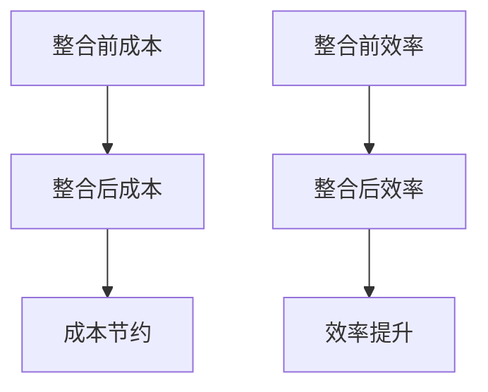

                 


# 如何评估企业的垂直整合价值

> 关键词：企业战略、垂直整合、供应链优化、成本控制、效率提升

> 摘要：本文详细探讨了企业垂直整合的评估方法，从概念到实施，结合实际案例分析，为企业提供科学的垂直整合策略。通过系统的分析和数学模型，帮助企业在复杂市场环境中优化供应链，提升竞争力。

---

## 第一章：背景介绍

### 1.1 垂直整合的基本概念

- **垂直整合的定义**：垂直整合是指企业整合其供应链，从原材料采购到生产、分销和销售的全过程，以减少对外部供应商的依赖，提高控制力和效率。
- **背景与重要性**：在现代商业环境中，供应链的稳定性和效率直接影响企业的竞争力。垂直整合能够降低外部风险，优化成本，提升产品质量。

### 1.2 问题背景与问题描述

- **传统供应链的挑战**：依赖外部供应商可能导致成本高、交货延迟和质量问题。
- **问题描述**：企业如何通过垂直整合优化供应链，降低风险，提升效率和竞争力。

### 1.3 垂直整合的解决方案

- **内部化供应链**：通过内部生产关键部件，减少对外部供应商的依赖。
- **提高控制力**：垂直整合使企业能够更好地控制产品质量和生产节奏。
- **优化效率**：整合供应链可以减少中间环节，降低运营成本。

### 1.4 垂直整合的边界与外延

- **范围界定**：垂直整合通常涵盖从原材料到成品的全过程。
- **相关概念**：与水平整合（横向并购）不同，垂直整合关注供应链的垂直链条。
- **外部影响**：垂直整合可能影响市场结构，增强企业的市场支配力。

---

## 第二章：核心概念与联系

### 2.1 内部化供应链的优势

- **成本节约**：通过内部生产，企业可以降低采购成本和物流费用。
- **质量控制**：内部供应链更容易监控产品质量，确保一致性。
- **灵活性**：内部化供应链能够更快响应市场需求变化。

### 2.2 垂直整合的控制力提升

- **集中管理**：整合后的供应链由企业内部统一管理，提高决策效率。
- **关键环节把控**：控制关键生产环节，避免供应链断裂风险。
- **应急能力**：在供应链出现问题时，内部整合能够更快调整策略。

### 2.3 效率与成本优化

- **成本模型**：整合前后的成本对比，使用数学公式分析。
- **效率提升**：通过消除中间环节，优化生产流程，提高整体效率。

---

## 第三章：算法原理与数学模型

### 3.1 垂直整合价值评估模型

#### 3.1.1 模型概述

- **模型输入**：整合前后的成本数据、效率数据。
- **模型输出**：垂直整合带来的成本节约和效率提升。

#### 3.1.2 数学公式

- **成本节约公式**：
  $$ \text{节约成本} = \text{整合前成本} - \text{整合后成本} $$
- **效率提升公式**：
  $$ \text{效率提升} = \frac{\text{整合后效率}}{\text{整合前效率}} $$

#### 3.1.3 mermaid流程图



---

## 第四章：系统分析与架构设计

### 4.1 系统架构设计

#### 4.1.1 供应链管理模块

- **功能**：监控原材料采购、库存管理。
- **类图**：
  ```mermaid
  classDiagram
      class 供应链管理 {
          采购部门
          库存部门
      }
      供应链管理 <-- 关键供应商
  ```

#### 4.1.2 生产流程优化模块

- **功能**：优化生产流程，提高效率。
- **流程图**：
  ```mermaid
  graph TD
      A[原材料] --> B[生产] --> C[成品]
      B --> D[质量检验]
  ```

---

## 第五章：项目实战

### 5.1 案例分析

- **案例背景**：某制造企业整合供应链，从外部采购原材料到内部生产。

### 5.2 代码实现

- **环境配置**：
  ```bash
  pip install numpy pandas
  ```

- **代码示例**：
  ```python
  import numpy as np
  import pandas as pd

  # 整合前成本数据
  pre_cost = np.array([100, 200, 150])
  # 整合后成本数据
  post_cost = np.array([80, 180, 120])

  # 计算成本节约
  cost_saving = pre_cost - post_cost
  print("成本节约:", cost_saving)
  ```

### 5.3 结果解读

- **成本节约分析**：整合后成本显著降低，提升企业利润。
- **效率提升分析**：生产周期缩短，产品交付更快。

---

## 第六章：最佳实践与总结

### 6.1 总结

- **垂直整合的优势**：降低成本、提高效率、增强控制力。
- **实施建议**：逐步整合关键环节，评估整合后的效果。

### 6.2 注意事项

- **风险控制**：整合过程中可能出现成本超支和管理复杂化。
- **灵活性保持**：避免过度整合影响企业的灵活性。

### 6.3 未来趋势

- **技术驱动整合**：利用大数据和AI优化供应链。
- **可持续发展**：绿色供应链成为趋势。

---

作者：AI天才研究院/AI Genius Institute & 禅与计算机程序设计艺术/Zen And The Art of Computer Programming

---

通过系统的分析和实际案例，本文为企业提供了垂直整合的科学评估方法，帮助企业优化供应链，提升竞争力。

