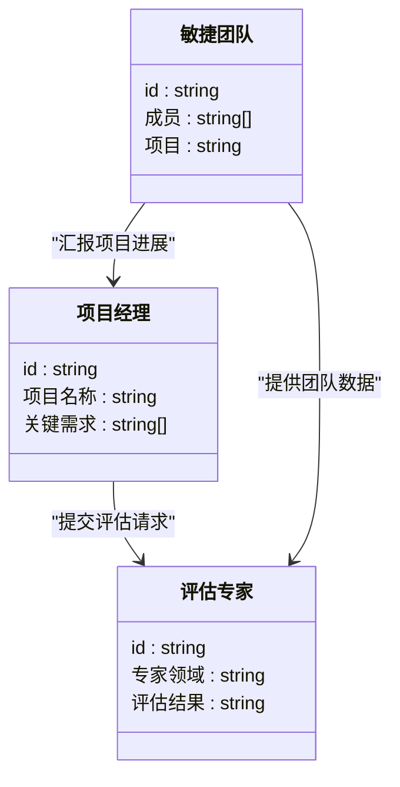
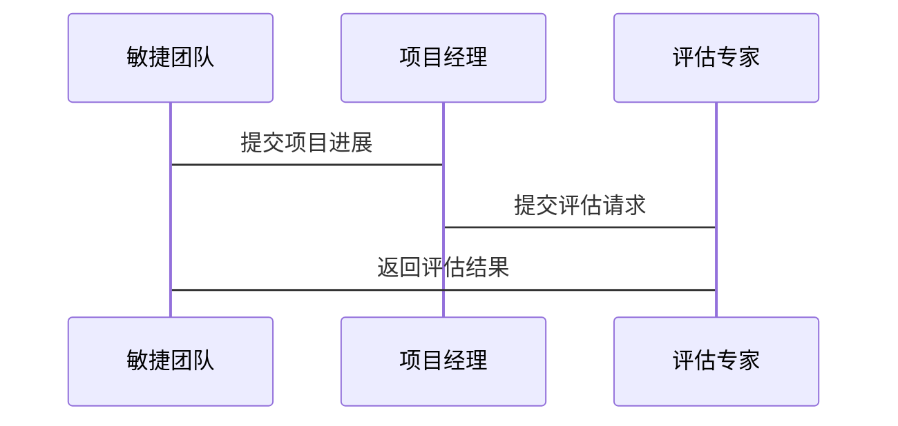

                 


# 如何评估企业的敏捷管理能力价值

> 关键词：敏捷管理，能力评估，企业价值，管理能力，评估模型，敏捷方法论，管理价值

> 摘要：本文将详细探讨如何评估企业的敏捷管理能力价值，从敏捷管理的基本概念到评估模型的构建，再到实际应用案例，通过系统化的分析和方法论的讲解，为企业提供实用的评估策略和实施指南。

---

# 目录

## 第一章：敏捷管理能力评估的背景与核心概念

### 1.1 敏捷管理的基本概念
- 1.1.1 敏捷管理的定义与特征
- 1.1.2 敏捷管理的核心原则
- 1.1.3 敏捷管理与传统管理的区别

### 1.2 敏捷管理能力评估的背景
- 1.2.1 数字化转型对企业管理的影响
- 1.2.2 敏捷管理能力在企业中的重要性
- 1.2.3 企业敏捷管理能力评估的必要性

### 1.3 敏捷管理能力评估的目标
- 1.3.1 评估的目的与意义
- 1.3.2 评估的核心问题
- 1.3.3 评估的边界与外延

### 1.4 敏捷管理能力评估的核心要素
- 1.4.1 敏捷团队的特征
- 1.4.2 敏捷过程的关键环节
- 1.4.3 敏捷文化的构建

## 第二章：敏捷管理能力评估的核心概念与联系

### 2.1 敏捷管理能力的理论基础
- 2.1.1 管理学基础理论
- 2.1.2 敏捷方法论的核心思想
- 2.1.3 现代企业管理的演变

### 2.2 敏捷管理能力的构成要素
- 2.2.1 人员能力
- 2.2.2 过程管理
- 2.2.3 技术支撑
- 2.2.4 组织文化

### 2.3 敏捷管理能力与其他管理能力的对比
- 2.3.1 敏捷管理与传统管理的对比
- 2.3.2 敏捷管理与精益管理的对比
- 2.3.3 敏捷管理与目标管理的对比

### 2.4 敏捷管理能力的ER实体关系图
```mermaid
erDiagram
    actor 顾客 {
        string id
        string 姓名
        string 需求
    }
    actor 开发团队 {
        string id
        string 团队名称
        string 项目
    }
    actor 项目经理 {
        string id
        string 项目名称
        string 关键需求
    }
    actor 评估专家 {
        string id
        string 专家领域
        string 评估结果
    }
    customer
    (
        顾客, 开发团队, 项目经理, 评估专家
    )
    development_team
    (
        顾客, 开发团队, 项目经理
    )
    project_management
    (
        开发团队, 项目经理, 评估专家
    )
```

## 第三章：敏捷管理能力评估的模型与方法论

### 3.1 敏捷管理能力评估模型的构建
- 3.1.1 模型构建的思路
- 3.1.2 模型的维度与权重
- 3.1.3 模型的评估标准

### 3.2 敏捷管理能力评估的方法论
- 3.2.1 数据采集方法
- 3.2.2 数据分析方法
- 3.2.3 诊断报告的撰写

### 3.3 敏捷管理能力评估的流程
- 3.3.1 准备阶段
- 3.3.2 数据收集阶段
- 3.3.3 数据分析阶段
- 3.3.4 结果呈现阶段

## 第四章：敏捷管理能力评估的系统分析与架构设计

### 4.1 问题场景介绍
- 4.1.1 问题背景
- 4.1.2 项目介绍

### 4.2 系统功能设计
- 4.2.1 领域模型


### 4.3 系统架构设计
- 4.3.1 系统架构图
```mermaid
architecturalDiagram
    component 敏捷团队 {
        敏捷团队模块
    }
    component 项目经理 {
        项目经理模块
    }
    component 评估专家 {
        评估专家模块
    }
    component 数据库 {
        敏捷团队数据
        项目经理数据
        评估结果数据
    }
    敏捷团队 --> 数据库 : "存储敏捷数据"
    项目经理 --> 数据库 : "存储项目数据"
    评估专家 --> 数据库 : "存储评估结果"
```

### 4.4 系统接口设计
- 4.4.1 接口定义
- 4.4.2 接口交互流程

### 4.5 系统交互设计
- 4.5.1 序列图展示


## 第五章：敏捷管理能力评估的项目实战

### 5.1 环境安装与配置
- 5.1.1 系统环境要求
- 5.1.2 工具安装与配置

### 5.2 核心实现源代码
- 5.2.1 代码实现
- 5.2.2 代码解读

### 5.3 实际案例分析
- 5.3.1 案例背景
- 5.3.2 案例分析与解决方案
- 5.3.3 案例结果与总结

## 第六章：敏捷管理能力评估的总结与展望

### 6.1 总结
- 6.1.1 核心内容回顾
- 6.1.2 实施效果评估
- 6.1.3 经验教训总结

### 6.2 展望
- 6.2.1 未来发展趋势
- 6.2.2 持续改进方向
- 6.2.3 新技术的应用前景

## 附录
- 附录A：相关术语解释
- 附录B：参考文献与拓展阅读

## 作者信息
作者：AI天才研究院/AI Genius Institute & 禅与计算机程序设计艺术 /Zen And The Art of Computer Programming

---

### 说明
该目录大纲详细涵盖了从敏捷管理能力评估的背景到实际应用的各个方面，确保内容的全面性和逻辑性。每个章节都包含了必要的细节和结构，帮助读者系统地理解和应用敏捷管理能力评估的方法。通过理论与实践相结合，为企业的敏捷管理能力评估提供了实用的指导和参考。

