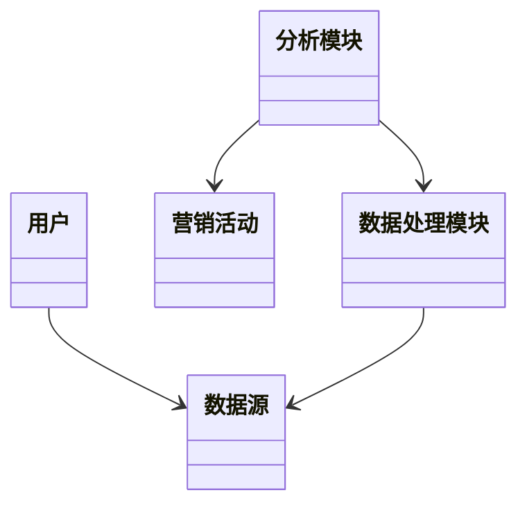
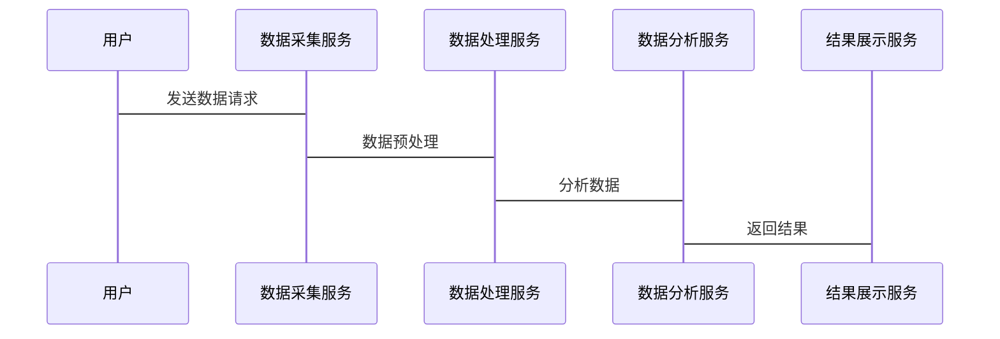

                 


# 如何评估企业的数字化营销效果

## 关键词：数字化营销，效果评估，KPI，数据分析，算法模型

## 摘要：  
在数字化营销时代，企业需要通过科学的方法评估营销活动的效果，以优化资源配置、提升投资回报率。本文从数字化营销的基本概念出发，深入分析评估的核心指标、数据分析方法、算法模型，以及系统架构设计，为企业提供一套完整的评估体系。

---

## 正文

---

### 第一部分: 数字化营销效果评估基础

---

#### 第1章: 数字化营销概述

##### 1.1 数字化营销的定义与特点

###### 1.1.1 数字化营销的定义
数字化营销是指通过数字技术（如互联网、社交媒体、大数据等）与目标客户进行交互、推广产品或服务的营销方式。它以数据驱动为核心，强调精准定位和实时互动。

###### 1.1.2 数字化营销的核心特点
- **数据驱动**：依赖数据进行决策。
- **精准定位**：基于用户行为数据，实现精准投放。
- **实时互动**：通过数字化渠道与客户实时互动。
- **可量化**：可以通过数据指标量化营销效果。

###### 1.1.3 数字化营销与传统营销的区别
| 特性        | 数字化营销                  | 传统营销                  |
|-------------|-----------------------------|---------------------------|
| 渠道        | 网络、社交媒体、App等       | 报纸、电视、广播等         |
| 定位精度    | 高精度，基于用户数据        | 低精度，基于广泛覆盖       |
| 互动性      | 高度互动，实时反馈          | 低互动，单向传播           |
| 数据支持    | 强依赖数据分析              | 较少依赖数据               |

##### 1.2 数字化营销的演变历程

###### 1.2.1 传统营销到数字化营销的演变
- **传统营销**：依赖广告投放和人员推销。
- **互联网营销**：基于PC端的广告投放。
- **移动营销**：基于智能手机的营销。
- **智能营销**：基于AI和大数据的精准营销。

##### 1.3 数字化营销的目标与价值

###### 1.3.1 数字化营销的主要目标
- 提高客户触达率。
- 增加客户转化率。
- 提升客户忠诚度。
- 最小化营销成本。

###### 1.3.2 数字化营销对企业价值的体现
- 优化资源配置。
- 提高营销效率。
- 实现精准投放。
- 支持数据驱动的决策。

---

#### 第2章: 数字化营销效果评估的核心概念

##### 2.1 评估指标与KPI

###### 2.1.1 常见的数字化营销评估指标
- **点击率（CTR）**：广告点击数占展示数的比例。
- **转化率（CR）**：目标行为完成数占总访问数的比例。
- **投资回报率（ROI）**：利润与投入的比率。
- **客户获取成本（CAC）**：获取一个新客户的总成本。
- **客户生命周期价值（CLV）**：客户在生命周期内为企业带来的总收入。

###### 2.1.2 KPI的定义与选择
KPI是衡量营销活动效果的关键指标。选择KPI时，需结合企业的目标和资源。

| KPI类型      | 定义                     | 适用场景                   |
|--------------|--------------------------|---------------------------|
| 点击率（CTR） | 点击广告的用户比例       | 广告投放效果评估           |
| 转化率（CR） | 完成目标行为的用户比例    | 营销活动效果评估           |
| ROI          | 投入与收益的比率         | 财务效益评估               |
| CAC          | 获取客户的平均成本       | 营销成本控制               |
| CLV          | 客户生命周期价值         | 客户价值评估               |

##### 2.2 数据采集与处理

###### 2.2.1 数据采集的常见方法
- **Cookies**：记录用户行为数据。
- **API接口**：通过第三方平台获取数据。
- **埋点技术**：在网页或App中嵌入代码采集数据。

###### 2.2.2 数据清洗与预处理
- 去重：去除重复数据。
- 填充实缺数据。
- 删除异常数据。

##### 2.3 数据分析与建模

###### 2.3.1 数据分析的基本方法
- 描述性分析：了解数据的基本特征。
- 预测性分析：预测未来的趋势。
- 实验性分析：通过A/B测试优化策略。

###### 2.3.2 常见的营销效果评估模型
- **线性回归模型**：预测销售量与广告投入的关系。
- **逻辑回归模型**：预测客户点击广告的概率。
- **决策树模型**：分类客户行为。

##### 2.4 本章小结
本章介绍了数字化营销的核心概念，包括评估指标、数据采集与处理方法，以及数据分析的基本方法。

---

### 第二部分: 数字化营销效果评估的系统分析与架构设计

---

#### 第3章: 数字化营销效果评估的核心算法与模型

##### 3.1 常见的评估算法

###### 3.1.1 点击率预测模型
使用逻辑回归模型预测用户点击广告的概率。

$$ P(y=1|x) = \frac{1}{1 + e^{-\beta x}} $$

其中，$y$是目标变量（点击或不点击），$x$是自变量，$\beta$是系数。

###### 3.1.2 转化率预测模型
使用逻辑回归模型预测用户完成目标行为的概率。

$$ P(y=1|x) = \frac{1}{1 + e^{-\beta x}} $$

##### 3.2 算法原理与实现

###### 3.2.1 点击率预测的Python代码
```python
import pandas as pd
from sklearn.linear_model import LogisticRegression
from sklearn.metrics import accuracy_score

# 数据加载
data = pd.read_csv('click_data.csv')

# 特征提取
X = data[['age', 'gender', 'interest']]
y = data['click']

# 模型训练
model = LogisticRegression()
model.fit(X, y)

# 预测
y_pred = model.predict(X)

# 评估
print('准确率:', accuracy_score(y, y_pred))
```

##### 3.3 算法实现与代码示例

###### 3.3.1 点击率预测的Python代码
如上所示，使用逻辑回归模型预测点击率。

##### 3.4 本章小结
本章详细介绍了常见的评估算法，包括逻辑回归模型，并通过代码示例展示了算法的实现过程。

---

#### 第4章: 数字化营销效果的系统分析与架构设计

##### 4.1 系统分析与需求定义

###### 4.1.1 问题场景介绍
企业希望通过数字化营销提升销售，但缺乏有效的评估体系。

##### 4.1.2 项目目标与范围
目标：构建一个数字化营销效果评估系统。范围：数据采集、数据分析、效果评估。

##### 4.1.3 系统功能需求
- 数据采集模块。
- 数据处理模块。
- 数据分析模块。
- 结果展示模块。

##### 4.2 系统功能设计

###### 4.2.1 领域模型设计（Mermaid类图）


##### 4.3 系统架构设计

###### 4.3.1 系统架构设计（Mermaid架构图）
```mermaid
docker
    services
        数据采集服务
        数据处理服务
        数据分析服务
        结果展示服务
```

##### 4.4 系统接口设计

###### 4.4.1 接口设计（Mermaid序列图）


##### 4.5 本章小结
本章详细介绍了系统分析与架构设计，包括领域模型设计和系统架构设计。

---

### 第三部分: 项目实战与最佳实践

---

#### 第5章: 项目实战

##### 5.1 环境安装与配置

###### 5.1.1 安装必要的库
```bash
pip install pandas numpy scikit-learn matplotlib
```

##### 5.2 核心实现与代码示例

###### 5.2.1 数据采集与处理
```python
import pandas as pd
import requests

# 数据采集
data = requests.get('https://example.com/api/data')
df = pd.DataFrame(data.json())
```

###### 5.2.2 数据分析与建模
```python
from sklearn.model_selection import train_test_split
from sklearn.metrics import classification_report

# 数据分割
X_train, X_test, y_train, y_test = train_test_split(X, y, test_size=0.2)

# 模型训练
model.fit(X_train, y_train)

# 模型评估
print(classification_report(y_test, model.predict(X_test)))
```

##### 5.3 案例分析与解读

###### 5.3.1 案例分析
某电商平台通过数字化营销提升销售额，通过评估点击率和转化率，优化广告投放策略。

##### 5.4 本章小结
本章通过实际案例展示了数字化营销效果评估的实现过程。

---

#### 第6章: 最佳实践与注意事项

##### 6.1 最佳实践

###### 6.1.1 数据质量
确保数据的准确性和完整性。

###### 6.1.2 模型选择
根据业务需求选择合适的模型。

##### 6.2 注意事项

###### 6.2.1 数据隐私
遵守数据隐私保护法规。

###### 6.2.2 模型优化
定期更新模型，避免过时。

##### 6.3 拓展阅读

###### 6.3.1 推荐书籍
- 《数据挖掘导论》
- 《机器学习实战》

---

## 作者：AI天才研究院/AI Genius Institute & 禅与计算机程序设计艺术/Zen And The Art of Computer Programming

---

### 附录：代码示例

#### 附录A: 数据采集与处理代码
```python
import pandas as pd
import requests

# 数据采集
data = requests.get('https://example.com/api/data')
df = pd.DataFrame(data.json())

# 数据清洗
df.dropna(inplace=True)
```

#### 附录B: 数据分析与建模代码
```python
from sklearn.linear_model import LogisticRegression
from sklearn.metrics import accuracy_score

# 数据分割
X_train, X_test, y_train, y_test = train_test_split(X, y, test_size=0.2)

# 模型训练
model = LogisticRegression()
model.fit(X_train, y_train)

# 模型评估
print('准确率:', accuracy_score(y_test, model.predict(X_test)))
```

---

通过以上内容，本文详细讲解了数字化营销效果评估的核心概念、算法模型、系统架构设计以及项目实战，为企业提供了一套完整的评估体系。

