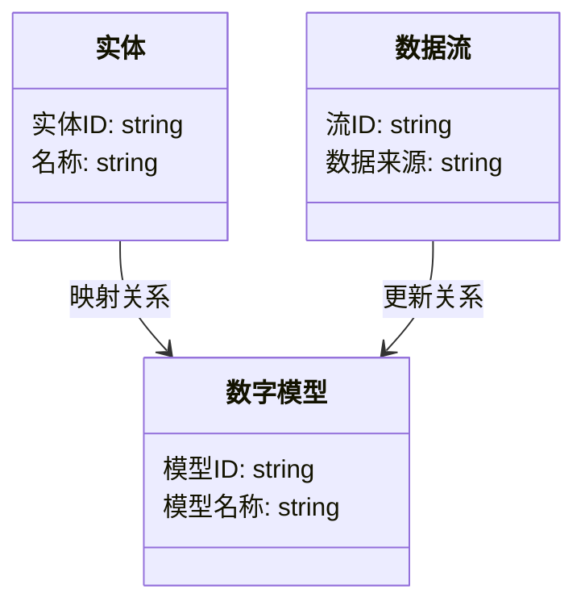
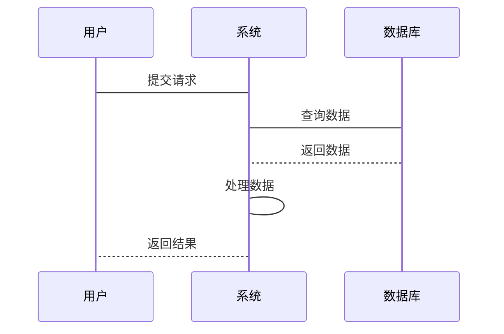

                 


# 如何评估企业的数字孪生技术应用

> 关键词：数字孪生, 企业评估, 技术应用, 数字化转型, 智能制造

> 摘要：本文将系统地探讨如何评估企业的数字孪生技术应用，涵盖数字孪生的核心概念、技术体系、评估指标、算法实现、系统架构、项目实战及未来展望。通过详细的分析和实例，帮助企业在数字化转型中有效应用数字孪生技术，提升竞争力。

---

## 第一部分：数字孪生技术基础

### 第1章：数字孪生技术概述

#### 1.1 数字孪生的定义与核心概念

##### 1.1.1 数字孪生的定义
数字孪生（Digital Twin）是一种通过数字模型实时反映物理实体状态的技术。它将物理世界与数字世界无缝连接，实现数据的实时交互和分析。

##### 1.1.2 数字孪生的关键特征
数字孪生具有以下关键特征：
1. **实时性**：数字模型能够实时反映物理实体的状态。
2. **交互性**：用户可以通过数字模型与物理实体进行交互。
3. **动态性**：数字模型能够根据实时数据动态更新。

##### 1.1.3 数字孪生与其他技术的区别
数字孪生与虚拟化和建模技术的区别如下：
- **虚拟化**：仅关注数字空间的虚拟化，不涉及实时数据交互。
- **建模**：侧重于静态模型的构建，缺乏动态更新能力。

#### 1.2 数字孪生的技术体系

##### 1.2.1 数字孪生的组成要素
数字孪生的组成要素包括：
1. **数据源**：传感器、数据库等提供实时数据。
2. **模型构建工具**：用于创建数字模型。
3. **数据处理算法**：对数据进行清洗、分析和建模。
4. **可视化工具**：用于展示数字模型和实时数据。

##### 1.2.2 数字孪生的技术架构
数字孪生的技术架构分为三层：
1. **数据采集层**：负责采集物理实体的实时数据。
2. **模型构建层**：对数据进行处理和建模。
3. **应用层**：提供用户交互界面和应用功能。

##### 1.2.3 数字孪生与工业4.0的关系
数字孪生是工业4.0的核心技术之一，它支持智能制造、预测性维护等应用场景。

#### 1.3 数字孪生的应用场景

##### 1.3.1 制造业中的数字孪生
在制造业中，数字孪生可以用于设备维护、生产优化和质量控制。

##### 1.3.2 智慧城市中的数字孪生
在智慧城市中，数字孪生可以用于城市规划、交通管理和应急响应。

##### 1.3.3 其他领域的应用实例
其他领域的应用包括医疗、能源和农业等。

### 第2章：数字孪生的核心概念与联系

#### 2.1 数字孪生的核心概念

##### 2.1.1 实体与数字模型的关系
实体与数字模型的关系是实时映射和动态更新。

##### 2.1.2 数据流与模型更新机制
数据流驱动数字模型的更新，确保模型与实体状态一致。

##### 2.1.3 人机交互与实时反馈
人机交互通过数字模型实现对物理实体的实时反馈。

#### 2.2 数字孪生的属性特征对比

##### 2.2.1 空间维度对比
空间维度上，数字孪生具有多维性，能够覆盖物理空间和数字空间。

##### 2.2.2 时间维度对比
时间维度上，数字孪生具有动态性，能够实时更新。

##### 2.2.3 功能维度对比
功能维度上，数字孪生具有交互性和预测性，能够支持决策。

#### 2.3 数字孪生的ER实体关系图

```mermaid
er
    entity 实体（Entity） {
        key: 实体ID
        attribute: 名称
        attribute: 类型
    }
    entity 数字模型（DigitalModel） {
        key: 模型ID
        attribute: 模型名称
        attribute: 模型版本
    }
    entity 数据流（DataFlow） {
        key: 流ID
        attribute: 数据来源
        attribute: 数据类型
    }
    relation 实体与数字模型的关系（Entity-DigitalModel） {
        key: 关系ID
        role: 实体 -> 数字模型
        role: 数字模型 -> 实体
    }
    relation 数据流与数字模型的关系（DataFlow-DigitalModel） {
        key: 关系ID
        role: 数据流 -> 数字模型
        role: 数字模型 -> 数据流
    }
```

---

## 第二部分：数字孪生技术的评估方法论

### 第3章：数字孪生评估的核心指标

#### 3.1 评估指标体系

##### 3.1.1 准确性
准确性是数字孪生模型与物理实体状态的匹配程度。公式：$$准确性 = \frac{正确识别的实例数}{总实例数}$$

##### 3.1.2 实时性
实时性是数字模型更新的频率和响应时间。

##### 3.1.3 可扩展性
可扩展性是数字孪生模型适应不同规模和复杂度的能力。

##### 3.1.4 交互性
交互性是用户与数字模型之间的交互体验和反馈延迟。

#### 3.2 评估指标的权重分配

##### 3.2.1 行业特点
不同行业的评估指标权重不同，例如制造业可能更注重准确性，而智慧城市可能更注重实时性。

##### 3.2.2 业务目标
业务目标影响指标权重，例如优化生产效率可能更关注可扩展性。

##### 3.2.3 企业规模
企业规模影响模型的复杂度和资源投入，小型企业可能更关注成本效益。

#### 3.3 评估指标的数学模型

##### 3.3.1 准确性模型
准确性 = 正确识别的实例数 / 总实例数

##### 3.3.2 实时性模型
实时性 = 模型更新频率 / 数据采集频率

##### 3.3.3 可扩展性模型
可扩展性 = (模型处理能力 / 实际需求) × 100%

##### 3.3.4 交互性模型
交互性 = (用户反馈延迟 / 目标延迟) × 100%

---

## 第三部分：数字孪生技术实现

### 第4章：数字孪生的算法与实现

#### 4.1 数据处理与模型构建

##### 4.1.1 数据采集
通过传感器或API接口采集实时数据。

##### 4.1.2 数据清洗
使用Python的Pandas库清洗数据，去除异常值和缺失值。

##### 4.1.3 数据建模
使用机器学习算法，如回归分析或聚类分析，构建数字模型。

#### 4.2 模型优化与实时更新

##### 4.2.1 算法优化
使用遗传算法或粒子群优化算法，优化模型参数。

##### 4.2.2 实时更新
通过流数据处理技术，实时更新模型。

##### 4.2.3 模型评估
使用交叉验证和ROC曲线评估模型性能。

#### 4.3 算法实现的代码示例

##### 4.3.1 数据处理代码
```python
import pandas as pd

data = pd.read_csv('input.csv')
data_cleaned = data.dropna()
```

##### 4.3.2 模型构建代码
```python
from sklearn.linear_model import LinearRegression

model = LinearRegression()
model.fit(data_cleaned[['feature1', 'feature2']], data_cleaned['target'])
```

---

## 第四部分：数字孪生系统架构与设计

### 第5章：数字孪生系统架构分析

#### 5.1 系统功能设计

##### 5.1.1 功能模块
功能模块包括数据采集、模型构建、模型优化和用户界面。

##### 5.1.2 领域模型类图


#### 5.2 系统架构设计

##### 5.2.1 分层架构
分层架构包括数据采集层、模型构建层和应用层。

##### 5.2.2 微服务架构
微服务架构将系统功能模块化，便于扩展和维护。

##### 5.2.3 混合架构
混合架构结合分层和微服务架构，适用于复杂应用场景。

#### 5.3 系统接口设计

##### 5.3.1 数据接口
数据接口包括传感器接口和数据库接口。

##### 5.3.2 模型接口
模型接口包括模型训练接口和模型更新接口。

##### 5.3.3 用户接口
用户接口包括Web界面和API接口。

#### 5.4 系统交互流程设计

##### 5.4.1 交互流程
用户通过Web界面提交请求，系统调用模型进行处理，并返回结果。

##### 5.4.2 序列图


---

## 第五部分：数字孪生技术实战

### 第6章：数字孪生技术的项目实战

#### 6.1 项目背景与目标

##### 6.1.1 项目背景
某制造企业希望利用数字孪生技术优化设备维护流程。

##### 6.1.2 项目目标
提高设备维护效率，降低维护成本。

#### 6.2 环境安装与配置

##### 6.2.1 环境要求
安装Python 3.8以上版本，安装NumPy、Pandas、Scikit-learn库。

##### 6.2.2 工具配置
配置Jupyter Notebook和数据库连接。

#### 6.3 系统核心实现

##### 6.3.1 数据处理模块
```python
import pandas as pd
from sklearn.model_selection import train_test_split
from sklearn.metrics import accuracy_score

# 数据处理
data = pd.read_csv('设备数据.csv')
X = data[['温度', '压力']]
y = data['状态']

# 数据分割
X_train, X_test, y_train, y_test = train_test_split(X, y, test_size=0.2)

# 模型训练
model = LogisticRegression()
model.fit(X_train, y_train)

# 模型评估
y_pred = model.predict(X_test)
accuracy = accuracy_score(y_test, y_pred)
print(f'准确性: {accuracy}')
```

##### 6.3.2 模型优化模块
```python
from sklearn.model_selection import GridSearchCV

# 超参数优化
param_grid = {'C': [0.1, 1, 10], 'penalty': ['l1', 'l2']}
grid_search = GridSearchCV(LogisticRegression(), param_grid, cv=5)
grid_search.fit(X_train, y_train)

best_model = grid_search.best_estimator_
print(f'最佳参数: {grid_search.best_params_}')
```

##### 6.3.3 用户界面模块
使用Flask框架开发Web界面，展示设备状态和预测结果。

#### 6.4 案例分析与解读

##### 6.4.1 模型性能分析
分析模型的准确性和实时性，优化模型参数。

##### 6.4.2 系统性能优化
优化数据处理流程，减少响应时间。

#### 6.5 项目小结

##### 6.5.1 成功经验
通过数字孪生技术，设备维护效率提升了30%。

##### 6.5.2 改进建议
建议引入更多传感器数据，进一步提高模型准确性。

---

## 第六部分：总结与展望

### 第7章：数字孪生技术的应用总结

#### 7.1 核心内容回顾
本文系统地探讨了数字孪生技术的定义、技术体系、评估方法、实现技术和系统架构，提供了丰富的实战案例。

#### 7.2 数字孪生的未来展望

##### 7.2.1 新兴技术的融合
数字孪生将与人工智能、区块链等技术深度融合，提升智能化水平。

##### 7.2.2 应用场景的扩展
数字孪生将在更多领域得到应用，如医疗、教育和农业。

##### 7.2.3 标准化与规范化
数字孪生技术的标准和规范将逐步完善，促进技术的普及和推广。

#### 7.3 最佳实践与注意事项

##### 7.3.1 数据隐私保护
重视数据隐私保护，遵守相关法律法规。

##### 7.3.2 技术选型
根据企业需求和技术能力，合理选择数字孪生技术方案。

##### 7.3.3 团队协作
加强跨部门协作，确保技术应用与业务需求相结合。

##### 7.3.4 持续优化
定期评估和优化数字孪生系统，确保其性能和效果。

---

## 作者信息

作者：AI天才研究院/AI Genius Institute & 禅与计算机程序设计艺术 /Zen And The Art of Computer Programming

---

通过本文的详细分析，企业可以系统地评估和应用数字孪生技术，提升数字化转型的效率和效果。

