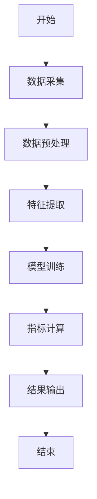
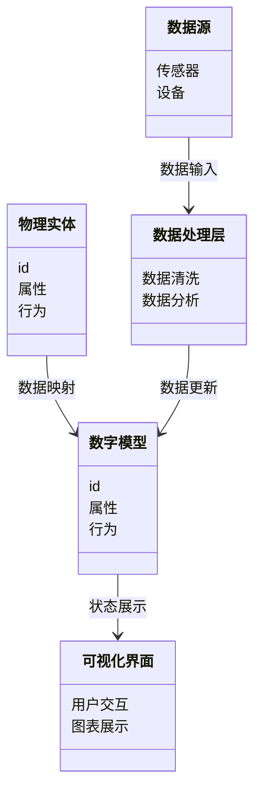
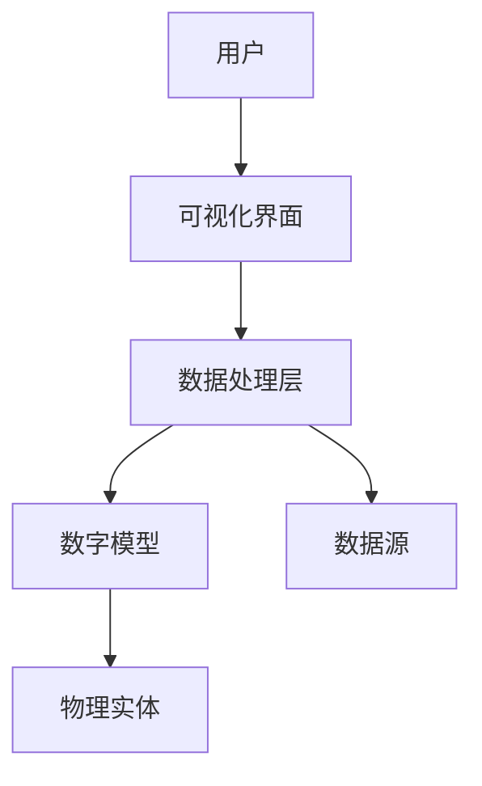
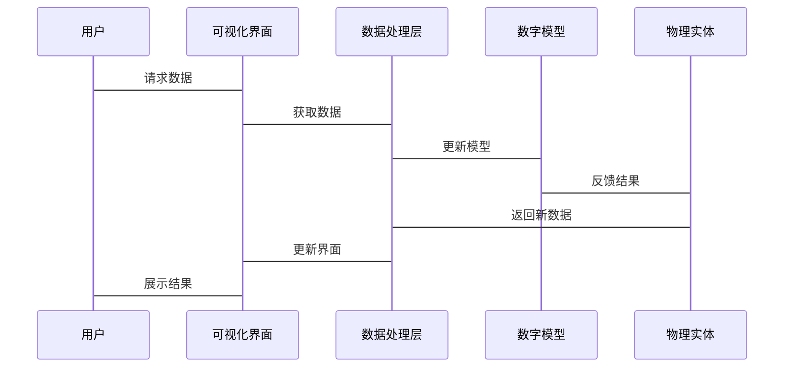

                 


# 如何评估企业的数字孪生技术应用

## 关键词：数字孪生、企业评估、技术应用、系统架构、算法原理、项目实战

## 摘要：  
数字孪生技术作为企业数字化转型的重要工具，正在被广泛应用于各个行业。本文从数字孪生的核心概念出发，详细分析了数字孪生技术在企业中的应用评估方法，包括系统架构设计、算法原理、项目实战以及最佳实践等内容。通过本文的讲解，读者将能够全面了解数字孪生技术的应用价值，并掌握如何在实际场景中进行有效的评估与优化。

---

## 第一部分: 企业数字孪生技术应用评估背景介绍

### 第1章: 数字孪生技术概述

#### 1.1 数字孪生的定义与核心概念

##### 1.1.1 数字孪生的定义  
数字孪生（Digital Twin）是一种通过物理实体的虚拟化表示，结合实时数据、分析模型和软件工具，来模拟、分析和优化物理实体行为的技术。它能够实现物理世界与数字世界的双向实时交互。

##### 1.1.2 数字孪生的核心要素  
- **数据驱动**：基于实时数据的采集与分析。
- **模型构建**：通过建模技术创建虚拟化表示。
- **智能分析**：利用人工智能和大数据技术进行预测和优化。
- **交互与反馈**：支持用户与数字模型的交互，并根据反馈调整物理实体的行为。

##### 1.1.3 数字孪生的实现方法  
- 数据采集：通过传感器、物联网设备等获取物理实体的实时数据。
- 模型构建：基于数据创建三维模型或数据模型。
- 数据分析：利用机器学习、统计分析等方法对数据进行处理。
- 可视化呈现：通过图形界面展示数字孪生的结果。

#### 1.2 数字孪生在企业中的价值

##### 1.2.1 数字孪生对企业业务的影响  
- 提高生产效率：通过实时监控和优化，减少资源浪费。
- 降低运营成本：通过预测性维护减少设备故障。
- 提升决策能力：基于数据驱动的分析，提供更准确的决策支持。

##### 1.2.2 数字孪生对管理效率的提升  
- 实现可视化管理：管理者可以通过数字孪生模型直观了解企业运营状况。
- 支持快速决策：基于实时数据和模拟分析，加快决策过程。
- 优化资源配置：通过数字孪生模型进行资源优化配置。

##### 1.2.3 数字孪生对创新的推动作用  
- 创新设计：通过数字孪生技术进行产品设计和测试，缩短研发周期。
- 创新管理：利用数字孪生进行流程优化和创新管理模式。

#### 1.3 数字孪生技术的现状与发展趋势

##### 1.3.1 数字孪生技术的现状分析  
- 技术成熟度：数字孪生技术在制造业、建筑、医疗等领域已经得到了广泛应用。
- 市场需求：随着企业数字化转型的推进，数字孪生技术的需求持续增长。

##### 1.3.2 数字孪生技术的发展趋势  
- 技术融合：数字孪生将与人工智能、大数据、物联网等技术深度融合。
- 行业扩展：数字孪生技术将从制造业扩展到更多行业，如教育、医疗、交通等。
- 标准化发展：数字孪生相关标准和规范将逐步完善。

##### 1.3.3 数字孪生技术面临的挑战  
- 数据隐私：数字孪生涉及大量数据采集和传输，数据隐私问题亟待解决。
- 技术复杂性：数字孪生技术的实现需要多领域技术的结合，技术复杂性较高。
- 成本问题：数字孪生技术的实施成本较高，中小企业可能难以承担。

---

## 第二部分: 数字孪生技术的核心概念与联系

### 第2章: 数字孪生的核心概念

#### 2.1 数字孪生的核心属性

##### 2.1.1 实时性  
数字孪生模型需要实时反映物理实体的状态，数据采集和处理的延迟越低越好。

##### 2.1.2 可视化  
数字孪生模型需要通过可视化界面展示物理实体的状态和行为，方便用户理解和操作。

##### 2.1.3 智能性  
数字孪生模型需要具备一定的智能性，能够进行预测、优化和自适应调整。

#### 2.2 数字孪生与相关技术的对比

##### 2.2.1 数字孪生与虚拟化技术的区别  
- 数字孪生是基于物理实体的虚拟化表示，而虚拟化技术更广泛，包括计算资源、存储资源的虚拟化。

##### 2.2.2 数字孪生与物联网技术的联系  
- 数字孪生依赖于物联网技术进行数据采集和传输，物联网是数字孪生的基础之一。

##### 2.2.3 数字孪生与大数据技术的结合  
- 数字孪生需要处理大量的实时数据，大数据技术在数据存储、处理和分析方面发挥重要作用。

#### 2.3 数字孪生系统的组成架构

##### 2.3.1 数据采集层  
- 负责采集物理实体的实时数据，包括传感器数据、设备状态数据等。

##### 2.3.2 数据处理层  
- 对采集到的数据进行清洗、转换和分析，生成可供数字模型使用的数据。

##### 2.3.3 模型构建层  
- 基于数据构建数字模型，包括几何模型、行为模型等。

##### 2.3.4 可视化呈现层  
- 通过图形界面展示数字模型的状态和行为，支持用户与模型的交互。

---

### 第3章: 数字孪生技术的应用场景

#### 3.1 制造业中的数字孪生应用

##### 3.1.1 生产线优化  
- 通过数字孪生技术优化生产流程，减少浪费，提高效率。

##### 3.1.2 设备维护与预测  
- 基于数字孪生模型进行设备状态监测和预测性维护。

##### 3.1.3 产品设计与测试  
- 利用数字孪生技术进行产品原型设计和虚拟测试。

#### 3.2 建筑与城市规划中的数字孪生应用

##### 3.2.1 建筑设计与仿真  
- 通过数字孪生技术进行建筑设计优化和仿真测试。

##### 3.2.2 城市规划与管理  
- 基于数字孪生模型进行城市规划和交通管理优化。

##### 3.2.3 设施维护与监控  
- 利用数字孪生技术进行城市基础设施的实时监控和维护。

---

## 第三部分: 数字孪生技术的算法原理

### 第3章: 数字孪生的算法原理

#### 3.1 基于指标的评估方法

##### 3.1.1 算法流程图  


##### 3.1.2 算法数学模型  
$$ \text{指标值} = \sum_{i=1}^{n} w_i \cdot x_i $$
其中，\( w_i \) 是第 \( i \) 个指标的权重，\( x_i \) 是第 \( i \) 个指标的值。

#### 3.2 数字孪生模型的优化算法

##### 3.2.1 基于遗传算法的优化  
遗传算法是一种通过模拟自然选择和遗传机制来寻找最优解的算法，适用于数字孪生模型的参数优化。

##### 3.2.2 基于机器学习的预测模型  
利用机器学习算法（如随机森林、神经网络等）对数字孪生模型的性能进行预测和优化。

---

## 第四部分: 数字孪生技术的系统架构设计

### 第4章: 数字孪生系统的架构设计

#### 4.1 系统功能设计

##### 4.1.1 领域模型设计  


#### 4.2 系统架构设计

##### 4.2.1 系统架构图  


#### 4.3 系统接口设计

##### 4.3.1 API接口设计  
- 数据采集接口：用于获取物理实体的实时数据。
- 模型更新接口：用于更新数字模型的状态和参数。
- 可视化接口：用于展示数字模型的状态和行为。

#### 4.4 系统交互设计

##### 4.4.1 交互序列图  


---

## 第五部分: 数字孪生技术的项目实战

### 第5章: 数字孪生项目的实战分析

#### 5.1 环境安装与配置

##### 5.1.1 开发环境  
- 操作系统：Windows 10 或 macOS
- 开发工具：Python、Jupyter Notebook、Git
- 依赖库：numpy、pandas、matplotlib、scikit-learn

##### 5.1.2 数据采集工具  
- 传感器：Arduino、Raspberry Pi
- 数据采集库：paho-mqtt、pyserial

#### 5.2 系统核心代码实现

##### 5.2.1 数据采集代码  
```python
import paho.mqtt.client as mqtt

def on_connect(client, userdata, flags, rc):
    print("Connected with result code " + str(rc))
    client.subscribe("sensor/data")

def on_message(client, userdata, msg):
    print("Received message: " + msg.payload.decode())
    # 处理数据并更新数字模型

client = mqtt.Client()
client.on_connect = on_connect
client.on_message = on_message
client.connect("mqtt.eclipse.org", 1883, 60)
client.loop_forever()
```

##### 5.2.2 模型构建代码  
```python
from sklearn.ensemble import RandomForestRegressor

# 假设我们有传感器数据和目标变量
X = sensor_data
y = target_variable

model = RandomForestRegressor(n_estimators=100, random_state=42)
model.fit(X, y)

# 预测结果
y_pred = model.predict(X)
```

##### 5.2.3 可视化展示代码  
```python
import matplotlib.pyplot as plt

plt.figure(figsize=(10, 6))
plt.plot(range(len(y)), y, label='实际值')
plt.plot(range(len(y_pred)), y_pred, label='预测值')
plt.xlabel('时间')
plt.ylabel('值')
plt.legend()
plt.show()
```

#### 5.3 项目小结

##### 5.3.1 实战总结  
数字孪生项目的成功实施需要数据采集、模型构建和可视化展示的有机结合。通过代码实现，我们可以看到数字孪生技术在实际中的应用价值。

##### 5.3.2 注意事项  
- 数据质量是关键，必须确保数据的准确性和完整性。
- 模型选择需要根据具体场景进行调整，不能一味追求复杂度。
- 系统安全性需要重视，特别是数据传输和存储环节。

---

## 第六部分: 数字孪生技术的最佳实践

### 第6章: 最佳实践与经验分享

#### 6.1 数字孪生技术的小结

##### 6.1.1 技术总结  
数字孪生技术是一种强大的工具，能够帮助企业实现物理世界与数字世界的无缝连接。

##### 6.1.2 实施经验  
- 从小规模试点开始，逐步推广到全企业。
- 确保数据安全和隐私保护，制定相关规范和策略。

#### 6.2 数字孪生技术的注意事项

##### 6.2.1 技术选型  
- 根据企业需求选择合适的技术方案，避免盲目追求新技术。

##### 6.2.2 人员培养  
- 数字孪生技术的实施需要多领域人才的配合，企业需要加强人员培训。

##### 6.2.3 系统维护  
- 建立完善的系统维护机制，确保数字孪生系统的稳定运行。

#### 6.3 数字孪生技术的拓展阅读

##### 6.3.1 推荐书籍  
- 《Digital Twin: From Concept to Implementation》
- 《Industrial IoT: A Guide to Product Design and Implementation》

##### 6.3.2 推荐博客与资源  
- 数字孪生技术社区
- 物联网技术博客

---

## 作者：AI天才研究院/AI Genius Institute & 禅与计算机程序设计艺术/Zen And The Art of Computer Programming

---

以上是《如何评估企业的数字孪生技术应用》的技术博客文章大纲，希望对您有所帮助！

