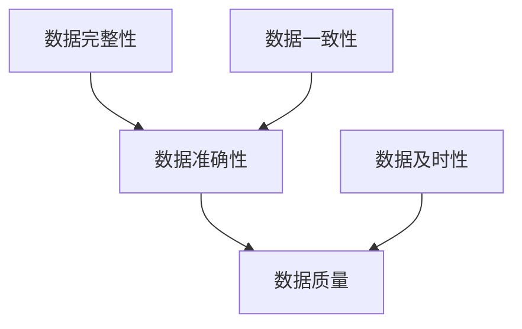
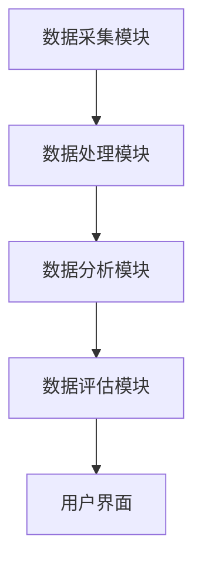

                 


# 如何评估企业的数据变现能力

## 关键词：数据变现、数据资产、数据治理、数据价值、数据 monetization

## 摘要：  
数据作为企业的重要资产，其变现能力直接影响企业的价值和盈利能力。本文将从数据资产的价值评估、数据治理、数据变现模式、数学建模与算法实现、系统架构设计等多个方面，详细分析如何科学评估企业的数据变现能力。通过理论分析与实际案例结合，为企业提供数据变现能力的评估框架和实践指南。

---

# 第一部分：数据变现能力评估的背景与基础

## 第1章：数据资产的价值与重要性

### 1.1 数据资产的定义与特征

#### 1.1.1 数据资产的定义  
数据资产是指企业拥有或控制的、能够为企业创造经济价值的数据资源。数据资产具有可测量性、可共享性、可扩展性等特征，是企业核心竞争力的重要组成部分。

#### 1.1.2 数据资产的特征  
| 特征 | 描述 |
|------|------|
| 无形性 | 数据本身不具有物理形态，但其价值体现在信息内容中。 |
| 可共享性 | 数据可以被多个业务部门或外部合作伙伴共享使用。 |
| 可扩展性 | 数据可以通过分析和挖掘，衍生出更多的价值。 |
| 可塑性 | 数据可以通过不同的分析方法，转化为多种形式的产品或服务。 |

#### 1.1.3 数据资产与传统资产的对比  
以下是数据资产与传统资产的对比表格：  

| 对比维度 | 数据资产 | 传统资产 |
|----------|----------|----------|
| 形态 | 无形 | 有形 |
| 生命周期 | 可持续 | 有限 |
| 价值来源 | 数据的可用性、完整性、准确性 | 实物资产的物理特性 |
| 处理方式 | 需要通过技术手段提取价值 | 直接使用或出售 |

### 1.2 数据资产的价值来源

#### 1.2.1 数据的稀缺性  
数据的稀缺性决定了其市场价值。例如，某些行业中的独特数据（如医疗数据、地理位置数据）往往具有较高的市场价值。

#### 1.2.2 数据的可塑性  
数据可以通过分析和建模转化为多种形式的产品或服务，例如预测模型、个性化推荐等。

#### 1.2.3 数据的可扩展性  
数据可以通过技术手段（如云计算、大数据分析）快速扩展其应用范围和使用场景。

---

## 第2章：数据资产的管理与治理

### 2.1 数据资产管理框架

#### 2.1.1 数据资产管理的目标  
数据资产管理的目标是最大化数据资产的价值，同时降低数据管理的成本和风险。

#### 2.1.2 数据资产管理的流程  
数据资产管理的流程包括：数据采集、数据清洗、数据存储、数据安全、数据分析和数据应用。

#### 2.1.3 数据资产管理的关键环节  
- 数据采集：通过各种渠道获取数据。
- 数据清洗：对数据进行去重、去噪、补全等处理。
- 数据存储：选择合适的存储方式（如数据库、数据仓库、分布式存储）。
- 数据安全：确保数据的安全性和隐私性。
- 数据分析：通过数据分析提取数据价值。
- 数据应用：将数据分析结果应用于业务决策或产品开发。

### 2.2 数据治理的挑战与解决方案

#### 2.2.1 数据治理的主要挑战  
- 数据孤岛问题：数据分散在不同的部门或系统中，难以统一管理。
- 数据质量问题：数据可能存在不一致、不准确或不完整的情况。
- 数据安全问题：数据泄露或被篡改的风险。

#### 2.2.2 数据治理的解决方案  
- 建立数据治理组织：明确数据治理的职责分工。
- 制定数据治理政策：包括数据分类、数据访问权限、数据使用规范等。
- 引入数据治理工具：如数据清洗工具、数据质量管理工具等。

#### 2.2.3 数据治理的最佳实践  
- 数据治理需要跨部门协作，包括IT部门、业务部门、法务部门等。
- 数据治理需要持续进行，数据资产的价值会随着市场变化而变化。
- 数据治理需要结合企业的实际情况，制定灵活的治理策略。

---

# 第二部分：数据变现能力的核心评估方法

## 第3章：数据变现模式的分类与分析

### 3.1 数据变现的主要模式

#### 3.1.1 数据销售  
企业将数据直接出售给第三方，例如出售给广告商、市场研究公司等。

#### 3.1.2 数据服务  
企业通过提供数据分析服务、数据报告服务等，间接实现数据变现。

#### 3.1.3 数据广告  
企业利用数据进行精准营销，例如通过数据定位目标用户，提供个性化广告。

#### 3.1.4 数据授权  
企业将数据授权给第三方使用，例如授权给保险公司、金融机构等进行风险评估。

### 3.2 数据变现模式的选择策略

#### 3.2.1 企业战略目标与数据变现模式的关系  
企业需要根据自身的战略目标选择合适的数据变现模式。例如，互联网企业可能更适合数据广告模式，而金融企业可能更适合数据授权模式。

#### 3.2.2 数据资产的特点与变现模式的匹配  
- 数据的类型：结构化数据、非结构化数据。
- 数据的敏感性：高敏感数据、低敏感数据。
- 数据的规模：大规模数据、小规模数据。

#### 3.2.3 市场环境与数据变现模式的调整  
市场环境的变化会影响数据变现模式的选择。例如，当市场竞争加剧时，企业可能需要通过数据服务模式来提升竞争力。

---

## 第4章：数据变现能力的评估指标与模型

### 4.1 数据变现能力的评估指标

#### 4.1.1 数据资产的质量评估  
- 数据的准确性：数据是否反映了真实情况。
- 数据的完整性：数据是否涵盖了所有需要的信息。
- 数据的及时性：数据是否及时更新。

#### 4.1.2 数据资产的流动性评估  
- 数据的可访问性：数据是否可以被快速获取。
- 数据的可转换性：数据是否可以被转换为其他形式的产品或服务。

#### 4.1.3 数据资产的收益能力评估  
- 数据的市场价值：数据在市场上的需求情况。
- 数据的盈利能力：数据变现模式的收入情况。

### 4.2 数据变现能力的数学模型构建

#### 4.2.1 数据资产价值的评估公式  
$$ V = Q \times L \times R $$  
其中，\( V \) 表示数据资产的价值，\( Q \) 表示数据资产的质量，\( L \) 表示数据资产的流动性，\( R \) 表示数据资产的收益能力。

#### 4.2.2 数据资产质量的评估模型  
以下是数据资产质量的评估模型：  



---

# 第三部分：数据变现能力的系统分析与架构设计

## 第5章：数据变现能力评估的系统架构

### 5.1 系统功能设计

#### 5.1.1 数据采集模块  
功能：从企业内外部数据源（如数据库、API、文件等）采集数据。  
实现：使用爬虫技术、数据库连接等方式进行数据采集。

#### 5.1.2 数据处理模块  
功能：对采集到的数据进行清洗、转换、存储等处理。  
实现：使用Python的Pandas库进行数据清洗和处理。

#### 5.1.3 数据分析模块  
功能：对数据进行分析和建模，评估数据资产的价值。  
实现：使用机器学习算法（如回归分析、聚类分析）进行数据建模。

#### 5.1.4 数据评估模块  
功能：根据评估指标和模型，输出数据资产的评估结果。  
实现：使用Python的Scikit-learn库进行模型评估。

### 5.2 系统架构设计

#### 5.2.1 系统架构图  
以下是系统架构图：  



#### 5.2.2 系统交互图  
以下是系统交互图：  

```mermaid
graph TD
    User --> A[数据采集模块]: 提供数据源
    A --> B[数据处理模块]: 传输数据
    B --> C[数据分析模块]: 请求分析
    C --> D[数据评估模块]: 输出评估结果
    D --> User: 显示结果
```

---

## 第6章：数据变现能力评估的算法实现

### 6.1 数据资产价值评估算法

#### 6.1.1 算法原理  
数据资产价值评估算法基于数据资产的质量、流动性和收益能力进行综合评估。算法采用加权平均的方法，将各项指标的权重相乘，最终得出数据资产的价值。

#### 6.1.2 算法实现代码  

```python
import pandas as pd
from sklearn.metrics import r2_score

def data_asset_value_assessment(data_quality, data_liability, data_revenue):
    # 数据质量权重
    q_weight = 0.4
    # 数据流动性权重
    l_weight = 0.3
    # 数据收益能力权重
    r_weight = 0.3

    # 数据价值计算
    data_value = data_quality * q_weight + data_liability * l_weight + data_revenue * r_weight

    return data_value

# 示例数据
data_quality = 0.8
data_liability = 0.7
data_revenue = 0.6

# 调用函数
data_value = data_asset_value_assessment(data_quality, data_liability, data_revenue)
print(f"数据资产价值为：{data_value}")
```

---

## 第7章：数据变现能力评估的实际案例分析

### 7.1 案例背景介绍

#### 7.1.1 案例概述  
某互联网公司希望通过数据变现实现额外收入。公司拥有大量用户行为数据，包括用户的点击流数据、购买记录、浏览时长等。

#### 7.1.2 案例目标  
评估用户行为数据的变现能力，选择合适的数据变现模式（如数据广告、数据销售等）。

### 7.2 数据分析与评估

#### 7.2.1 数据清洗与预处理  
使用Pandas库对用户行为数据进行清洗和预处理，包括去除重复数据、填补缺失值等。

#### 7.2.2 数据分析与建模  
使用机器学习算法（如逻辑回归、随机森林）对用户行为数据进行分析，评估数据的可变现能力。

#### 7.2.3 数据变现模式的选择  
根据数据分析结果，选择适合的数据变现模式。例如，如果用户行为数据适合精准营销，可以选择数据广告模式。

---

## 第8章：数据变现能力评估的总结与展望

### 8.1 总结

通过本文的分析，我们可以得出以下结论：  
1. 数据资产是企业的重要资源，其变现能力直接影响企业的价值。  
2. 数据变现模式的选择需要结合企业的实际情况和市场环境。  
3. 数据资产的评估需要综合考虑数据质量、流动性和收益能力。

### 8.2 注意事项

- 数据资产的评估需要结合企业的实际情况，制定灵活的评估策略。  
- 数据资产的管理和治理需要持续进行，确保数据的安全性和准确性。  
- 数据资产的变现需要遵守相关法律法规，保护用户隐私。

### 8.3 拓展阅读

- 《数据驱动的商业变革》  
- 《数据科学实战指南》  
- 《企业数据治理框架》  

---

# 作者：AI天才研究院/AI Genius Institute & 禅与计算机程序设计艺术 /Zen And The Art of Computer Programming

---

通过以上内容，我们详细分析了如何评估企业的数据变现能力，从数据资产的价值评估到系统架构设计，为企业提供了全面的指导和实践方案。

