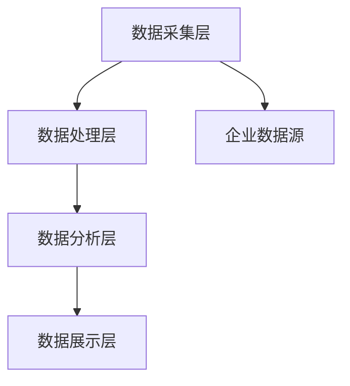

                 


# 如何评估企业的数据治理能力

> 关键词：数据治理，企业能力评估，数据质量，数据安全，数据整合

> 摘要：数据治理是企业信息化建设中的核心问题之一，如何科学、系统地评估企业的数据治理能力，是企业在数字化转型中必须面对的挑战。本文从数据治理的核心概念出发，逐步分析数据治理能力评估的框架、方法和实现路径，为企业提供一套完整的评估体系。

---

## 第一部分：数据治理概述

### 第1章：数据治理的核心概念

#### 1.1 数据治理的定义与背景

数据治理（Data Governance）是指对企业中数据的全生命周期进行规划、监控和优化的过程，旨在确保数据的准确性、完整性和安全性。随着企业数字化转型的深入，数据已成为企业的核心资产，数据治理的重要性愈发凸显。

#### 1.2 数据治理的核心问题

数据治理涉及多个关键问题：

1. **数据质量**：数据的准确性、一致性、完整性。
2. **数据安全**：数据的保密性、完整性、可用性。
3. **数据整合与共享**：数据的统一管理与有效共享。
4. **数据生命周期管理**：从数据生成到归档、销毁的全生命周期管理。

#### 1.3 数据治理的核心要素

数据治理的核心要素包括：

- **数据质量**：数据的准确性、一致性、完整性。
- **数据安全**：数据的保密性、完整性、可用性。
- **数据整合与共享**：数据的统一管理与有效共享。
- **数据生命周期管理**：从数据生成到归档、销毁的全生命周期管理。

---

## 第2章：数据治理能力评估的框架

### 2.1 数据治理能力评估的维度

数据治理能力评估可以从以下几个维度展开：

1. **数据战略与组织架构**：企业是否有明确的数据战略，组织架构是否支持数据治理。
2. **数据管理流程与制度**：数据管理流程是否规范，制度是否完善。
3. **数据技术与工具支持**：是否具备支持数据治理的技术和工具。
4. **数据文化与员工意识**：员工是否具备数据意识，是否积极参与数据治理。

### 2.2 数据治理能力评估的指标体系

为了科学评估企业的数据治理能力，可以构建以下指标体系：

| 评估维度       | 评估指标                     | 评估方法               |
|----------------|------------------------------|------------------------|
| 数据战略与组织架构 | 数据治理领导小组是否成立     | 调查与文件审查         |
|                | 数据治理战略是否清晰         | 文件审查与访谈         |
| 数据管理流程与制度 | 数据管理制度是否完善         | 文件审查与流程分析     |
|                | 数据质量管理流程是否规范     | 流程审查与访谈         |
| 数据技术与工具支持 | 数据治理技术是否先进         | 技术审查与工具评估     |
|                | 数据治理工具是否支持         | 工具评估与使用情况调查 |
| 数据文化与员工意识 | 员工数据意识是否强           | 调查与访谈             |
|                | 数据治理培训是否到位         | 培训记录审查与访谈     |

---

## 第3章：数据治理能力评估的实现方法

### 3.1 数据治理能力评估的理论模型

数据治理能力评估的理论模型可以表示为一个系统化的框架：

$$ \text{数据治理能力} = f(\text{数据战略}, \text{组织架构}, \text{数据流程}, \text{技术支持}) $$

其中，$f$ 表示综合评估函数，需要根据具体企业的实际情况进行调整。

### 3.2 数据治理能力评估的数学模型

为了量化评估企业的数据治理能力，可以构建以下数学模型：

$$ \text{数据治理能力评分} = w_1 \times S + w_2 \times O + w_3 \times F + w_4 \times T $$

其中：
- $S$ 表示数据战略评分，权重 $w_1$。
- $O$ 表示组织架构评分，权重 $w_2$。
- $F$ 表示数据流程评分，权重 $w_3$。
- $T$ 表示技术支持评分，权重 $w_4$。

---

## 第4章：数据治理能力评估的系统实现

### 4.1 数据治理能力评估系统的设计

数据治理能力评估系统可以分为以下几个层次：

1. **数据采集层**：采集企业的数据战略、组织架构、数据流程和技术支持的相关信息。
2. **数据处理层**：对采集到的数据进行清洗、转换和标准化处理。
3. **数据分析层**：基于数学模型对数据进行分析，计算出数据治理能力评分。
4. **数据展示层**：将分析结果以图表形式展示，便于企业理解和改进。

### 4.2 数据治理能力评估系统的架构图



### 4.3 数据治理能力评估系统的实现代码

以下是一个简单的数据治理能力评分计算示例代码：

```python
def calculate_data_governance_score(strategy_score, organization_score, process_score, technology_score):
    weight_strategy = 0.3
    weight_organization = 0.2
    weight_process = 0.3
    weight_technology = 0.2
    
    total_score = (weight_strategy * strategy_score +
                   weight_organization * organization_score +
                   weight_process * process_score +
                   weight_technology * technology_score)
    return total_score

# 示例数据
strategy_score = 80
organization_score = 70
process_score = 85
technology_score = 75

# 计算总分
total_score = calculate_data_governance_score(strategy_score, organization_score, process_score, technology_score)
print(f"数据治理能力总分：{total_score}")
```

---

## 第5章：数据治理能力评估的实战案例

### 5.1 案例背景

某大型制造企业希望评估自身的数据治理能力，以优化数据管理流程。

### 5.2 案例分析

1. **数据战略**：企业已制定数据战略，但目标不够明确。
2. **组织架构**：数据治理领导小组已成立，但职责划分不清晰。
3. **数据流程**：数据质量管理流程较为完善，但缺乏自动化工具支持。
4. **技术支持**：数据治理工具较为落后，无法满足当前需求。

### 5.3 案例结论

通过评估，企业的数据治理能力得分为72分，属于中等水平。建议企业从以下几个方面进行改进：

1. **优化数据战略**：明确数据治理目标。
2. **完善组织架构**：清晰职责分工。
3. **引入先进技术**：升级数据治理工具。

---

## 第6章：数据治理能力评估的注意事项与最佳实践

### 6.1 注意事项

1. 数据治理能力评估是一个持续的过程，需要定期进行复盘和优化。
2. 数据治理能力评估需要结合企业的实际情况，避免生搬硬套。
3. 数据治理能力评估结果的应用是关键，需要与企业的实际业务相结合。

### 6.2 最佳实践

1. **建立数据治理文化**：通过培训和宣传，提高员工的数据意识。
2. **引入智能化工具**：利用AI和大数据技术，提升数据治理效率。
3. **持续优化流程**：根据评估结果，不断优化数据管理流程。

---

## 结语

企业数据治理能力评估是一项复杂但重要的任务。通过科学的评估框架和方法，企业可以更好地识别数据管理中的问题，并采取有效的改进措施。未来，随着技术的不断进步，数据治理能力评估将更加智能化和自动化，为企业创造更大的价值。

---

## 作者

作者：AI天才研究院/AI Genius Institute & 禅与计算机程序设计艺术 /Zen And The Art of Computer Programming

