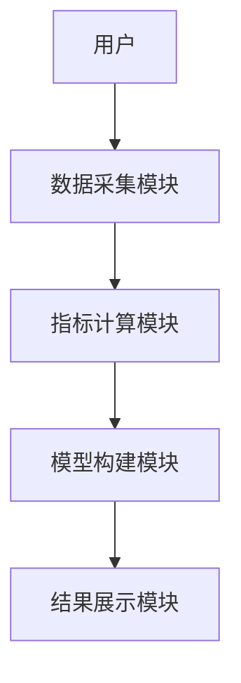
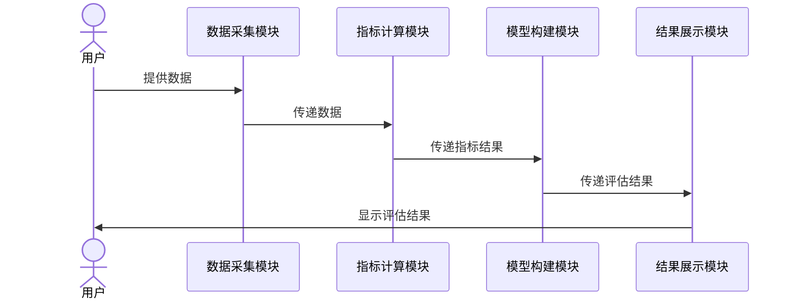

                 

# 如何评估企业的生态系统价值

> 关键词：企业生态系统、价值评估、层次分析法、熵权法、系统架构、综合评价模型

> 摘要：企业生态系统是一个复杂的系统，其价值评估需要从多个维度进行综合分析。本文将从企业生态系统的核心要素出发，详细讲解企业生态系统价值评估的算法原理、系统架构设计以及实际项目中的应用。通过案例分析和最佳实践，帮助读者掌握企业生态系统价值评估的方法和技巧。

---

# 第一部分: 企业生态系统价值评估的背景与概念

## 第1章: 企业生态系统概述

### 1.1 企业生态系统的基本概念

#### 1.1.1 企业的定义与特征
企业的定义是一个组织，通过提供产品或服务来满足客户需求并实现盈利。企业的核心特征包括：目标明确性、组织结构化、资源依赖性、社会互动性。

#### 1.1.2 生态系统的定义与特征
生态系统是由生物群落和其非生物环境相互作用而形成的复杂系统。其特征包括：多样性、动态性、相互依存性、适应性。

#### 1.1.3 企业生态系统的核心要素
企业生态系统由以下核心要素组成：
- **核心业务**：企业的主营业务和核心竞争力。
- **资源与能力**：企业拥有的资源（如资金、技术、人才）和能力（如研发、生产、营销）。
- **组织结构**：企业的组织架构和管理模式。
- **社会环境**：包括政策、法律、市场、文化等外部因素。
- **利益相关者**：股东、客户、供应商、员工、合作伙伴等。

### 1.2 企业生态系统价值评估的必要性

#### 1.2.1 企业生态系统的重要性
企业生态系统是企业生存和发展的基础。一个健康的生态系统能够为企业提供竞争优势，增强企业的韧性和适应能力。

#### 1.2.2 价值评估的目的与意义
企业生态系统价值评估的目的是为了帮助企业识别自身的优势和劣势，优化资源配置，提升整体竞争力。其意义在于：
- 为企业的战略决策提供数据支持。
- 帮助企业识别外部环境的变化，及时调整策略。
- 为企业的价值创造和价值传递提供方向。

#### 1.2.3 当前企业生态系统评估的挑战
当前企业生态系统评估的挑战包括：
- 数据获取困难：企业生态系统涉及多个维度的数据，获取全面数据较为复杂。
- 方法选择困难：不同的评估方法适用于不同的场景，选择合适的评估方法需要深入分析。
- 动态变化的环境：企业生态系统是一个动态系统，评估结果需要定期更新。

### 1.3 企业生态系统价值评估的现状与趋势

#### 1.3.1 国内外研究现状
国内外对企业生态系统价值评估的研究主要集中在以下几个方面：
- 基于层次分析法（AHP）的企业价值评估。
- 基于熵权法的企业生态价值评估。
- 综合多种方法构建的企业生态系统价值评估模型。

#### 1.3.2 企业生态系统评估的最新趋势
随着技术的进步，企业生态系统价值评估的最新趋势包括：
- 数据驱动的评估方法：利用大数据和人工智能技术进行评估。
- 多维度综合评估：从财务、市场、社会等多个维度进行综合评估。
- 动态评估模型：能够实时反映企业生态系统的变化。

#### 1.3.3 技术进步对企业生态系统评估的影响
技术进步为企业生态系统评估提供了新的工具和方法，例如：
- 数据挖掘技术：帮助企业获取和分析海量数据。
- 人工智能技术：用于构建动态评估模型。
- 区块链技术：用于确保数据的真实性和可追溯性。

### 1.4 本章小结
本章从企业生态系统的基本概念出发，阐述了企业生态系统价值评估的必要性、挑战以及当前的研究现状和趋势。通过分析，我们可以看到企业生态系统价值评估是一个复杂但重要的任务，需要结合多种方法和技术进行综合评估。

---

## 第2章: 企业生态系统价值评估的核心概念与联系

### 2.1 企业生态系统价值的核心要素

#### 2.1.1 企业的核心竞争力
企业的核心竞争力是企业在市场上独特的优势，包括技术、品牌、服务等方面。

#### 2.1.2 企业的资源与能力
企业的资源和能力是企业生态系统的重要组成部分，包括人力资源、财务资源、技术资源等。

#### 2.1.3 企业的组织结构与文化
企业的组织结构和文化决定了企业的运作方式和员工的行为模式，影响企业的生态系统价值。

### 2.2 企业生态系统价值的构成要素

#### 2.2.1 企业的财务价值
企业的财务价值包括资产、负债、所有者权益等财务指标。

#### 2.2.2 企业的市场价值
企业的市场价值包括市场份额、品牌价值、客户忠诚度等。

#### 2.2.3 企业的社会价值
企业的社会价值包括企业对社会的贡献、社会责任、品牌形象等。

### 2.3 企业生态系统价值与外部环境的关系

#### 2.3.1 宏观环境对企业生态系统的影响
宏观环境包括经济、政治、社会、技术等因素，这些因素对企业生态系统的价值评估有重要影响。

#### 2.3.2 微观环境对企业生态系统的影响
微观环境包括行业竞争、供应商、客户等，这些因素直接影响企业的生态系统价值。

#### 2.3.3 企业生态系统对外部环境的反馈作用
企业生态系统通过自身的运作，对宏观和微观环境产生反馈作用，例如技术创新、就业创造等。

### 2.4 本章小结
本章分析了企业生态系统价值的核心要素以及与外部环境的关系，强调了企业生态系统是一个动态的、相互依存的系统。企业生态系统价值的评估需要综合考虑财务、市场和社会等多个维度。

---

## 第3章: 企业生态系统价值评估的算法原理

### 3.1 层次分析法（AHP）的应用

#### 3.1.1 层次分析法的基本原理
层次分析法是一种定性与定量相结合的决策分析方法，适用于多目标决策问题。

#### 3.1.2 层次分析法的步骤与流程
1. 构建层次分析结构图。
2. 确定各层次的权重。
3. 计算各选项的综合得分。

#### 3.1.3 层次分析法在企业生态系统评估中的应用
例如，我们可以将企业生态系统价值评估的目标分解为财务价值、市场价值和社会价值三个维度，每个维度下再细分为具体的指标。

---

### 3.2 熵权法的应用

#### 3.2.1 熵权法的基本原理
熵权法是一种基于数据分布特征的权重计算方法，适用于指标数量较多的情况。

#### 3.2.2 熵权法的计算步骤
1. 计算各指标的熵值。
2. 计算各指标的权重。
3. 计算各选项的综合得分。

#### 3.2.3 熵权法在企业生态系统评估中的应用
例如，我们可以将企业生态系统价值评估的指标进行熵权法计算，得到每个指标的权重。

---

### 3.3 综合评价模型的构建

#### 3.3.1 综合评价模型的构建步骤
1. 确定评价目标和评价指标。
2. 确定评价方法和权重分配。
3. 计算各选项的综合得分。
4. 对结果进行排序和分析。

#### 3.3.2 综合评价模型的数学表达式
综合评价模型的数学表达式为：
$$
S_i = \sum_{j=1}^{n} w_j x_{ij}
$$
其中，$S_i$ 为第 $i$ 个方案的综合得分，$w_j$ 为第 $j$ 个指标的权重，$x_{ij}$ 为第 $i$ 个方案在第 $j$ 个指标上的得分。

#### 3.3.3 综合评价模型的实际应用案例
例如，我们可以将某科技企业的财务价值、市场价值和社会价值作为评价指标，构建综合评价模型，计算其生态系统价值。

### 3.4 本章小结
本章介绍了层次分析法和熵权法两种常用的评估方法，并结合实际案例展示了如何构建综合评价模型。这些方法为企业生态系统价值评估提供了理论依据和实践指导。

---

## 第4章: 企业生态系统价值评估的系统架构与设计

### 4.1 问题场景介绍

#### 4.1.1 企业生态系统价值评估的目标
目标是通过系统化的方法，对企业生态系统进行综合评估，为企业决策提供支持。

#### 4.1.2 企业生态系统价值评估的范围
范围包括企业的核心业务、资源、组织结构、外部环境等多个方面。

#### 4.1.3 企业生态系统价值评估的约束条件
约束条件包括数据获取的限制、评估方法的适用性等。

### 4.2 系统功能设计

#### 4.2.1 数据采集模块
数据采集模块负责收集企业的财务数据、市场数据和社会数据。

#### 4.2.2 指标计算模块
指标计算模块根据收集的数据，计算各个评价指标的得分。

#### 4.2.3 模型构建模块
模型构建模块根据指标计算结果，构建综合评价模型。

#### 4.2.4 结果展示模块
结果展示模块将评估结果以可视化的方式呈现给用户。

### 4.3 系统架构设计

#### 4.3.1 系统架构图

#### 4.3.2 系统交互流程

### 4.4 本章小结
本章从系统架构的角度，详细设计了企业生态系统价值评估的各个模块和交互流程。通过系统的构建，我们可以实现对企业生态系统价值的高效评估。

---

## 第5章: 企业生态系统价值评估的项目实战

### 5.1 项目背景与目标

#### 5.1.1 项目背景
本项目旨在评估某科技企业的生态系统价值，帮助企业识别自身的优势和劣势，优化资源配置。

#### 5.1.2 项目目标
- 构建企业生态系统价值评估模型。
- 计算企业的综合得分。
- 提供优化建议。

### 5.2 项目实施步骤

#### 5.2.1 环境配置
安装所需的软件和工具，包括数据分析工具、编程语言等。

#### 5.2.2 数据收集
收集企业的财务数据、市场数据和社会数据。

#### 5.2.3 指标计算
根据收集的数据，计算各个评价指标的得分。

#### 5.2.4 模型应用
构建综合评价模型，计算企业的综合得分。

#### 5.2.5 结果分析
分析评估结果，提出优化建议。

### 5.3 项目小结
本章通过一个实际案例，展示了企业生态系统价值评估的整个过程。通过项目的实施，我们可以看到理论与实践的结合，帮助企业实现价值提升。

---

## 第6章: 企业生态系统价值评估的最佳实践

### 6.1 最佳实践 tips

#### 6.1.1 选择合适的评估方法
根据企业的具体情况选择合适的评估方法，如层次分析法、熵权法等。

#### 6.1.2 定期更新评估结果
企业生态系统是一个动态系统，评估结果需要定期更新。

#### 6.1.3 结合定性与定量分析
在评估过程中，结合定性分析和定量分析，确保结果的全面性和准确性。

### 6.2 小结
企业生态系统价值评估是一个复杂但重要的任务。通过最佳实践的总结，我们可以更好地指导未来的评估工作。

### 6.3 注意事项
- 数据的准确性和完整性。
- 方法的适用性和可操作性。
- 结果的可解释性和可操作性。

### 6.4 拓展阅读
- 《企业价值评估方法与应用》
- 《生态系统理论与实践》

### 6.5 本章小结
本章总结了企业生态系统价值评估的最佳实践，为读者提供了实用的建议和指导。

---

## 作者：AI天才研究院/AI Genius Institute & 禅与计算机程序设计艺术 /Zen And The Art of Computer Programming

---

通过以上结构化的内容，我们可以系统地了解如何评估企业的生态系统价值。从理论到实践，从方法到系统设计，本文为企业生态系统价值评估提供了全面的指导和参考。

