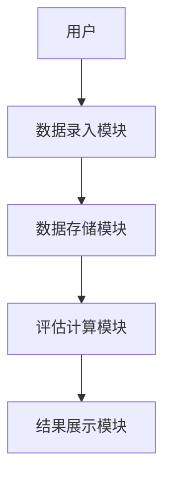

                 


# 如何评估企业的知识产权价值

> 关键词：知识产权价值评估、专利评估、商标评估、版权评估、知识产权战略

> 摘要：知识产权是企业的重要资产之一，其价值评估对企业的发展战略、融资和并购活动具有重要意义。本文从知识产权的基本概念出发，详细探讨了不同类型知识产权的评估方法，包括层次分析法、收益法和市场法等，并通过实际案例展示了如何应用这些方法进行价值评估。文章还提供了详细的数学模型和系统架构设计，帮助读者全面理解知识产权价值评估的流程和技巧。

---

# 第一部分: 企业知识产权价值评估的背景与核心概念

## 第1章: 知识产权价值评估的背景介绍

### 1.1 知识产权的基本概念

#### 1.1.1 知识产权的定义与范围
知识产权是指人们在创造性的智力劳动成果中所享有的法律权利，主要包括专利、商标、版权和商业秘密等形式。这些权利为企业提供了法律保护，防止他人未经许可使用或模仿其创新成果。

#### 1.1.2 知识产权的核心要素
- **创新性**：知识产权的价值往往与其创新性直接相关，创新性越高，其市场竞争力越强。
- **法律状态**：知识产权的有效期和法律保护力度直接影响其价值。
- **市场需求**：知识产权的应用前景和市场需求决定了其经济价值。

#### 1.1.3 知识产权的法律保护框架
知识产权的保护主要通过专利法、商标法、版权法和反不正当竞争法等法律体系实现。这些法律为企业提供了明确的保护范围和侵权责任认定标准。

### 1.2 企业知识产权价值评估的重要性

#### 1.2.1 知识产权在企业中的战略地位
知识产权不仅是企业的无形资产，还是企业在市场竞争中的核心竞争力。通过知识产权评估，企业可以更好地制定研发、许可和投资策略。

#### 1.2.2 知识产权价值评估的现实需求
在企业融资、并购和上市过程中，知识产权的价值评估是不可或缺的环节。准确的评估结果能够帮助企业和投资者做出合理的决策。

#### 1.2.3 知识产权价值评估对企业决策的影响
通过评估知识产权的价值，企业可以了解其资产的实际价值，优化资产配置，并制定合理的知识产权保护和运用策略。

---

## 第2章: 知识产权价值评估的核心概念与联系

### 2.1 知识产权的类型与特点

#### 2.1.1 专利
- **定义**：专利是对发明的保护，包括发明专利、实用新型专利和外观设计专利。
- **特点**：保护期限较长（通常为20年），具有较高的技术门槛。

#### 2.1.2 商标
- **定义**：商标是用于区分商品或服务来源的标识。
- **特点**：具有显著性和持续性，可以通过注册获得更强的法律保护。

#### 2.1.3 版权
- **定义**：版权是对文学、艺术和科学作品的保护。
- **特点**：保护期限相对较短，通常为作者 lifetime plus 50年。

#### 2.1.4 商业秘密
- **定义**：商业秘密是指未公开的、具有商业价值的技术或经营信息。
- **特点**：保密性强，保护期限不确定，但一旦泄露，价值可能迅速下降。

### 2.2 知识产权价值评估的关键要素

#### 2.2.1 技术创新性
技术创新性是决定知识产权价值的核心因素。技术创新性越高的专利或技术，其市场竞争力越强，评估价值也越高。

#### 2.2.2 市场需求
市场需求决定了知识产权的经济价值。一项技术如果市场需求旺盛，其评估价值也会相应提高。

#### 2.2.3 法律状态
知识产权的法律状态直接影响其价值。例如，专利的剩余有效期、是否存在侵权风险等因素都会影响其评估价值。

#### 2.2.4 经济效益
经济效益是知识产权价值的最终体现。通过评估知识产权的经济效益，可以确定其在企业资产中的实际价值。

### 2.3 知识产权价值评估的流程与方法

#### 2.3.1 数据收集与整理
评估知识产权价值的第一步是收集相关数据，包括技术资料、市场信息、法律文件等。这些数据是评估的基础。

#### 2.3.2 评估模型的选择
根据具体情况选择合适的评估模型，如层次分析法、收益法或市场法等。

#### 2.3.3 评估结果的验证
对评估结果进行验证，确保其合理性和准确性。可以通过比较不同模型的评估结果或参考市场案例进行验证。

---

## 第3章: 知识产权价值评估的算法原理

### 3.1 基于层次分析法的评估模型

#### 3.1.1 层次分析法的基本原理
层次分析法（AHP）是一种用于多准则决策分析的方法，适用于复杂的评估问题。其基本原理是将评估问题分解为多个层次，每个层次包含多个因素，通过比较各因素的重要性来确定其权重。

#### 3.1.2 评估指标的权重计算
通过构造比较矩阵，计算各因素的特征向量和特征值，从而确定各因素的权重。

#### 3.1.3 综合价值的计算公式
综合价值可以通过以下公式计算：
$$ V = \sum_{i=1}^{n} w_i \cdot v_i $$
其中，$w_i$ 是第i个因素的权重，$v_i$ 是第i个因素的评分。

### 3.2 基于收益法的评估模型

#### 3.2.1 收益法的基本原理
收益法是通过预测知识产权在未来产生的收益，结合适当的折现率，计算其现值。

#### 3.2.2 未来收益的预测方法
未来收益可以通过市场分析、技术预测等方法进行预测。

#### 3.2.3 折现率的确定
折现率通常基于市场利率、行业平均水平或风险调整后的回报率。

### 3.3 基于市场法的评估模型

#### 3.3.1 市场法的基本原理
市场法是通过比较类似知识产权的市场交易价格，确定其价值。

#### 3.3.2 可比交易的选取与分析
选择与目标知识产权相似的交易案例，分析其交易价格和相关因素。

#### 3.3.3 价值倍数的计算
通过比较可比交易的价值倍数，确定目标知识产权的价值。

---

## 第4章: 知识产权价值评估的数学模型与公式

### 4.1 层次分析法的数学模型

#### 4.1.1 指标权重的计算公式
$$ A = \lambda_{\text{最大特征值}} / n $$

### 4.2 收益法的数学模型

#### 4.2.1 未来收益的折现公式
$$ V = \sum_{t=1}^{n} \frac{CF_t}{(1 + r)^t} $$

### 4.3 市场法的数学模型

#### 4.3.1 价值倍数的计算公式
$$ V = \text{可比公司平均倍数} \times \text{目标公司指标值} $$

---

# 第五部分: 项目实战与系统设计

## 第5章: 项目实战

### 5.1 环境安装与数据准备

#### 5.1.1 环境安装
安装Python和相关库（如numpy、pandas、scipy）。

#### 5.1.2 数据准备
收集专利、商标等知识产权的相关数据，包括技术资料、市场信息和法律文件。

### 5.2 系统核心实现

#### 5.2.1 层次分析法的实现
```python
import numpy as np

def calculate_weights(matrix):
    eigenvalues, eigenvectors = np.linalg.eig(matrix)
    max_eigenvalue = eigenvalues.max()
    weights = eigenvectors[:, np.argmax(eigenvalues)] / eigenvectors[:, np.argmax(eigenvalues)].sum()
    return weights
```

#### 5.2.2 收益法的实现
```python
def calculate_future_value(revenue, discount_rate):
    return sum(revenue / (1 + discount_rate) ** t for t in range(len(revenue)))
```

### 5.3 代码解读与分析

#### 5.3.1 层次分析法
上述代码通过计算比较矩阵的最大特征值和特征向量，确定各因素的权重。

#### 5.3.2 收益法
上述代码通过预测未来收益并进行折现，计算知识产权的现值。

### 5.4 实际案例分析

#### 5.4.1 案例背景
某企业拥有一项专利技术，预计未来5年的收益分别为100万、120万、150万、180万和200万。

#### 5.4.2 评估过程
使用层次分析法确定各因素的权重，假设权重为0.3、0.4、0.2和0.1。

#### 5.4.3 评估结果
综合价值为：
$$ V = 0.3 \times 100 + 0.4 \times 120 + 0.2 \times 150 + 0.1 \times 180 = 123 \text{万} $$

---

## 第6章: 系统架构设计

### 6.1 系统功能设计

#### 6.1.1 数据录入模块
用户可以输入知识产权的相关数据，包括技术资料、市场信息和法律文件。

#### 6.1.2 评估计算模块
根据选择的评估模型，计算知识产权的价值。

#### 6.1.3 结果展示模块
以图表形式展示评估结果，便于用户理解和分析。

### 6.2 系统架构图


### 6.3 系统交互设计

#### 6.3.1 用户与系统的交互流程
用户输入数据 -> 系统计算评估价值 -> 系统展示结果。

#### 6.3.2 关键接口设计
- 数据录入接口：`POST /api/input`
- 评估计算接口：`POST /api/calculate`
- 结果展示接口：`GET /api/results`

---

## 第7章: 总结与展望

### 7.1 项目总结
通过本文的介绍，读者可以全面了解知识产权价值评估的方法和流程，掌握实际应用中的关键技巧。

### 7.2 注意事项
在实际应用中，需要注意数据的准确性和模型的适用性，避免因数据偏差或模型选择不当导致评估结果不准确。

### 7.3 拓展阅读
推荐阅读《知识产权评估实务》和《企业价值评估方法》等书籍，以进一步提升对知识产权价值评估的理解。

---

作者：AI天才研究院/AI Genius Institute & 禅与计算机程序设计艺术 /Zen And The Art of Computer Programming

