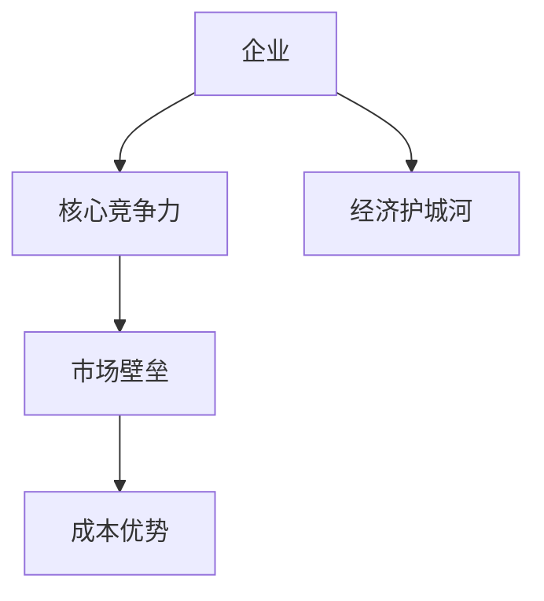
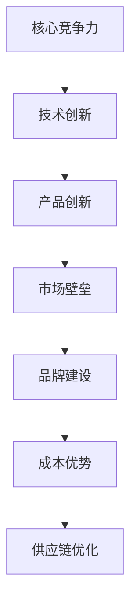

                 

# 如何评估企业的经济护城河

> 关键词：经济护城河、企业竞争优势、市场壁垒、核心竞争力、企业价值评估、商业策略

> 摘要：本文将系统地探讨如何评估企业的经济护城河，从核心概念、理论基础到实际应用，结合案例分析和数学模型，全面解析企业如何构建和强化自身竞争优势，确保在激烈的市场竞争中立于不败之地。

---

# 第一部分: 企业经济护城河的核心概念与背景

## 第1章: 经济护城河的定义与背景

### 1.1 经济护城河的核心概念

经济护城河（Economic Moat）是企业在市场竞争中建立的长期竞争优势，通过形成市场壁垒，使竞争对手难以复制或超越。这些壁垒可以是技术、品牌、成本、资源或商业模式等方面的优势。经济护城河的本质在于为企业创造可持续的超额利润，增强企业的抗风险能力。

### 1.2 经济护城河的背景与重要性

在当今快速变化的商业环境中，企业面临的竞争日益激烈。经济护城河不仅是企业生存的关键，更是其长期发展的基石。通过建立经济护城河，企业可以有效防御竞争对手的进攻，同时吸引更多的客户和资源，巩固市场地位。

### 1.3 经济护城河的边界与外延

经济护城河并非无边界的概念。它需要明确企业的核心竞争优势，并将其与外部环境相结合。经济护城河的外延包括企业生态系统、供应链管理、客户关系等，这些因素共同构成了企业竞争优势的全方位保障。

### 1.4 经济护城河的核心要素组成

- **核心竞争力**：企业的独特技术和能力，使其在市场中具备不可替代性。
- **市场准入壁垒**：通过专利、品牌、规模经济等手段，阻止竞争对手进入市场。
- **成本优势**：通过技术创新和规模效应，降低生产成本，提高产品性价比。

---

# 第二部分: 经济护城河的理论与分析框架

## 第2章: 经济护城河的理论基础

### 2.1 经济护城河的理论模型

经济护城河的理论基础主要来源于资源基础观（Resource-Based View）和价值链分析（Value Chain Analysis）。资源基础观强调企业内部资源的独特性和不可模仿性，而价值链分析则关注企业如何通过优化内部流程创造价值。

### 2.2 经济护城河的分析框架

- **波特五力模型**：分析行业竞争环境，包括潜在进入者的威胁、替代品的威胁、供应商的议价能力、买家的议价能力以及现有竞争者之间的竞争。
- **SWOT分析**：评估企业的优势（Strengths）、劣势（Weaknesses）、机会（Opportunities）和威胁（Threats）。
- **护城河强度评估模型**：通过综合评估企业的核心竞争力、市场壁垒和成本优势，量化其经济护城河的强度。

### 2.3 经济护城河的数学模型与公式

护城河强度指数公式：

$$ \text{护城河强度} = \frac{\text{核心竞争力} + \text{市场壁垒}}{\text{行业平均值}} $$

市场份额与护城河关系的线性回归模型：

$$ \text{市场份额} = a \times \text{护城河强度} + b $$

### 2.4 经济护城河的ER实体关系图

---

# 第三部分: 经济护城河的评估方法

## 第3章: 经济护城河的定量评估方法

### 3.1 财务指标分析

- **净利润率**：反映企业的盈利能力，较高的净利润率通常意味着较强的市场地位和成本控制能力。
- **资产周转率**：衡量企业利用资产创造收入的能力，高周转率表明企业运营效率高。
- **市盈率与市净率**：市盈率反映市场对企业盈利能力的预期，市净率则反映企业资产的市场价值。

### 3.2 市场地位分析

- **市场占有率**：企业在市场中的份额越大，通常意味着其经济护城河越强。
- **品牌影响力**：强大的品牌可以帮助企业建立客户忠诚度，形成市场竞争优势。

### 3.3 案例分析

以某科技公司为例，通过分析其财务指标和市场地位，评估其经济护城河的强度。

---

## 第4章: 经济护城河的定性评估方法

### 4.1 竞争优势分析

- **技术优势**：企业是否拥有独特的技术或专利，使其在行业中保持领先地位。
- **商业模式创新**：企业是否通过独特的商业模式，如订阅制或平台模式，创造新的市场机会。

### 4.2 市场反应测试

- **客户忠诚度**：通过调查或实验，评估客户对企业的依赖程度。
- **竞争对手分析**：研究竞争对手的策略，评估企业护城河的有效性。

---

# 第四部分: 企业经济护城河的实际应用

## 第5章: 企业如何构建经济护城河

### 5.1 系统架构设计

企业经济护城河的系统架构设计需要综合考虑企业内部资源和外部环境。通过优化企业内部流程和利用外部资源，构建一个可持续的竞争优势体系。

### 5.2 系统功能设计

- **核心竞争力模块**：包括技术研发、产品创新等。
- **市场壁垒模块**：包括品牌建设、专利申请等。
- **成本优势模块**：包括供应链优化、生产效率提升等。

### 5.3 系统架构图

---

## 第6章: 经济护城河的风险管理与应对策略

### 6.1 风险识别

- **竞争对手的威胁**：竞争对手可能通过模仿或创新削弱企业的护城河。
- **市场变化的威胁**：市场环境的变化可能影响企业的竞争优势。

### 6.2 风险应对策略

- **持续创新**：通过不断的技术创新和产品升级，保持竞争优势。
- **动态调整策略**：根据市场变化和竞争对手的动向，灵活调整企业战略。

### 6.3 预警机制

建立预警机制，及时发现潜在风险，并采取有效措施进行应对。

---

# 第五部分: 项目实战与案例分析

## 第7章: 项目实战

### 7.1 项目背景与需求分析

选择一家企业作为案例，分析其经济护城河的现状，识别存在的问题，并提出优化建议。

### 7.2 系统设计与实现

- **需求分析**：明确项目目标和范围。
- **系统设计**：基于需求分析，设计系统的功能模块和架构。
- **系统实现**：根据设计文档，编写代码，实现系统功能。

### 7.3 系统测试与优化

对系统进行全面测试，发现并修复问题，确保系统稳定运行。

### 7.4 项目小结

总结项目实施过程中的经验教训，提出改进建议。

---

# 第六部分: 最佳实践与总结

## 第8章: 最佳实践

### 8.1 关键要点总结

- **动态评估**：经济护城河需要持续评估和优化。
- **数据驱动**：利用数据分析工具，精准评估企业的竞争优势。
- **差异化策略**：根据企业的实际情况，制定差异化的竞争策略。

### 8.2 小结

经济护城河是企业在市场竞争中立于不败之地的关键，通过系统化的评估和优化，企业可以有效应对竞争压力，实现可持续发展。

---

# 结语

通过本文的系统分析和案例解读，读者可以全面了解如何评估和构建企业的经济护城河。从理论到实践，从分析到优化，每一步都需要精心设计和实施。希望本文能够为企业提供有价值的指导和启示。

---

作者：AI天才研究院/AI Genius Institute & 禅与计算机程序设计艺术 /Zen And The Art of Computer Programming

