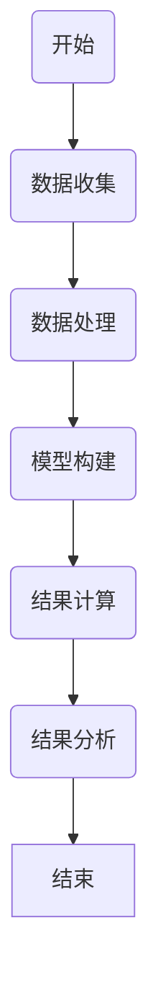
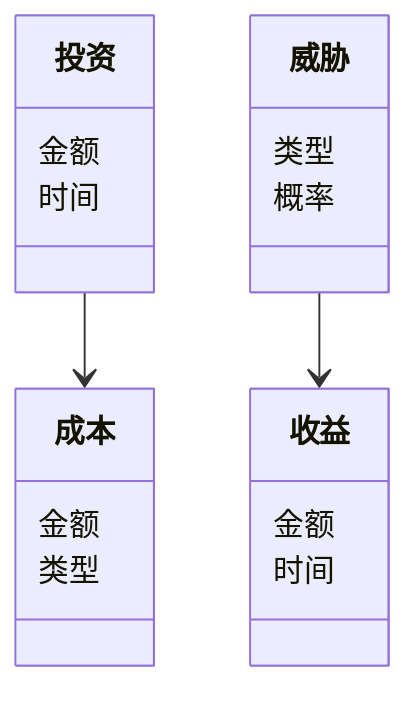
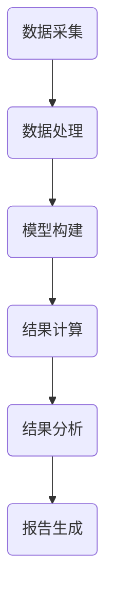

                 


# 如何评估企业的网络安全投资回报

## 关键词：网络安全、投资回报、风险管理、成本效益分析、威胁建模

## 摘要：本文系统地探讨了如何评估企业的网络安全投资回报，从背景介绍、核心概念到算法原理、系统设计，再到项目实战和最佳实践，提供了全面的指导。

---

## 第1章：网络安全投资回报评估的背景与重要性

### 1.1 问题背景

随着数字化转型的推进，网络安全已成为企业运营的关键部分。然而，企业在安全上的投入不断增加，如何评估这些投入的回报变得至关重要。企业面临的主要挑战包括缺乏统一的评估标准、难以量化安全措施的效益，以及如何在有限预算内优化资源分配。

### 1.2 问题描述

网络安全投资回报评估涉及多个方面，包括确定哪些安全措施有效、如何量化其效果，以及如何将这些效果转化为可衡量的经济收益。问题的核心在于如何将安全措施的成本与带来的效益进行对比，找到最优的投资组合。

### 1.3 问题解决

通过建立科学的评估框架，企业可以系统地分析各项安全投资的效果，识别高回报的安全措施，优化资源配置，降低安全风险，提升整体安全防护能力。

### 1.4 边界与外延

评估的边界包括企业内部的网络和数据安全，而外延则涉及第三方供应商的安全、供应链安全等。评估不仅关注直接成本，还考虑间接成本和机会成本。

---

## 第2章：网络安全投资回报的核心概念

### 2.1 核心概念原理

网络安全投资回报涉及成本效益分析、风险管理、概率论等多个方面。关键概念包括净现值、内部收益率、预期损失等，这些指标帮助企业量化安全投资的效果。

### 2.2 概念属性特征对比

表2-1：网络安全投资与一般投资的对比

| 属性           | 一般投资         | 网络安全投资   |
|----------------|------------------|----------------|
| 投资类型       | 资本性支出       | 资本性支出     |
| 回报类型       | 财务回报         | 风险降低       |
| 时间范围       | 中长期           | 短期至中长期   |
| 不可逆性       | 部分            | 高             |

---

## 第3章：网络安全投资回报评估的算法原理

### 3.1 算法流程

使用mermaid绘制的流程图如下：



### 3.2 代码实现

```python
def calculate_return(investment, cost, benefit):
    return (benefit - (investment + cost)) / investment * 100
```

### 3.3 数学模型

净现值（NPV）计算公式：

$$ NPV = \sum_{t=1}^{n} \frac{C_t}{(1 + r)^t} $$

其中，$C_t$ 是第t年的现金流，$r$ 是贴现率。

内部收益率（IRR）计算公式：

$$ NPV = 0 = \sum_{t=1}^{n} \frac{C_t}{(1 + IRR)^t} $$

示例计算：

投资 = $100,000，成本 = $20,000，收益 = $150,000

$$ ROI = \frac{150,000 - 120,000}{100,000} \times 100\% = 30\% $$

---

## 第4章：系统分析与架构设计

### 4.1 问题场景

企业面临多次网络攻击，希望通过评估优化安全投入，降低风险。

### 4.2 系统功能设计

领域模型类图如下：



### 4.3 系统架构设计

系统架构图如下：



---

## 第5章：项目实战

### 5.1 环境安装

安装Python和相关库，如NumPy和Pandas。

### 5.2 核心实现

```python
import numpy as np
import pandas as pd

def calculate_return(investment, cost, benefit):
    return (benefit - (investment + cost)) / investment * 100

# 示例数据
investment = 100000
cost = 20000
benefit = 150000
roi = calculate_return(investment, cost, benefit)
print(f"ROI: {roi}%")
```

### 5.3 案例分析

分析一个中型企业的网络攻击案例，评估不同安全措施的投资回报，优化预算分配。

---

## 第6章：最佳实践与总结

### 6.1 小结

网络安全投资回报评估是企业优化安全投入的关键，需结合定性和定量分析，考虑多种因素。

### 6.2 注意事项

确保数据准确，考虑不可预见风险，定期评估。

### 6.3 未来展望

人工智能和大数据技术将提升评估的精确性，推动数据驱动的安全决策。

作者：AI天才研究院 & 禅与计算机程序设计艺术

