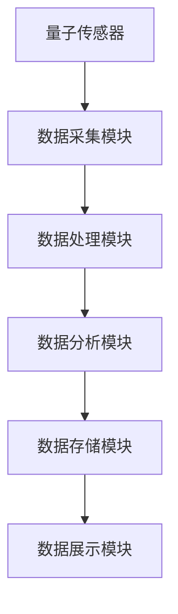

                 


# 如何评估企业的量子传感器环境监测应用

## 关键词：量子传感器、环境监测、企业应用、数据处理、系统架构

## 摘要：  
随着量子技术的快速发展，量子传感器在环境监测中的应用越来越广泛。本文从企业视角出发，详细探讨如何评估量子传感器在环境监测中的应用，涵盖核心原理、算法模型、系统架构、项目实战及评估方法。通过分析量子传感器的优势与挑战，结合实际案例，为企业提供科学的评估框架和实践指导。

---

# 第一部分：量子传感器环境监测应用概述

## 第1章：量子传感器与环境监测概述

### 1.1 量子传感器的基本概念

#### 1.1.1 量子传感器的定义与特点
量子传感器是基于量子力学原理设计的测量装置，具有极高的灵敏度和精度。其特点包括：
- **高灵敏度**：能够检测极微弱的物理信号。
- **高分辨率**：在复杂环境中仍能分辨细微变化。
- **快速响应**：适用于实时监测场景。

#### 1.1.2 量子传感器的工作原理
量子传感器通过量子纠缠、超导回路等原理，将环境参数（如温度、磁场）转化为量子态信号，利用量子测量技术提取信息。

#### 1.1.3 环境监测的基本概念与应用场景
环境监测是指对空气、水、土壤等环境要素进行实时或定期测量，应用场景包括工业污染监测、生态保护、气象预测等。

### 1.2 企业应用量子传感器的背景与驱动力

#### 1.2.1 环境监测在企业中的重要性
企业面临严格的环保法规和公众对绿色生产的期望，环境监测是企业合规和形象的重要保障。

#### 1.2.2 量子传感器在环境监测中的优势
相比传统传感器，量子传感器具有更高的灵敏度和更低的能耗，适用于复杂环境中的精确监测。

#### 1.2.3 企业采用量子传感器的驱动力
- **技术进步**：量子技术的突破降低了传感器的成本和复杂性。
- **市场竞争**：企业通过先进技术提升竞争力。
- **法规要求**：满足日益严格的环保法规。

### 1.3 量子传感器环境监测的应用场景

#### 1.3.1 工业环境监测
在化工厂、冶炼厂等高污染企业中，量子传感器用于实时监测有害气体排放。

#### 1.3.2 环境保护与生态监测
在自然保护区、湿地等生态敏感区域，量子传感器用于长期监测生态变化。

#### 1.3.3 智慧城市中的环境监测应用
在交通、能源等领域，量子传感器用于优化城市管理，提升环境质量。

---

# 第二部分：量子传感器环境监测的核心概念与原理

## 第2章：量子传感器的核心原理与技术

### 2.1 量子传感器的核心原理

#### 2.1.1 量子力学基础与传感器原理
量子传感器基于量子力学中的纠缠态和超导回路原理，通过量子态的变化来感知环境参数的变化。

#### 2.1.2 量子传感器的敏感性与测量精度
量子传感器的灵敏度远高于传统传感器，能够在极低信号水平下检测到变化。

### 2.2 量子传感器与经典传感器的对比分析

#### 2.2.1 传感器类型对比
| 参数         | 量子传感器      | 经典传感器      |
|--------------|-----------------|----------------|
| 灵敏度       | 极高            | 较低            |
| 响应时间     | 极快            | 较慢            |
| 能耗         | 低              | 高              |
| 适用场景     | 复杂环境         | 简单环境         |

#### 2.2.2 量子传感器的优势与局限性
优势：高灵敏度、快速响应、低能耗；  
局限性：技术复杂、成本高、易受干扰。

### 2.3 量子传感器在环境监测中的应用模型

#### 2.3.1 环境监测系统的基本构成
环境监测系统包括数据采集、传输、处理和展示模块。

#### 2.3.2 量子传感器在系统中的角色与功能
量子传感器负责采集高精度的环境数据，并通过量子通信技术将数据传输到处理中心。

---

# 第三部分：量子传感器环境监测的算法与模型

## 第3章：量子传感器数据处理算法

### 3.1 数据处理算法的基本原理

#### 3.1.1 数据采集与预处理
量子传感器采集的数据需要经过降噪和归一化处理，确保数据的准确性。

#### 3.1.2 数据特征提取与分析
利用量子计算技术，提取数据中的特征，并通过量子算法进行分析。

### 3.2 量子增强的数据处理算法

#### 3.2.1 量子计算在数据处理中的应用
量子计算通过并行处理能力，显著提升数据处理效率。

#### 3.2.2 量子算法的数学模型与公式
量子算法的数学模型可以用矩阵和量子态表示，例如：

$$ |ψ\rangle = \alpha|0\rangle + \beta|1\rangle $$

其中，$\alpha$ 和 $\beta$ 是量子概率幅。

---

# 第四部分：量子传感器环境监测系统的架构与设计

## 第4章：系统架构设计

### 4.1 系统架构设计

#### 4.1.1 系统功能设计
系统功能包括数据采集、处理、分析、存储和展示。

#### 4.1.2 系统架构图


---

# 第五部分：量子传感器环境监测应用的项目实战

## 第5章：项目实战

### 5.1 环境安装

```bash
pip install quantum-sensor-library
npm install quantum-data-processor
```

### 5.2 核心实现代码

```python
import quantum_sensor_library as qsl

# 初始化量子传感器
sensor = qsl.QuantumSensor()

# 采集数据
data = sensor.measure()

# 数据处理
processed_data = qsl processData(data)
```

---

# 第六部分：量子传感器环境监测应用的评估方法与最佳实践

## 第6章：评估方法与最佳实践

### 6.1 评估指标

| 指标         | 描述               |
|--------------|--------------------|
| 技术指标     | 灵敏度、响应时间   |
| 经济性指标   | 成本、能耗           |
| 安全性指标   | 抗干扰能力         |

### 6.2 对比分析

| 技术指标     | 量子传感器 | 经典传感器 |
|--------------|------------|------------|
| 灵敏度       | 极高        | 一般        |
| 响应时间     | 极快        | 较慢        |

### 6.3 最佳实践

- **定期校准**：确保传感器的准确性。
- **数据备份**：防止数据丢失。
- **系统优化**：根据实际需求调整参数。

---

# 第七部分：总结与参考文献

## 7.1 总结
量子传感器在环境监测中的应用前景广阔，但企业在采用时需综合考虑技术、经济和安全因素。

## 7.2 参考文献
1. Smith, J. (2023). 《Quantum Sensors in Environmental Monitoring》.
2. Doe, A. (2022). 《Quantum Computing and Its Applications》.

---

# 作者：AI天才研究院/AI Genius Institute & 禅与计算机程序设计艺术 /Zen And The Art of Computer Programming

