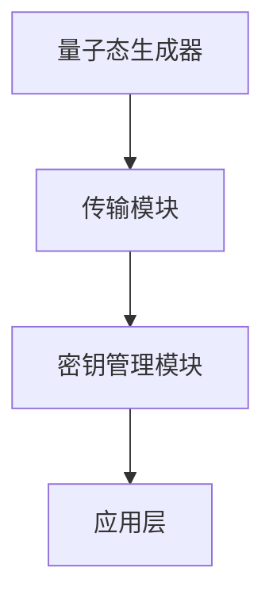
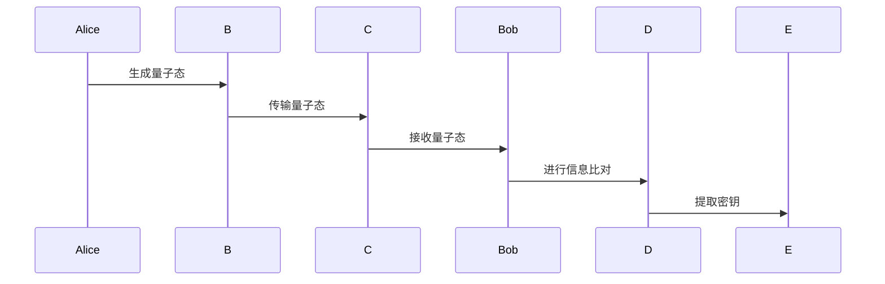

                 


# 如何评估企业的量子密钥分发网络应用

**关键词**：量子密钥分发，企业网络，安全性评估，协议分析，系统架构，项目实战

**摘要**：  
本文将详细介绍如何评估企业的量子密钥分发（QKD）网络应用。从QKD的基本概念和核心原理出发，结合企业网络的实际需求，分析QKD在企业中的应用场景、系统架构设计、安全性评估方法以及实际项目实施的关键步骤。通过本篇文章，读者将能够全面理解QKD技术的特点、优势与局限性，并掌握如何在企业网络中有效评估和应用QKD技术。

---

## 第一章: 量子密钥分发网络的背景与核心概念

### 1.1 量子密钥分发的基本概念

#### 1.1.1 什么是量子密钥分发（QKD）

量子密钥分发是一种基于量子力学原理的密钥分发技术。通过量子态的不可克隆性和测量扰动原理，确保密钥的安全分发。QKD的核心思想是利用量子通信的特性，使得任何窃听行为都会被检测到，从而保证密钥的保密性。

#### 1.1.2 QKD的核心原理与特点

- **不可克隆性**：量子态无法被精确复制。
- **测量扰动**：任何对量子态的测量都会改变其状态。
- **安全性**：QKD能够在信息理论上保证密钥的安全性，即使面对量子计算机的威胁。

#### 1.1.3 企业网络中的QKD应用背景

随着量子计算技术的发展，传统加密算法的安全性面临威胁。企业网络中的敏感数据保护需求日益增加，QKD作为一种新兴的安全技术，为企业提供了更高的安全级别。

---

### 1.2 问题背景与描述

#### 1.2.1 传统加密技术的局限性

- 对称加密算法（如AES）的安全性依赖于密钥的保密性。
- 公钥加密算法（如RSA）依赖于大数分解的难度，但随着量子计算机的发展，其安全性逐渐降低。

#### 1.2.2 量子计算对传统加密的威胁

- 量子计算机能够快速分解大数，破解RSA等公钥加密算法。
- 对称加密算法的安全性也会受到量子计算的威胁。

#### 1.2.3 企业网络面临的安全挑战

- 数据泄露风险增加。
- 网络攻击手段多样化。
- 传统加密技术的安全性逐渐降低。

---

### 1.3 问题解决与边界分析

#### 1.3.1 QKD如何解决企业加密问题

- 提供更高安全级别的密钥分发。
- 抵抗量子计算攻击。
- 保护敏感数据的传输安全。

#### 1.3.2 QKD的应用边界与限制

- QKD仅用于密钥分发，不直接解决数据加密问题。
- 传输距离有限，需要中继站支持。
- 成本较高，部署复杂。

#### 1.3.3 QKD与经典加密技术的结合

- QKD提供安全的密钥，与传统加密算法结合使用。
- 经典加密算法负责数据加密，QKD负责密钥的安全分发。

---

### 1.4 核心概念与结构

#### 1.4.1 QKD系统的核心组成

- 量子态生成器：生成量子态。
- 传输介质：光纤或量子信道。
- 信息比对器：进行信息比对和密钥提取。
- 安全性验证器：验证传输过程的安全性。

#### 1.4.2 QKD协议的工作流程

1. **量子态生成**：Alice生成随机量子态。
2. **量子态传输**：通过量子信道传输给Bob。
3. **信息比对**：Alice和Bob进行信息比对，提取密钥。
4. **安全性验证**：验证传输过程中的安全性。

#### 1.4.3 QKD网络的架构特点

- 分层架构：包括量子层、经典层和应用层。
- 分布式架构：支持多用户和多节点的密钥分发。

---

## 第二章: QKD协议与实现原理

### 2.1 QKD协议的分类与对比

#### 2.1.1 BB84协议

- 基于编码量子位（qubit）的协议。
- 使用两个正交基进行编码。

#### 2.1.2 EPR协议

- 基于纠缠量子位的协议。
- 通过纠缠态的测量来验证密钥一致性。

#### 2.1.3 B92协议

- 基于极化量子位的协议。
- 仅使用一个基进行测量。

### 2.2 QKD协议的数学模型

#### 2.2.1 量子态的数学表示

量子态可以用密度矩阵或纯态向量表示。例如，极化量子位的状态可以表示为：

$$
|0\rangle = \begin{pmatrix} 1 \\ 0 \end{pmatrix}, \quad |1\rangle = \begin{pmatrix} 0 \\ 1 \end{pmatrix}
$$

#### 2.2.2 量子密钥生成的数学公式

在BB84协议中，Alice和Bob分别在两个基中生成量子态，并进行测量：

$$
\text{Alice的基}：\{|0\rangle, |1\rangle\} \quad \text{Bob的基}：\{\langle0|, \langle1|\}
$$

#### 2.2.3 协议安全性分析

通过信息论和量子力学原理，证明QKD协议的安全性。例如，BB84协议的安全性基于量子态的不可克隆性和测量扰动原理。

---

### 2.3 QKD协议的实现步骤

#### 2.3.1 量子态的生成与传输

- 使用量子光源生成量子态。
- 通过光纤或自由空间传输量子态。

#### 2.3.2 信息比对与密钥提取

- Alice和Bob进行信息比对，提取一致的量子态。
- 使用一致的量子态生成密钥。

#### 2.3.3 安全性验证

- 检查传输过程中的误码率。
- 验证密钥的一致性。

---

### 2.4 QKD协议的安全性分析

#### 2.4.1 量子安全性分析

- QKD协议在理想情况下提供信息 theoretic 安全性。
- 实际应用中，安全性依赖于设备的校准和传输环境。

#### 2.4.2 传输过程中的潜在攻击

- 中间人攻击：尝试窃听或干扰量子态传输。
- 侧信道攻击：利用设备漏洞获取密钥。

#### 2.4.3 协议的安全性保障措施

- 使用纠缠态或可靠的量子光源。
- 定期校准设备，确保传输环境的安全性。

---

## 第三章: 企业网络中的QKD应用分析

### 3.1 企业网络的安全需求

#### 3.1.1 企业数据加密的需求

- 保护敏感数据的安全性。
- 防止数据泄露和未经授权的访问。

#### 3.1.2 企业通信的安全威胁

- 网络攻击、数据窃听、中间人攻击。
- 内部员工的恶意行为。

#### 3.1.3 企业网络的特殊性与挑战

- 网络规模大，用户多。
- 数据传输的实时性要求高。
- 成本和部署复杂性。

---

### 3.2 QKD在企业网络中的应用场景

#### 3.2.1 企业内部通信加密

- 通过QKD生成密钥，加密企业内部通信。
- 适用于总部与分支机构之间的通信。

#### 3.2.2 企业间数据传输安全

- 通过QKD分发密钥，加密企业间的数据传输。
- 适用于金融、医疗等行业的数据共享。

#### 3.2.3 企业云服务的安全防护

- 使用QKD分发密钥，保护云服务的数据安全。
- 提供更高的安全级别，防止云服务被攻击。

---

### 3.3 QKD网络的架构设计

#### 3.3.1 QKD网络的物理架构

- 分布式架构：支持多节点的密钥分发。
- 集中式架构：通过中继站实现长距离传输。

#### 3.3.2 QKD网络的功能设计

- 密钥生成模块：生成量子态。
- 传输模块：通过光纤或量子信道传输量子态。
- 密钥管理模块：管理密钥的分发和存储。

---

## 第四章: 量子密钥分发网络的安全性评估方法

### 4.1 评估指标

#### 4.1.1 安全性指标

- 误码率：衡量传输过程中的安全性。
- 密钥一致性：衡量密钥生成的正确性。

#### 4.1.2 性能指标

- 传输距离：支持的最大距离。
- 密钥生成速度：密钥分发的效率。

#### 4.1.3 经济性指标

- 部署成本：设备和网络的建设成本。
- 维护成本：设备的维护和升级成本。

---

### 4.2 测试方法与工具

#### 4.2.1 误码率测试

- 使用专用设备测量传输过程中的误码率。
- 误码率越低，安全性越高。

#### 4.2.2 密钥一致性测试

- 比较Alice和Bob生成的密钥是否一致。
- 不一致的密钥需要丢弃。

#### 4.2.3 安全性验证工具

- 使用专用软件验证QKD网络的安全性。
- 检查传输过程中的潜在攻击。

---

### 4.3 实际案例分析

#### 4.3.1 某企业QKD网络的部署案例

- 网络架构设计：采用分布式架构。
- 设备选型：选择高性价比的量子通信设备。
- 测试结果：误码率低于预期，密钥一致性高。

#### 4.3.2 QKD网络在金融行业的应用

- 用于银行间的资金划转加密。
- 提供高安全性的密钥分发，保护金融数据。

---

## 第五章: 量子密钥分发网络的系统架构与设计

### 5.1 问题场景介绍

- 企业需要保护内部通信的安全性。
- 现有加密技术无法满足高安全性的需求。

---

### 5.2 系统功能设计

#### 5.2.1 系统模块划分

- 量子态生成模块：生成量子态。
- 传输模块：通过量子信道传输量子态。
- 密钥管理模块：管理密钥的分发和存储。

#### 5.2.2 系统功能描述

- 量子态生成：支持多种协议的量子态生成。
- 传输控制：控制量子态的传输过程。
- 密钥管理：实现密钥的安全存储和分发。

---

### 5.3 系统架构设计

#### 5.3.1 系统架构图



#### 5.3.2 系统接口设计

- 量子态生成模块接口：生成量子态并传输给传输模块。
- 传输模块接口：接收量子态，通过量子信道传输。
- 密钥管理模块接口：管理密钥的分发和存储。

---

### 5.4 系统交互设计

#### 5.4.1 交互流程

1. Alice生成量子态。
2. 量子态通过量子信道传输给Bob。
3. Alice和Bob进行信息比对，提取密钥。
4. 密钥管理模块存储密钥。

#### 5.4.2 交互序列图



---

## 第六章: 量子密钥分发网络的项目实战

### 6.1 环境搭建

#### 6.1.1 硬件设备

- 量子通信设备：支持量子态生成和传输。
- 传输介质：光纤或自由空间。

#### 6.1.2 软件环境

- 操作系统：支持量子通信的Linux系统。
- 专用软件：用于控制量子通信设备。

---

### 6.2 核心实现源代码

#### 6.2.1 量子态生成代码

```python
import random

def generate_qubit():
    # 随机选择一个基
    basis = random.choice(['Z', 'X'])
    if basis == 'Z':
        return random.choice([0, 1])
    else:
        return random.choice([0, 1])
```

#### 6.2.2 信息比对代码

```python
def compare_basis(alice_basis, bob_basis):
    if alice_basis == bob_basis:
        return True
    else:
        return False
```

---

### 6.3 案例分析与解读

#### 6.3.1 某企业QKD网络的部署案例

- 部署背景：企业需要保护内部通信的安全性。
- 实施步骤：部署量子通信设备，配置传输介质，测试安全性。
- 测试结果：误码率低于预期，密钥一致性高。

---

## 第七章: 量子密钥分发网络的未来展望

### 7.1 技术趋势

- 长距离传输技术的突破。
- 量子中继站的应用。
- QKD与经典加密技术的结合。

### 7.2 对企业网络的影响

- 提供更高安全性的密钥分发。
- 保护企业核心数据的安全性。
- 促进企业网络的安全升级。

### 7.3 应对未来挑战的建议

- 加强QKD技术的研究和开发。
- 推动QKD技术的标准化。
- 提高企业对QKD技术的认知和应用能力。

---

## 作者：AI天才研究院/AI Genius Institute & 禅与计算机程序设计艺术 /Zen And The Art of Computer Programming

