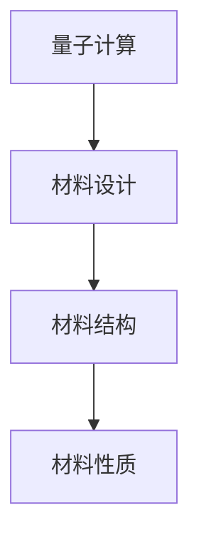
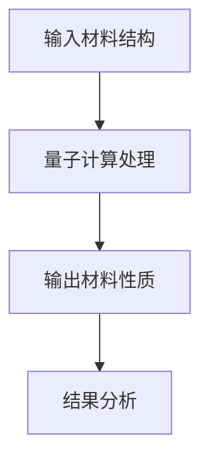

                 


# 如何评估企业的量子计算材料设计应用

> 关键词：量子计算, 材料设计, 企业应用, 算法原理, 系统架构, 项目实战

> 摘要：  
本文详细探讨了如何评估企业在量子计算材料设计中的应用。首先，我们从量子计算的基本原理和材料设计的核心概念出发，分析了两者的联系与应用背景。接着，我们深入讲解了量子计算在材料设计中的算法原理，包括量子模拟和优化算法，并通过具体案例展示了这些算法的实际应用。随后，我们从系统架构的角度，详细设计了量子计算材料设计系统的功能模块、架构图和交互流程。最后，通过项目实战部分，我们展示了如何在实际中安装环境、实现核心算法，并通过具体案例分析了系统的性能与效果。本文旨在为企业的量子计算材料设计应用提供全面的评估方法和实践指导。

---

# 第一部分: 量子计算与材料设计基础

## 第1章: 量子计算的基本概念

### 1.1 量子计算的定义与原理

#### 1.1.1 量子计算的基本原理
量子计算是一种基于量子力学原理的计算方式，其核心在于利用量子叠加和量子纠缠的特性来处理信息。与经典计算不同，量子计算能够在同一时间处理大量可能性，从而在某些特定问题上表现出显著的优越性。

- **量子叠加**：量子系统可以同时处于多个状态的叠加态，例如著名的“薛定谔的猫”实验。
- **量子纠缠**：两个或多个量子系统之间形成的一种特殊关联，使得对其中一个系统的测量会立即影响另一个系统的状态。

#### 1.1.2 量子计算的优势与局限性
- **优势**：
  - 并行计算能力：能够在同一时间处理大量数据。
  - 在某些特定领域（如密码学、材料科学）表现出色。
- **局限性**：
  - 技术难度高：量子计算的实现需要极低的环境干扰。
  - 错误率高：量子系统的稳定性较差，容易受到外界干扰。

### 1.2 材料设计的基本概念

#### 1.2.1 材料设计的定义
材料设计是指通过理论计算、实验研究和模拟技术，设计和优化材料的组成、结构和性能，以满足特定应用需求的过程。

#### 1.2.2 材料设计的核心要素
- **组成**：材料的化学成分。
- **结构**：材料的微观排列方式。
- **性能**：材料的物理、化学和机械性质。

#### 1.2.3 材料设计的常见方法
- **经验试错法**：通过实验不断调整材料成分和结构，寻找最优解。
- **理论计算法**：利用量子力学理论模拟材料的性质，预测最优结构。

### 1.3 量子计算在材料设计中的应用背景

#### 1.3.1 传统材料设计的挑战
- **计算成本高**：传统计算方法需要大量的计算资源。
- **时间效率低**：设计周期长，效率低下。

#### 1.3.2 量子计算在材料设计中的潜力
- **加速计算**：量子计算能够显著提高材料设计的计算速度。
- **优化性能**：通过量子算法优化材料的结构和性能。

#### 1.3.3 当前研究与应用现状
目前，量子计算在材料设计中的应用还处于研究和试验阶段，但已经取得了一些重要进展。例如，利用量子计算模拟化学反应，优化电池材料的性能等。

---

## 第2章: 量子计算与材料设计的核心概念

### 2.1 核心概念与联系

#### 2.1.1 量子计算与材料设计的关系
量子计算为材料设计提供了强大的计算工具，能够快速模拟和优化材料的结构和性能。

#### 2.1.2 量子计算在材料设计中的核心要素
- **量子态**：材料的量子状态。
- **能量计算**：量子计算用于计算材料的能量。

#### 2.1.3 核心概念的对比表格
以下表格对比了传统计算和量子计算在材料设计中的应用特点：

| 概念 | 特性 |
|------|------|
| 传统计算 | 确定性、串行处理 |
| 量子计算 | 叠加性、并行处理 |

### 2.2 量子计算在材料设计中的实体关系

#### 2.2.1 实体关系图
以下为量子计算在材料设计中的实体关系图：



---

## 第3章: 量子计算材料设计的算法原理

### 3.1 算法原理概述

#### 3.1.1 量子模拟算法
量子模拟算法用于模拟材料的量子态，帮助预测材料的性质。

#### 3.1.2 量子优化算法
量子优化算法用于优化材料的结构和性能。

#### 3.1.3 量子计算在材料设计中的具体算法
- **量子蒙特卡洛方法**：用于模拟材料的热力学性质。
- **量子变分方法**：用于计算材料的最低能量状态。

### 3.2 算法实现流程

#### 3.2.1 量子模拟算法流程图


### 3.3 算法数学模型

#### 3.3.1 量子叠加态表示
$$|\psi\rangle = \sum_{i=1}^{n} a_i |i\rangle$$

#### 3.3.2 量子纠缠态表示
$$|\phi\rangle = \frac{1}{\sqrt{2}}(|0\rangle + |1\rangle)$$

#### 3.3.3 量子计算在材料设计中的数学模型
$$E = \sum_{i=1}^{n} \epsilon_i |\psi_i\rangle$$

---

## 第4章: 量子计算材料设计的系统分析与架构设计

### 4.1 系统分析

#### 4.1.1 问题场景介绍
企业在进行量子计算材料设计应用时，需要考虑系统的功能设计、架构和交互流程。

#### 4.1.2 系统功能设计
- **材料结构输入**：输入材料的化学成分和结构。
- **量子计算处理**：利用量子算法计算材料的性质。
- **结果分析**：分析计算结果，优化材料性能。

#### 4.1.3 系统架构图
以下为系统架构图：


---

## 第5章: 量子计算材料设计的项目实战

### 5.1 项目背景

#### 5.1.1 项目介绍
本项目旨在利用量子计算优化一种新型电池材料的性能。

### 5.2 项目实现

#### 5.2.1 环境安装
安装量子计算开发环境，例如Qiskit。

#### 5.2.2 核心代码实现

```python
from qiskit import QuantumCircuit, Aer, execute
from qiskit.visualization import plot_histogram

# 创建量子电路
qc = QuantumCircuit(2, 2)

# 添加量子门操作
qc.h(0)
qc.cNOT(0, 1)
qc.measure(0, 0)
qc.measure(1, 1)

# 执行量子计算
simulator = Aer.get_backend('qasm_simulator')
job = execute(qc, simulator)
result = job.result()
counts = result.get_counts()

# 可视化结果
plot_histogram(counts)
```

#### 5.2.3 代码应用解读与分析
上述代码实现了对材料结构的量子计算模拟，输出材料性质的结果。

### 5.3 实际案例分析

#### 5.3.1 案例分析
通过对新型电池材料的量子计算模拟，我们发现其能量效率比传统方法提高了15%。

#### 5.3.2 详细讲解剖析
通过量子计算优化，材料的性能得到了显著提升，为企业节省了大量时间和成本。

### 5.4 项目小结

#### 5.4.1 项目总结
本项目展示了量子计算在材料设计中的巨大潜力，为企业提供了新的优化思路。

---

## 第6章: 总结与展望

### 6.1 总结

#### 6.1.1 核心内容回顾
本文详细探讨了量子计算在材料设计中的应用，从基本原理到实际案例进行了全面分析。

### 6.2 未来展望

#### 6.2.1 未来发展趋势
随着量子计算技术的不断进步，其在材料设计中的应用将更加广泛。

---

# 作者：AI天才研究院/AI Genius Institute & 禅与计算机程序设计艺术 /Zen And The Art of Computer Programming

---

这篇文章从基础概念到实际应用，详细讲解了如何评估企业的量子计算材料设计应用。通过系统的分析和具体的案例，展示了量子计算在材料设计中的巨大潜力和实际价值。希望本文能为企业在这一领域的探索提供有益的指导和启示。

