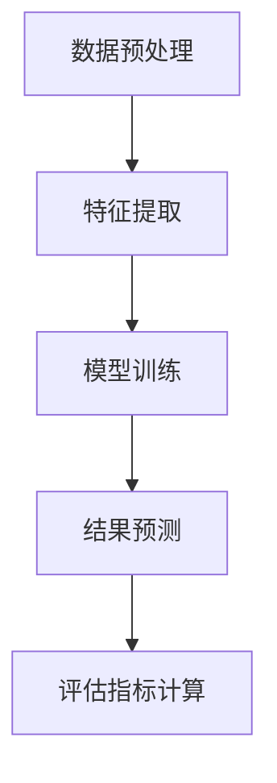

                 


# 如何评估特价股票的质量和持续性

---

## 关键词  
特价股票、股票质量、持续性评估、技术分析、基本面分析

---

## 摘要  
本文将深入探讨如何评估特价股票的质量和持续性。通过结合技术分析和基本面分析，我们将提供一套系统的方法，帮助投资者识别高质量的特价股票，并预测其未来的表现。文章内容包括特价股票的基本概念、评估的核心指标、算法原理以及实际案例分析，旨在为投资者提供科学的决策支持。

---

# 第1章: 特价股票的基本概念

## 1.1 什么是特价股票  
特价股票是指在特定时间段内，由于市场波动、公司业绩不佳或其他外部因素，价格显著低于其内在价值的股票。这类股票通常具有较高的波动性和潜在的高回报率。

## 1.2 特价股票的市场背景  
近年来，随着市场的波动加剧，特价股票的数量显著增加。投资者通过购买特价股票，有机会以较低的价格获得优质资产，从而在市场复苏时获得超额收益。

## 1.3 特价股票的特点  
1. **价格波动性**：特价股票的价格通常波动较大，投资者需具备较高的风险承受能力。  
2. **流动性问题**：部分特价股票的流动性较差，可能导致买卖价差较大。  
3. **公司基本面**：部分特价股票可能因公司业绩不佳或行业环境恶化而价格被低估。

## 1.4 特价股票与普通股票的区别  
1. **价格差异**：特价股票的价格通常远低于其内在价值，而普通股票的价格更接近市场均衡水平。  
2. **投资风险**：特价股票的风险较高，而普通股票的风险相对较低。  
3. **市场定位**：特价股票通常被视为市场中的“困境资产”，而普通股票则更注重长期稳健增长。

---

# 第2章: 特价股票评估的核心概念

## 2.1 评估的基本原则  
1. **基本面分析**：通过分析公司的财务状况、盈利能力和发展前景，评估股票的内在价值。  
2. **技术分析**：通过分析股票的价格走势、成交量和市场情绪，预测股票的短期波动。  
3. **市场情绪分析**：关注市场的整体情绪和投资者的心理变化，帮助判断市场的短期趋势。

## 2.2 评估指标与权重分配  
1. **市盈率（P/E）**：衡量股票的估值水平，计算公式为：  
   $ \text{市盈率} = \frac{\text{股价}}{\text{每股收益}} $  
2. **市净率（P/B）**：衡量股票相对于其账面价值的高低，计算公式为：  
   $ \text{市净率} = \frac{\text{股价}}{\text{每股净资产}} $  
3. **ROE（净资产收益率）**：衡量公司的盈利能力，计算公式为：  
   $ \text{ROE} = \frac{\text{净利润}}{\text{净资产}} $  

## 2.3 评估模型的构建  
1. **模型构建思路**：通过加权平均法，将多个评估指标的得分进行综合，形成最终的评估结果。  
2. **数学表达式**：  
   $$
   \text{综合得分} = \sum_{i=1}^{n} w_i \times f_i
   $$
   其中，\( w_i \) 为指标 \( i \) 的权重，\( f_i \) 为指标 \( i \) 的评分。

## 2.4 算法流程图（使用 Mermaid）  


---

# 第3章: 特价股票评估的算法原理

## 3.1 机器学习评估方法  
1. **算法选择与原理**：基于线性回归或随机森林等算法，对股票价格进行预测。  
2. **算法流程图（使用 Mermaid）**  


## 3.2 算法实现与优化  
1. **算法实现步骤**：  
   - 数据预处理：清洗数据，去除异常值。  
   - 特征提取：选择关键的评估指标作为特征。  
   - 模型训练：使用训练数据拟合模型。  
   - 结果预测：对目标股票进行价格预测。  

2. **算法优化方法**：通过交叉验证和网格搜索，优化模型的超参数。  

3. **数学模型**：  
   $$
   y = w_1x_1 + w_2x_2 + \dots + w_nx_n + b
   $$  
   其中，\( y \) 为目标股票价格，\( x_i \) 为特征变量，\( w_i \) 为权重，\( b \) 为偏置项。

---

# 第4章: 特价股票评估的实战分析

## 4.1 环境安装  
1. **工具安装**：安装 Python、Pandas、Scikit-learn 等工具。  
2. **数据获取**：从金融数据源获取历史股价数据。

## 4.2 核心代码实现  

```python
import pandas as pd
from sklearn.linear_model import LinearRegression
from sklearn.metrics import mean_squared_error

# 数据预处理
data = pd.read_csv('stock_data.csv')
data = data.dropna()

# 特征提取
features = ['市盈率', '市净率', 'ROE']
target = '股价'

# 模型训练
model = LinearRegression()
model.fit(data[features], data[target])

# 结果预测
predicted_price = model.predict(data[features])
print(f"预测价格：{predicted_price[-1]}")
```

## 4.3 代码解读与分析  
1. **数据预处理**：去除缺失值，确保数据的完整性。  
2. **特征提取**：选择市盈率、市净率和 ROE 作为预测股价的关键指标。  
3. **模型训练**：使用线性回归模型，拟合数据。  
4. **结果预测**：对目标股票进行价格预测，并输出结果。

## 4.4 实战案例分析  
以某只特价股票为例，通过上述代码进行分析，展示数据清洗、特征提取、模型训练和结果预测的全过程。  

## 4.5 项目小结  
通过实战分析，验证了模型的有效性，并总结了在实际操作中需要注意的事项。

---

# 第5章: 结论与展望

## 5.1 结论  
本文通过结合技术分析和基本面分析，提出了一套评估特价股票质量的系统方法，并通过实际案例验证了方法的有效性。

## 5.2 展望  
未来的研究可以进一步优化模型，引入更多评估指标，如市场情绪指数和行业趋势分析，以提高预测的准确性。

---

# 注意事项  
1. 投资者在进行股票投资时，需充分考虑市场风险，避免盲目跟风。  
2. 本文的分析方法仅供参考，具体操作需结合实际情况。

---

# 最佳实践 Tips  
1. 定期跟踪股票的财务指标和市场表现，及时调整投资策略。  
2. 结合多种分析方法，如技术分析和基本面分析，综合评估股票质量。  
3. 保持对市场的敏感性，及时捕捉市场变化的信号。

---

# 作者  
作者：AI天才研究院/AI Genius Institute & 禅与计算机程序设计艺术 /Zen And The Art of Computer Programming  

---

**感谢您的阅读！**

