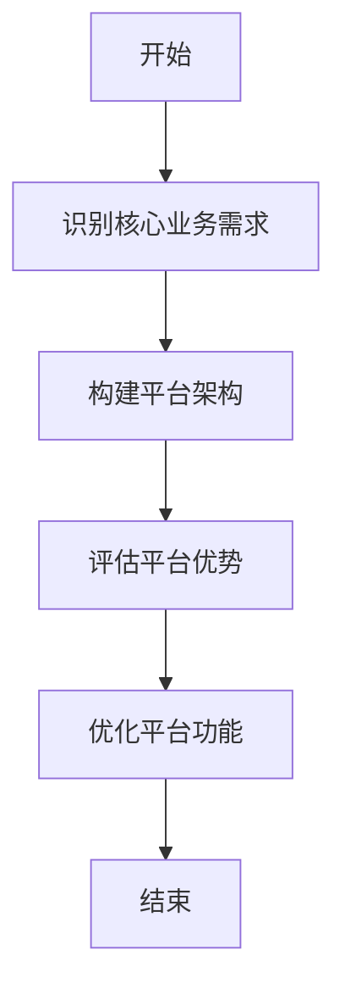
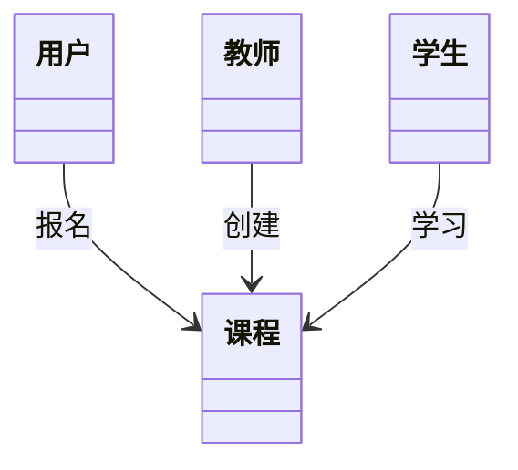
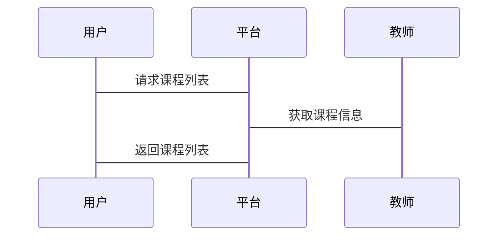
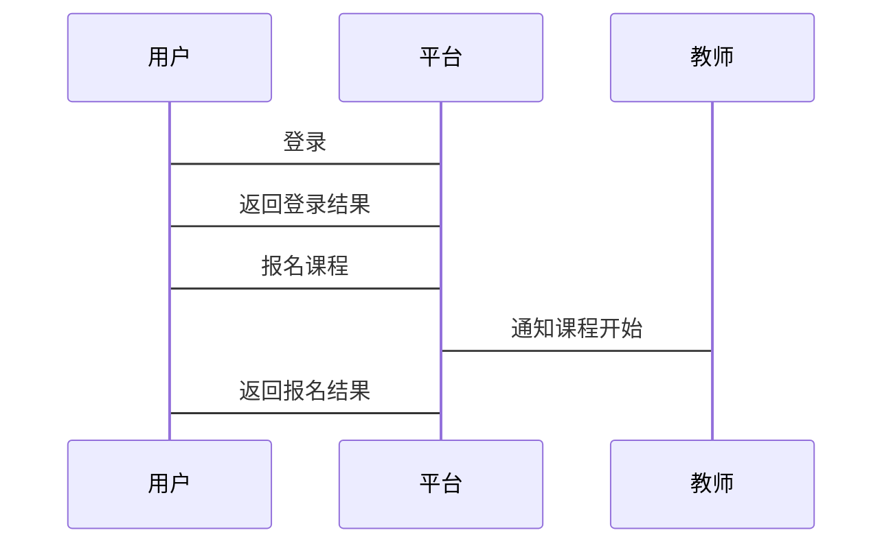

                 


# 如何识别企业的平台战略优势

## 关键词：平台战略、企业优势、数字化转型、系统架构、竞争力分析

## 摘要：  
在数字化转型的浪潮中，企业如何通过识别和构建平台战略优势，增强自身竞争力，成为企业高管和技术领导者关注的核心问题。本文从背景、核心概念、算法原理到系统架构、项目实战，全面解析平台战略优势的识别方法，帮助企业构建可持续的竞争优势。

---

# 第一部分: 企业平台战略优势的背景与核心概念

## 第1章: 平台战略优势的背景与问题描述

### 1.1 平台战略优势的背景

#### 1.1.1 数字化转型与平台经济的兴起  
随着信息技术的飞速发展，数字化转型已成为企业生存和发展的关键。平台经济作为一种新兴的商业模式，通过构建共享价值网络，连接供需双方，创造更大的经济价值。平台经济的兴起为企业提供了新的竞争优势。

#### 1.1.2 平台战略在企业竞争中的重要性  
在现代商业环境中，企业间的竞争不仅体现在产品和服务上，更体现在商业模式和生态系统构建上。平台战略通过整合资源、优化流程和创新服务模式，帮助企业构建差异化竞争优势。

#### 1.1.3 平台战略的核心驱动力  
平台战略的核心驱动力包括技术创新、数据驱动和生态系统协同。通过技术驱动，企业可以快速响应市场需求；通过数据驱动，企业能够精准洞察用户行为；通过生态系统协同，企业可以实现多方共赢。

### 1.2 问题背景与问题描述

#### 1.2.1 传统企业面临的平台化转型挑战  
传统企业在转型过程中面临诸多挑战，包括组织结构僵化、资源分配不合理、技术能力不足等。这些问题限制了企业在平台化转型中的创新能力。

#### 1.2.2 平台战略优势的定义与边界  
平台战略优势是指企业在平台上构建的核心能力，通过资源整合、价值创造和生态协同，形成独特的竞争优势。其边界包括核心业务、生态系统和用户体验等方面。

#### 1.2.3 平台战略与企业核心竞争力的关系  
平台战略是企业核心竞争力的重要组成部分。通过平台战略，企业可以整合内外资源，优化业务流程，提升用户体验，从而增强整体竞争力。

### 1.3 问题解决与平台战略优势

#### 1.3.1 平台战略如何解决企业痛点  
平台战略通过构建开放的生态系统，解决企业资源不足、创新乏力等问题。通过平台，企业可以快速引入外部资源，实现协同创新。

#### 1.3.2 平台战略的优势与劣势对比  
平台战略的优势包括资源整合能力强、网络效应显著、灵活性高；劣势则包括初期投入大、风险高、竞争激烈。

#### 1.3.3 平台战略的外延与应用场景  
平台战略的应用场景包括金融、医疗、教育等多个行业。通过平台，企业可以实现跨行业合作，拓展业务边界，创造新的增长点。

## 第2章: 平台战略优势的核心概念与联系

### 2.1 平台战略的核心要素

#### 2.1.1 平台的核心要素分析  
平台的核心要素包括用户、服务、数据和生态系统。用户是平台的基础，服务是平台的核心，数据是平台的血液，生态系统是平台的扩展。

#### 2.1.2 平台战略的构成要素  
平台战略的构成要素包括商业模式、技术架构、组织结构和生态系统。这些要素相互作用，共同构建平台的核心竞争力。

#### 2.1.3 平台战略与企业战略的关系  
平台战略是企业整体战略的重要组成部分。通过平台战略，企业可以实现业务模式创新，优化资源配置，提升整体竞争力。

### 2.2 平台战略优势的属性特征对比

#### 2.2.1 平台战略与传统业务模式的对比  
传统业务模式以产品为中心，而平台战略以服务为中心。传统模式注重单点突破，而平台模式注重生态协同。

#### 2.2.2 平台战略的规模效应与网络效应  
平台战略的规模效应体现在用户增长和资源扩展上，而网络效应则体现在用户间的价值共创和资源共享上。

#### 2.2.3 平台战略的灵活性与扩展性  
平台战略通过模块化设计，具有高度的灵活性和扩展性，能够快速响应市场需求，适应变化。

### 2.3 平台战略的ER实体关系图

```mermaid
er
    actor(用户) --> platform(平台): 使用平台服务
    actor <--o platform: 支付费用
    platform --> service(服务): 提供服务
    service <--o platform: 集成到平台
```

---

# 第二部分: 平台战略优势的算法与系统架构

## 第3章: 平台战略优势的算法原理

### 3.1 平台战略优势的算法流程



### 3.2 平台战略优势的数学模型

$$平台优势 = \sum_{i=1}^{n} (核心要素_i \times 权重_i)$$

### 3.3 算法实现示例

---

## 第4章: 平台战略优势的系统架构

### 4.1 系统分析与架构设计

#### 4.1.1 问题场景介绍  
企业在构建平台战略时，需要解决用户需求多样、资源分散、协同困难等问题。通过系统架构设计，可以实现资源整合、高效协同和价值共创。

#### 4.1.2 项目介绍  
以某企业为例，构建一个在线教育平台。通过平台整合课程资源、教师资源和学习者，实现教学资源共享和价值共创。

#### 4.1.3 系统功能设计

##### 4.1.3.1 领域模型


##### 4.1.3.2 系统架构设计


##### 4.1.3.3 接口设计


##### 4.1.3.4 交互设计


### 4.2 系统优化与实现

#### 4.2.1 系统优化
- 通过缓存技术优化数据访问性能
- 使用分布式架构提升系统扩展性
- 采用微服务设计实现功能模块化

#### 4.2.2 核心代码实现

##### 4.2.2.1 环境安装
```bash
pip install flask
pip install requests
pip install redis
```

##### 4.2.2.2 核心代码实现
```python
from flask import Flask
from redis import Redis

app = Flask(__name__)
redis = Redis(host='localhost', port=6379)

@app.route('/')
def home():
    return "欢迎来到平台战略优势系统！"

@app.route('/login', methods=['POST'])
def login():
    # 登录逻辑实现
    return "登录成功！"

@app.route('/signup', methods=['POST'])
def signup():
    # 注册逻辑实现
    return "注册成功！"
```

#### 4.2.3 代码解读与分析
- 使用Flask框架构建Web应用
- 通过Redis实现缓存功能
- 采用RESTful API设计接口，确保系统高效可靠

### 4.3 项目实战与案例分析

#### 4.3.1 项目实战
- 项目需求：构建一个在线教育平台，整合课程资源、教师资源和学习者。
- 核心实现：课程管理模块、用户认证模块、课程推荐模块。

#### 4.3.2 案例分析
- 某教育平台通过构建在线课程平台，实现了教师、学生和课程资源的高效整合，提升了教学效率和用户体验。

### 4.4 最佳实践 tips

- **小结**：平台战略优势的识别和构建需要从核心要素、系统架构和算法原理等多方面进行综合考虑。
- **注意事项**：在实际项目中，需要注重用户体验设计、系统安全性和数据隐私保护。
- **拓展阅读**：建议深入学习平台经济的相关理论，关注行业动态和技术趋势。

---

## 第5章: 平台战略优势的最佳实践

### 5.1 平台战略优势的识别方法

#### 5.1.1 从核心要素出发
- 确定企业的核心资源和竞争优势
- 识别目标用户的需求和痛点
- 分析竞争对手的平台战略

#### 5.1.2 基于系统架构设计
- 构建清晰的系统功能模块
- 设计高效的接口和交互流程
- 优化系统性能和安全性

### 5.2 平台战略的优化与提升

#### 5.2.1 数据驱动的优化
- 利用数据分析优化平台功能
- 基于用户行为数据进行精准推荐
- 通过数据监控及时发现和解决问题

#### 5.2.2 生态系统协同
- 引入合作伙伴，构建开放生态系统
- 促进用户共创，提升平台价值
- 通过生态系统协同实现多方共赢

### 5.3 平台战略的持续改进

#### 5.3.1 用户反馈与迭代
- 建立用户反馈机制，及时收集用户意见
- 根据反馈优化平台功能，提升用户体验
- 持续改进平台战略，保持竞争优势

#### 5.3.2 技术创新与应用
- 关注新技术的发展，如人工智能、大数据等
- 将新技术应用于平台战略中，提升平台能力
- 通过技术创新实现差异化竞争

---

## 第6章: 总结与展望

### 6.1 总结

通过本文的详细分析，我们深入探讨了如何识别企业的平台战略优势，从背景分析、核心概念、算法原理到系统架构和项目实战，全面解析了平台战略的优势和实现方法。

### 6.2 展望

未来，随着技术的不断进步和商业模式的不断创新，平台战略的优势将更加显著。企业需要持续优化平台战略，构建可持续的竞争优势，以应对未来的挑战和机遇。

---

## 作者：AI天才研究院/AI Genius Institute & 禅与计算机程序设计艺术 /Zen And The Art of Computer Programming

---

这篇文章通过系统化的分析和实际案例的剖析，帮助读者全面理解如何识别和构建企业的平台战略优势。从理论到实践，从分析到设计，为企业的数字化转型提供了有力的指导和参考。

